# 1 引言

## 1 .1 WAVEWATCH III 建模框架

WAVEWATCH III® 是一个社区波浪建模框架，包含了风浪建模与动力学领域中最新的科学进展。

该框架的核心是第三代波浪模型 WAVEWATCH III，其开发源于美国国家环境预报中心 (NOAA/NCEP)，并继承了 WAM 模型 (Komen 等，1994) 的理念。当前的框架由早期的 WAVEWATCH I 和 II 模型包 (Tolman，1991，1992) 发展而来，并在控制方程、模型结构、数值方法以及物理参数化等多个重要方面与其前身存在显著差异。

WAVEWATCH III 求解的是波数---方向谱的随机相位谱作用量密度平衡方程。该方程隐含的假设是：介质特性 (水深和流速) 以及波场本身在时间和空间尺度上的变化远大于单个波的变化尺度。

模型包含适用于浅水 (碎波带) 应用的选项，并支持网格点的淹没与干涸处理。波谱传播可在规则 (直角或曲线) 网格以及非结构 (三角形) 网格上求解，可单独使用或组合成多重网格拼接系统。

物理过程的源项包括风作用引起的波浪增长参数化、对非线性共振波---波相互作用的精确和参数化表示、波---底相互作用引起的散射、三波相互作用，以及由白冠破碎、底摩擦、碎波破坏以及与泥沙和冰相互作用引起的耗散。

模型包含多种用于缓解"花园洒水器效应"的方法，并计算其他转换过程，例如表层流对风场和波场的影响，以及由于未解析岛屿造成的子网格遮挡效应。

WAVEWATCH III 的输入可以通过外部文件提供，或通过 OASIS 或 ESMF/NUOPC 框架进行耦合。输入数据在波浪模型驱动程序中动态更新，可能包括冰覆盖、泥沙、流场以及用于可移动上的耗散的底部特性，以及用于在用户可能开发的数据同化占位模块中进行同化的数据

WAVEWATCH III 是用符合 ANSI 标准的 FORTRAN 90 语言编写的，它的结构是完全模块化的，并且可以很灵活地分配内存。这个模型支持传统的单向嵌套方式，也支持一种'马赛克'或者叫'多网格'的方法。

'马赛克'方法允许同时考虑任意数量的网格，并且所有网格之间都有完全的双向相互作用。你可以用单个网格或者多个网格组成的'马赛克'作为移动的参考系，这样就能在远离海岸的地方对飓风进行高分辨率的模拟。

波浪能量谱是用一个固定的方向增量 (覆盖所有方向) 和一个空间上变化的波数网格来离散化的。这个模型提供了第一阶、第二阶和第三阶精度的数值方案，用来描述波浪的传播。

源项 (指影响波浪的因素) 是使用一个动态调整时间步长的算法来进行时间积分的，这个算法会把计算资源集中在那些光谱变化很快的条件下。WAVEWATCH III 可以选择性地用 OpenMP 编译器指令进行编译，以包含共享内存的并行处理能力；或者也可以为了在分布式内存环境下运行而进行编译 (使用消息传递接口 MPI)。"

## 1.2 关于本手册

这是 WAVEWATCH III ® 风浪模拟框架版本 7.14 的用户手册和系统文档。虽然这个框架的代码管理主要由 NCEP/NOAA 负责，但模型本身的开发则依赖于一个开发者社区------WAVEWATCH III 开发组 (WW3DG)，其成员名单如下所示。本手册按照以下内容来介绍这个风浪模拟框架：

• 第二章：控制方程

• 第三章：数值方法

• 第四章：模型结构和数据流

• 第五章：安装、编译和运行

• 第六章：关于通用代码结构以及不同方面实现细节的说明。

因此，想要安装这个框架的用户可以直接跳到第五章，然后在示例运行 (比如第四章提到的) 中依次修改输入文件。"

不过这不能替代通过阅读第 2 章到第 5 章所能获得的关于 WAVEWATCH III 的全面知识。选择将用户手册和系统文档结合在一起的形式，是为了给用户提供必要的背景知识，让他们能够根据自己的需求，在框架中包含新的物理和数值方法。随着 WAVEWATCH III 发展成为波浪模型框架，这种方法变得越来越重要。

按照设计，用户可以应用自己的数值和/或物理方法，从而基于 WAVEWATCH III 框架开发新的波浪模型。在这种方法中，优化、并行化、嵌套、框架的输入和输出服务程序可以很容易地在实际模型之间共享。虽然本文件旨在完整且自包含，但系统文档中的所有元素并不都是这样。

对于额外的系统细节，参考源代码，它是完全文档化的。请注意，现在有一份 WAVEWATCH III 代码开发的最佳实践指南 (Tolman，2010a，2014a)。模型框架的应用在文献中得到了广泛记录，一些近期应用综述可以在 Tolman 等人 (2002 年)、Hanson 等人 (2009 年)、Chawla 等人 (2013 年)、Alves 等人 (2014 年)、Rogers 等人 (2014 年)、Li 和 Saulter(2014 年)、Roland 和 Ardhuin(2014a)、Zieger 等人 (2018 年) 中找到。

当前的模型版本 (7.14) 是基于之前的官方模型发布版本 (版本 6.07) 的新公共版本。以下是自上次发布以来在 WAVEWATCH III 7.14 中添加的新功能以及代码结构修改。

• 为下一个模型版本 (模型版本 7.00) 做准备

• 增加通过 WRST 开关在重启文件中读取/写入风的功能 (模型版本 7.01)

• 增加在多网格中插值输入到曲线子网格的能力 (模型版本 7.02)

• 增加重启文件的第二个写入流 (模型版本 7.03)

• 将代码中的版本报告更改为日期字符串 (模型版本 7.04)

• 更新 IS2 默认参数化 (模型版本 7.05)

• 在 ST4 中包含 Romero 耗散 (模型版本 7.06)

• 更新潮汐及其 MPI 实现 (模型版本 7.07)

• 在非结构化网格的边界条件上，增加了对 CFL 的可选退出选项 (模型版本 7.08)。

• 为 ww3_uprstr 增加了对风浪和海啸成分数据同化的选项 (模型版本 7.09)。

• 扩展了 OASIS-NEMO 耦合模型系统的参数集 (模型版本 7.10)。

• 增加了将边界条件输出到旋转的经纬度网格的方法 (模型版本 7.11)。

• 改进了 NetCDF 网格化输出，以符合 CF 标准 (模型版本 7.12)。

• 进行了大规模代码清理，包括移除对 NetCDFv3 的支持，将 NC4 设为默认，将 F90 设为默认 (移除了 DUM 选项)，移除了编译器指令开关 (C90、NEC、SX6、SX8)，移除了对 Grib1 的支持 (NCEP1 开关)，移除了 OMPX 和 NCC 开关，移除了实验性和补充性开关 (XX0、XXX、FLXX、PRX、STX、NLX、BTX、DBX、TRX、BSX)，并对构建过程进行了模块化和清理 (模型版本 7.13)。

• 从使用 WW3 预处理器和 ftn 源代码目录改为使用 CPP 预处理器和 src 作为源代码目录 (模型版本 7.14)。

关于此模型的最新信息 (包括错误和修复) 可以在 WAVEWATCH III GitHub 维基页面上找到：<https://github.com/NOAA-EMC/WW3/wiki>

也可以在 NCEP WAVEWATCH III 页面上找到：

<http://polar.ncep.noaa.gov/waves/wavewatch/>

评论、问题和建议应发送给代码管理员 Ali Abdolali(<ali.abdolali@noaa.gov>) 和 Jose-Henrique Alves(<henrique.alves@noaa.gov>)，或发送到一般的 WAVEWATCH III 用户邮件列表：<ncep.list.wwatch3.users@lstsrv.ncep.noaa.gov> 

NCEP 会把来自 NCEP 以外的问题转交给相应代码的作者。你可以在以下网页订阅 WAVEWATCH III 用户邮件列表：

<https://www.lstsrv.ncep.noaa.gov/mailman/listinfo/ncep.list.wwatch3.users>

## 1.3 许可条款

从模型版本 3.14 开始，WAVEWATCH III 按照以下许可条款进行分发：

在此理解中，软件被广泛解释为包括算法、源代码、目标代码、数据库和相关文档，所有这些都应免费提供给许可证持有人。可以提供更正、升级或增强功能，如果提供，也应以无费用方式提供给许可证持有人。然而，NOAA 不需要开发或提供此类更正、升级或增强功能。NOAA 的软件，无论是最初提供的还是更正或升级，都以"原样"提供。NOAA 不为其软件提供任何保证，也不对许可证持有人可能遭受的直接、间接或后果性损害负责。商品性、特定用途适用性、所有权和非侵权保证均被明确否认。许可证持有人不需要开发与许可软件相关的任何软件。但是，如果许可证持有人这样做，许可证持有人必须向 NOAA 提供，以便根据当前的许可条款将其包含在 NOAA 的许可软件中，并提供有关其原理、使用及其优势的文档。这包括对波浪模型的更改，包括波浪建模的数值和物理方法，以及嵌入在波浪模型中的边界层参数化。鼓励但不强制要求许可证持有人提供用于模型输入和输出的预处理和后处理工具。需要提供的软件不应包括可以与波浪模型耦合的附加模型。

比如说海洋环流模型或者大气环流模型。许可证方提供的软件应当与许可证方可获得的最新模型版本保持一致，并且提供给许可证方的软件接口例程应当符合模型文档中概述的编程标准。提供给美国国家海洋和大气管理局 (NOAA) 的软件应当是原样提供，没有任何保证，也不承担任何损害赔偿责任。NOAA 不必须将许可证方的软件作为其软件的一部分。许可证方提供的软件中不得包含由他人开发的软件。许可证方可以复制足够的软件以满足其需要。所有副本都应当载有软件的名称以及任何版本号，并且还应当包含任何适用的版权声明、商标声明、其他声明和致谢语。此外，如果副本已经被修改，比如有删除或添加，则应当如此声明并加以识别。许可证方所有需要使用软件的员工都可以访问该软件，但前提是他们在阅读本许可证后，以书面形式声明已经阅读并理解了该许可证，并且同意其条款。许可证方有责任采取合理措施，以确保只有其应当访问软件的员工实际上能够访问该软件。许可证方可以使用该软件用于与海况预测相关的任何目的。许可证方或其员工不得以任何方式 (无论是通过媒体还是口头) 向任何第三方披露软件的任何部分。许可证方有责任遵守美国任何适用的出口或进口管制法律。

## 1.4 版权和商标

WAVEWATCH III ® © 2009-2016 美国国家气象局，美国国家海洋和大气管理局。版权所有。WAVE DRAFT WAVEWATCH III 版本 7.14 7

WAVEWATCH III ® 是美国国家气象局的商标。未经许可，禁止使用。

## 1.5 WAVEWATCH III® 开发组 (WW3DG)

WAVEWATCH III ® 的开发依赖于一个不知疲倦地努力将其作为一个有效社区工具的开发团队。随着可用的物理和数值参数化的扩展，该模型的贡献者名单不断增长。开发组由一个核心开发组组成，他们参与整体代码开发、调试和优化，以及一个更大的组，他们要么已经做出过贡献，要么继续为物理包和数值做出贡献。以下是该开发组 (包括过去和现在的贡献者) 的名单 (按字母顺序排列)：

Abdolali, Ali (美国国家海洋和大气管理局/国家气象局/环境模型中心，美国) 非结构化网格、并行化效率、波浪 - 风暴耦合、WAVEWATCH III 的一般代码开发支持和代码管理。

Accensi, Mickael (法国 LOPS)NetCDF 输入和输出 (ww3 prnc、ww3 bounc、ww3 ounf、ww3 ounp、ww3 trnc)、namelist 输入文件、OASIS 耦合、安装和编译环境，以及一般代码开发支持。

Alves, Jose-Henrique(美国国家海洋和大气管理局/国家气象局/环境模型中心，美国) 浅水物理包、时空波高极端值方法的发展、WAVEWATCH III 的一般代码开发支持和代码管理。

Ardhuin, Fabrice(法国 LOPS，以前在 SHOM 工作) 各种参数化包 (ST3、ST4、BS1、BT4、IG1、REF1、IS2...)、与非结构化网格方案的接口、潮汐分析以及一些 I/O 方面 (通量估计、NetCDF 适应)。

Babanin, Alexander(澳大利亚墨尔本大学)ST6 项目负责人，源函数 (风输入、白帽耗散、膨胀耗散、负输入、物理约束)；海冰源功能 IC5；广义动力学方程 NL5。  Barbariol, Francesco(ISMAR-CNR，意大利) 开发时空波高极限方法。 

Benetazzo, Alvise(ISMAR-CNR，意大利) 开发时空波高极限方法。 

Bidlot, Jean(ECMWF，英国) 物理包 ST3 的更新。 

Booij, Nico(荷兰代尔夫特理工大学，退休) 源代码预处理器 (w3adc) 的原创设计，文档的基本方法和其他编程习惯。空间变化的波数网格。 

Boutin, Guillaume(LOPS，法国) 对 IS2 和 IC2 的贡献。 

Bunney, Chris(英国气象局)SMC 网格的附加光谱划分方案和 netCDF 输出。 

Campbell, Tim(美国海军研究实验室) 搜索和重新网格实用程序、不规则网格、回归测试 shell 脚本、ESMF 接口模块和整体代码开发支持。 

Chalikov, Dmitry V.(前身为 NOAA/NCEP/EMC 的 UCAR)Tolman 和 Chalikov (1996) 输入和耗散参数化及源代码的合著者。 

Chawla, Arun(NOAA/NCEP/EMC，美国) 支持 NCEP 的代码开发、GRIB 打包、自动网格生成软件 (Chawla 和 Tolman，2007 年、2008 年)。 

Cheng, Sukun(在美国克拉克森大学期间) 代码的原始作者，该代码被移植到 WW3(模型版本 5) 中，作为海冰对波浪影响的改进的"IC3"参数化。

Collins, Clarence (在美国国家海洋和大气管理局/美国地球物理联盟做博士后期间) IC4(海冰源函数) 的起源。

Filipot, Jean-Franc ̧ois (法国能源海洋公司，之前在法国国家海洋服务局，然后是在 LOPS) ST4 中白帽效应和破碎波的统一。

Flampouris, Stylianos S. (在美国国家海洋和大气管理局/美国国家气象局/环境模型预测中心工作的国际海洋气象学小组) 波浪数据同化，数据同化系统与模型之间的通信 (ww3 uprstr)。

Foreman, Mike (加拿大国际海洋组织) 通用潮汐分析软件包。

Gramstad, Odin (挪威 DNV GL) 广义动力学方程 NL5。

Ginis, Isaac (美国罗德岛大学) 开发了用于海况相关风应力计算的源代码 (FLD1, FLD2)。

Hara, Tetsu (美国罗德岛大学) 开发了用于海况相关风应力计算的源代码 (FLD1, FLD2)。

Hesser, Tyler J. (美国陆军工程兵团研究与发展中心海岸与水力学实验室) 非结构化网格，浅水物理。

Janssen, Peter (欧洲中期天气预报中心，英国) WAM-Cycle 4 软件包 (ST3) 的原始版本，二阶波浪谱的正则变换。

Leckler, Fabien (法国 LOPS) 从源项得到的破碎参数，以及对 ST4 的贡献。

Li, Jian-Guo (英国气象局，英国) SMC 网格，二阶 UNO 格式和旋转网格。

Lind, Kevin (美国国防部 PETTT) 改进了某些多重网格函数的性能。

Liu, Qingxiang (中国海洋大学；澳大利亚墨尔本大学) 海冰源函数 IC5；源项软件包 ST6 的更新；广义动力学方程 NL5。

Meixner, Jessica (美国国家海洋和大气管理局/美国国家气象局/环境模型预测中心) 耦合模型开发，通用代码开发支持以及 WAVEWATCH III 的代码管理。

Mentaschi, Lorenzo (欧洲委员会，联合研究中心，JRC，之前在意大利热那亚大学) 开发了未解决障碍源项 (UOST)。

Orzech, Mark (美国海军研究实验室) 泥土效应的源项 (BT8, BT9)。

Padilla--Hern ́andez, Roberto (在美国国家海洋和大气管理局/美国国家气象局/环境模型预测中心工作的国际海洋气象学小组) 支持 NCEP 的代码开发，编辑工作。

Perrie, William (加拿大贝德福德海洋学研究所) 非线性相互作用的二尺度近似 (NL4)。

Rawat, Arshad (毛里求斯海洋研究所和法国 LOPS) 对二阶谱和自由次重力波源 (IG1) 的贡献。

Reichl, Brandon (美国国家海洋和大气管理局/全球大气研究中心和普林斯顿大学；之前在美国罗德岛大学) 开发了用于海况相关风应力计算的源代码 (FLD1, FLD2)。

Rogers, W. Erick (美国海军研究实验室) 非规则网格，海冰 (例如 IC1, IC2, IC3, IC4, IC5) 和泥土 (BT8, BT9) 的影响，ST6 软件包 (源材料和建议)，保守重映射软件的适配/接口，三重网格，回归测试。

Roland, Aron (德国达姆施塔特工业大学) 非结构化 (基于三角形) 网格上的平流和网格划分工具，并行效率，隐式求解器的实现。

Sevigny, Caroline (加拿大魁北克大学) 对冰散射 (包括冰破碎) 的贡献。

Shen, Hayley (克拉克森大学) 指导赵和程对"IC3"参数化 (海冰对波浪的影响) 所做的贡献。

Saulter, Andy (英国气象局) 对英国气象局代码开发的测试和支持。

Sikiric, Mathieu Dutour (克罗地亚 IRB) 使用非结构化 (基于三角形) 网格进行多重网格计算，并行效率，隐式求解器的实现。

Szyszka, Mark (澳大利亚 RPS 集团) 在代码开发过程中发现了几个错误，并提供了 Openmp 问题的修复。

Smith, Jane M. (美国陆军工程兵团研究与发展中心海岸与水力学实验室) 非结构化网格，浅水物理。

Tolman, Hendrik L. (美国商务部/国家海洋和大气管理局/国家气象局/能源部科学办公室) 通用代码架构，原始的 WAVEWATCH-I、II 和 III 模型。正在进行中的模型开发。

Toulany, Bash (加拿大贝德福德海洋学研究所) 非线性相互作用的二尺度近似 (NL4)。

Tracy, Barbara (美国陆军工程兵团，ERDC-CHL，美国，已退休) 光谱划分。

Van Vledder, Gerbrant Ph. (荷兰代尔夫特理工大学) Webb-Resio-Tracy 精确非线性相互作用例程，以及一些原始的服务例程。

Van Der Westhuysen, Andr ́e (在美国国家海洋和大气管理局/美国国家气象局/环境模型预测中心工作的国际海洋气象学小组) 支持 NCEP 的代码开发，波浪系统跟踪，增加了三重波相互作用。

Young, Ian (澳大利亚墨尔本大学) ST6 源函数 (风输入，白帽耗散)。

Zhao, Xin (在美国克拉克森大学期间) 是被移植到 WW3(模型版本 4) 中作为"IC3"参数化 (海冰对波浪的影响) 的代码的原始作者。

Zieger, Stefan (澳大利亚气象局) ST6 源项软件包，代码和测试。

## 1.6 致谢

WAVEWATCH III 风波模型由 Hendrik Tolman 于 20 世纪 90 年代初在代尔夫特大学开发了 WAVEWATCH 模型，并在 NASA 戈达德太空飞行中心开发了 WAVEWATCH II。

随后，在国家海洋伙伴计划 (NOPP) 的支持下启动了一项支持风浪建模发展的研究计划，帮助 WAVEWATCH III 从单个人或团体承担的任务转变为社区建模框架。该计划提供了资源来显着扩展建模系统的功能并将其转移到社区开发范例。我们感谢科学界的所有合作伙伴，他们在 NOPP 计划结束后仍然坚持这一努力。

我们还非常感谢更大的用户社区，他们与我们不懈地合作，找出模型中的错误和其他问题。

WAVEWATCH III 开发团队

2019 年 2 月

# 2 控制方程 

## 2.1 引言

在有限深度且存在非零平均流的水体中，波浪或频谱波浪分量通常是用若干相位和振幅参数来描述的。

相位参数包括波数矢量 $\mathbf{k}$ 、波数 $k$ 、方向 $\theta$ 以及一些频率。如果要考虑平均流对波浪的影响，就需要区分相对频率 (或固有频率，单位为弧度， $\sigma=2\pi f_r$ )，这个频率是在一个随平均流运动的参考系中观察到的；以及绝对频率 (单位为弧度， $\omega=2\pi f_a$ )，这个频率是在一个惯性参考系中观察到的。

方向 $\theta$ 按定义是与波浪的波峰 (或频谱分量) 垂直的，并且等于波数矢量 $\mathbf{k}$ 的方向。这里给出的方程遵循几何光学近似，该近似在水深和流速的变化尺度远大于单个波浪尺度的极限情况下是严格成立的。

该近似所忽略的衍射、散射以及干涉效应，可以在事后通过在波作用量方程中加入相应的源项来加以考虑。在这种水深和流速缓慢变化的近似条件下，可以在局地应用准均匀的（线性）波浪理论，从而得到以下色散关系以及类似多普勒效应的方程，用以相互联系这些相位参数。

$$\sigma^{2}=gk\tanh kd  \tag{2.1} $$

$$\omega=\sigma+\mathbf{k}\cdot\mathbf{U} \tag{2.2}$$

其中 $d$ 为平均水深， $\mathbf{U}$ 为在单个波浪尺度上对水深和时间进行平均后的流速。对水深和流速缓慢变化的假设意味着海底地形具有大尺度特征，在这种情况下通常可以忽略波浪的衍射效应。根据由波浪或谱波分量相位函数所给出的 $\mathbf{k}$ 和 $\omega$ 的通常定义，可以推出波峰数是守恒的（见 Phillips,1977; Mei, 1983）。

$$\frac{\partial\mathbf{k}}{\partial t}+\nabla\omega=0\tag{2.3}$$

由式（2.1）至（2.3）可以计算各相位参数的变化率（例如 Christoffersen，1982；Mei，1983；Tolman，1990，具体方程此处不再列出）。

对于不规则风浪，海表面的（随机）方差通过海面高程方差密度谱 $F$ 来描述。在波浪建模领域中，这通常被称为"能量谱"。该谱 $F$ 是所有独立相位参数的函数，即 $F (\mathbf{k},σ,ω)$ ，并且还会在比单个波浪尺度更大的时空尺度上发生变化，例如 $F (\mathbf{k},σ,ω; \mathbf{x}, t)$ 。然而，对于波长小于主导风浪频率 3 倍的波浪（Leckler 等，2015），其能量非常接近于线性色散关系，因此公式（2.1）和（2.2）将 $\mathbf{k}$ 、 $σ$ 和 $ω$ 相互联系起来。

因此，仅存在两个独立的相位参数，局部和瞬时谱便成为二维的。非线性束缚波的贡献效应可以在 WAVEWATCH III 中按照 Janssen（2009）的方法，通过后处理的方式加以引入。

在 WAVEWATCH III 中，基本谱采用的是波数--方向谱 $F(k,\theta)$ ，之所以选择该形式，是因为它在可变水深条件下，对波浪生长与衰减物理过程具有不变性特征。然而，WAVEWATCH III 的输出则采用更为传统的频率--方向谱 $F(f_r,\theta)$ 。不同形式的谱都可以通过对 $F(k,\theta)$ 进行简单的雅可比变换来计算得到。

$$F(f_r,\theta)=\frac{\partial k}{\partial f_r}F(k,\theta)=\frac{2\pi}{c_g}F(k,\theta) \tag {2.4}$$

$$F(f_a,\theta)=\frac{\partial k}{\partial f_a}F(k,\theta)=\frac{2\pi}{c_g}\left(1+\frac{\mathbf{k}\cdot\mathbf{U}}{kc_g}\right)^{-1}F(k,\theta)
\tag{2.5}$$

$$c_g=\frac{\partial\sigma}{\partial k}=n\frac{\sigma}{k},n=\frac{1}{2}+\frac{kd}{\sinh2kd}\tag{2.6}$$

其中 $c_g$ 为群速。由这些谱中的任意一种，都可以通过对方向积分生成一维谱；而对整个谱进行积分，根据定义即可得到总方差 $E$（在波浪建模领域通常称为波能）。

在不存在流的情况下，波包的方差（能量）是守恒量。而在存在流的情况下，由于流对波浪平均动量输运所做的功，谱分量的能量或方差将不再守恒（Longuet-Higgins 和 Stewart，1961）。

不过，一般来说，波作用量 $A \equiv E/\sigma$ 是守恒的 (例如，Whitham, 1965；Bretherthon 和 Garrett, 1968)。这就使得波作用量密度谱 $N(k,\theta) \equiv F(k,\theta)/\sigma$ 成为模型中的首选谱。波传播现象随后就由

$$\frac{DN}{Dt}=\frac{S}{\sigma}\tag{2.7}$$

其中 $D/Dt$ 表示全导数 (随波分量移动) $S$ 代表频谱 $F$ 的源和汇的净效应。(2.7) 一般考虑线性传播而无需散射、非线性波传播的影响 (即波与波相互作用) 部分波反射出现在 $S$ 中。传播项和源项将在以下各节中分别讨论

## 2.2 传播

在一个数值模型中，需要平衡方程 (2.7) 的欧拉形式。这个平衡方程要么可以写成传输方程的形式 (速度在导数外面)，要么可以写成守恒形式 (速度在导数里面)。前者形式只适用于矢量波数谱 $N(\mathbf{k};\mathbf{x},t)$ ，而后者的有效方程可以推导出任意谱表述，只要相应的雅可比变换如上所述表现良好 (见 Tolman 和 Booij, 1998 年)。

此外，守恒方程守恒总波能/作用量，而传输方程则不守恒。这是方程在数值模型中应用的一个重要特征。WAVEWATCH III 中使用的波数谱 $N(k,\theta;\mathbf{x},t)$ 的平衡方程给出如下 (为了方便记法，此后谱简单地记作 $N$ ):

$$\begin{aligned}\frac{\partial N}{\partial t}+\nabla_x\cdot\dot{\mathbf{x}}N+\frac{\partial}{\partial k}\dot{k}N+\frac{\partial}{\partial\theta}\dot{\theta}N=\frac{S}{\sigma}\end{aligned}\tag{2.8}$$

$$\mathbf{\dot{x}}=\mathbf{c}_g+\mathbf{U}\tag{2.9}$$

$$\begin{aligned}\dot{k}=-\frac{\partial\sigma}{\partial d}\frac{\partial d}{\partial s}-\mathbf{k}\cdot\frac{\partial\mathbf{U}}{\partial s}\end{aligned}
\tag{2.10}$$

$$\begin{aligned}\dot{\theta}=-\frac{1}{k}\left[\frac{\partial\sigma}{\partial d}\frac{\partial d}{\partial m}+\mathbf{k}\cdot\frac{\partial\mathbf{U}}{\partial m}\right]\end{aligned}
\tag{2.11}$$

其中 $\mathbf{c}_g=(c_g\sin\theta,c_g\cos\theta)$ ， $s$ 是 $\theta$ 方向的坐标， $m$ 是垂直于 $s$ 的坐标。方程 (2.8) 对于笛卡尔坐标有效。对于大规模应用，该方程通常转移为球面坐标，由经度 $\lambda$ 和纬度 $\varphi$ 定义，但保持局部方差的定义 (即每单位表面，见 WAMDIG,1988)

$$\frac{\partial N}{\partial t}+\frac{1}{\cos\phi}\frac{\partial}{\partial\phi}\dot{\phi}N\cos\theta+\frac{\partial}{\partial\lambda}\dot{\lambda}N+\frac{\partial}{\partial k}\dot{k}N+\frac{\partial}{\partial\theta}\dot{\theta}_gN=\frac{S}{\sigma}
\tag{2.12}$$

$$\dot{\phi}=\frac{c_g\cos\theta+U_\phi}{R}\tag{2.13}$$

$$\begin{aligned}\dot{\lambda}=\frac{c_g\sin\theta+U_\lambda}{R\cos\phi}\end{aligned}\tag{2.14}$$

$$\dot{\theta}_g=\dot{\theta}-\frac{c_g\tan\phi\cos\theta}{R} \tag{2.15}$$

其中 $R$ 是地球半径， $U_{\phi}$ 和 $U_{\lambda}$ 是洋流分量。方程 (2.15) 包括沿大圆传播的修正项，使用 $\theta$ 的笛卡尔定义，其中 $\theta = 0$ 对应于波传播从西到东。WAVEWATCH III 可以使用笛卡尔或球坐标。请注意，未解决的障碍 (例如岛屿) 可能会被包含在方程中。

在 WAVEWATCH III 中，这一处理是在数值格式层面完成的，相关内容将在第 3.4.7 节中进行讨论。

此外，还可以通过第 2.3.21 节中描述的散射源项，引入与波长尺度相当的水深变化效应。

最后，笛卡尔坐标和球坐标都可以离散化为有多种方式，使用四边形 (矩形、曲线或 SMC 网格) 和三角形。这方面将在第 3 章中讨论。

## 2.3 源项

### 2.3.1 一般概念

在深水中，净源项 $S$ 通常被认为由三部分组成，一部分是大气 - 波浪相互作用项 $S_{\mathrm{in}}$ ，这通常是一个正值能量输入，但在涌浪的情况下也可以为负值，非线性波浪相互作用项 $S_{\mathrm{nl}}$ 和波浪 - 海洋相互作用项（通常为以波浪破碎为主） $S_{\mathrm{ds}}$ 。

输入项 $S_{\mathrm{in}}$ 主要由指数型风浪增长项主导，因此该源项通常只描述这一主导过程。为模型初始化以及提供更真实的初始波浪增长，在 WAVEWATCH III 中还可以加入一个线性输入项 $S_{\mathrm{ln}}$ 。

在浅水中，必须考虑其他过程，最值得注意的是波底相互作用 $S_{\text{bot}}$ (见 Shemdin 等人，1978)。在极浅水条件下，如果破碎效应在 $S_{\mathrm{ds}}$ 中未能得到充分体现，则应考虑引入一个额外的破碎项 $S_{\mathrm{db}}$ (见 Filipot 和 Ardhuin，2012a)。也可以考虑三重波 - 波相互作用 $S_{\mathrm{tr}}$ ，但目前的参数化已经准确度有限。

WAVEWATCH III 中还提供了其他源项：底部特征 $S_{\mathrm{sc}}$ 、波冰相互作用 $S_{\mathrm{ice}}$ 、重新计算的波散射偏离海岸线或冰山等漂浮物体的弯曲，其中可能包括次重力波能量源 $S_\mathrm{ref}$ ，以及通用槽附加的、用户定义的源术语 $S_\mathrm{user}$ 。

此外，WAVEWATCH III 还提供了多种源项，包括：波浪与海底地形相互作用引起的散射项 $S_{\mathrm{sc}}$ 、波浪--海冰相互作用项 $S_{\mathrm{ice}}$ 、波浪在海岸线或冰山等漂浮物体上的反射项 $S_\mathrm{ref}$ ，其中还可包含次重力波能量的来源），以及一个通用接口，用于加入用户自定义的附加源项 $S_\mathrm{user}$ 。

这由此定义了 WAVEWATCH III 中所采用的一般源项形式为

$$ \small S=S_{\mathrm{ln}}+S_{\mathrm{in}}+S_{\mathrm{nl}}+S_{\mathrm{ds}}+S_{\mathrm{bot}}+S_{\mathrm{db}}+S_{\mathrm{tr}}+S_{\mathrm{sc}}+S_{\mathrm{ice}}+S_{\mathrm{ref}}+S_{\mathrm{user}} \tag{2.16} $$

其他源项也可以很容易地加入。这些源项在定义时是针对能量谱的；然而在模型中，大多数源项实际上是直接针对作用量谱计算的。这些源项的后者记作 $\mathcal{S}\equiv S/\sigma$

第三代波浪模型的特点就是明确考虑了非线性相互作用。所以，关于如何计算 $S_{\mathrm{nl}}$ 这个量，我们会在第 2.3.2 节首先进行讨论。 $S_{\mathrm{in}}$ 和 $S_{\mathrm{ds}}$ 代表的是不同的过程，但它们之间往往相互关联，因为这两个源项的平衡状态决定了波浪能量的整体增长特性。这些基本源项有多种组合方式，具体在 2.3.9 节及之后的部分会进行描述。关于线性输入的说明从第 2.3.14 节开始，而 2.3.15 节及之后的部分则介绍了可用的其他过程，这些过程大多与浅水和海冰有关。

第三代波浪模式实际上只对谱积分到一个截止频率 $f_{hf}$ （或截止波数 $k_{hf}$ ），该值理想情况下应等于离散化所采用的最高频率。

但在实际操作中，源项参数化或所使用的时间步长可能无法保证达到理想的平衡状态，所以， $f_{hf}$ 可以在模型频率范围内取值。在截止频率以上，通常采用参数化的谱尾来表示 (例如，WAMDIG，1988)。

$$F(f_r,\theta)=F(f_{r,hf},\theta)\left(\frac{f_r}{f_{r,hf}}\right)^{-m}\tag{2.17}$$

该谱可以通过前面讲述的雅可比变换方便地转换为其他任何形式的谱。例如，对于当前的作用量谱，参数化谱尾可以表示为 (假设尾部的波浪成分在深水区域)。

$$N(k,\theta)=N(k_{hf},\theta)\left(\frac{f_r}{f_{r,hf}}\right)^{-m-2}\tag{2.18}$$

参数 $m$ 的具体取值以及 $f_{r, hf}$ 的表达式取决于所采用的源项参数化方案，相关内容将在下文中给出。

在对这些参数化方案进行描述之前，有必要对风的定义加以说明。在存在洋流的情况下，可以将风定义在一个固定的参考系中，或者定义在随流运动的参考系中。这两种定义方式在 WAVEWATCH III 中都可以使用，并可在编译时进行选择。然而，程序的输出始终为未以任何方式对洋流进行修正的风速。

源项中对部分海冰覆盖（冰浓度）的处理遵循"有限气--海界面"的概念。这意味着大气向波浪传递的动量是受限的。因此，输入项和耗散项都会按冰浓度的比例进行缩放。非线性波--波相互作用项则可以在开阔水域和有冰覆盖的区域中使用（Polnikov 和 Lavrenov，2007）。这种缩放方式的实现与所选择的具体源项无关。

共振非线性相互作用发生在四个波分量（四元组）之间，其波数矢量 $\mathbf{k},\mathbf{ k_1},\mathbf{k_2}$ 和 $\mathbf{k}_3$ 满足如下条件：

$$\left.\begin{array}{rcl}\mathbf{k}+\mathbf{k}_1&=&\mathbf{k}_2+\mathbf{k}_3\\f_r+f_{r,1}&=&f_{r,2}+f_{r,3}\end{array}\quad\quad\right\}\tag{2.19}$$

非线性四波相互作用理论最初是针对谱 $F(f_r,\theta)$ 发展起来的。为了保证该谱下非线性源项 $S_\mathrm{nl}$ 的守恒性（该谱可视为模型的"最终产品"），该源项并不是针对 $N(k,\theta)$ 计算的，而是通过采用式 (2.4) 的转换关系，直接对 $F(f_r,\theta)$ 进行计算。

### 2.3.2 Snl: 离散交互近似 (DIA)

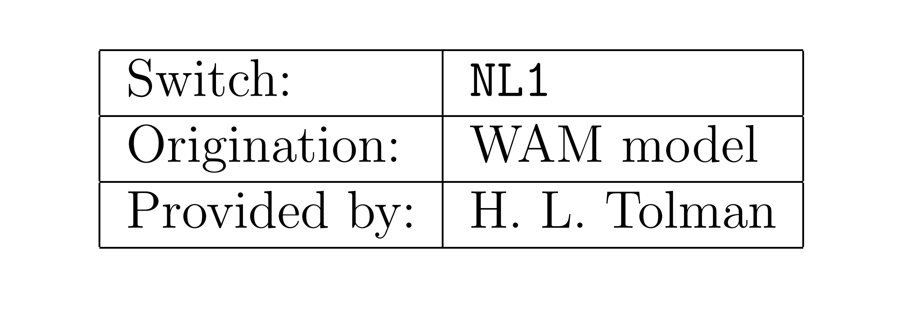
在 DIA 方法中，对于每一个波分量 $\mathbf{k}$ ，只采用两种四元组构型，而在完整积分中本应存在成千上万种构型。由这两种四元组产生的相互作用会经过缩放处理，使其在向低频方向传输能量的通量上能够给出正确的数量级。

DIA 中所采用的两个四元组均使用

$$\left.\begin{array}{rcl}\mathbf{k}_{1}&=&\mathbf{k}\\f_{r,2}&=&(1+\lambda)f_{r}\\f_{r,3}&=&(1-\lambda)f_{r}\end{array}\quad\quad\right\}
\tag{2.20}$$

其中 $\lambda$ 是一个常数，通常是 0.25，它们的不同之处只在于交互角度的选择，在下面要么取加号，要么取减号。

$$\left.\begin{array}{rcl}\theta_{2,\pm}&=&\theta\pm\delta_{\theta,2}\\\theta_{3,\pm}&=&\theta\mp\delta_{\theta,3}\end{array}\quad\quad\right\} \tag{2.21}$$

其中 $\delta_{\theta,2}$ 和 $\delta_{\theta,3}$ 只是由几何形状给出的 $\lambda$ 的函数沿"8 字形"相互作用的波数，即

$$\begin{array}{ccc}\cos(\delta_{\theta,2})=(1-\lambda)^4+4-(1+\lambda)^4)/[4(1-\lambda)^2]\end{array}\tag{2.22}$$

$$\begin{aligned}\sin(\delta_{\theta,3})=\sin(\delta_{\theta,2})(1-\lambda)^2/(1+\lambda)^2\end{aligned}\tag{2.23}$$

因此，对于任意给定的 $\mathbf{k}$ ，其中一个四元组选择 $\mathbf{k}_{2,+}$ 和 $\mathbf{k}_{3,+}$ ，而另一个四元组则选择其镜像形式 $\mathbf{k}_{2,-}$ 、 $\mathbf{k}_{2,-}$ 。由于在 DIA 选取的这两个四元组中，共有 3 个不同的波分量参与相互作用，任意一个离散谱分量 ( $f_r,\theta)$ 实际上会参与到 6 个四元组中，并且与另外 12 个谱分量 $(f_r^{\prime},\theta^{\prime})$ 直接交换能量。

由于 $f_r^{\prime}$ 和 $\theta^{\prime}$ 的取值并不恰好落在其他离散谱分量上，因此需要采用双线性插值来获得谱密度。这样，每一个源项值 $\mathcal{S_{nl}(k)}$ 都包含了与 48 个其他离散谱分量之间的直接能量交换。

我们计算了三种对应的贡献情况，即 $\mathbf{k}$ 在四元组中分别扮演 $\mathbf{k},\mathbf{k}_{2,+},\mathbf{k}_{2,-},\mathbf{k}_{3,+}$ 和 $\mathbf{k}_{3,-}$ 的角色。

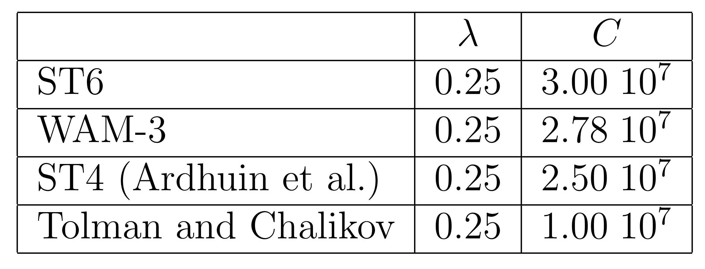

表 2.1：DIA 中输入耗散包的默认常量

因此，在不显式写出双线性插值的情况下，完整的源项可以表示为

$$\begin{aligned}S_{\mathrm{nl}}(\mathbf{k})=&-2\left[\delta S_{\mathrm{nl}}(\mathbf{k},\mathbf{k}_{2,+},\mathbf{k}_{3,+})+\delta S_{\mathrm{nl}}(\mathbf{k},\mathbf{k}_{2,-},\mathbf{k}_{3,-})\right]\\&+\delta S_{\mathrm{nl}}(\mathbf{k}_4,\mathbf{k},\mathbf{k}_5)+\delta S_{\mathrm{nl}}(\mathbf{k}_6,\mathbf{k},\mathbf{k}_7)\\&+\delta S_{\mathrm{nl}}(\mathbf{k}_8,\mathbf{k}_9,\mathbf{k})+\delta S_{\mathrm{nl}}(\mathbf{k}_{10},\mathbf{k}_{11},\mathbf{k})\end{aligned}\tag{2.24}$$

其中，四元组 $(\mathbf{k}_4,\mathbf{k}_4,\mathbf{k}_5)$ 的几何构型可由 $(\mathbf{k},\mathbf{k},\mathbf{k}_{2,+},\mathbf{k}_{3,+})$ 通过尺度因子 $(1+λ)^2$ 的伸缩并再旋转角度 $\delta_{\theta,2}$ 得到；( $\mathbf{k}_6,\mathbf{k}_6,\mathbf{k},\mathbf{k}_7)$ 具有相同的伸缩，但旋转方向相反； $( \mathbf{k} _8, \mathbf{k} _8, \mathbf{k} _9, \mathbf{k} )$ 则通过尺度因子 $(1-\lambda)^2$ 的伸缩并旋转角度 $- \delta _{\theta , 3}$ 得到；而 $(\mathbf{k}_{10},\mathbf{k}_{10},\mathbf{k}_{11},\mathbf{k})$ 具有相同的伸缩因子，但旋转方向相反。

基本贡献项 $\delta S_{\mathrm{nl}}(\mathbf{k}_{l},\mathbf{k}_{m},\mathbf{k}_{n})$ 表达式为

$$\small\begin{aligned}\delta S_{\mathrm{nl}}(\mathbf{k}_l,\mathbf{k}_m,\mathbf{k}_n)=\frac{C}{g^4}f_{r,l}^{11}\left[F_l^2\left(\frac{F_m}{(1+\lambda)^4}+\frac{F_n}{(1-\lambda)^4}\right)-\frac{2F_lF_mF_n}{(1-\lambda^2)^4}\right]\end{aligned}
\tag{2.26}$$

其中谱密度 $F_l=F(f_{r,l},\theta_l)$ 等依此类推。$C$为比例常数，通过调节以再现能量的逆级联过程。不同源项方案所采用的默认取值列于表 2.1 中。

该参数化方案是在深水条件下发展起来的，在共振条件中采用了相应的色散关系。对于浅水情况，该表达式通过一个因子 $D$ 进行缩放（但仍然使用深水色散关系）。

$$D=1+\frac{c_1}{\bar{k}d}\begin{bmatrix}1-c_2\bar{k}d\end{bmatrix}e^{-c_3\bar{k}d}\tag{2.27}$$

推荐的常数值是 $c1=5.5,c2=5/6,c3=1.25$ (Hasselmann 和 Hasselmann, 1985 )。这里的横杠符号表示对频谱进行直接平均。对于任意参数 $z$，其谱平均定义为

$$\begin{aligned}\bar{z}=E^{-1}\int_0^{2\pi}\int_0^{\infty}zF(f_r,\theta)~df_r~d\theta\end{aligned}\tag{2.28}$$

$$E=\int_0^{2\pi}\int_0^\infty F(f_r,\theta)~df_r~d\theta \tag{2.29}$$

然而，由于数值原因，平均相对深度估计为

$$\overline{k}d=0.75\widehat{k}d \tag{2.30}$$

其中 $\widehat{k}$ 定义为

$$\widehat{k}=\left(\overline{1/\sqrt{k}}\right)^{-2}$$

公式 (2.27) 的浅水修正只适用于中等水深。因此，平均相对水深 $\overline{k}d$ 不允许小于 0.5 (与 WAM 模型中的处理一致)。上述所有常数均可由用户在模型的输入文件中重新设定 (见第 4.4.3 节)。

### 2.3.3 Snl: 高斯求积法 (DIA)

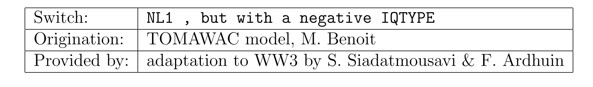

把 namelist 参数 IQTYPE 改成负值，可以用拉夫伦诺夫的高斯求积法 (2001 年) 来做一个既精确又快的 $S_\mathrm{nl}$ 计算，这样就替换掉了原来的 DIA 参数化方法。更多细节可以看 Gagnaire-Renou (2010) 的论文。

现在用的四重态构型，对应着对 $f_1,f_2$ 和 $\theta_1$ 的三个积分，其他所有频率和方向都由共振条件式 (2.19) 决定，只有 $\theta_{2}$ 角度上有一个模糊性，可以用符号索引 $s$ 来定义，这一点与 DIA 中的处理类似。以 Lavrenov（2001）中的式（A4）为起点，并按照 Gagnaire-Renou（2010）式（2.25）中的写法，源项表示为


其中 $B$ 由等式给出。拉夫雷诺夫 (2001) 的 (A5) 和

$$T(\mathbf{k},\mathbf{k}_1,\mathbf{k}_2,\mathbf{k}_3)=\frac{\pi g^2D^2(\mathbf{k},\mathbf{k}_1,\mathbf{k}_2,\mathbf{k}_3)}{4\sigma\sigma_1\sigma_2\sigma_3}\tag{2.33}$$

其中 $D (\mathbf{k},\mathbf{k}_1,\mathbf{k}_2,\mathbf{k}_3)$ 的定义来自 Webb (1978a) 的方程 (A1)。

为了更好地刻画分母中奇异性的影响，该三重积分通过求积函数来实现。因此被替换为在三个维度上的加权求和。

与 DIA 相比，这种方法不再采用双线性插值，而是在频率和方向上使用最近邻取值。此外，源项是通过对四元组构型进行循环来计算的，这使得可以根据耦合系数的大小以及与波数 $\mathbf{k}$  对应频率处的能量水平进行筛选。在该循环中，源项贡献会同时对所有 4 个相互作用的波分量进行计算，因此即使进行了筛选，仍然能够保持能量、作用量、动量等守恒。（有人可能会认为这使计算量增加了 4 倍，但它可能有助于更合理地处理高频边界问题......这一点仍有待验证。DIA 中也存在类似的问题：既然在遍历谱分量时会计算到这些情况，为什么还要让波数 $\mathbf{k}$ 去扮演四元组中其他成员的角色？）

如果采用了非常激进的筛选方式，则可能需要对源项进行重新缩放。

### 2.3.4 Snl: 完全玻尔兹曼积分 (WRT)

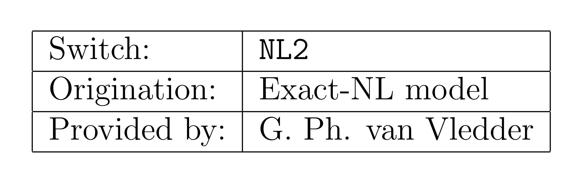

在 WAVEWATCH III 中，用于计算非线性相互作用的第二种方法是所谓的 Webb--Resio--Tracy（WRT）方法。该方法基于 Hasselmann（1962，1963a, b）提出的六维玻尔兹曼积分形式的原始工作，并结合了 Webb（1978b）、Tracy 和 Resio（1982）以及 Resio 和 Perrie（1991）所做的进一步发展。

玻尔兹曼积分描述了由于四个波数成对发生共振相互作用而导致某一特定波数处作用量密度变化的速率。要发生相互作用，这些波数必须满足以下共振条件：

$$\left.\begin{array}{rcl}\mathbf{k}_1+\mathbf{k}_2&=&\mathbf{k}_3+\mathbf{k}_4\\\sigma_1+\sigma_2&=&\sigma_3+\sigma_4\end{array}\right\} \tag{2.34}$$

这是一种比共振条件式（2.19）更为一般的形式。由所有包含 $\mathbf{k}_1$ 的四元组相互作用所引起的、波数 $\mathbf{k}_1$ 处作用量密度 $N_1$  的变化率可表示为

$$\begin{aligned}\frac{\partial N_1}{\partial t}&=\iiint  G\left(\mathbf{k}_1,\mathbf{k}_2,\mathbf{k}_3,\mathbf{k}_4\right)~\delta\left(\mathbf{k}_1+\mathbf{k}_2-\mathbf{k}_3-\mathbf{k}_4\right)\\\\&\times
~\delta\left(\sigma_1+\sigma_2-\sigma_3-\sigma_4\right)\\\\&\times[N_1N_3\left(N_4-N_2\right)+N_2N_4\left(N_3-N_1\right)]~d\mathbf{k}_2~d\mathbf{k}_3~d\mathbf{k}_4 \end{aligned} \tag{2.35}$$

其中，作用量密度 $N$ 是以波数向量 $\mathbf{k}$ 为自变量定义的，即 $N = N (\mathbf{k})$ 。项 $G$ 是一个较为复杂的耦合系数，其具体表达式由 Herterich 和 Hasselmann (1980)给出。在 WRT 方法中，通过一系列变量变换来消除其中的狄拉克 $δ$ 函数。

WRT 方法的一个关键要素是：针对每一组 $(\mathbf{k}_1,\mathbf{k}_3)$组合来考察其对应的积分空间（见 Resio 和 Perrie，1991）。

$$\frac{\partial N_1}{\partial t}=2\int T(\mathbf{k}_1,\mathbf{k}_3)~d\mathbf{k}_3 \tag{2.36}$$

其中函数 $T$ 由下式给出

$$\begin{aligned}T\left(\mathbf{k}_{1},\mathbf{k}_{3}\right)&=\iint G\left(\mathbf{k}_1,\mathbf{k}_2,\mathbf{k}_3,\mathbf{k}_4\right)~\delta\left(\mathbf{k}_1+\mathbf{k}_2-\mathbf{k}_3-\mathbf{k}_4\right)\\\\&\times\delta\left(\sigma_1+\sigma_2-\sigma_3-\sigma_4\right)~\theta\left(\mathbf{k}_1,\mathbf{k}_3,\mathbf{k}_4\right)\\\\&\times \left[N_1N_3\left(N_4-N_2\right)+N_2N_4\left(N_3-N_1\right)\right]~d\mathbf{k}2~d\mathbf{k}_4\end{aligned}\tag{2.37}$$

其中

$$\left.\theta\left(\mathbf{k}_1,\mathbf{k}_3,\mathbf{k}_4\right)=\left\{\begin{array}{ccc}1&\mathrm{when}&|\mathbf{k}_1-\mathbf{k}_3|\leq|\mathbf{k}_1-\mathbf{k}_4|\\0&\mathrm{when}&|\mathbf{k}_1-\mathbf{k}_3|>|\mathbf{k}_1-\mathbf{k}_4|\end{array}\right.\right. \tag{2.38}$$

式 (2.37) 中的 $δ$ 函数在波数空间中确定了一条需要进行积分的区域。函数 $\theta$ 决定了积分中一部分未被定义的区段，其原因在于假定 $\mathbf{k}_1$ 比 $\mathbf{k}_2$ 更接近 $\mathbf{k}_3$ 。Webb 方法的核心在于沿所谓的轨迹使用一个局部坐标系，即在给定 $\mathbf{k}_1$ 和 $\mathbf{k}_3$ 组合下，由共振条件在波数空间中确定的那条路径。

为此，将原有的 $(k_x, k_y)$ 坐标系转换为 $(s, n)$ 坐标系，其中 $s(n)$ 分别表示沿该轨迹的切向（法向）方向。经过一系列变换后，能量转移积分可以写成沿该闭合轨迹的闭合线积分形式。

$$\begin{aligned}T\left(\mathbf{k}_1,\mathbf{k}_3\right)&=\oint G\left|\frac{\partial W(s,n)}{\partial n}\right|^{-1}\theta(\mathbf{k}_1,\mathbf{k}_3,\mathbf{k}_4)\\\\&\times[N_1N_3\left(N_4-N_2\right)+N_2N_4\left(N_3-N_1\right)]~ds\end{aligned}\tag{2.39}$$

其中， $G$ 为耦合系数， $|∂W/∂n|$ 是表示共振条件的函数的梯度项见 (Van Vledder，2000)。在数值实现中，玻尔兹曼积分是通过对所有离散的 $\mathbf{k}_1$ 和 $\mathbf{k}_3$ 组合计算大量线积分 $T$ 并求有限和来完成的。线积分式 (2.39) 通常通过将该轨迹划分为约 30 个区段来求解，其离散化形式可写为：

$$\begin{aligned}T\left(\mathbf{k}_1,\mathbf{k}_3\right)&\approx\sum_{i=1}^{n_s}G(s_i)W(s_i)P(s_i)\Delta s_i\end{aligned} \tag{2.40}$$

其中， $P (s_i)$ 表示在轨迹上的某一点的乘积项， $n_s$ 表示线段的数量，而 $s_i$ 则是轨迹上的离散坐标。最后，给定波数 $\mathbf{k}_1$ 的变化率可表示为

$$\begin{aligned}\frac{\partial N(\mathbf{k}_1)}{\partial t}&\approx\sum_{i_{k3}=1}^{n_k}\sum_{i_{\theta3}=1}^{n_\theta}k_3T(\mathbf{k}_1,\mathbf{k}_3)~\Delta k_{i_{k3}}~\Delta\theta_{i_{\theta3}}\end{aligned} \tag{2.41}$$

$n_k$ 和 $n_θ$ 分别代表计算网格中波数和方向的离散数量。需要注意的是，虽然频谱是以矢量波数 $\mathbf{k}$ 来定义的。

但在波浪模式中，为了保证计算在方向上的各向同性，计算网格通常更方便地采用绝对波数与波向 $(k, θ)$ 的形式来定义。对所有波数 $\mathbf{k}_1$ 加以考虑后，便可得到由非线性四波相互作用所产生的完整源项。

关于在给定 $\mathbf{k}_1$ 与 $\mathbf{k}_3$ 组合下高效计算轨迹的细节，可参见 Van Vledder(2000,2002a,b)。

需要注意的是，这些精确的相互作用计算非常耗时，通常需要比 DIA 方法多出 $10^3$ 到 $10^4$ 倍的计算工作量。因此，目前这类计算只能用于空间网格非常有限的高度理想化测试算例中。

采用 WRT 方法的非线性相互作用已经通过 Van Vledder(2002b) 开发的可移植子程序在 WAVEWATCH III 中实现。在该实现中，WRT 方法所使用的计算网格与 WAVEWATCH III 的离散谱网格完全一致。此外，WRT 程序同样继承了与 DIA 方法相同的参数化谱尾处理能力。理论上，可以采用比 WAVEWATCH III 计算网格更高的分辨率来计算非线性相互作用，但这并不会改善计算结果，因此并未加以实现。

由于高频处的非线性四波相互作用非常重要，建议将波浪模式的最高频率设定为预期谱峰频率的大约 5 倍。需要注意的是，这一点尤为关键，因为谱网格决定了公式(2.41)中的积分范围。推荐的频率数目约为 40 个，频率递增因子为 1.07。用于计算非线性相互作用的推荐方向分辨率约为 10 度。在特定应用中也可以采用其他分辨率，但可能需要针对不同分辨率进行一定的测试。

多数用于计算玻尔兹曼积分的算法都有一个重要特性，即其积分空间可以预先计算。WAVEWATCH III 中所采用的 WRT 方法子程序版本同样具备这一特性。在波浪模式的初始化阶段，会计算积分空间------包括所有轨迹的离散路径，以及相应的相互作用系数和梯度项------并将其存储为二进制数据文件。对于每一种水深，都会生成并在当前目录中保存这样一个数据文件。

这些数据文件的名称由关键字 "quad" 加上 "xxxx" 组成，其中 xxxx 表示以米为单位的水深；对于深水情况则使用 9999。二进制数据文件的扩展名为 "bqf"（Binary Quadruplet File，BQF）。如果某个 BQF 文件已经存在，程序会检查该文件是否是在正确的谱网格下生成的；若不匹配，则会用正确的 BQF 文件覆盖原有文件。

在包含多种水深的波浪模式计算过程中，程序会通过查找已生成的、与目标水深最接近的有效 BQF 文件来选用最优的 BQF。此外，计算结果还会根据目标水深与 BQF 文件对应水深之间的深度缩放因子(公式 2.27) 之比进行重新缩放。

### 2.3.5 Snl: 广义多 DIA (GMD)

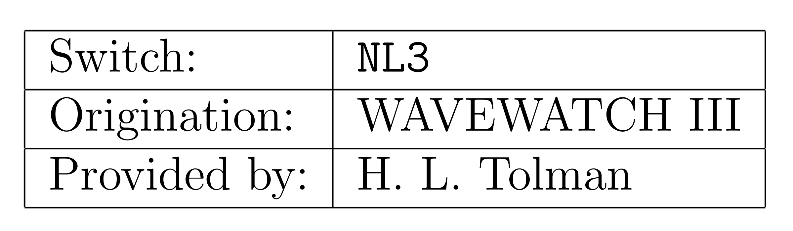

GMD 是在 DIA 的基础上发展起来的一种扩展方法。其发展过程记录在一系列技术说明（Tolman，2003a，2005，2008a，2010b）、报告（Tolman 和 Krasnopolsky，2004；Tolman，2009a，2011a）以及论文（Tolman，2004，2013a）中。作为 GMD 开发的一部分，还提出了一种整体性的遗传优化技术（Tolman 和 Grumbine，2013）。用于在 WAVEWATCH III 中执行该优化的程序包最早由 Tolman（2010c）提供，其最新版本为 1.5（Tolman，2014b）。

GMD 在三个方面对 DIA 进行了扩展。首先，扩展了代表性四元组的定义。其次，将方程推广到任意水深条件下，包括对极浅水中强相互作用的描述（例如 Webb，1978b）。第三，引入了多个代表性四元组。

GMD 通过对共振条件式（2.19）的扩展，允许采用任意构型的代表性四元组，其形式为

$$\left.\begin{array}{rcl}\sigma_1&=&a_1\sigma_r\\\sigma_2&=&a_2\sigma_r\\\sigma_3&=&a_3\sigma_r\\\sigma_4&=&a_4\sigma_r\\\theta_{12}&=&\theta_1\pm\theta_{12}\end{array}\quad\right\} \tag{2.42}$$

在 $a_1+a_2=a_3+a_4$ 满足一般共振条件 (2.34) 的地方， $σ_r$ 是一个参考频率， $θ_{12}$ 是波数 $\mathbf{k_1}$ 和 $\mathbf{k_2}$ 之间的角间隙。后一个参数可以是四元组定义中的隐含参数，也可以是一个可以明确调节的参数。有了这个，一 (λ)、二 (λ, µ) 或三参数 (λ, µ, θ12) 四元组定义已按表 2.2 所示构建。请注意，与 DIA 不同的是，所有四元组均根据实际水深和频率进行评估

其中 $a_1+a_2=a_3+a_4$ ，以满足一般共振条件式（2.34）； $σ_r$ 为参考频率， $θ_{12}$ 为波数 $\mathbf{k_1}$ 和 $\mathbf{k_2}$ 之间的夹角。后一个参数既可以隐含在四元组的定义中，也可以作为一个可显式调节的参数引入。由此，构建了一参数 $\lambda$ 、两参数 $(\lambda,\mu)$ 或三参数 $(\lambda,\mu,\theta_{12})$ 的四元组定义方式，如表 2.2 所示。需要注意的是，与 DIA 不同，在 GMD 中，所有四元组都是针对实际水深和频率进行计算的。

------------------------------------------------------------------------

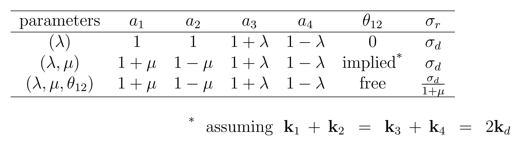

表 2.2：GMD 中代表性四元组的一参数、两参数或三参数定义。 $k_d$ 或 $(\sigma_d,\theta_d)$ 表示进行离散相互作用贡献计算时所对应的离散谱网格点。通过令 $\mathbf{k}_1+\mathbf{k}_2 ~//~ \mathbf{k}_d$ ，使所有四元组与离散方向对齐。

------------------------------------------------------------------------

在 GMD 中，离散相互作用可以在任意水深条件下计算。一个颇为出人意料的结果是：先对频率--方向谱 $F (f, θ)$ 计算相互作用，再通过雅可比变换将其转换为 WAVEWATCH III 的本征谱 $N (k,\theta)$，比直接对后者计算相互作用贡献更容易进行优化。此外，引入了一个双分量缩放函数，其中"深水"缩放函数用于描述中等到深水条件下传统意义上的弱相互作用，而"浅水"缩放函数则用于表示极浅水中的强相互作用。经过这些改进后，DIA 的离散相互作用贡献式（2.26）变为

\$\$
```{=tex}
\begin{aligned} 
\left(\begin{array}{c}
\delta S_{n l, 1} \\
\delta S_{n l, 2} \\
\delta S_{n l, 3} \\
\delta S_{n l, 4}
\end{array}\right) &= \left(\begin{array}{c}
-1 \\
-1 \\
1 \\
1
\end{array}\right) \left(\frac{1}{n_{q, d}} C_{\text{deep}} B_{\text{deep}} + \frac{1}{n_{q, s}} C_{\text{shal}} B_{\text{shal}}\right)\\\\  & \small\times 
\left[
\frac{c_{g, 1} F_{1}}{k_{1} \sigma_{1}} \frac{c_{g, 2} F_{2}}{k_{2} \sigma_{2}} \left(\frac{c_{g, 3} F_{3}}{k_{3} \sigma_{3}} + \frac{c_{g, 4} F_{4}}{k_{4} \sigma_{4}}\right) 
- \frac{c_{g, 3} F_{3}}{k_{3} \sigma_{3}} \frac{c_{g, 4} F_{4}}{k_{4} \sigma_{4}} \left(\frac{c_{g, 1} F_{1}}{k_{1} \sigma_{1}} + \frac{c_{g, 2} F_{2}}{k_{2} \sigma_{2}}\right)
\right]\end{aligned}
```

其中 $B_{\mathrm{deep}}$ 和 $B_{\mathrm{shal}}$ 是深水和浅水缩放函数

$$B_\mathrm{deep}=\frac{k^{4+m}\sigma^{13-2m}}{(2\pi)^{11}g^{4-m}c_g^2}\tag{2.44}$$


$$B_\mathrm{shal}=\frac{g^2k^{11}}{(2\pi)^{11}c_g}(kd)^n \tag{2.45}$$

其中 $m$ 和 $n$ 为可调参数，式（2.43）中的 $C_{\mathrm{deep}}$ 和 $C_{\mathrm{shal}}$ 分别为深水和浅水缩放所对应的可调比例常数； $n_{q, d}$ 和 $n_{q, s}$ 分别表示采用深水和浅水缩放的代表性四元组数量，这体现了 GMD 允许使用多个代表性四元组的特性。

在 namelist SNL3 和 ANL3 中，用户可以定义四元组的数量，并为每个四元组指定 $λ$ 、 $µ$ 、 $θ_{12}$ 、 $C_{\mathrm{deep}}$ 和 $C_{\mathrm{shal}}$ 。参数 $m$ 和 $n$ 只需定义一次，并对所有四元组通用。最后，还需要给出相对水深的阈值：低于该阈值时不采用深水缩放，高于该阈值时不采用浅水缩放。Tolman（2010b）中给出的一些 GMD 配置示例已包含在第 4.4.3 节的示例输入文件 ww3_grid. inp 中。默认设置旨在复现传统的 DIA。

需要注意的是，GMD 在形式上明显比 DIA 更为复杂，因为它需要针对每一个谱频率评估四元组的布局（而 DIA 只使用一个固定布局）。为了提高计算效率，四元组布局会针对一组无量纲水深进行预计算，并存储在内存中。即便采用了这些以及其他优化措施，当使用一参数四元组布局时，GMD 对单个代表性四元组的计算成本仍大约是 DIA 的两倍；当采用两参数或三参数四元组布局时，GMD 拥有 4 个而非 2 个四元组实现形式，使得每个四元组的计算成本约为传统 DIA 的 4 倍。使用多个代表性四元组时，计算成本将随数量线性增加。关于包含 GMD 的模型在计算代价方面的更深入评估，可参见 Tolman（2010b）和 Tolman（2013a）。

### 2.3.6 Snl: 两种尺度近似 (TSA) 和完整玻尔兹曼积分 (FBI)

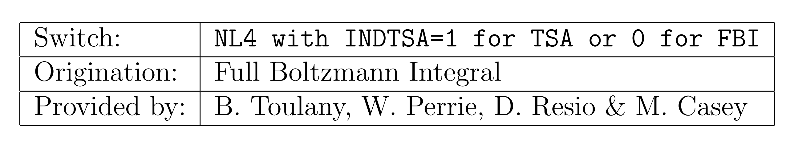

玻尔兹曼积分描述了由于四个波数之间发生共振相互作用而引起的某一特定波数处作用量密度变化的速率。这些波数必须满足相应的共振条件。

$$\mathbf{k}_1+\mathbf{k}_2=\mathbf{k}_3+\mathbf{k}_4 \tag{2.46}$$

在 WAVEWATCH III 中实现的用于计算非线性相互作用的双尺度近似（Two-Scale Approximation，TSA）方法，基于 Resio 和 Perrie（2008）（以下简称 RP08）、Perrie 和 Resio（2009）、Resio 等（2011）以及 Perrie 等（2013a）的研究成果。就玻尔兹曼积分而言，TSA 的描述方式与 WRT 方法类似；但在这里，我们将重点放在 TSA 的推导过程以及它与 WRT 方法之间的差异上。

从 RP08 的式（2）出发，由波数 $\mathbf{k}_3$ 向波数 $\mathbf{k}_1$ 的传输率积分，记为 $T (\mathbf{k}_1, \mathbf{k}_3)$ ，满足如下关系：

$$\frac{\partial n(\mathbf{k}_1)}{\partial t}=\iint T(\mathbf{k}_1,\mathbf{k}_3)d\mathbf{k}_3 \tag{2.47}$$

可以重写 (如 RP08) 为

$$\begin{aligned}T(\mathbf{k}_1,\mathbf{k}_3)=&~2\oint[n_1n_3(n_4-n_2)+n_2n_4(n_3-n_1)]~C(\mathbf{k}_1,\mathbf{k}_2,\mathbf{k}_3,\mathbf{k}_4)\\&~ \vartheta(|\mathbf{k}_1-\mathbf{k}_4|-|\mathbf{k}_1-\mathbf{k}_3|)\left|\frac{\partial W}{\partial\eta}\right|^{-1}ds\\\equiv &~2\oint N^3C\vartheta\left|\frac{\partial W}{\partial\eta}\right|^{-1}ds\end{aligned}
\tag{2.48}$$

作为轮廓 $s$ 上的线积分，其中函数 $W$ 由下式给出

$$W=\omega_1+\omega_2-\omega_3-\omega_4 \tag{2.49}$$

其中， $\vartheta$ 为 Heaviside 函数， $\mathbf{k}_2 = \mathbf{k}_2(s,\mathbf{k}_1,\mathbf{k}_3)$ 。这里， $n_i$ 表示在 $\mathbf{k}_i$ 处的作用量密度，函数 $W$ 定义为 $W = \omega_1 + \omega_2 - \omega_3 - \omega_4$ ，

它要求相互作用在 $s$ 上守恒能量，其中 $s$ 是满足 $W=0$ 的点所构成的轨迹，而 $\eta$ 是与该轨迹正交的局地方向。需要注意的是，式（2.48）与第 2.3.4 节中 WRT 的式（2.39）形式相似，其中耦合系数 $C$ 等于 WRT 耦合系数 $G$ 的一半。

TSA 与 FBI

对于 FBI，与 WRT 类似，我们通过数值方法将式（2.48）的离散形式计算为针对所有离散 $\mathbf{k}_1$ 与 $\mathbf{k}_3$ 组合的、围绕 locus $s$ 的大量线积分 $T(\mathbf{k}_1,\mathbf{k}_3)$ 的有限求和。线积分是通过将 locus 划分为有限个长度为 $ds$ 的小区段来确定的。完整的"精确"计算代价极高，其计算时间通常是 DIA 的 $10^3$--$10^4$ 倍。

TSA 的基本思想是将方向谱分解为一个参数化的（大尺度，broadscale）谱和一个（局地尺度，local-scale）的非参数残差分量。残差分量的引入使得这种分解在自由度数量上与原始谱保持一致，这是第三代（3G）波浪模式中非线性传输源项所必需的。如相关文献所述，这种分解使非线性波--波相互作用可以表示为：大尺度相互作用、局地尺度相互作用，以及交叉项------即大尺度谱分量与局地尺度谱分量之间的相互作用。该方法允许对大尺度相互作用以及部分局地尺度相互作用进行预计算。TSA 的精度依赖于用于表示大尺度分量的参数化方案的准确性。

我们首先将给定的作用量密度谱 $n_i$ 分解为参数化的大尺度项 $\hat{n}_i$ 和残余的局地尺度（或"扰动尺度"）项 $n'_i$。其中，大尺度项 $\hat{n}_i$ 假定具有 JONSWAP 类型的形式，仅依赖于少数几个参数。

$$n_i^{\prime}=n_i-\hat{n}_i \tag{2.50}$$

TSA 的精度取决于 $\hat n_i$ 。也就是说，如果用于 $\hat n_i$ 的自由度数量接近某一给定波谱 $n_i$ 的自由度数量，那么局地尺度的 $n'_i$ 就会变得非常小，因此 TSA 的精度会非常高。然而，为 $\hat n_i$ 构建大型多维的预计算矩阵集合是非常耗时的。因此，一个最优的 TSA 表述必须尽量减少 $\hat n_i$ 所需的参数数量。不过，即便如此，对于复杂的多峰波谱 $n_i$ ，可以使用一小组参数来使 $\hat n_i$ 捕捉到波谱中的大部分能量，从而使残余项 $n'_i$ 变得很小（RP08；Perrie and Resio，2009）。

RP08 描述了对 $n_i$ 的划分方式，使得式 (2.48) 中的传输积分 $T$ 由三部分之和构成：大尺度项 $\hat n_i$，记为 $B$；局地尺度项 $n'_i$，记为 $L$；以及 $\hat n_i$ 与 $n'_i$ 之间的跨尺度项，记为 $X$。因此，非线性能量传输项可以表示为，

$$S_{nl}(f,\theta)=B+L+X \tag{2.51}$$

其中 $B$ 取决于 JONSWAP 类型参数 $x_i$ 并且可以预先计算，

$$S_{nl}(f,\theta)_{broadscale}=B(f,\theta,x_1,\ldots,x_n) \tag{2.52}$$

TSA 需要为 $L+X$ 寻找既准确又高效的近似方法。如果像 FBI 那样计算式 (2.51) 中的所有项，那么与式 (2.51) 中的 $B$ 相比，计算量可能会增加约 8 倍。尽管这种方法可以作为研究双峰波谱一般问题的一种手段，例如在混合风浪和涌浪的情况下，通过将两个谱区之和的相互作用减去单一谱区的相互作用来进行分析，但它并不能像使用分裂密度函数那样提供同等程度的物理洞察；在后者中，跨尺度相互作用项可以通过代数方式进行分析。

无论如何，为了简化式 (2.51)，涉及 $n'_2$ 和 $n'_4$ 的项被忽略。这是基于这样的假设：这些局地尺度项只是围绕大尺度项 $\hat n_2$ 和 $\hat n_4$ 的偏差，而后者被认为能够捕捉到波谱中的大部分能量；相反， $n'_2$ 和 $n'_4$ 由于其正负差异及其乘积，往往会相互抵消。TSA 在测试波谱中能够再现 FBI（或 WRT）结果的能力，被用来证明这种处理方法的合理性。

此外，大尺度项 $\hat n_2$ 和 $\hat n_4$ 通常沿轨迹 $s$ 具有更长的尺度长度，因此应当对净传输积分作出更大的贡献。因此，RP08 表明

$$\begin{aligned}S_{nl}(k_1)=B+L+X=B+\int\int\oint N_*^3C\left|\frac{\partial W}{\partial n}\right|^{-1}dsk_3d\theta_3dk_3\end{aligned} \tag{2.53}$$

其中， $N^*_3$ 表示在忽略所有包含 $n'_2$ 和 $n'_4$ 的项之后，由其余交叉项所剩下的部分，

$$\small\begin{aligned} N_*^3&=\hat{n}_2\hat{n}_4(n_3^{\prime}-n_1^{\prime})+n_1^{\prime}n_3^{\prime}(\hat{n}_4-\hat{n}_2)+\hat{n}_1n_3^{\prime}(\hat{n}_4-\hat{n}_2)+n_1^{\prime}\hat{n}_3(\hat{n}_4-\hat{n}_2)\end{aligned} 
\tag{2.54}$$

他们使用已知的比例关系，并针对具体情况进行了参数化，比如用于 $f^{-4}$ 或 $f^{-5}$ 谱。为了实现这个公式，我们通常对每一个谱峰分别进行拟合。

需要注意的是，为了加快计算速度，会预先生成一组多维数组并将其保存下来，例如网格几何数组和梯度数组。这些数组是谱参数、轨迹上分段数量以及水深的函数，并被存储在名为 "grd_dfrq_nrng_nang_npts_ndep. dat" 的文件中，例如 "grd_1.1025-35_36_30_37. dat" 等。

位于 w3snl4md.ftn 中的 TSA 主子程序 W3SNL4 的流程图如下所示：

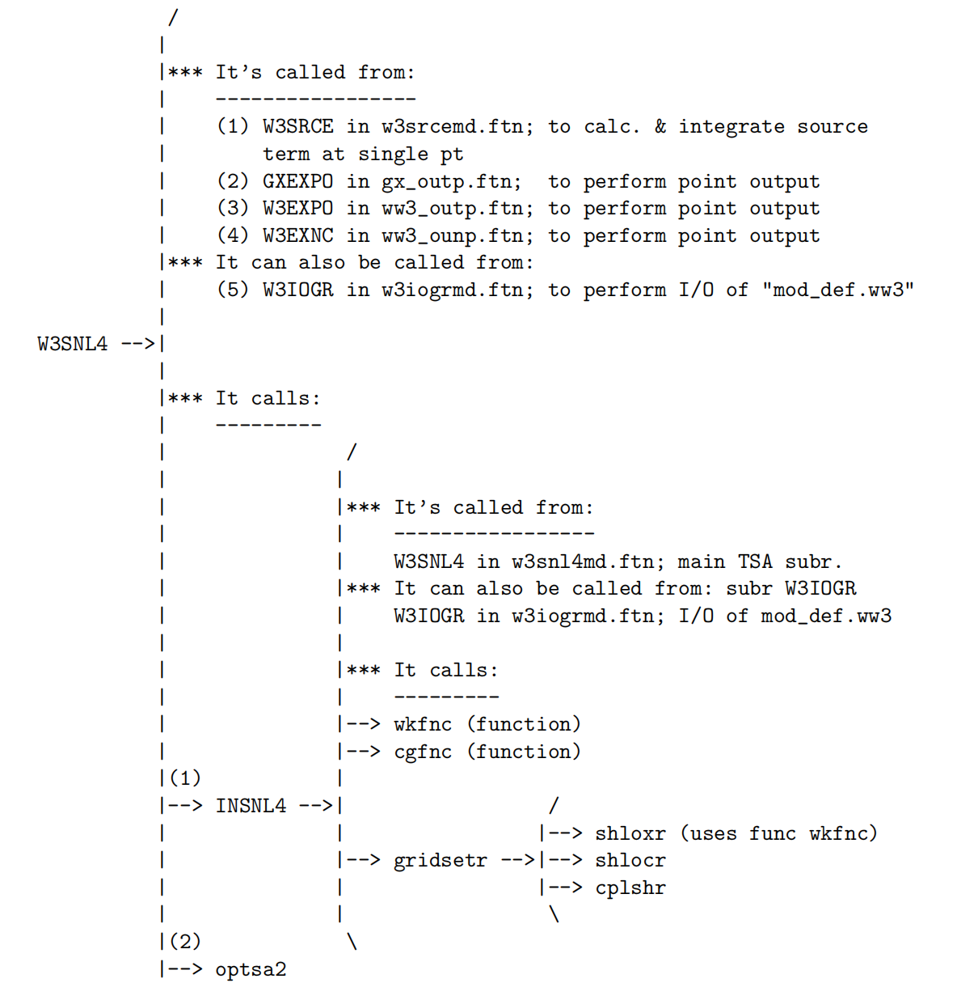
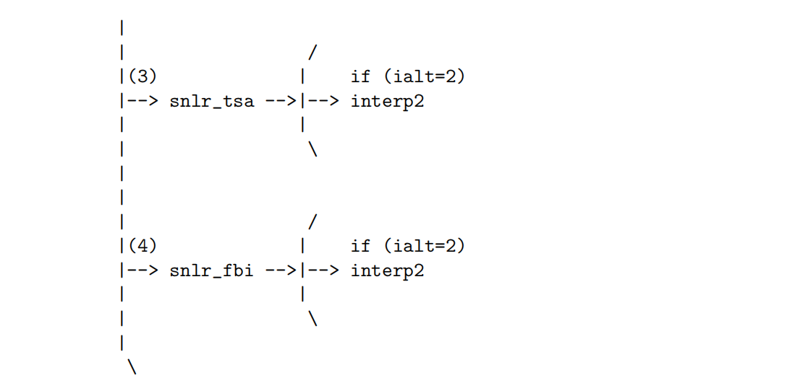

### 2.3.7 Snl: 广义动力学方程 (GKE)

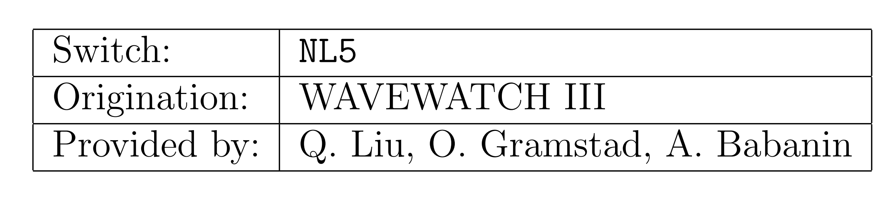

Hasselmann，1962 提出的玻尔兹曼积分形式（也称为动力学方程，见公式 (2.35)，下文简称 HKE）描述了由于共振四波相互作用（见公式 (2.34)），波浪能量在频谱空间中是如何重新分配的。

HKE 的推导基于一个重要假设：作用量密度（action density）的演化发生在一个非常缓慢的时间尺度上，也称为"动力学"时间尺度，其量级为$O(1/\varepsilon^4 \sigma_0)$ ，其中 $\varepsilon$ 和 $\sigma_0$ 分别表示波浪场中波浪的典型陡峭度和特征频率（Annenkov 和 Shrira，2006）。

在这一假设下，从长时间极限来看，HKE 不包含非共振相互作用的贡献，即频率变化量 $\Delta \sigma \ne 0$ 的情况。

随后，HKE 被进一步扩展以纳入非共振四波相互作用的影响。例如，Janssen（2003）、Annenkov 和 Shrira（2006）以及 Gramstad 和 Stiassnie（2013，下文简称 GS13）均提出了相应的理论扩展。

本文中实现的广义动力学方程（generalized kinetic equation，GKE）正是基于 GS13，以及 Gramstad 和 Babanin（2016）和 Liu 等（2021a，下文简称 LGB21）的研究工作。

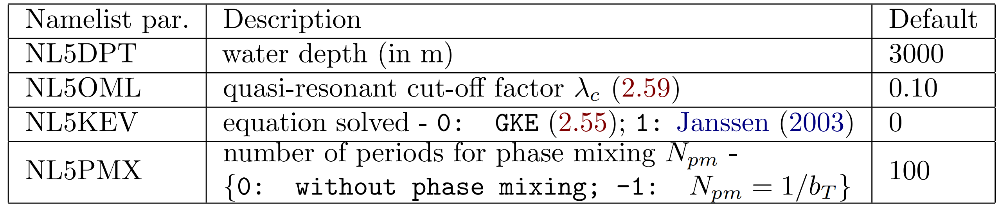

在 GS13 以下，GKE 读取。

$$\begin{aligned}\frac{\mathrm{~d}C_1}{\mathrm{~d}t}&=4\Re\int\left[T_{1,2,3,4}^2\delta(\boldsymbol{\Delta k})\mathrm{e}^{i\Delta\sigma t}I(t)\right]\mathrm{~d}\boldsymbol{{k}_{2,3,4}}\end{aligned}
\tag{2.55}$$


$$I(t)=\int_0^t\mathcal{F}_{1,2,3,4}(\tau)\mathrm{e}^{-i\Delta\sigma\tau}\mathrm{~d}\tau \tag{2.56}$$


$$\begin{aligned}\mathcal{F}_{1,2,3,4}=C_3C_4(C_1+C_2)-C_1C_2(C_3+C_4)\end{aligned} \tag{2.57}$$

这里 $C_{1} = C(k_{1}) = gN(k,\theta)/k$ 是作用波谱， $T_{1,2,3,4} = T(k_{1},k_{2},k_{3},k_{4})$ 是相互作用系数 (Krasitskii，1994；Janssen，2009)， $\Delta k = k_{1} + k_{2} - k_{3} - k_{4}$ 是波数失配， $dk_{2,3,4} = dk_{2}dk_{3}dk_{4}$ 。注意。

$$\begin{aligned}S_{nl}(k,\theta)=\omega\frac{\mathrm{~d}N}{\mathrm{~d}t}|_{nl}=\frac{\omega k}{g}\frac{\mathrm{~d}C_1}{\mathrm{~d}t}\end{aligned} \tag{2.58}$$

根据上述方程可以看出，GKE 不仅包含了**非共振相互作用**（在式 (2.55) 中，HKE 中所包含的 $\delta(\Delta \sigma)$ 已被消去），而且还表明波浪场的演化与其**先前的演化历史**有关（即式 (2.56) 中的 $I(t)$ ）。

GKE 算法的完整细节可参见 GS13 和 LGB21。Janssen（2003）提出的修正动力学方程也已在 GKE 框架内实现。

SNL5 命名表中可用的参数汇总见表 2.3。

关于如何使用这一非线性项，读者可参考回归测试 ww3_ts1/input_nl5_growth 和 ww3_ts1/input_nl5_gaussian 。

**四元组的筛选（Filtration of quadruplets）**

为了降低 GKE 的计算开销，这里只考虑满足以下条件的波数构型：

$$\left\{\begin{array}{rcl}k_1+k_2&=&k_3+k_4\\|\Delta\sigma|&\leq&\lambda_c\min(\sigma_1,&\sigma_2,&\sigma_3,&\sigma_4)\end{array}\right. 
\tag{2.59}$$

作为有效的四元组。其中， $\lambda_c$ 是一个截断因子，用于滤除那些远离共振、对频谱演化贡献很小的四波组合。对于给定的一个四元组， $k_1$ 、 $k_2$ 和 $k_3$ 取自波数网格点，而 $k_4$ 则由式 (2.59) 自然确定。除非另有说明，作用量密度 $C(k_4)$ 通过双线性插值获得（van Vledder，2006）。当 $k_4$ 落在频谱网格之外时，我们假设

$$C(k_4)=\begin{cases}0&\mathrm{~for~}k_4<k_\mathrm{min}\\C(k_\mathrm{max})\left(\frac{k_4}{k_\mathrm{max}}\right)^{n/2-2}&\mathrm{~for~}k_4>k_\mathrm{max}&\end{cases}\tag{2.60}$$

其中， $k_{\min}$ 和 $k_{\max}$ 分别表示频谱网格中的最小和最大波数， $n=-5$ 为预先设定的高频谱幂律指数（即频谱满足 $E(f)\propto f^n$ ）。

------------------------------------------------------------------------

**相位混合（Phase mixing）**

GKE 通常在假设波相位在初始时刻完全不相关的条件下求解，即采用"冷启动"，令 $I(t=0)=0$（GS13）。随着波场的演化，非线性的四波相互作用会导致波场偏离高斯分布（Janssen，2003），从而产生非零的四阶累积量，并使 $I(t)$ 变为非零。

某些物理过程（例如波浪破碎；Babanin，2011）可能在特定时刻重新打乱波相位，使其再次变得不相关（即相位重新混合）。GS13 以及 Gramstad 和 Babanin（2016）提出，可通过在 GKE 算法中周期性地重新启动 GKE 来引入这一效应：在保持作用量谱不变的前提下，每经过 $N_{pm}$ 个特征波周期（以 $T_{m0,-1}$ 表示，见式 (2.258)）便将时间重置为 $t=0$ 。。

需要指出的是，相位重新混合不仅具有物理意义，同时也是抑制 GKE 在长期数值模拟中出现数值不稳定性的一种有效手段（参见 LGB21）。

目前提供了两种 $N_{pm}$ 的设置方式：

1.  将 $N_{pm}$ 设为一个固定常数 $[N_{pm}\sim O(10^2)]$ ；

2.  令 $N_{pm}$ 显式依赖于主导破碎概率 $b_T$，即采用 $N_{pm}=1/b_T$，其中 $b_T$ 按照 Babanin 等（2001）的方法，通过式 (2.165) 进行估计。

------------------------------------------------------------------------

**源项积分（Source term integration）**

第三代谱波浪模式通常采用半隐式或隐式积分格式，在时间步长 $\Delta t$ 内根据各类源项计算作用量密度的变化 $\Delta N$ 。在这类积分格式中，需要用到对角项$D(k,\theta)=\partial S(k,\theta)/\partial N(k,\theta)$［见式 (3.61)，以及第 3.6 节］。

然而，在 GKE 的源项表达式 (2.55) 中包含时间积分项 $I(t)$ ，而该项又显式依赖于波谱演化的历史（通过作用量乘积项 $\mathcal{F}_{1,2,3,4}(\tau)$ 体现）。因此，对 GKE 来说，计算对角项 $D(k,\theta)$ 是非常困难的，甚至在实际中几乎不可行。

为了解决这一问题，当非线性源项 $S_{nl}$ 基于 GKE 计算时，本文采用了 Tolman（1992）提出的显式动态时间步进格式进行源项积分，即在式 (3.61) 中取 $\varepsilon=0$ 。

------------------------------------------------------------------------

**代码的局限性（Limitations of the code）**

GKE 的计算代价极高，目前只能应用于 WW3 的单网格点版本（例如持续时间受限的测试算例）。由于引入了准共振相互作用，以及采用了显式的源项积分格式，基于 GKE 的计算开销大约是 WRT 方法（见第 2.3.4 节）的 5--10 倍。

### 2.3.8 Snl 非线性滤波器

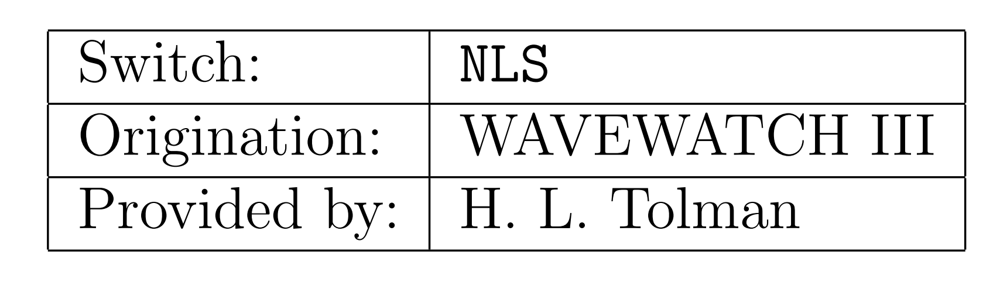

当采用式 (2.19) 和 (2.26) 中的 DIA，并选取一个四元组使得 $\lambda_{nl}$ 足够小、从而该四元组无法被离散频谱网格分辨时，DIA 的数值形式将等效为一个简单的扩散张量。如果对该扩散张量进行滤波，使其仅作用于频谱的高频尾部，则可以得到一种守恒型滤波器，该滤波器能够保持非线性相互作用的所有守恒性质（Tolman，2008a，2011b）。

这种滤波器可以作为非线性相互作用参数化方案的一部分。例如，Tolman（2011b）在其图 5 和图 6 中表明，在某些 GMD 配置下，该方法能够有效去除高频谱噪声。

由于该方法的前提条件是四元组不能被频谱网格分辨，因此，用于定义四元组的滤波自由参数是离散频率网格中第 3 和第 4 个分量的相对偏移量 $\alpha_{34}$ （ $0<\alpha_{34}<1$ ）。由此可以计算得到 $\lambda_{nl}$ ，其表达式为：

$$\lambda_{nl}=\alpha_{34}(X_\sigma-1) \tag{2.61}$$

其中， $X_\sigma$ 为离散频率网格的递增因子，通常取 $X_\sigma = 1.1$ ［见式 (3.1)］。

在采用 WAVEWATCH III 的原生谱表示方式时，四元组中第 $i$ 个分量处谱密度的变化 $\delta N_i$ 可以写成离散扩散方程的形式（Tolman，2011b，第 294 页）：

$$\begin{pmatrix}\delta N_3\\\delta N_1\\\delta N_4\end{pmatrix}=N_1\begin{pmatrix}0\\1\\0\end{pmatrix}+N_1\frac{S\Delta t}{N_1}\begin{pmatrix}1\\-2\\1\end{pmatrix} \tag{2.62}$$

和

$$S=\frac{C_{nlf}k^4\sigma^{12}}{(2\pi)^9g^4c_g}\left[\frac{N_1^2}{k_1^2}\left(\frac{N_3}{k_3}+\frac{N_4}{k_4}\right)-2\frac{N_1}{k_1}\frac{N_3}{k_3}\frac{N_4}{k_4}\right] \tag{2.63}$$

其中， $C_{nlf}$ 为滤波器中所采用的 DIA 的比例常数。DIA 会对应两个互为镜像的四元组，分别产生变化项 $S_a$ 和 $S_b$ 。为使该平滑过程仅作用于高频区域，这里引入了一种 JONSWAP 形式的滤波函数 $\Phi$ ，其表达式为：

$$\Phi(f)=\exp\left[-c_1\left(\frac{f}{c_2f_p}\right)^{-c_3}\right] \tag{2.64}$$

其中 $c_1$ 到 $c_3$ 是可调参数。后三个参数需要选择为 $\Phi(f_p)\approx0,\Phi(f>3f_p)\approx1$ 和 $\Phi\approx0.5$ (频率略大于 $f_p$ )。这可以通过设置来实现

其中， $c_1$ 至 $c_3$ 为可调参数。这三个参数需要合理选择，使滤波函数满足以下条件：

- 在谱峰频率处 $\Phi(f_p)\approx 0$ ；
- 当频率大于约 $3f_p$ 时， $\Phi(f>3f_p)\approx 1$ ；
- 而在略高于 $f_p$ 的频率范围内， $\Phi \approx 0.5$ 。

这些要求可以通过如下方式进行设置。

$$c_1=1.25,\quad c_2=1.50,\quad c_3=6.00 \tag{2.65}$$

在考虑将变化量 $S_{a,b}$ 重新分配到相邻的离散频谱网格点之后，两个四元组相互作用的有效无量纲强度（ $\tilde S_{a,b}$ ）可表示为：

$$\tilde{S}_a=\Phi(f)M_1S_a\Delta t/N_1,\quad\tilde{S}_b=\Phi(f)M_1S_b\Delta t/N_1\tag{2.66}$$

其中， $N_1$ 为四元组中心分量处的作用量密度， $M_1$ 是一个用于考虑该贡献在离散频谱网格上重新分配的因子（详见 Tolman，2011b）。为了将该 DIA 转化为稳定的扩散型滤波器，需要将相互作用的有效无量纲强度限制在 $|\tilde S_{a,b}| \le \tilde S_{\max} \approx 0.5$ （例如，Fletcher，1988）。

最大变化量随后按照如下方式分配到两个四元组中：

$$\tilde{S}_{m,a}=\frac{|\tilde{S}_a|\tilde{S}_{\max}}{|\tilde{S}_a|+|\tilde{S}_b|},\quad{S}_{m,b}=\frac{|\tilde{S}_b|\tilde{S}_{\max}}{|\tilde{S}_a|+|\tilde{S}_b|}\tag{2.67}$$

标准化变化 $\tilde{S}_a$ 和 $\tilde{S}_b$ 限制为

$$-\tilde{S}_{m,a}\leq\tilde{S}_a\leq\tilde{S}_{m,a},\quad-\tilde{S}_{m,b}\leq\tilde{S}_b\leq\tilde{S}_{m,b}\tag{2.68}$$

由此可见，该非线性滤波器的自由参数包括：式 (2.61) 中的 $\alpha_{34}$ 、式 (2.63) 中的 $C_{nlf}$ 、式 (2.67) 中的 $\tilde S_{\max}$ ，以及式 (2.64) 中的 $c_1$ 至 $c_3$ 。上述所有参数均可由用户在 ww3_grid.inp 文件中的 snls 命名表中进行设置（分别对应参数 A34、FHFC、DNM、FC1、FC2 和 FC3）。

需要注意的是，该滤波器是在 $S_{nl}$ 的参数化方案之外额外应用的，并不替代原有的 $S_{nl}$ 参数化。因此，它需要与前文所述的完整 $S_{nl}$ 参数化方案配合使用。

### 2.3.9

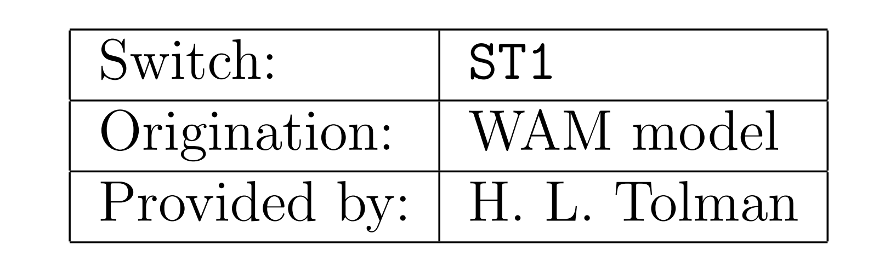

WAM 周期 1 至 3 的输入和耗散源项基于 Snyder 等人。 (1981) 和科曼等人。 (1984)(另见 WAMDIG，1988)。输入源项给出为

WAM 第 1 至第 3 代循环中的输入源项和耗散源项基于 Snyder 等（1981）以及 Komen 等（1984）的工作（另见 WAMDIG，1988）。其中，输入源项表示为：

$$\mathcal{S}_{in}(k,\theta)=C_{in}\frac{\rho_a}{\rho_w}\max\left[0,\left(\frac{28\:u_*}{c}\cos(\theta-\theta_w)-1\right)\right]\:\sigma\:N(k,\theta)\: \tag{2.69}$$

$$u_*=u_{10}\sqrt{(0.8+0.065u_{10})10^{-3}}\: \tag{2.70}$$

其中， $C_{in}$ 为常数（ $C_{in}=0.25$ ）， $\rho_a$ （ $\rho_w$ ）分别为空气（海水）的密度， $u_*$ 为风摩擦速度（Charnock，1955；Wu，1982）， $c$ 为相速度（ $c=\sigma/k$ ）， $u_{10}$ 为距平均海平面 10 m 处的风速， $\theta_w$ 为平均风向。相应的耗散项表示为：

$$\mathcal{S}_{ds}(k,\theta)=C_{ds}\:\hat{\sigma}\:\frac{k}{\hat{k}}\left(\frac{\hat{\alpha}}{\hat{\alpha}_{PM}}\right)^2N(k,\theta)\tag{2.71}$$
$$\hat{\sigma}=\left(\overline{\sigma^{-1}}\right)^{-1}\tag{2.72}$$
$$\hat{\alpha}=E\:\hat{k}^2\:g^{-2}\tag{2.73}$$

其中 $C_{ds}$ 是常数 $(C_{ds}=-2.3610^{-5})，\hat{\alpha}_{PM}$ 是 PM 的 $\hat{\alpha}$ 值 $\mathop{\text{spectrum }}(\hat{\alpha}_{PM}=3.0210^{-3})$ 且其中 $\hat{k}$ 由等式给出 (2.31)。

参数尾部 \[方程 (2.17) 和 (2.18)\] 对应于这些来源条件由 $m=4.5$ 给出，并且由

$$f_{hf}=\max\left[\:2.5\:\hat{f}_r\:,\:4\:f_{PM}\:\right]\tag{2.74}$$

$$f_{PM}=\frac g{28\:u_*}\tag{2.75}$$

其中， $f_{PM}$ 为 Pierson 和 Moskowitz（1964）提出的特征频率，由风摩擦速度 $u_*$ 估算得到。该高频尾部的形状及其与主谱的连接位置在当前模型中是硬编码设定的。可调参数 $C_{in}$ 、 $C_{ds}$ 和 $\alpha_{PM}$ 预先设定为默认值，但用户也可以在模型的输入文件中重新定义这些参数。此外，还可以采用 Alves 等（2003）提出的替代 $f_{PM}$ 和 $\alpha_{PM}$ 取值。

### 2.3.10 Sin + Sds: Tolman and Chalikov 1996

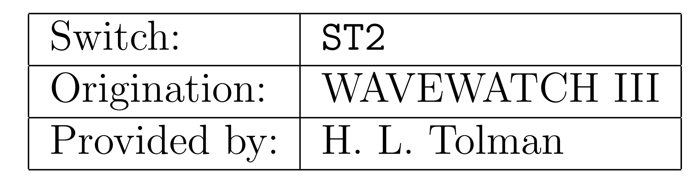

Tolman 和 Chalikov（1996）提出的源项方案由 Chalikov 和 Belevich（1993）以及 Chalikov（1995）的输入源项，以及两个耗散组成部分构成。该输入源项表示为

$$\mathcal{S}_{in}(k,\theta)=\sigma\:\beta\:N(k,\theta)\tag{2.76}$$

其中，$\beta$ 是一个无量纲的风--浪相互作用参数，其近似表达式为

$$\left.10^4\beta=\left\{\begin{array}{ccc}-a_1\tilde{\sigma}_a^2-a_2&,&\tilde{\sigma}_a&<-1\\a_3\tilde{\sigma}_a(a_4\tilde{\sigma}_a-a_5)-a_6&,&-1\leq&\tilde{\sigma}_a&<\Omega_1/2\\(a_4\tilde{\sigma}_a-a_5)\tilde{\sigma}_a&,&\Omega_1/2\leq&\tilde{\sigma}_a&<\Omega_1\\a_7\tilde{\sigma}_a-a_8&,&\Omega_1\leq&\tilde{\sigma}_a&<\Omega_2\\a_9(\tilde{\sigma}_a-1)^2+a_{10}&,&\Omega_2\leq&\tilde{\sigma}_a\end{array}\right.\right.$$

其中

$$\tilde{\sigma}_a=\frac{\sigma\:u_\lambda}g\cos(\theta-\theta_w)
\tag{2.78}$$

为谱分量的无量纲频率， $\theta_w$ 表示风向， $u_{\lambda}$ 为位于"表观"波长高度处的风速。

$$\lambda_a=\frac{2\pi}{k|\cos(\theta-\theta_w)|}\tag{2.79}$$
方程 (2.77) 中的参数 $a_1-a_{10}$ 和 $\Omega_1,\Omega_2$ 取决于高度 $z=\lambda_a$ 处的阻力系数 $C_\lambda$ 。

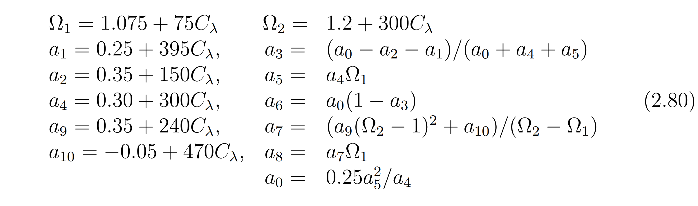

波浪模型以给定参考高度 $z_r$ 处的风速 $u_r$ 作为输入，因此在参数化过程中需要推导 $u_\lambda$ 和 $C_\lambda$ 。除去紧贴水面的一个很薄的表面调整层外，平均风速廓线可近似认为是对数分布的

$$u_z=\frac{v_*}\kappa\ln\left(\frac z{z_0}\right)\tag{2.81}$$

其中， $\kappa = 0.4$ 为冯·卡门常数， $z_0$ 为粗糙度参数。该公式也可以用参考高度 $z_r$ 处的阻力系数 $C_r$ 来重新表示（Chalikov，1995）：

$$C_r = \kappa^2 [R - \ln(C)]^2 \tag{2.82}$$

其中

$$R = \ln\left(\frac{z_r g}{\chi \sqrt{\alpha} u_r^2}\right)\tag{2.83}$$

其中， $\chi = 0.2$ 为常数， $\alpha$ 为高频段常用的无量纲能量水平。对这些隐式关系，可以采用如下较为精确的显式近似表达式：

$$C_r = 10^{-3} \left(0.021 + \frac{10.4}{R^{1.23} + 1.85}\right)\tag{2.84}$$

因此，对阻力系数的估计需要先得到高频能量水平 $\alpha$ 。理论上， $\alpha$ 可以直接由波浪模型给出，但由于谱的高频部分通常分辨率不足、噪声较大，并且容易受到多个源项误差的影响，这种直接估计并不可靠。因此， $\alpha$ 采用参数化方式进行估计（Janssen，1989）：

$$\alpha = 0.57 \left(\frac{u_*}{c_p}\right)^{3/2}\tag{2.85}$$

由于后一公式本身依赖于阻力系数，严格来说，式 (2.83) 至 (2.85) 需要通过迭代方式求解。这类迭代在模型初始化阶段会被执行，而在实际模式运行过程中通常并不需要，因为 $u_*$ 一般变化较为缓慢。

需要指出的是，式 (2.85) 可以视为阻力系数 $C_r$ 参数化过程中的一种内部关系，因此即便它与模型的实际行为存在一定偏差，也不会影响参数化的一般性。在 Tolman 和 Chalikov（1996）中， $C_r$ 因而被直接表示为 $c_p$ 的函数。

利用阻力系数的定义以及式 (2.81)，粗糙度参数 $z_0$ 可表示为：

$$z_0 = z_r \exp\left(-\kappa C_r^{-1/2}\right)\tag{2.86}$$

高度 $\lambda$ 处的风速和阻力系数变为

$$u_\lambda=u_r\frac{ln(\lambda_a/z_0)}{ln(z_r/z_0)}\tag{2.87}$$
$$C_\lambda=C_r\left(\frac{u_a}{u_\lambda}\right)^2\tag{2.88}$$

最后，等式。 (2.85) 需要估计峰值频率 $f_p。$ 为了获得主动生成的波的峰值频率的一致估计，即使在复杂的多模态频谱中，该频率是根据输入源项的正部分的等效峰值频率估计的 (参见 Tolman 和 Chalikov，1996)

最后，式 (2.85) 还需要给出谱峰频率 $f_p$ 的估计。为了在复杂的多峰波谱条件下，仍能对正在生成的风浪的谱峰频率给出一致的估计，这里采用输入源项中正值部分所对应的等效谱峰频率来确定 $f_p$ （见 Tolman 和 Chalikov，1996）。

$$f_{p,i}=\dfrac{\int\int\:f^{-2}\:c_g^{-1}\:\max\:[\:0\:,\:\mathcal{S}_{wind}(k,\theta)\:]\:df\:d\theta}{\int\int\:f^{-3}\:c_g^{-1}\:\max\:[\:0\:,\:\mathcal{S}_{wind}(k,\theta)\:]\:df\:d\theta}\: \tag{2.89}$$

由此可以估计实际的谱峰频率，其表达式为（上标波浪号表示基于 $u_*$ 和 $g$ 的无量纲参数）：

$$\tilde f_p\:=\:3.6\:10^{-4}\:+\:0.92\tilde f_{p,i}\:-\:6.3\:10^{-10}\:\tilde f_{p,i}^{-3}\tag{2.90}$$

上述各式中的所有常数均已在模型内部定义，用户只需指定参考风速高度 $z_r$ 。

在对包含该源项的 WAVEWATCH III 全球实现版本进行测试时（Tolman，2002f），我们发现模型对逆风或弱风条件下的涌浪耗散存在明显的高估。为修正这一问题，引入了一种经过滤波处理的输入源项，其形式定义为：

$$\mathcal{S}_{i,m}=\left\{\begin{array}{cccc}\mathcal{S}_i&\text{for}&\beta\geq0&\text{或}&f>0.8f_p\\X_s\mathcal{S}_i&\text{for}&\beta<0&\text{和}&f<0.6f_p\\\mathcal{X}_s\mathcal{S}_i&\text{for}&\beta<0&\text{和}&0.6f_p<f<0.8f_p\end{array}\right.\tag{2.91}$$

$C_{r}$ 可以设置最大允许阻力系数 $C_{r,max}$ ，或者一个简单的硬限制

其中， $f$ 为频率， $f_p$ 为由输入源项计算得到的风浪谱峰频率， $\mathcal{S}_i$ 为输入源项（式 2.76）， $0<X_s<1$ 为对 $\mathcal{S}_i$ 的削减系数，该系数仅作用于增长率 $\beta$ 为负的涌浪部分（由用户定义）。 $\mathcal{X}_s$ 表示一个随 $f_p$ 线性变化的削减函数，用于在原始输入与削弱后的输入之间实现平滑过渡。

由式 (2.85) 得到的参考高度处阻力系数在飓风强度风速条件下会变得不现实地偏大，从而导致波浪增长率被明显高估。为缓解这一问题，参考高度处的阻力系数 $C_r$ 可以设置上限 $C_{r,\max}$ ，可采用简单的硬性限制方式：

$$C_r=\min(C_r,C_{r,max})\tag{2.92}$$

或平滑过渡

$$C_r=C_{r,max}\tanh(C_r/C_{r,max})\tag{2.93}$$

上限阻力系数的选择在代码的编译阶段进行，用户可以设置上限值和上限类型。默认设置为 $C_{r,\max} = 2.5 \times 10^{-3}$ ，采用式 (2.92) 的形式。

相应的耗散源项由两部分组成。其中（主导的）低频部分基于与湍流能量耗散的类比，

$$\mathcal{S}_{ds,l}(k,\theta)=-2\:u_{*}\:h\:k^{2}\phi\:N(k,\theta)\tag{2.94}$$
$$h=4\left(\int_0^{2\pi}\int_{f_h}^\infty F(f,\theta)\:df\:d\theta\right)^{1/2}\tag{2.95}$$
$$\phi=b_0+b_1\tilde{f}_{p,i}+b_2\tilde{f}_{p,i}^{-b_3}\tag{2.96}$$

其中， $h$ 是由波场高频能量含量确定的混合尺度， $\phi$ 是一个经验函数，用于考虑波场的发育阶段。式 (2.96) 的线性部分描述了风生波的耗散。非线性项的引入，是为了在完全成熟条件下提供一定的控制，通过对谱峰频率的最小值 $f_{p,i,\min}$ 定义 $\phi$ 的最小值 $\phi_{\min}$ 。当 $\phi_{\min}$ 低于线性曲线时， $b_2$ 和 $b_3$ 的取值为：

$$b_2=\tilde{f}_{p,i,\min}^{b_3}\:\left(\phi_{\min}-b_0-b_1\tilde{f}_{p,i,\min}\right)\tag{2.97}$$
$$b_3=8\tag{2.98}$$

如果 $\phi_{\mathrm{min}}$ 位于线性曲线上方，则 $b_2$ 和 $b_3$ 给出为

$$\tilde{f}_{a}=\frac{\phi_{\min}-b_{0}}{b_{1}}\quad,\quad\tilde{f}_{b}=\max\:\Big\{\:\tilde{f}_{a}-0.0025\:,\:\tilde{f}_{p,i,\min}\Big\}\tag{2.99}$$

$$b_2=\tilde{f}_b^{b_3}\begin{bmatrix}\phi_{\min}-b_0-b_1\tilde{f}_b\end{bmatrix}\tag{2.100}$$

$$b_3 = \frac{b_1\tilde{f}_b}{\phi_{\min} - b_0 - b_1\tilde{f}_b} \tag{2.101}$$

上述 $b_3$ 的估计结果是 $\partial\phi/\partial\tilde{f}_{p,i} = 0$ ，因为 $\tilde{f}_{p,i} = \tilde{f}_b$ 。对于 $\tilde{f}_{p,i} < \tilde{f}_b$ ， $\phi$ 保持不变 ( $\phi = \phi_{\min}$ )。

高频段的经验性耗散定义为：

$$S_{ds,h}(k,\theta) = -a_0\left(\frac{u_*}{g}\right)^2 f^3\alpha_n^B N(k,\theta) \tag{2.102}$$
$$B = a_1\left(\frac{fu_*}{g}\right)^{-a_2} $$

$$\alpha_n = \frac{\sigma^6}{c_g g^2\alpha_r}\int_0^{2\pi}N(k,\theta)\,d\theta \tag{2.103}$$

其中， $\alpha_n$ 是 Phillips 的无量纲高频能量水平，相对于 $\alpha_r$ 进行归一化， $a_0$ 到 $a_2$ 以及 $\alpha_r$ 为经验常数。该参数化意味着参数化高频尾的指数 $m=5$ ，在模型中已预设。需要注意的是，模型中求解式 (2.103) 时假设深水色散关系，此时 $\alpha_n$ 的计算方式为：

$$\alpha_n = \frac{2k^3}{\alpha_r}F(k) \tag{2.104}$$

耗散源项的两个组成部分使用简单的线性组合进行组合，由频率 $f_1$ 和 $f_2$ 定义。

$$\mathcal{S}_{ds}(k,\theta)=\mathcal{AS}_{ds,l}+(1-\mathcal{A})\mathcal{S}_{ds,h} \tag{2.105}$$

$$\left.\mathcal{A}=\left\{\begin{array}{ccc}1&\mathrm{for}&f<f_l\\\frac{f-f_2}{f_1-f_2}&\mathrm{for}&f_1\leq f<f_2\\0&\mathrm{for}&f_2\leq f\end{array}\right.\right. \tag{2.106}$$

为了增强参数截止 $f_{hf}$ 附近频率的模型行为的平滑度，在预测谱和参数高频尾部之间使用了类似的过渡区，如方程式 1 所示。 (2.18)

为了增强模型在接近参数化截断频率 $f_{hf}$ 附近的平滑性，在预测谱与参数化高频尾之间引入了一个类似的过渡区，方式与式 (2.18) 相同。

$$N(k_i,\theta) = (1-\mathcal{B})N(k_i,\theta) + \mathcal{B}N(k_{i-1},\theta)\left(\frac{f_i}{f_{i-1}}\right)^{-m-2}\tag{2.107}$$

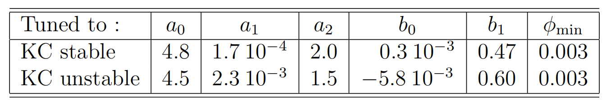

表 2.4：Tolman 和 Chalikov 源项包中建议的常数。KC 表示 Kahma 和 Calkoen(1992，1994)。第一行表示默认模型设置。

其中， $i$ 为离散波数计数器， $\mathcal{B}$ 的定义与 $\mathcal{A}$ 类似，在 $f_2$ 到 $f_{hf}$ 之间取值从 0 到 1。

定义过渡区的频率以及长度尺度 $h$ 已在模型中预先设定为：

$$\left.\begin{array}{lll}f_{hf}&=&3.00\:f_{p,i}\\f_{1}&=&1.75\:f_{p,i}\\f_{2}&=&2.50\:f_{p,i}\\f_{h}&=&2.00\:f_{p,i}\end{array}\right\}\tag{2.108}$$

此外，模型中预设了 $f_{p,i,\min} = 0.009$ 和 $\alpha_r = 0.002$ 。所有其他可调参数需由用户提供，建议值和默认值列于表 2.4。

在全局模式实现中对这些源项进行测试（Tolman，2002f）表明：

(i) 采用经典方式调节以满足稳定条件下的风程受限增长，会低估深海波浪的增长（这一缺陷似乎 WAM 模型也存在）；

(ii) 稳定性对波浪增长率的影响（Kahma 和 Calkoen，1992，1994）应在源项参数化中显式考虑。

理想情况下，这两个问题应通过对源项的理论分析来解决。作为替代方案，可以将风速 $u$ 替换为有效风速 $u_e$ 。在 Tolman（2002f）中，采用的有效风速为：：

$$\frac{u_e}u=\left(\frac{c_o}{1+C_1+C_2}\right)^{1/2}\tag{2.109}$$

$$C_1=c_1\tanh\left[\max(0,f_1\{\mathcal{ST}-\mathcal{ST}_o\})\right]\tag{2.110}$$


$$C_2=c_2\tanh\left[\max(0,f_2\{\mathcal{ST}-\mathcal{ST}_o\})\right]\tag{2.111}$$


$$\mathcal{ST}=\frac{hg}{u_h^2}\frac{T_a-T_s}{T_0} \tag{2.112}$$

其中， $\mathcal{ST}$ 是一个总体稳定性参数， $T_a$ 、 $T_s$ 和 $T_0$ 分别为空气、海水和参考温度。此外， $f_1 \le 0$ ， $c_1$ 与 $c_2$ 符号相反，且 $f_2 = f_1 c_1 / c_2$ 。

按照 Tolman（2002f），默认设置为：$c_0 = 1.4$，$c_1 = -0.1$，$c_2 = 0.1$，$f_1 = -150$，$S_{T0} = -0.01$，并结合对稳定分层波增长数据的调节（表 2.4 中的"KC stable"参数值）。需要注意的是，该有效风速是针对 10 m 高度风速推导的。

用户可以在模型编译时选择关闭风速修正，并可在程序输入文件中重新定义默认参数。该稳定性修正通过 STAB2 开关激活。空气-海水温差需由用户提供，例如通过 ww3_prep。

### 2.3.11 Sin + Sds：WAM 周期 4 (ECWAM)

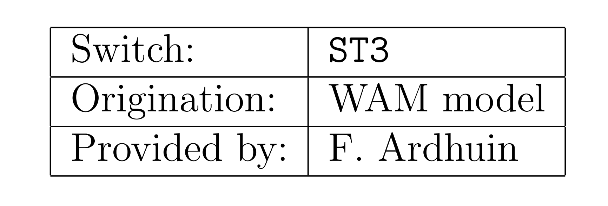

本文所述的风-波相互作用源项基于 Miles（1957）的波增长理论，并由 Janssen（1982）进行了修正。产生部分波浪生成的压力-坡度相关项按 Janssen（1991）进行了参数化。

Abdalla 和 Bidlot（2002）对该参数化进行了扩展，以考虑在不稳定大气条件下更强的阵风效应。该效应已包含在当前参数化中，可通过可选的 STAB3 开关激活。STAB3 使用的具体公式此处未描述，读者可参考 Abdalla 和 Bidlot（2002）。如果启用 STAB3，空气-海水温差需由用户提供，例如通过 ww3_prep。

在实现过程中，尽量使本模型与 ECWAM 模型（Bidlot 等，2005）的实现保持一致，尤其是应力查找表已验证为相同。后续的修改还包括在风输入中增加负值部分，以表示涌浪耗散。

该源项表达式如下（Janssen，2004）：

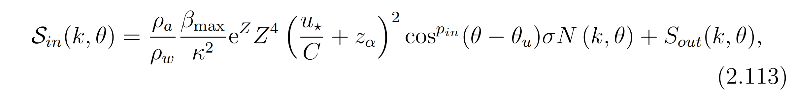

其中， $\rho_a$ 和 $\rho_w$ 分别为空气和海水密度， $\beta_{\max}$ 为无量纲增长参数（常数）， $\kappa$ 为冯·卡门常数， $p_{in}$ 是控制 $S_{in}$ 方向分布的常数。在当前实现中，空气与水的密度比 $\rho_a / \rho_w$ 保持为常数。

我们定义 $Z = \log(\mu)$，其中 $\mu$ 由 Janssen（1991）式 (16) 给出，并针对中等水深进行了修正，使得：

$$Z=\log(kz_1)+\kappa/\left[\cos\left(\theta-\theta_u\right)(u_\star/C+z_\alpha)\right]\tag{2.114}$$

其中， $z_1$ 为受波浪支撑应力 $\tau_w$ 修正后的粗糙度长度， $z_\alpha$ 为波龄调节参数³。如果已知摩擦速度 $u_*$ ，则可以计算出粗糙度 $z_1$ 以及高度 $z_u$ 处的风速（默认 $z_u = 10$ m）。

> 虽然 WAM-Cycle4 文档中对该调节参数 $z_\alpha$ 描述不详，但它对波浪增长有重要影响。
> 本质上，它会改变长波的波龄，通常会增加波浪增长，甚至可能生成传播速度超过风速的波浪。
> 这反映了风中的某种阵风效应，并可能与网格分辨率有关。
> 作为参考，R. Lalbeharry 发现该参数在早期版本的 SWAN 模型中未被正确设置。

$$z_1=\alpha_0\frac{\tau}{\sqrt{1-\tau_w/u_\star^2}}\tag{2.115}$$


$$U(z_u)=\frac{u_\star}{\kappa}\log\left(\frac{z_u}{z_1}\right)\tag{2.116}$$

在实际应用中，这两个方程提供了摩擦速度 $u_*$ 对 $U_{10}$ 和 $\tau_w / \tau$ 的隐式函数关系。该关系随后被制成查表（Janssen，1991；Bidlot 等，2007）。

参数化的一个重要部分是计算波浪支撑应力 $\tau_w$ ，

$$\tau_w=\left|\int_0^{k_{\max}}\int_0^{2\pi}\frac{\mathcal{S}_{in}(k^{\prime},\theta)}{C}\left(\cos\theta,\sin\theta\right)\mathrm{d}k^{\prime}\mathrm{d}\theta+\tau_{\mathrm{hf}}(u_\star,\alpha)\left(\cos\theta_u,\sin\theta_u\right)\right|$$

其中包括频谱中可解析的部分（直到 $k_{\max}$ ），以及由更短波支撑的应力 $\tau_{hf}$ 。假设在最高频率之外存在一个 $f^{-X}$ 诊断尾，则 $\tau_{hf}$ 表示为：

实际上，这两个方程提供了 $u_{*}$ 对 $U_\mathrm{hf}。$ 假设 $f^-X$ 诊断尾部超出最高频率， $\tau_\mathrm{hf}$ 由下式给出

$$\begin{aligned} 
\tau_{\mathrm{hf}}(u_{\star},\alpha)=&\frac{u_{\star}^{2}}{g^{2}}\frac{\sigma_{\mathrm{max}}^{X}2\pi\sigma}{2\pi C_{g}(k_{\mathrm{max}})}\int_{0}^{2\pi}N\left(k_{\mathrm{max}},\theta\right)\max\left\{0,\cos\left(\theta-\theta_{u}\right)\right\}^{3}d\theta\\\\&\times\frac{\beta_{\mathrm {max}}}{\kappa^{2}}\int_{\sigma_{\mathrm{max}}}^{0.05*g/u_{\star}}\frac{\mathrm{e}^{Z _{\mathrm{hf}}}Z_{\mathrm{hf}}^{4}}{\sigma^{X-4}}\mathrm{d}\sigma\end{aligned}\tag{2.118}$$

其中，第二个积分仅依赖于摩擦速度 $u_*$ 和 Charnock 系数 $\alpha$ ，可方便地制成查表。在实际计算中，该积分采用 $X = 5$ 编码，并定义变量 $Z_{hf}$ 为：

$$Z_{\mathrm{hf}}(\sigma)=\log(kz_1)+\min\left\{\kappa/\left(u_\star/C+z_\alpha\right),20\right\}\tag{2.119}$$

该参数化对 $k_{\max}$ 处的谱能量水平较为敏感。谱能量越高，会导致摩擦速度 $u_*$ 越大，从而通过 $z_1$ 对风输入产生正反馈。这种敏感性会因为高频谱能量对涌浪存在的耗散项敏感而被进一步放大。

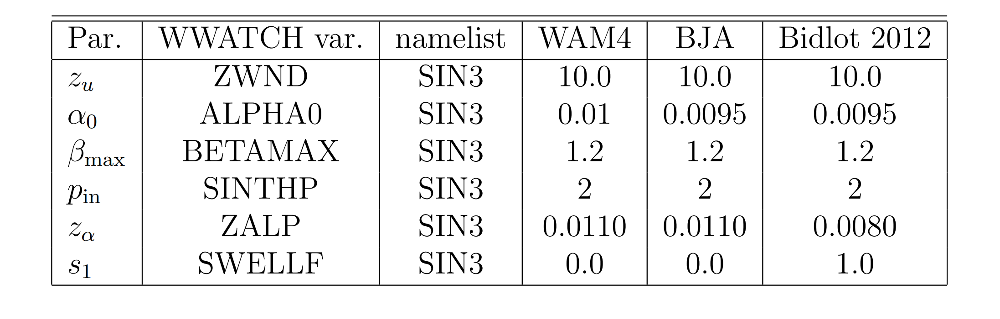

表 2.5：WAM4、BJA 以及 ECWAM 模型 2012 年更新版本的参数值。可通过 SIN3 和 SDS3 命名表重新设置的源项参数化。总体而言，BJA 比 WAM4 表现更好。ST3 中的默认参数对应 BJA。请注意，这些变量名仅适用于命名表。在源项模块中，变量名略有不同，首字母加倍，用以区分变量本身与指向这些变量的指针。

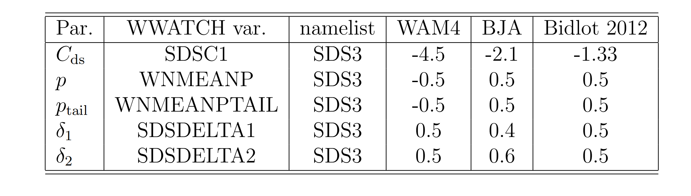

表 2.6：WAM4、BJA 以及 Bidlot（2012）更新版本的参数值。可通过 SDS3 命名表重新设置的源项参数化。总体而言，BJA 比 WAM4 表现更好。请注意，这些变量名仅适用于命名表。在源项模块中，变量名略有不同，首字母加倍，用以区分变量本身与指向这些变量的指针。

在 2009 年 9 月，操作性 ECWAM 模型中引入了涌浪的线性阻尼，其形式采用 Janssen（2004）给出的表达式

$$S_{out}(k,\theta)=2s_1\kappa\frac{\rho_a}{\rho_w}\left(\frac{u_\star}{C}\right)^2\left[\cos\left(\theta-\theta_u\right)-\frac{\kappa C}{u_\star\log(kz_0)}\right]\tag{2.120}$$

其中，当使用该阻尼时， $s_1$ 设为 1，否则为 0。若 $s_1 = 0$ ，则采用 WAM4 或 BJA 参数化（见表 2.5）。

由于与 WAM3 相比高频输入增加，耗散函数由 Janssen（1994）在 WAM3 耗散基础上进行了调整，随后又由 Bidlot 等（2005）重新修正。该后续修改称为 "BJA"，取自 Bidlot、Janssen 和 Abdallah 的名字。最近的一次修改显著改善了太平洋涌浪的模拟结果，但代价是低估了最高海况。这对应于 IFS 版本 CY38R1 中的 ECMWF WAM 模型（Bidlot，2012）。

需要注意的是，这些参数是针对操作性 ECMWF 分析提供的中性风优化的。若使用其他风场产品，可能需要重新调节这些系数。例如，对于 NCEP 或 CFSRR 风场，BETAMAX 可能需要减小，或 ZWND 需要增大。

WAM4 耗散项的通用形式为：

$$S_{ds}\left(k,\theta\right)^\text{WAM}=C_{ds}\overline{\alpha}^2\overline{\sigma}\left[\delta_1\frac{k}{\overline{k}}+\delta_2\left(\frac{k}{\overline{k}}\right)^2\right]N\left(k,\theta\right)\tag{2.121}$$

其中 $C_{ds}$ 是无量纲常数 $\delta_1$ ， $\delta_2$ 是权重参数，

$$\overline k=\left[\frac{\int k^pN\left(k,\theta\right)\mathrm{d}\theta}{\int N\left(k,\theta\right)\mathrm{d}\theta}\right]^{1/p}\tag{2.122}$$

$p$ 具有恒定功率。类似地，平均频率定义为

$$\overline{\sigma}=\left[\frac{\int\sigma^pN\left(k,\theta\right)\mathrm d\theta}{\int N\left(k,\theta\right)\mathrm d\theta}\right]^{1/p}\tag{2.123}$$
因此平均陡度为 $\overline{\alpha}=E\overline{k}^2.$

平均频率也出现在源项预报积分的最大频率定义中。由于该频率的定义可能与源项的定义不同，因此引入了另一个指数 $p_{\rm tail}$ 来定义。

不幸的是，这些参数化对涌浪较为敏感。涌浪高度增加通常会减小风生波谱峰处的耗散，因为平均波数 $k$ 下降，从而平均陡度 $\alpha$ 也减小。对于 $p<2$ 的情况，如 WAM-Cycle 4 和 BJA 参数化，这种敏感性更大，并且方向与长波对短波调制的预期效应相反。

源项代码已被泛化，可以通过在 SIN3 和 SDS3 命名表中简单修改参数，使用 WAM4、BJA 或其他 ECWAM 参数化方案，见表 2.5 和 2.6。目前，命名表参数的默认值对应 BJA（Bidlot 等，2005）。

### 2.3.12 Sin + Sds：基于饱和的耗散

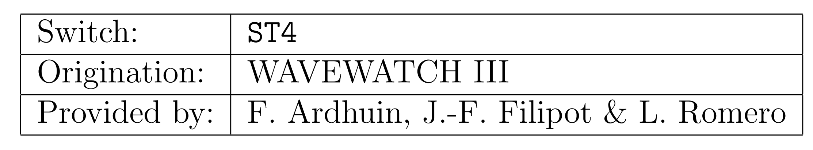

这一类参数化使用来自 WAM Cycle 4 的风输入的正值部分，并通过对摩擦速度 $u_*$ 进行人工削减来实现，以便与基于饱和度的耗散平衡，该耗散采用不同的累积项选项。饱和度和累积项的定义主要有三种选择，可通过 SDSBCHOICE 参数设置：SDSBCHOICE = 1 对应 Ardhuin 等（2010），SDSBCHOICE = 2 对应 Filipot 和 Ardhuin（2012a），SDSBCHOICE = 3 对应 Romero（2019）及其后续调整，包括 ?。

最后一种选项基于局地谱密度定义饱和度，因此在未达到阈值的方向上耗散为零，从而得到更宽的方向谱。同时，通过累积项的强调制效应，可以实现更明显的双峰结构。

其他调整可通过修改命名表参数完成。几个成功的参数组合见表 2.7 和 2.8，结果由 Rascle 和 Ardhuin（2013）、Stopa 等（2016）等给出。为了获得最佳性能，对特定风场的进一步校准是必要的，参考 Stopa（2018）的指导。

风输入与涌浪耗散：式 (2.113) 中 $u_*$ 的削减是通过用每个频率定义的 $u_*'$ 替代实现的，其定义为：

$$\left(u'_{\star}\right)^{2}=\left|u_{\star}^{2}\left(\cos\theta_{u},\sin\theta_{u}\right)-\left|s_{u}\right|\int_{0}^{k}\ int_{0}^{2\pi}\frac{S_{in}\left(k',\theta\right)}{C}\left(\cos\theta,\sin\theta\right)\mathrm{d}k'\mathrm{d}\theta\right|$$

其中，遮蔽系数 $|s_u| \sim 1$ 可用于调节高风速下的应力，对于 $s_u = 0$ 的情况，高风速应力通常会被严重高估。若 $s_u > 0$ ，该遮蔽也会作用于诊断尾（式 2.118）中，这需要为高频应力估算一个三维查找表，其中第三个参数为尾部的能量水平。

前面用于 ST3 的 STAB3 开关也可用于 ST4。如果使用 STAB3，空气-海水温差需由用户提供，例如通过 ww3_prep。

Ardhuin 等（2009a）的涌浪耗散参数化可通过将 $s_1$ 设为非零整数来激活，其表达式由粘性边界层值与其他项组合而成：

$$\mathcal{S}_{\mathrm{out,vis}}\left(k,\theta\right)=-s_{5}\frac{\rho_{a}}{\rho_{w}}\left\{2k\sqrt{2\nu\sigma}\right\}N\left(k,\theta\right)\tag{2.125}$$

与湍流边界层表达式

$$\mathcal{S}_{\mathrm{out,tur}}\left(k,\theta\right)=-\frac{\rho_{a}}{\rho_{w}}\left\{16f_{e}\sigma^{2}u_{\mathrm{orb,}s}/g\right\}N\left(k,\theta\right)\tag{2.126}$$

给予完整期限

$$\mathcal{S}_{\mathrm{out}}\left(k,\theta\right)=r_{vis}\mathcal{S}_{\mathrm{out,vis}}\left(k,\theta\right)+r_{tur}\mathcal{S}_{\mathrm{out,tur}}\left(k,\theta\right)\tag{2.127}$$

其中两个权重 $r_\mathrm{vis}$ 和 $r_\mathrm{tur}$ 是根据修改后的海空边界定义的 -多层显著雷诺数 $\mathrm{Re}=2u_\mathrm{orb,s}H_{s}/\nu_{a}$

$$r_\mathrm{vis}=0.5(1-\tanh((\mathrm{Re}-\mathrm{Re}_c)/s_7)
\tag{2.128}$$

$$r_\mathrm{tur}=0.5(1+\tanh((\mathrm{Re}-\mathrm{Re}_c)/s_7)\tag{2.129}$$

有效表面轨道速度定义为

$$u_{\text{orb},s}=2\left[\iint\sigma^3\:N(k,\theta)\:dkd\theta\right]^{1/2}\tag{2.130}$$

第一个方程 (2.125) 是 Dore (1978) 提出的线性粘性衰减，其中 $\nu_a$ 是空气粘度， $s_5$ 是 $O(1)$ 调整参数。一些测试表明 $\mathrm{Re}_{c}= 2\times 10^{5}\times ( 4 m/H_{s}) ^{( 1- s_{6}) }$ 在 $s_6=0$ 的情况下提供了合理的结果，尽管它也可能随风速变化，并且我们无法解释其对 $H_s$ 的依赖。当 $s_6=1$ ，接近 $2\times10^5$ 的恒定阈值提供类似但精度稍低的结果。

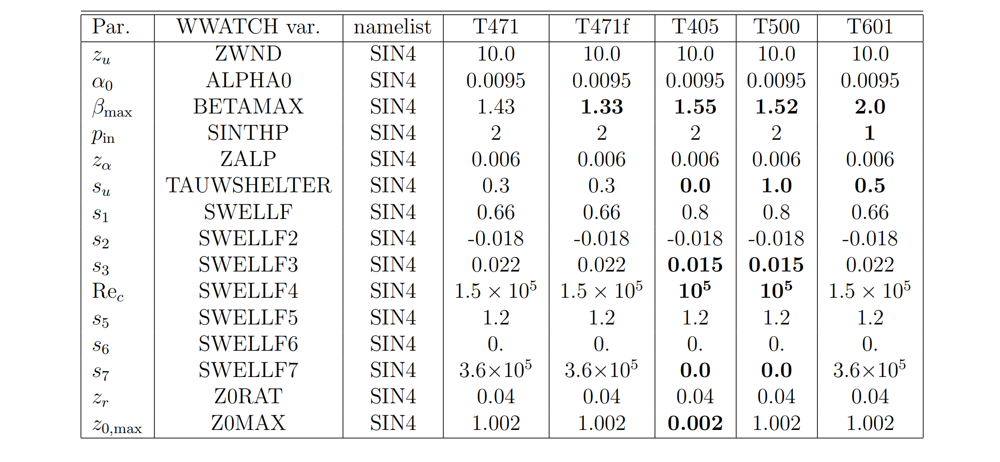

表 2.7：T471、T471f、T405、T500 和 T601 源项参数化的参数值，可通过 SIN4 namelist 重新设置。请注意，这些变量名仅适用于 namelist。在源项模块中，变量名略有不同，首字母加倍，以区分变量本身与指向这些变量的指针，且 SWELLFx 参数合并为一个数组 SSWELLF。表中加粗的数值表示与 ww3_grid 设定的默认值不同。

TEST471 在使用 ECMWF 风场时，在全球尺度上通常能提供最佳结果，唯一较严重的问题是当 $H_s > 8$ m 时存在低偏差。TEST471f 对应于针对 NCEP/NCAR CSFR 风场再分析（Saha 等，2010）进行的重新调节，其偏差几乎可以忽略，直到 $H_s = 15$ m。

在 2012 年 3 月之前的模拟和论文中，使用了略有不同的参数值，例如，通过将 SWELLF7 设为 0 可以得到 TEST441 和 TEST441f，而 TEST471 还使用了 $s_u = 1$ 及其他一些调整（见 4.18 版手册）。TEST405 在短风程条件下略优，TEST500 的整体质量居中，但它还在同一公式中包括了水深诱导破碎，因此在受深度限制的条件下可能更合适。

式 (2.126) 是非线性湍流衰减的参数化。在将模型结果与观测比较时发现，模型倾向于低估大涌浪、高估小涌浪，并存在区域性偏差。该缺陷部分可能源于这些涌浪生成或非线性演化中的误差。然而，为了改善表现，选择将 $f_e$ 作为风速和风向的函数进行调整。

$$f_e=s_1f_{e,GM}+[|s_3|+s_2\cos(\theta-\theta_u)]\:u_\star/u_{\mathrm{orb}}\tag{2.131}$$

其中， $f_{e,\rm GM}$ 是由 Grant 和 Madsen（1979）针对无平均流的粗糙振荡边界层给出的摩擦因子，使用调整后的粗糙度长度 $r_z$ 倍于风速对应的粗糙度 $z_1$ 。系数 $s_1$ 为 $O(1)$ 调节参数， $s_2$ 和 $s_3$ 是另外两个可调参数，用于描述风对振荡空气-海水边界层的影响。当 $s_2 < 0$ 时，逆风涌浪的耗散大于顺风涌浪。此外，如果 $s_3 > 0$ ， $S_{\rm out}$ 会作用于整个频谱，而不仅仅是涌浪部分。

------------------------------------------------------------------------

**波破碎与海洋湍流效应**：

耗散项基于波谱饱和度进行参数化，遵循 Phillips（1985）的基本思想。饱和谱定义为：

$$B\left(k,\theta\right)=\sigma k^3N(k,\theta) \tag{2.132}$$

它对应于表面升高谱的无量纲形式。通常，从谱空间到物理空间的转换需要在有限波数和方向带宽上对饱和度进行积分，以计算破碎概率，然后对该积分进行反卷积以得到谱耗散率。由于这种操作计算量过大，我们实现了三种方法：一种仅对方向积分（Ardhuin 等，2010），第二种对频率带积分（Filipot 和 Ardhuin，2012a），最后一种直接使用局部的 $B$ 值而不进行积分。具体使用哪种方法，由命名表参数 SDSBCHOICE 决定。

由于在对整个圆周进行积分得到的饱和谱时，方向谱过窄（Ardhuin 和 Boyer，2006），Ardhuin 等（2010）将积分限制在半宽 $\Delta_ \theta$ 的扇区内。

$$B'\left(k,\theta\right)=\int_{\theta-\Delta_\theta}^{\theta+\Delta_\theta}\sigma k^3cos^\text{sB}\left(\theta-\theta'\right)N(k,\theta')\mathrm{d}\theta'\tag{2.133}$$

因此，对于两个方向相反但能量相同的海况，其总耗散通常比所有能量沿同一方向传播的海况要小。

最终，我们将耗散项定义为基于饱和度的耗散项与累积破碎项 $S_{bk,cu}$ 之和：

$$\begin{aligned} 
S_{ds}(k,\theta)=&\sigma\frac{C_{\mathrm{ds}}^{\mathrm{sat}}}{B_r^2}\left[\delta_d\max\{B(k)-B_r,0\}^2 +(1-\delta_d)\max\{B^{\prime}(k,\theta)-B_r,0\}^2\right]\\\\ & \times N(k,\theta)+S_{\mathrm{bk,cu}}(k,\theta)+S_{\mathrm{turb}}(k,\theta)\end{aligned}$$

其中

$$B\left(k\right)=\max\left\{B'(k,\theta),\theta\in[0,2\pi]\right\}\tag{2.135}$$

各向同性部分（与 $\delta_d$ 相乘的项）与方向依赖部分（带 $1-\delta_d$ 的项）的组合，旨在对生成谱的方向扩展进行一定的控制。

累积破碎项 $\mathcal{S}_\mathrm{bk,cu}$ 表示大型破碎机以 $C^\prime$ 的速度对表面进行平滑，从而消除较小的相速度波 $C。$ 由于在各种观测中估计这种效应的不确定性，我们使用 Ardhuin 等人的理论模型。 （2009b）。

简而言之，波峰的相对速度是矢量差的范数， $\Delta_C=|\mathbf{C}-\mathbf{C}^{\prime}|$ ，短波耗散率就是大碎波在短波上的通过率，即 $\Delta_C\Lambda(\mathbf{C})d\mathbf{C}$ 的积分，其中 $\Lambda(\mathbf{C})d\mathbf{C}$ 是每单位表面上速度分量介于 $C_x$ 和 $C_x+dC_x$ 之间以及 $C_y$ 和 $C_y+dC_y$ 之间的断裂波峰的长度

（菲利普斯，1985）。

累积破碎项 $\mathcal{S}_\mathrm{bk,cu}$ 表示大破浪以速度 $C'$ 平滑海面，从而消除较小的相速度波 $C$ 。由于在不同观测中对该效应的估计存在不确定性，我们采用 Ardhuin 等（2009b）的理论模型。

简而言之，波峰的相对速度为向量差的模： $\Delta_C=|\mathbf{C}-\mathbf{C}^{\prime}|$ 短波的耗散率即大破浪覆盖短波的通过率，即 $\Delta_C\Lambda(\mathbf{C})d\mathbf{C}$ 的积分，其中， $\Lambda(\mathbf{C})d\mathbf{C}$ 表示单位面积上，速度分量在 $C_x$ 到 $C_x + dC_x$ 以及 $C_y$ 到 $C_y + dC_y$ 范围内的破浪波峰总长度（Phillips, 1985）。

这里 $\Lambda$ 是根据破坏概率推断出来的。基于

班纳等人。 (2000, 假设 $6,b_T=22(\varepsilon-0.055)^2)$ ，并取其饱和度参数 $\varepsilon$ 为 $1.6\sqrt {B^{\prime}(k,\theta)}$ 量级，则主波的破碎概率约为

这里的 $\Lambda$ 是从破浪概率推导得到的。根据 Banner 等（2000，图 6， $b_T = 22 (\varepsilon - 0.055)^2$ ），并将其饱和参数 $\varepsilon$ 取为约 $1.6 \sqrt[]{B'(k, \theta)}$ 的量级，主导波的破碎概率可近似表示为：

$$P=56.8\left(\max\{\sqrt{B'(k,\theta)}-\sqrt{B'_r},0\}\right)^2\tag{2.136}$$

然而，由于他们采用了零交叉分析，对于某一波长尺度，许多时刻的波可能未被计入，因为记录中另一尺度的波占主导：在他们的分析中，任意时刻只有一波存在。这会使破碎概率被高估约 2 倍（Filipot 等，2010），而在当前方法中，认为同一时间同一位置可能存在多种尺度的波。为修正这一效应，只需将 $P$ 除以 2。

采用这种方法，单位面积上的波峰长度谱密度（无论是否破碎）为 $l(k)$ ，满足 $\int l(\mathbf{k})\mathrm{d}k_x \mathrm{d} k_y$ ，我们取：

$$l(\mathbf{k})=1/(2\pi^2k)\tag{2.137}$$

单位面积上的破浪波峰长度谱密度为 $\Lambda(\mathbf{k})=l(\mathbf{k})P(\mathbf{k})$

最后，对于 ST4 中基于饱和度的耗散实现的另一种选项，是 Romero（2019）参数化的推广，为调制项的定义提供了一定灵活性，通过设置 SDSBCHOICE = 3 来激活。在这种情况下，波数向量 $k$ 的破浪波峰密度仅依赖于同一波数的饱和度 $B(\mathbf{k})$ ，不进行方向或频率积分（若应用于单色波谱会有问题），但同时引入了由长波产生的强调制 $M_L$ 和随风调整的修正 $M_W$ 。

$$\Lambda(\mathbf{k})=\dfrac{1}{k}\exp\left(-\dfrac{B_\mathbf{r}}{M_l(\mathbf{k})B(\mathbf{k})}\right)M_L(\mathbf{k})M_W(k)\tag{2.138}$$

其中风因子为

$$M_W(k)=(1+D_W\max(1,k/k_0))\:/(1+D_W)\tag{2.139}$$

其中 $k_0=g(3/28u_{\star})^2$ ，当使用 DIA 时， $D_W$ 调整为 0.9；而对于精确非线性相互作用， $D_W = 2$ 。长波调制要么作用于 $B$ （当 $N_\theta > 0$ 时），其形式为前文给出的 $M_l(k, \theta)$ ；要么，如 Romero（2019）所做，将调制作用于 $\Lambda$ ，形式为：

$$M_L(k,\theta)=\left(1+M_\Lambda\sqrt{\text{mss'}(k,\theta)}\right)^{1.5}\tag{2.140}$$

在该表达式中，累积斜度 mss' 要么取 mss$(k, \theta)$ ，要么当 $N_\theta = 0$ 时，被强制为 $\cos^2(\theta - \theta_w)$ 变化，其中 $\theta_w$ 为主导波的平均方向（与 $k$ 无关）。在 Romero（2019）中， $\Lambda$ 的这种强 $\cos^2$ 方向依赖是产生明显双峰谱的关键，也可能用于补偿各向同性耗散率。

实际上，当 SDSBCHOICE = 3 时，完整的源项为：

$$\mathcal{S}_{ds}(k,\theta)=\frac{C_\mathrm{ds}^\mathrm{sat}(\sqrt{B(k)}-\sqrt{B_T})^{2.5}}{g^2} \Lambda(k,\theta)c^5+\mathcal{S}_\mathrm{bk,cu}(k,\theta)+\mathcal{S}_\mathrm{turb}(k,\theta)\tag{2.141}$$

需要注意的是，用于耗散率中的饱和度 $b$ = $C_{\mathrm{ds}}^{\mathrm{sat}}( \sqrt {B( k) }$ - $\sqrt {B_T}) ^{2}$ 。 $5/ g^{2}$ 是在方向上积分过的，并使用了一个真正的阈值 $B_T$ ，它不同于 $\Lambda$ 表达式中的 $B_r$ 。此外，Romero（2019）的推广允许对 $B$ 或 $\Lambda$ 进行调制，并提供了不同的方向分布选项。同时，该破碎项可以与 Ardhuin 等（2010）的累积破碎项以及 Ardhuin 和 Jenkins（2006）的波-湍流相互作用项结合使用。

对于 SDSBCHOICE 的三种选择，附加的累积项和波-湍流相互作用项的计算方法相同。假设任何破碎波瞬间耗散所有频率高于某因子 $r_{cu}$ 的波的能量，则累积耗散率可表示为这些短波被大破浪覆盖的速率乘以谱密度，即：

$$\mathcal{S}_{\mathrm{bk,cu}}(k,\theta)=-C_{\mathrm{cu}}N\left(k,\theta\right)\int_{f^{\prime}<r_{\mathrm{cu}}f}\Delta_{C}\Lambda(\mathbf{k}^{\prime})\mathrm{d}\mathbf{k}^{\prime}\tag{2.142}$$

其中 $r_{cu}$ 定义了长波可以消灭短波的最大频率比。这对应的源项为：

$$\begin{aligned} 
\mathcal{S}_{\mathrm{bk,cu}}(k,\theta)=&\frac{-14.2C_{\mathrm{cu}}}{\pi^2}N\left(k,\theta\right)\\\\&\int_0^{r_\mathrm{cu}^2k}\int_0^{2\pi}\max\left\{\sqrt{B(f^{\prime},\theta^{\prime})}-\sqrt{B_r},0\right\}^2\mathrm{d}\theta^{\prime}\mathrm{d}k^{\prime}\end{aligned}\tag{2.143}$$

我们取 $r_{cu} = 0.5$ ， $C_{cu}$ 是一个调节系数，量级约为 1，同时也用于修正 $l$ 的估计误差。

最后，Teixeira 和 Belcher（2002）以及 Ardhuin 和 Jenkins（2006）的波-湍流相互作用项表示为：

$$\mathcal{S}_\mathrm{ds}^\mathrm{TURB}\left(k,\theta\right)=-2C_\mathrm{turb}\sigma\cos(\theta_u-\theta)k\frac{\rho_au_\star^2}{g\rho_w}N\left(k,\theta\right)\tag{2.144}$$

系数 $C_{\rm turb}$ 的量级约为 1，可用于调节海洋分层和波群效应。

所有相关的源项参数可以通过 namelist SIN4 和 SDS4 设置，以得到不同的参数化方案，例如 Ardhuin 等（2010）描述的 TEST441b、TEST405，或 Filipot 和 Ardhuin（2012b）描述的 TEST500（见表 2.7 和 2.8）。需要注意的是，在 TEST441b 中，DIA 常数 $C$ 被略微调整为 $C = 2.5 \times 10^7$ 。TEST441f 则对应在使用 NCEP/NCAR 风场时重新调节的风输入方案。

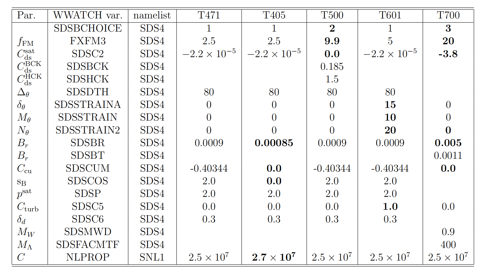

表 2.8：与表 2.7 类似，但针对 SDS4 和 SNL1 namelist。加粗的数值表示与 ww3_grid 默认值不同。当 SDSBCHOICE 使某些参数不使用时，数值会省略。需要注意的是，Romero（2019）建议在使用 NL2 时取 $M_W = 2$ 。

### 2.3.13 Sin + Sds：Rogers 等，2012；Zieger 等，2015

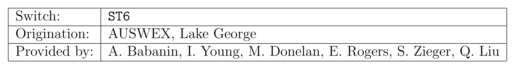

该版本实现了基于观测的深水源/汇项物理过程，包括风输入源项，以及由负风输入、白浪耗散和波-湍流相互作用（涌浪耗散）引起的汇项。风输入和白浪耗散源项基于澳大利亚乔治湖的实测数据；波-湍流耗散基于实验室实验和涌浪衰减的现场观测；负输入基于实验室测试。总风能输入受到风应力的约束，该值是独立已知的。

风输入方面，除了首次在强风条件下的直接现场测量外，乔治湖实验还揭示了风-波能量交换的一些新物理特征，这些在之前的模型中未被考虑：
(i) 空气流完全分离，在强风/陡波条件下导致风输入相对减少；
(ii) 波增长率依赖于波陡度，表明风输入源函数存在非线性行为；
(iii) 波破碎存在时输入增强（Donelan 等，2006；Babanin 等，2007）（该特征在此版本未实现）。

按照 Rogers 等（2012）的方法，该输入源项的公式为：

$$\mathcal{S}_{in}(k,\theta)=\frac{\rho_a}{\rho_w}~\sigma~\gamma(k,\theta)~N(k,\theta)\tag{2.145}$$

$$\gamma(k,\theta)= G\sqrt{B_n}W \tag{2.146}$$

$$\begin{aligned}G=2.8-\left(1+\tanh(10\sqrt{B_n}W-11)\right)\end{aligned}\tag{2.147}$$

$$B_n= A(k)~N(k)~\sigma ~k^3 \tag{2.148}$$

$$W=\left(\frac{U_s}{c}-1\right)^2\tag{2.149}$$

在公式 (2.145)−(2.149) 中， $\rho_a$ 和 $\rho_w$ 分别为空气和水的密度， $U_s$ 是风速标度， $c$ 表示波的相速度， $\sigma$ 是弧度频率， $k$ 是波数。谱饱和度（公式 2.148，由 Phillips，1984 提出）是波陡度 $ak$ 的谱度量。全方向作用量密度通过对所有方向积分得到：

$$N(k)=\int N(k,\theta)d\theta$$

方向谱窄度的倒数 $A(k)$ 定义为

$$A^{-1}(k)=\int_0^{2\pi}\frac{N(k,\theta)}{N_{\max}(k)}d\theta$$

其中 $N_\max(k)=\max\left\{N(k,\theta)\right\}$ ，对于所有 $\operatorname*{directions}\theta\in[0,2\pi]$ （Babanin 和 Soloviev，1987）。

Donelan 等（2006）用距平均海面 10 m 的风速参数化了增长率（公式 2.146）。然而，波浪模型通常采用摩擦速度 $u_\ast = \tau / \rho_a$ 来保证在不同风速下有一致的有效风程关系（Komen 等，1994，第 253 页）。因此，Rogers 等（2012）建议使用以下近似值：

$$U_s=U_{10}\simeq\Upsilon u_*,\mathrm{~和~}\Upsilon=28\tag{2.150}$$

通过遵循 Komen 等人（1984）。

$$W_{1}={\max}^2\left\{0,\frac{U}{c}\cos(\theta-\theta_w)-1\right\}
\tag{2.151}$$

$$W_{2}={\min}^2\left\{0,\frac{U}{c}\cos(\theta-\theta_w)-1\right\}
\tag{2.152}$$

$W$ 的方向分布被实现为顺风（公式 2.151）和逆风（公式 2.152）的叠加，使两者互为补充（即 $W = \{W_1 \cup W_2\}$ ，详见本节后面的负输入部分）：

$$W=W_1-a_0W_2\tag{2.153}$$

------------------------------------------------------------------------

**风输入约束**

风输入的一个重要部分是计算大气向海洋的动量通量，这一通量必须与波浪所接收的通量一致。在海面上，总应力 $\tilde{\tau}$ 可以写成粘性应力和波支撑应力之和： $\vec{\tau}=\vec{\tau}_v+\vec{\tau}_w.$

其中波支撑应力 $\vec{\tau}_w$ 被用作风输入的主要约束，且不能超过总应力，即 $\vec{\tau}\leq\vec{\tau}_{tot}$ 。这里总应力由通量参数化确定：$\vec{\tau}_{tot}=\rho_au_\star|u_\star|$

波支撑应力 $\tau_w$ 可通过对风动量输入函数进行积分计算得到：

$$\vec{\tau}_w=\rho_wg\int_0^{2\pi}\int_0^{k_{max}}\frac{S_{in}(k',\theta)}{c}\Big(\cos\theta,\sin\theta\Big)dk'd\theta \tag{2.154}$$

波支撑应力的计算（公式 2.154）包括谱中已解析的部分，直到最高离散波数 $k_{\rm max}$ ，以及短波所支撑的应力。对于后者，假设能量密度谱在最高频率之外呈 $f^{-5}$ 的诊断尾。

为了满足约束条件，当 $\vec{\tau}>\vec{\tau}_{tot}$ 时，引入一个依赖波数的因子 $L$ 来削减谱中高频部分的能量： $S_{in}( k^{\prime }) = L( k^{\prime })~S_{in}( k^{\prime })$ 其中， $L(k')$ 根据情况进行定义。

$$L(k')=\min\Bigl\{1,\exp\bigl(\mu\left[1-U/c\right]\bigr)\Bigr\}\tag{2.155}$$

该削减（公式 2.155）是风速和波相速度的函数，采用指数形式，用于减少谱中离散部分的能量。削减强度由系数 $\mu$ 控制， $\mu$ 对高频部分影响较大，而对能量主导的谱区影响较小。 $\mu$ 的数值在每个积分时间步通过迭代动态计算（Tsagareli 等，2010）。

摩擦系数由下式给出：

$$C_d\times10^4=8.058+0.967U_{10}-0.016U_{10}^2\tag{2.156}$$

该参数化被选定并通过开关 FLX4 实现。该方法由 Hwang（2011）提出，用于考虑海面摩擦在风速超过 30 m/s 时的饱和效应以及极端风下的进一步下降。

为了防止在极强风（ $U_{10} \ge 50.33$ m/s）下摩擦速度 $u_\ast$ 降为零，公式 (2.156) 被修改为保证 $u_\ast = 2.026$ m/s。

需要注意的是，在 ST6 中，对风输入场的整体偏差的批量调整是通过风应力参数 $u_\ast$ 而不是 $U_{10}$ 来完成的。为实现这一点，公式 (2.156) 左侧的 $C_d \times 10^4$ 因子被替换为 $C_d \times \text{FAC}$ ，并作为 FLX4 namelist 参数 CDFAC 添加（参见本节末尾的"批量调整"部分）。

粘性摩擦系数为

$$C_v\times10^3=1.1-0.05U_{10}\tag{2.157}$$

粘性摩擦系数由 Tsagareli 等（2010）根据风速参数化，所用数据来源于 Banner 和 Peirson（1998）。

------------------------------------------------------------------------

**负输入**

除了正向输入外，ST6 还包含一个负输入项，用于削弱波谱中风应力存在不利分量的区域的波浪增长（2.151-2.152）。

不利风下的波浪增长率为负（Donelan，1999），该负增长在满足波支撑应力 $\tau_w$ 约束之后施加。公式 (2.153) 中的 $a_0$ 是输入参数化中的调节参数，可通过 SIN6 namelist 参数 SINA0 进行调整。

------------------------------------------------------------------------

**白浪消散**

关于波浪破碎的消散，Lake George 实地研究揭示了若干新特征：

（i）波浪破碎的阈值行为（Babanin 等，2001）：波浪只有在超过某一临界陡度时才会破碎，且破碎概率取决于超出阈值的陡度水平；对于低于临界阈值的波浪，白浪消散为零。

（ii）破碎及短波消散受长波影响产生的累积消散效应（Donelan，2001；Babanin 和 Young，2005；Moon 等，2006；Young 和 Babanin，2006；Babanin 等，2010）；

（iii）强风下的非线性消散函数（Moon 等，2006；Babanin 等，2007）；

（iv）消散方向扩展的双峰分布（Young 和 Babanin，2006；Babanin 等，2010）（该特征在 ST6 中未实现）。

按照 Rogers 等（2012），白浪消散项实现为：

$$\mathcal{S}_{ds}(k,\theta)=\begin{bmatrix}T_1(k,\theta)+T_2(k,\theta)\end{bmatrix}\:N(k,\theta)\tag{2.158}$$

其中 $T_1$ 是固有破碎项，按传统波谱函数表示； $T_2$ 则表示为波谱在波数 $k$ 以下的积分，用以考虑每个频率/波数下短波破碎或受长波影响的累积消散效应。

当频率位于或低于谱峰时，固有破碎项 $T_1$ 是唯一的破碎消散项。一旦谱峰下移至该频率以下，$T_2$ 开始起作用，且随着谱峰进一步下移，其作用逐渐增强。

阈值谱密度 $F_T$ 的计算公式为：

$$F_\mathrm{T}(k)=\frac{\varepsilon_\mathrm{T}}{A(k)\:k^3}\tag{2.159}$$

其中 $k$ 是波数， $\varepsilon_T = 0.035^2$ 是一个经验常数（Babanin 等，2007；Babanin，2011）。定义超过临界阈值谱密度（波浪开始破碎的阶段）的超越量为 $\Delta(k) = F(k) - F_T(k)$ 。此外，设 $\mathcal{F}(k)$ 为用于归一化的通用谱密度，则固有破碎项可计算为：

$$T_1(k)=a_1A(k)\frac{\sigma}{2\pi}\left[\frac{\Delta(k)}{\mathcal{F}(k)}\right]^{p_1}\tag{2.160}$$

累积消散项在频率空间中不是局部的，其计算基于一个随频率增高而增大的积分，在较小尺度上占主导作用：

$$T_2(k)=a_2\int_0^kA(k)\frac{c_g}{2\pi}\left[\frac{\Delta(k)}{\mathcal{F}(k)}\right]^{p_2}dk \tag{2.161}$$

消散项（公式 2.160--2.161）依赖五个参数：用于归一化的通用谱密度 $\mathcal{F}(k)$ ，以及四个系数 $a_1,a_2,p_1$ 和 $p_{2}$ 。其中，系数 $p_1$ 和 $p_{2}$ 控制耗散项中归一化阈值谱密度 $\Delta(k)/\mathcal{F}(k)$ 的强度。通过 namelist 参数 SDSET 可以在公式（2.160--2.161）中切换归一化所用的谱密度 $F(k)$ 或阈值谱密度 $F_{\mathrm{T}}(k)$ 。根据 Babanin 等人（2007，2009），方向狭窄参数在公式（2.159--2.161）中被设置为 1，即 $A(k) ≈ 1$。

Rogers 等人（2012）通过持续时间受限的学术试验对耗散项进行了校准。在 ST6 中使用的校准系数列于表 2.9，与 Rogers 等人（2012）的系数略有不同，主要原因是波支持应力 $\vec{\tau}_w$ 被实现为向量分量形式，而非破碎涌浪的耗散（公式 2.162）在 Rogers 等人（2012）中未被考虑。

------------------------------------------------------------------------

**涌浪耗散**

在波浪未发生破碎的情况下，仍存在其他衰减机制，这里称为涌浪耗散，其通过波浪与海洋湍流的相互作用进行参数化（Babanin, 2011）。该机制对风生波谱的贡献较小（如果谱超过破碎阈值），但在谱的前缘或在完全 Pierson-Moscowitz 发展情况下的谱峰附近则占主导地位。

$$\mathcal{S}_{swl}(k,\theta)=-\frac{2}{3}b_{1}\sigma\:\sqrt{B_{n}}\:N(k,\theta)\tag{2.162}$$

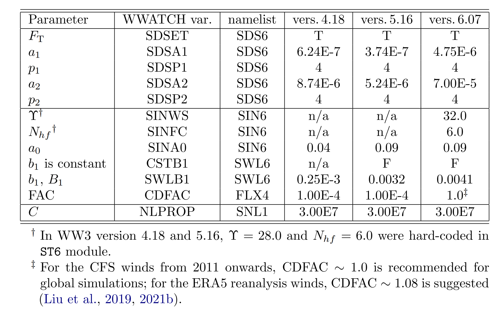

表 2.9：当 ST6 与 DIA 非线性求解器（见第 2.3.2 节）联合使用时的校准参数汇总。表中列出的数值为模型默认设置。"n/a"表示该变量在该版本代码中不适用。

通过让公式 (2.162) 中的系数 $b_1$ 随波陡度变化，可以减小波高空间偏差的大的梯度：

$$b_1=B_1\:2\sqrt{E}\:k_p \tag{2.163}$$

在公式 (2.163) 中， $B_1$ 是一个缩放系数， $E$ 是总海面方差（见公式 2.29）， $k_p$ 是峰值波数。公式 (2.163) 可通过 SWL6 namelist 参数 CSTB1 来启用。公式 (2.163) 中的系数 $B_{1}$ 和/或公式 (2.162) 中的 $b_1$ 的数值可以通过 SWL6 namelist 参数 SWLB1 自定义（见表 2.9）。

自版本 6.07 以来的更新：根据 Rogers 等人（2012），在版本 4.18 和 5.16 中采用了缩放风速 $U_s=28u_*$ （见公式 2.150，表 2.9）。这些 ST6 配置在不同空间尺度和天气条件下均表现良好（例如 Zieger 等人，2015；Liu 等人，2017）。然而，Zieger 等人（2015，图 5）也指出，ST6（版本 4.18 和 5.16）在高频谱尾的能量水平上存在高估趋势，说明在该特定频率范围内，不同源项之间的平衡存在一定偏差。

Rogers（2014，未发表的工作）发现，在 SWAN 中的 ST6 实现中使用 $U_s=32u_*$ （即 $\Upsilon=32$ ）可以改善高频谱尾能量的估算能力（参见 Rogers，2017）。随后，Liu 等人（2019）对 WW3 中的 ST6 进行了全面重新校准，新的参数集（即 $a_0$ 、 $a_1$ 、 $a_2$ 、 $B_1$ ）列于表 2.9 最后一列。更新后的 ST6 套件不仅在预测常用的整体波浪参数（如有效波高和波周期）方面表现良好，而且对高频能量水平的估算也明显改善（以饱和谱和平均平方斜率表示）。在持续时间受限的测试中，重新校准的 ST6 给出的全向频谱 $E(f)$ 显示出从约 $f^{-4}$ 幂律到约 $f^{-5}$ 幂律的清晰过渡，与先前的实测结果（Forristall，1981）相当。

除了将 ST6 与 DIA（第 2.3.2 节）非线性求解器一起应用之外，Liu 等人。 (2019) 还尝试使用 $S_{nl}$ 的 GMD 参数化来运行 ST6（第 2.3.5 节）。作为第一步，仅采用具有 5 个四联体和三参数四联体定义的 GMD 配置（即 Tolman，2013a 中的 G35）。通过整体遗传优化专门针对 ST6 优化的 GMD 可调参数

除了在 ST6 中使用 DIA 非线性求解器（第 2.3.2 节）外，Liu 等人（2019）还尝试在 ST6 中采用 Snl 的 GMD 参数化（第 2.3.5 节）。作为第一步，仅采用了包含 5 个四重波且使用三参数四重波定义的 GMD 配置（即 Tolman，2013a 中的 G35）。GMD 的可调参数通过 Tolman 和 Grumbine（2013）设计的整体遗传优化方法专门针对 ST6 进行了优化，其对应的 ST6 可调参数总结如表 2.10 所示。

> 

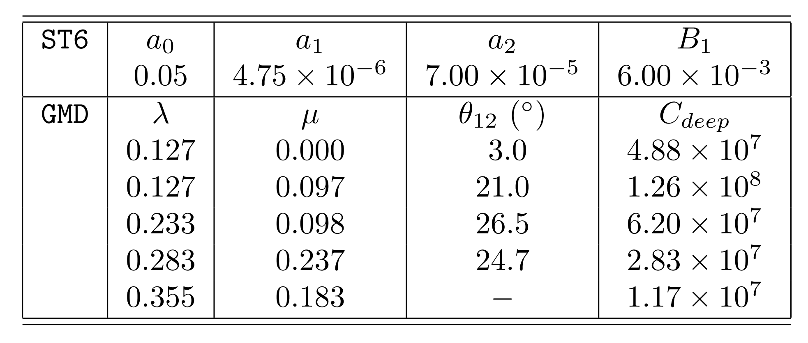

表 2.10：ST6 应用时的校准参数汇总使用 GMD 非线性求解器（或者具体来说，G35；Liu et al., 2019）

Liu 等人（2019）证明，在持续时间受限测试中，GMD 模拟的 $E(f)$ 与 $S_{\mathrm{nl}}$ 精确解（如 WRT，第 2.3.4 节）的结果非常吻合（参见 Tolman，2013a）。在一年期全球回溯试验中，基于 DIA 的模型在低频波能（波周期 $T > 16 s$）上高估了约 90%，而采用 GMD 后，该误差显著降低至约 20%。需要注意的是，GMD 方法的计算成本大约是 DIA 的 5 倍。

为了灵活控制预报频率区域的高频范围，我们引入了

$$f_{hf}=N_{hf}/T_{m0,-1}\tag{2.164}$$

在 6.07 版本中， $f_\mathrm{hf}$ 为高频截止限值（见公式 2.17）， $T_{m0,-1}$ 为公式 2.258 定义的平均波周期。 $N_\mathrm{hf}$ 通过 namelist 参数 SINFC 设置（表 2.9），若 $N_\mathrm{hf}$ 取负值（例如 $N_\mathrm{hf} = -1$ ），则高频谱尾自由演化，不受预设斜率限制。

------------------------------------------------------------------------

**主要波浪破碎概率**

根据 Babanin 等（2001，第 12 图），主要波浪破碎概率 $b_T$ 可以根据波谱 $F(f, \theta)$ 用以下参数化形式估算：

$$b_T=85.1\Big[(\epsilon_p-0.055)(1+H_s/d)\Big]^{2.33}\tag{2.165}$$

其中 $H_s$ 是有效波高， $d$ 是水深， $\epsilon_p$ 是有效波高光谱峰的陡峭度由下式给出

$$\begin{array}{rcl}\epsilon_p&=&H_pk_p/2\\H_p&=&4\Big[\int_0^{2\pi}\int_{0.7f_p}^{1.3f_p}F(f,\theta)\mathrm df\mathrm d\theta\Big]^{1/2}\end{array}\tag{2.166}$$

其中 $k_p$ 和 $f_p$ 分别为峰值波数和峰值频率。注意，在由 $F(f, \theta)$ 计算 $H_s$ 、 $H_p$ 和 $f_p$ （或 $k_p$ ）（公式 2.165 和 2.166）时，仅考虑风浪的贡献。按照 Janssen 等（1989）和 Bidlot（2001）的做法，当满足以下条件时，将谱分量视为风浪：

$$\frac{c(k)}{U_{10}\cos(\theta-\theta_u)}<\beta_w \tag{2.167}$$

其中 $c(k)$ 是波相速度， $U_{10}$ 是海面上方 10 米处的风速， $\theta_u$ 是风向， $\beta_w$ 是恒定风迫参数。我们将 $\beta_w$ 设为可调参数（MISC namelist 参数 BTBET），默认取 $\beta_w = 1.2$ 。

------------------------------------------------------------------------

**总体调整**

源项 ST6 已使用通量参数化 FLX4 进行校准。对风场的整体调整可通过重新标度 FLX4 的阻力参数实现，即通过 FLX4 namelist 参数 CDFAC = 1.0E-4 。这与在 ST4 源项包中调节 $\beta_{\max}$ （公式 (2.113) 和 (2.118)）的效果类似，该参数可通过 namelist 参数 BETAMAX 自定义。

Ardhuin 等（2011a）和 Rascle & Ardhuin（2013）列出了可适配不同风场的参数集合。在优化波浪模型时，建议仅重新调节参数 $a_0$、$b_1$ 和 FAC，其中 FAC 可用于消除风场偏差，这种偏差通常随所选再分析产品而变化（Liu 等，2021b，见表 2.9）。这种调整已在极端风况（如飓风）下进行了测试（Zieger 等，2015）。

在全球回溯模拟中，负输入系数可用于调节散点比较中的波高整体水平，而涌浪耗散的缩放系数主要影响大海况。使用离散相互作用近似（DIA）计算四波相互作用时，比例常数的默认值变为 $C = 3.00 \times 10^7$。

代码限制：在版本 4.18 和 5.16 中，当动力源项积分的最小时间步远小于整体时间步（即小于 1/15）时，模型可能出现不稳定现象。该问题自版本 6.07 起已解决。

### 2.3.14 Sln: Cavaleri and Malanotte-Rizzoli 1981

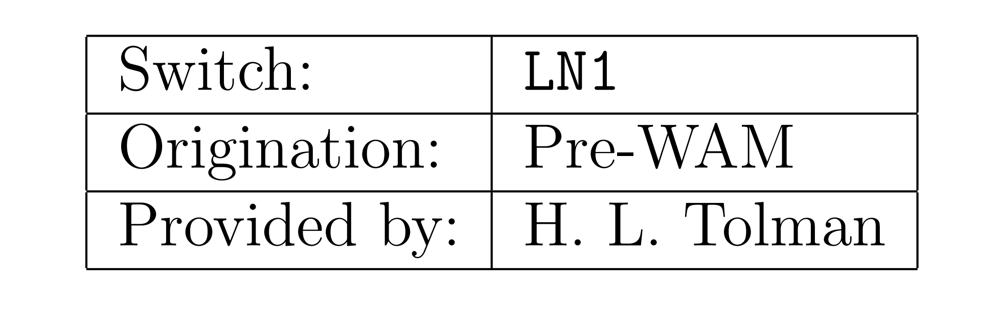

线性输入源项有助于在平静初始条件下实现模型的稳定启动，并改善初始波的生长特性。WAVEWATCH III 中提供了 Cavaleri 和 Malanotte-Rizzoli（1981）的参数化，同时结合 Tolman（1992）提出的低频能量滤波器。该输入项可以表示为

$$\mathcal{S}_{lin}(k,\theta)=80\left(\frac{\rho_a}{\rho_w}\right)^2g^{-2}k^{-1}\max\left[0,u_*\cos(\theta-\theta_w)\right]^4\:G\tag{2.168}$$

其中 $\rho_a$ 和 $\rho_w$ 分别为空气和水的密度， $G$ 为滤波函数。

$$G=\exp\left[-\left(\frac{f}{f_{filt}}\right)^{-4}\right]\tag{2.169}$$

在 Tolman（1992）中，滤波频率 $f_{filt}$ 被取为 Pierson-Moskowitz 频率 $f_{\text{PM}}$ ，其计算方法如公式 (2.75) 所示。在当前实现中，该滤波可以同时与 $f_{\text{PM}}$ 以及谱的预报部分的截止频率 $f_{\text{hf}}$ （见公式 (2.17)）相关联。

$$f_{filt}=\max\left[\alpha_{PM}f_{PM},\alpha_{hf}f_{hf}\right] \tag{2.170}$$

其中常数 $\alpha_{\rm PM}$ 和 $\alpha_{\rm hf}$ 可由用户定义。默认值为 $\alpha_{\rm PM} = 1$ 和 $\alpha_{\rm hf} = 0.5$ 。引入对 $f_{\rm hf}$ 的依赖可以保证在所有风程条件下的波增长行为一致，避免在极短风程下低频线性增长占主导。

### 2.3.15 $S_{bot}$ ：JONSWAP 底摩擦

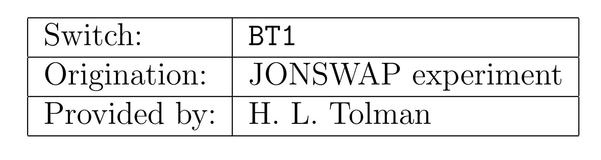

一种简单的底摩擦参数化是经验性的线性 JONSWAP 参数化（Hasselmann 等，1973），如 WAM 模型中所采用（WAMDIG，1988）。使用 Tolman（1991）的符号，该源项可以表示为：

$$\mathcal{S}_{bot}(k,\theta)=2\Gamma\:\frac{n-0.5}{gd}\:N(k,\theta)\tag{2.171}$$

其中 $\Gamma$ 是经验常数，对于涌浪（swell）估计为 $\Gamma = -0.038\ \mathrm{m^2s^{-3}}$ （Hasselmann 等，1973），对于风浪（wind seas）为 $\Gamma = -0.067\ \mathrm{m^2s^{-3}}$ （Bouws 和 Komen，1983）。 $n$ 是相速度与群速度的比值，如公式 (2.6) 所示。 $\Gamma$ 的默认值为 $-0.067$ ，用户可通过修改 SBT1 namelist 参数 GAMMA 来重新定义。

### 2.3.16 $S_{bot}$ : SHOWEX 底部摩擦

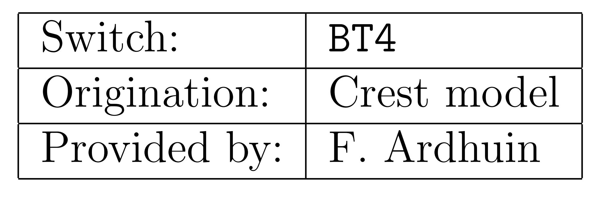

对于沙质海底，更现实的底摩擦参数化基于 Grant 和 Madsen（1979）的涡粘模型，以及考虑波纹形成和向片流（sheet flow）过渡的粗糙度参数化。

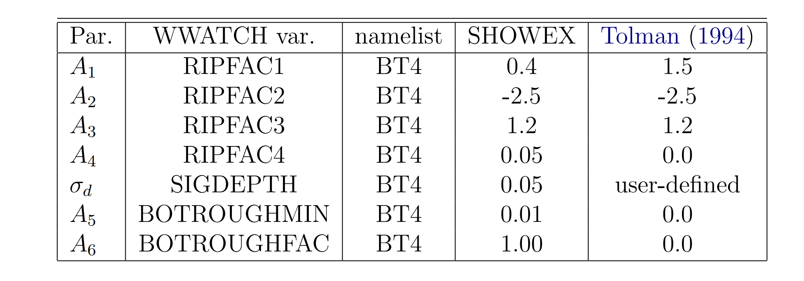

表 2.11：SHOWEX 底摩擦的参数值（默认值）以及 Tolman（1994）使用的原始参数值。源项参数可以通过 BT4 namelist 修改。需要注意的是，变量名称仅适用于 namelist，在源项模块中，这七个变量存储在数组 SBTCX 中。

Tolman（1994）的参数化经过 Ardhuin 等（2003）根据北卡罗来纳大陆架的 DUCK'94 和 SHOWEX 实验场测数据进行调整。WAVEWATCH III 中的实现还包括对水深变动的子网格参数化（Tolman，1995a）。该参数化可通过开关 BT4 激活。其源项可以表示为：

$$\mathcal{S}_{bot}(k,\theta)=-f_eu_b\:\frac{\sigma^2}{2g\sinh^2(kd)}\:N(k,\theta)\tag{2.172}$$

其中耗散因子 $f_e$ 是底部轨道位移均方根振幅 $a_b$ 和 Nikuradse 粗糙度长度 $k_N$ 的函数， $u_b$ 是底部轨道速度的均方根值。

当前床面粗糙度参数化（公式 $2.173$--$2.179$）包含表 $2.11$ 中列出的七个经验系数。粗糙度 $k_N$ 被分解为波纹粗糙度 $k_r$ 和片流粗糙度 $k_s$。

$$k_{r}\:=\:a_{b}\times A_{1}\:\left(\frac{\psi}{\psi_{c}}\right)^{A_{2}}
\tag{2.173}$$

$$k_{s}\:=\:0.57\frac{u_{b}^{2.8}}{\left [g\left(s-1\right)\right]^{1.4}}\frac{a_{b}^{-0.4}}{\left(2\pi\right)^{2}}\tag{2.174}$$

在公式 $2.173$ 和 $2.174$ 中， $A_1$ 和 $A_2$ 是经验常数， $s$ 是沉积物比重， $\psi$ 是 Shields 数，由底部轨道速度 $u_b$ 和中值砂粒直径 $D_{50}$ 决定。

$$\psi=f'_wu_b^2/\left[g\left(s-1\right)D_{50}\right]\tag{2.175}$$

其中 $f_w'$ 是沙粒的摩擦因子（计算方法与 $f_e$ 相同，但以 $D_{50}$ 代替 $k_r$ 作为底部粗糙度）， $\psi_c$ 是在平床正弦波作用下启动沉积物运动的临界 Shields 数。我们采用 Soulsby (1997) 的解析拟合公式。

$$\psi_{c}\:=\:\frac{0.3}{1+1.2D_{*}}+0.055\left[1-\exp\left(-0.02D_{*}\right) \right]\tag{2.176}$$

$$D_{*}\:=\:D_{50}\left[\frac{g\left(s-1\right)}{\nu^{2}}\right]^{1/3}
\tag{2.177}$$

其中 $\nu$ 是水的运动粘度。

当波浪运动不足以形成涡旋波纹时，即当席尔兹数小于阈值 $\psi_{rr}$ 时， $k_N$ 由残留波纹粗糙度 $k_{rr}$ 给出。该阈值为：

$$\psi_\mathrm{rr}=A_3\psi_c \tag{2.178}$$

低于此阈值，$k_N$ 由下式给出

$$k_{\mathrm{rr}}=\max\left\{A_5\text{m},A_6D_{50},A_4a_b\right\}\text{~for}\:\psi<\psi_{\mathrm{rr}}\tag{2.179}$$

### 2.3.17 $S_{mud}$ : 粘性泥浆的耗散（D&L）

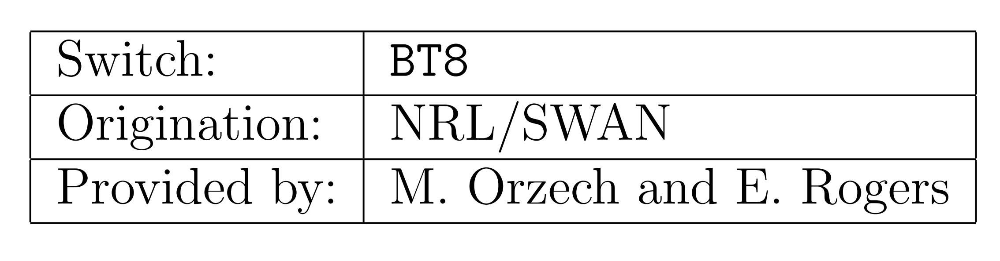

WAVEWATCH III 中实现了两种基于黏性流体泥浆的波衰减公式，这些公式来源于美国海军研究实验室 (NRL) 在 SWAN 代码中的早期实现。与冰引起的波衰减（第 2.4.1 节）类似，这两种方法都依赖于复波数的概念（公式 (2.200)）。两者都将泥层视为黏性流体，并假设泥层深度与其斯托克斯边界层厚度相当。

第一种公式（Dalrymple 和 Liu, 1978，以下简称 D&L）是数值解法；第二种公式（Ng, 2000，以下简称 Ng）是解析渐近解法，因此计算速度通常比 D&L 快得多。对于 Rogers 和 Holland (2009) 使用的泥浆特性范围（基于实地测量和估算），这两种方法产生的结果非常相似。

在每种情况下，泥浆引起的耗散会被加入公式 (2.8) 中其他源/汇项的贡献中。

$$S_{mud}=2k_iC_{g,mud}\tag{2.180}$$

其中 $k_i=imag(k_{mud})$ 和 $C_{g,mud}$ 是泥浆修正波群速度。

以上是根据单波列的指数衰减得出的初始幅度 $a_0:$

$$a=a_0e^{-k_ix}\tag{2.181}$$

两种方法都通过求解修正后的色散关系来实现，其中待求解的波数 $k_{\text{mud}}$ 是复数。D&L 方法采用迭代程序求解该色散关系。具体细节可参见 Dalrymple 和 Liu (1978) 的第 2 节及附录 B。针对 BT9（Ng 方法）的说明将在下一节给出。

要使用 (D&L) 例程激活黏性泥浆效应，用户需在开关参数文件中指定 BT8。

当新的冰或泥浆源项通过开关 IC1、IC2、IC3、BT8 或 BT9 被激活时，`ww3_shel` 将期望接收 8 个新场的数据（冰 5 个，泥浆 3 个），这些信息位于"水位"信息之前。新场也可以通过 `ww3_shel.inp` 指定为均匀场。泥浆参数按顺序为：泥浆密度（kg/m³）、泥浆厚度（m）和泥浆黏度（m²/s）。

用户可参考回归测试 `ww3_tbt1.1` 和 `ww3_tbt2.1`，了解如何使用新的泥浆源函数。

代码限制：在 `ww3_multi` 情况下，必要的泥浆和冰强迫场接口仅在使用 namelist 类型输入文件时实现。对于泥浆，尽管 $k_r$ 已计算，其影响并未反馈到主程序中，唯一起作用的是 $k_i$ （耗散）。 $k_r$ 的完整实现已在 IC3 中可用，并将在未来版本中提供。

物理限制：

1.  两种模型（BT8、BT9）均忽略泥层的弹性。
2.  泥浆的非牛顿响应（如触变流体行为）不可用。
3.  泥厚应理解为流化泥层的厚度，而非总泥层厚度。该值在实际中难以准确确定（Rogers 和 Holland, 2009）。

幸运的是，由于 WAVEWATCH III 支持泥浆参数的非稳态和非均匀输入，通过与泥层数值模型耦合可以处理第 (2) 和 (3) 项，无需对 WAVEWATCH III 代码进行额外修改。

### 2.3.18 $S_{mud}$ ：粘性泥浆的耗散（Ng）

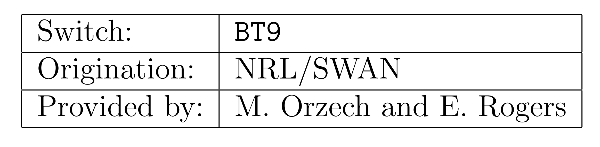

要使用 Ng 例程激活黏性泥浆效应，用户需在开关参数文件中指定 BT9。Ng 方法计算 $k_i$ 的公式为：

$$k_i \approx D_{mud}\equiv\frac{\delta_m(B_r'+B_i'){k_1}^2}{sinh2k_1d+2k_1d}\tag{2.182}$$

其中， $\delta_m$ 为泥浆斯托克斯边界层厚度， $d$ 为水深， $k_1$ 分别为泥水界面泰勒展开式中泥浆修正波数 $k_{mud}$ 实部的主阶项， $D_{mud}$ 为 $k_i$ 完全展开式中的主阶项。 $B^\prime$ 是影响速度深度剖面的复系数。有关更多详细信息，请参阅第 2.3.17 节和 Ng (2000)。

### 2.3.19 Sdb: Battjes and Janssen 1978

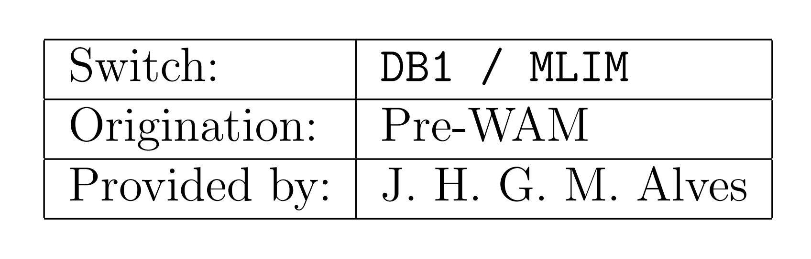

WAVEWATCH III 中水深致破碎算法的引入，旨在将模型的适用范围扩展至浅水区域。在此类环境中，波浪破碎以及其他由水深变化引起的波浪转化过程具有重要作用。

为实现这一目标，模型采用了 Battjes 和 Janssen (1978，以下简称 BJ78) 提出的理论方法。该方法假设：在随机波场中，凡是波高超过某一阈值的波浪均会发生破碎，而该阈值被定义为海底地形参数的函数。

对于随机波场，满足破碎条件的波浪比例通过对破碎带波高的统计分布进行描述来确定。该统计分布通常采用瑞利型分布，并在随水深变化的最大允许波高处进行截断。

根据 BJ78 的理论，破碎波所对应的谱能量密度总体耗散率 $\delta$ ，通过类比湍流跃波（turbulent bore）中的能量耗散过程进行估算，其表达式为：

$$\delta=0.25\:Q_b\:f_m\:H_{\max}^2\tag{2.183}$$

其中， $Q_b$ 为随机波场中发生破碎的波浪比例， $f_m$ 为平均频率， $H_{\max}$ 为随机波场中某一波浪分量在不发生破碎的情况下所能达到的最大单波波高（反之，超过该高度的波浪将全部发生破碎）。在 BJ78 中，最大波高 $H_{\max}$ 采用 Miche 型判据（Miche, 1944）来定义，

$$\bar{k}H_{\max}=\gamma_{M}\tanh(\bar{k}d)\tag{2.184}$$

其中， $\gamma_M$ 为常数系数。该方法同时会对超过极限陡度的深水波移除能量，这在深水条件下可能导致耗散的重复计数。作为替代方案，$H_{\max}$ 也可以采用 McCowan 型判据来定义，其形式为一个简单的常数比值。

$$H_{\max}=\gamma\:d \tag{2.185}$$

其中， $d$ 为局地水深， $\gamma$ 为由破碎波的现场观测和实验室试验得到的常数。该方法仅表征由水深引起的波浪破碎过程。尽管已提出若干将 $H_{\max}$ 表示为局地水深简单函数的更一般性破碎判据（例如 Thornton 和 Guza, 1983），但需要指出的是，系数 $\gamma$ 指的是随机波场中单个破碎波所能达到的最大波高。

McCowan (1894) 计算了在平底上传播的孤立波的极限波高与水深之比为 0.78，该数值至今仍作为工程应用中的保守判据。Battjes 和 Janssen (1978) 给出的平均值为 $\gamma = 0.73$。而 Nelson (1994, 1997) 对珊瑚礁上传播波浪的较新分析则表明，该比值约为 0.55。

破碎波比例 $Q_b$ 由在 $H_{\max}$ 处截断的瑞利型分布来确定（即假定所有已破碎波的波高均等于 $H_{\max}$），从而得到如下表达式：

$$\dfrac{1-Q_b}{-\ln Q_b}=\left(\dfrac{H_{rms}}{H_{\max}}\right)^2 \tag{2.186}$$

其中， $H_{\mathrm{rms}}$ 为均方根波高。在当前实现中，通过迭代方法求解隐式方程 (2.186) 以得到 $Q_b$ 。在假设总谱能量耗散率 $\delta$ 在整个频谱上均匀分配、从而不改变谱形的前提下（Eldeberky 和 Battjes, 1996），可得到如下水深致破碎的耗散源函数：

$$\mathcal{S}_{db}(k,\theta)=-\alpha\frac{\delta}{E}F(k,\theta)=-0.25\:\alpha\:Q_{b}\:f_{m}\frac{H_{\max}^{2}}{E}F(k,\theta)\tag{2.187}$$

其中， $E$ 为总谱能量， $\alpha = 1.0$ 为可调参数。用户可以在公式 (2.184) 与 (2.185) 之间进行选择，并对 $\gamma$ 和 $\alpha$ 进行调整。默认设置为采用公式 (2.185)， $\gamma = 0.73$ ， $\alpha = 1.0$ 。

### 2.3.20 $S_{tr}$：三元组非线性相互作用（LTA）

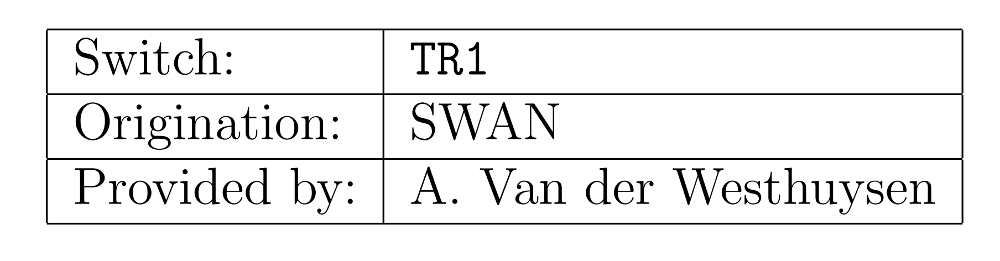

非线性三波相互作用采用 Eldeberky (1996) 提出的 LTA 模型进行模拟。该随机模型基于 Madsen 和 Sørensen (1993) 的 Boussinesq 型确定性方程。对这些确定性方程进行系综平均，并在零四阶累积量假设下截断空间演化方程层级，从而得到一维情况下谱与双谱演化的一组方程。

在谱演化方程中出现的双谱被分解为双振幅（biamplitude）和双相位（biphase）。其中，与峰值频率 $\sigma_p$ 自相互作用对应的双相位，被参数化为局地 Ursell 数的函数，其形式为：

$$\beta(\sigma_p,\sigma_p)=-\frac{\pi}{2}+\frac{\pi}{2}\tanh\left(\frac{0.2}{Ur}\right)\tag{2.188}$$

其中基于光谱的 Ursell 数 $Ur$ 由下式给出

$$Ur=\frac{g}{8\sqrt{2}\pi^{2}}\frac{H_{s}T_{m01}{}^{2}}{d^{2}}\tag{2.189}$$

双振幅通过对双谱演化方程在空间上进行积分得到，从而使其成为一个空间局地函数。由此得到的双振幅表达式包含一个空间上缓慢变化的分量和一个快速振荡的分量，其中后者被忽略。利用所推导得到的双相位和双振幅表达式，即可求解谱演化方程（一个单方程模型）。

为进一步降低计算成本，所有可能发生相互作用的三波组被简化为仅考虑自和相互作用（self-sum interactions），即频率为 $\sigma$ 的波分量与相同频率的另一分量相互作用，并与频率为 $\sigma + \sigma = 2\sigma$ 的分量进行能量通量交换的三波组。

最终，三波相互作用对频率为 $\sigma$ 的波分量的影响由两部分组成：一部分向 $\sigma$ 增加能量通量（来自 $1/2,\sigma$ 的传输通量），另一部分从 $\sigma$ 中移除能量通量（向 $2\sigma$ 的传输）。在采用角频率形式后，模型中实现的表达式为：

$$S_{\text{nl}3}(\sigma,\theta)=S_{\text{nl}3}^-(\sigma,\theta)+S_{\text{nl}3}^+(\sigma,\theta)\tag{2.190}$$

与

$$S_{\mathrm{nl3}}^{+}(\sigma,\theta)=\max[0,\alpha_{\mathrm{EB}}2\pi cc_{g}J^{2}|\sin\beta|\left\{E^{2}(\sigma/2,\theta)-2E(\sigma/2,\theta)E(\sigma,\theta)\right\}]$$

和
$$S_{\text{nl}3}^-(\sigma,\theta)=-2S_{\text{nl}3}^+(2\sigma,\theta)\tag{2.192}$$

由于在能量通量由 $\sigma$ 向 $2\sigma$ 转移的过程中存在雅可比因子，抵达 $2\sigma$ 的通量密度仅为离开 $\sigma$ 的通量密度的一半（因此在公式 (2.192) 中出现因子 2）。在非线性范围 $0 \le U_r \le 1$ 内，描述自相互作用的相互作用系数 $J$ 由 Madsen 和 Sørensen (1993) 给出：

$$J=\frac{k_{\sigma/2}^2(gd+2c_{\sigma/2}^2)}{k_\sigma d(gd+\frac{2}{15}gd^3k_\sigma^2-\frac{2}{5}\sigma^2d^2)}\tag{2.193}$$

LTA 表述沿方向谱的各个传播方向分别实施，从而得到一种各向同性、在方向上相互解耦的三波相互作用表示。比例系数取为 $\alpha_{EB} = 0.05$ 。此外，LTA 所得到的结果对参与相互作用计算的最高频率（记为 $f_{\max,EB}$ ）的选取十分敏感。Eldeberky (1995) 建议将相互作用的计算范围限定在平均频率的 2.5 倍以内，即 $f_{max,EB}=2.5f_{m01}$

### 2.3.21 Sbs：底部散射

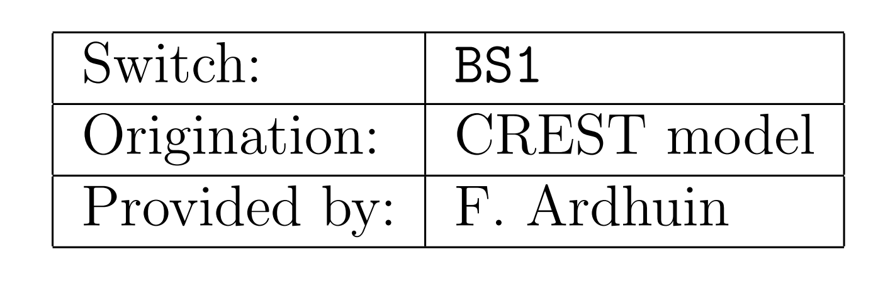

波浪在倾斜海底上传播时会发生部分反射。在水深变化量 $\Delta d$ 相对于平均水深 $d$ 较小的极限情况下，反射系数与海底谱成正比（Kreisel, 1949），并导致波能在方向上的重新分配。

这一过程可表示为一个源项。当在空间尺度大于海底自相关长度的条件下考察谱的演化时，该源项能够给出较为准确的反射系数；其适用范围在 $\Delta d / d \simeq 0.6$ 以内仍具有合理精度（Ardhuin 和 Magne, 2007）。该源项表达式为：

$$\mathcal{S}_{\mathrm{bs}}(\mathbf{k})=\dfrac{\pi}{2}\int_0^{2\pi}\dfrac{k'^2M^2(\mathbf{k},\mathbf{k}')}{\sigma\sigma'\left(k 'C_g'+\mathbf{k}\cdot\mathbf{U}\right)}F^B(\mathbf{k}-\mathbf{k}')\left[N(\mathbf{k}')-N(\mathbf{k})\right]\mathrm{d}\theta'$$

与耦合系数

$$M(\mathbf{k},\mathbf{k'})\simeq M_b(\mathbf{k},\mathbf{k'})=\frac{g\mathbf{k}\cdot\mathbf{k'}}{\cosh(kd)\cosh(k'd)}\tag{2.195}$$

其中，忽略了由海底起伏引起的流速和水位变化效应；当流速相对于本征相速较小或中等时（即 $U/C < 0.3$ ），这一近似是合理的。对于更大的弗劳德数，尤其是在接近阻塞（near-blocking）条件下，当前实现预计将不再具有足够精度。

在公式 (2.194) 中， $k$ 与 $k'$ 通过共振条件相关联，即 $\omega = \omega'$ ，也就是 $\sigma + k \cdot U = \sigma' + k' \cdot U$ ，其中 $U$ 为相位平流速度（参见例如 WISE Group, 2007）。

海底谱 $F_B(k)$ 在文件 `bottom_spectrum.inp` 中给定。该谱可由多波束测深数据确定。在缺乏详细地形数据的情况下，可基于 Hino (1968) 的研究对沙丘谱进行参数化。近期观测结果总体上证实了早期关于沙丘谱的结论（Ardhuin 和 Magne, 2007），即在较大 $k$ 范围内，海底谱呈无量纲常数形式，满足 $F_B(k) \sim k^{-4}$ .

为简化计算，海底谱采用双边形式，并归一化使得海底起伏方差（单位为平方米）为：

$$<d^2>=\int_{-\infty}^{\infty}\int_{-\infty}^{\infty}F^B(k_x,k_y)\mathrm dk_x\mathrm dk_y \tag{2.196}$$

在当前实现中，假定该海底谱在所有网格点上均相同。

源项的计算根据流速大小采用不同的方法。当流速为零时，相互作用仅涉及相同频率的波分量，且在方向谱意义下始终是线性的、形式固定。在这种情况下，相互作用可表述为一个矩阵问题：方向谱 $F$ 表示为包含 NTH 个分量的向量，源项为同样维度的向量，通过矩阵乘法 $S = M F$

得到，其中 $M$ 为大小为 (NTH, NTH) 的方阵。该矩阵是海底谱以及无量纲水深 $kd$ 的函数。该散射矩阵在预处理阶段针对有限个波数模值预先计算并进行对角化（Ardhuin 和 Herbers, 2002）。预处理的计算成本随离散波数数量线性增加。

当存在非零流速时，相互作用的模式将依赖于流速的大小和方向（对于各向同性的海底谱，仅依赖于流速大小）。在这种情况下，若对散射矩阵进行预计算，将至少使计算开销增加一个数量级。因此，在当前实现中，对于非零流速情形，相互作用积分在每一次源项调用时重新计算。

### 2.3.22 $S_{uo}$ ：未解决的障碍来源术语

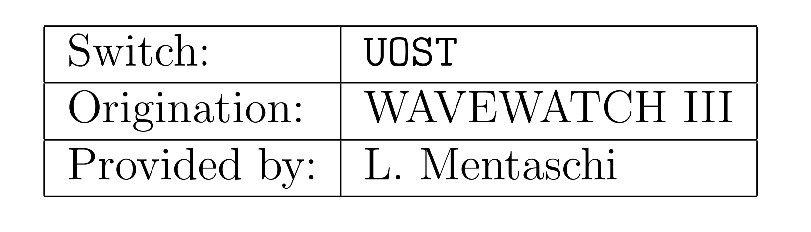

未被解析的海底地形和海岸特征（如悬崖、浅滩和小岛）是谱波浪模型中局地误差的重要来源。这些特征所引起的耗散效应可能在长距离传播过程中不断累积，若将其忽略，可能会显著降低模型在大范围区域内的模拟能力（Tolman, 2001；Tolman 等, 2002；Tuomi 等, 2014；Mentaschi 等, 2015a）。

在 WAVEWATCH III 中，针对未解析障碍物所导致的耗散效应，提供了两种次网格尺度建模方法：

a)  一种基于传播过程的方法，适用于规则网格，详见第 3.4.7 节（Tolman, 2003b；Chawla 和 Tolman, 2008）；

b)  未解析障碍物源项（Unresolved Obstacles Source Term，UOST；Mentaschi 等, 2018a, 2015b），即本文所述的方法。

除几乎支持任意类型的网格外，UOST 还显式考虑了未解析地形要素在方向和空间上的分布特征，相较于传统方法，可进一步提升模型的模拟性能（Hardy 等, 2000；Mentaschi 等, 2018b）。

UOST 基于这样一种假设：任意计算网格均可视为由一组多边形单元（称为单元格，cells）组成，模型在每个单元内估计未知量的平均值。对于任意一个单元（记为 $A$ ，见图 2.1ab），UOST 针对每一个谱分量，分别估计以下两类未解析要素的影响：

a)  位于单元 $A$ 内的未解析特征所引起的耗散（局地耗散，Local Dissipation，LD）；

b)  位于 $A$ 上游、其"阴影"投射到 $A$ 上的未解析特征所产生的影响（阴影效应，Shadow Effect，SE）。

在估计阴影效应时，对于每一个单元/谱分量，定义一个上游多边形 $A'$，其为与单元 $A$ 相邻的若干单元（图 2.1ab 中的 $B$、$C$ 和 $D$）与指向 $A$ 的上游能量通量之间的交集。

对于每一个单元或上游多边形，并针对每一个谱分量，分别估计两种不同的透明度系数：

1.  整体透明度系数 $\alpha$；

2.  与空间布局相关的透明度系数 $\beta$，其定义为从单元上游侧开始、沿单元截面计算得到的平均透明度。

该源项可表示为：

$$S_{uo}=S_{ld}+S_{se}\tag{2.197}$$

$$S_{ld}=-\psi_{ld}(\mathbf{k})\frac{1-\beta_l(\mathbf{k})}{\beta_l(\mathbf{k})}\frac{c_g(\mathbf{k})}{\Delta L}N\tag{2.198}$$

$$S_{se}=-\psi_{se}(\mathbf{k})\bigg[\frac{\beta_u(\mathbf{k})}{\alpha_u(\mathbf{k})}-1\bigg]\frac{c_g(\mathbf{k})}{\Delta L}N\tag{2.199}$$

其中， $S_{ld}$ 和 $S_{se}$ 分别表示局地耗散项和阴影效应项， $N$ 为谱密度， $k$ 为波矢量， $c_g$ 为群速度， $\Delta L$ 为谱分量在单元内的传播路径长度， $\psi$ 因子用于描述在存在局地波浪增长时耗散的削弱效应。系数 $\alpha$ 和 $\beta$ 的下标 $l$ 与 $u$ 分别表示这些系数对应于单元本身以及其上游多边形。关于 UOST 理论框架的更详细说明，可参见 Mentaschi 等 (2015b, 2018a)。

**网格参数的自动生成**

已开发一个开源 Python 软件包 alphaBetaLab (https://github.com/menta78/alphaBetaLab)，用于基于真实海底地形数据自动估计上游多边形，以及透明度系数，用于基于真实海底地形数据自动估计上游多边形，以及透明度系数) $\alpha_l$ 、 $\beta_l$ 、 $\alpha_u$ 、 $\beta_u$ ，以及 UOST 所需的其他参数。alphaBetaLab 将计算单元视为自由多边形，并根据未解析障碍物的截面与入射谱分量之间的关系来估计透明度系数（见图 2.1cd）。

因此，该工具可应用于任意类型的网格，包括非结构三角网格和 SMC 网格（截至 2018 年 8 月，目前仅支持规则网格和三角网格，SMC 网格的支持将很快加入）。需要指出的是，尽管 UOST 在理论上能够使能量耗散随谱频率变化，目前 alphaBetaLab 仅考虑方向上的影响。有关 alphaBetaLab 中所实现算法的更多细节，可参见 Mentaschi 等 (2018a)。Mentaschi 等 (2018c) 提供了该软件及其架构的完整文档，并给出了使用说明和示例。

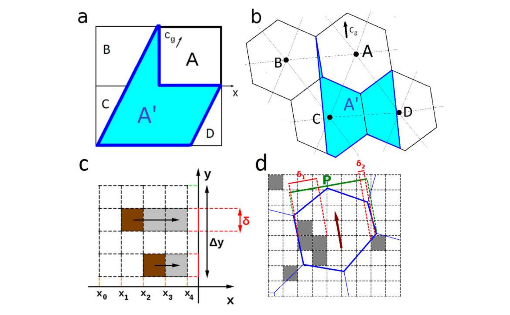

图 2.1：
a：对于以群速度 $c_g$ 传播的某一谱分量，示意一个方形单元（ $A$ ）及其上游多边形（ $A'$ ，由蓝色边界限定，浅蓝色区域）。联合多边形 BCD 表示邻域多边形。
b：与 a 类似，但对应于三角形网格（六边形近似表示中位对偶单元）。
c：在 $N_s = 4$ 的情况下，针对沿 $x$ 轴传播的谱分量，计算方形单元的 $\alpha$ 和 $\beta$ 的示意图。
d：与 c 类似，但对应六边形单元及倾斜传播的谱分量；在该面板中，灰色方块表示未解析的障碍物。

| Namelist parameter | Description | default value |
|----|----|----|
| UOSTFILELOCAL | Local $\alpha/\beta$ input file path | obstructions_local.gridname.in |
| UOSTFILESHADOW | Shadow $\alpha/\beta$ input file path | obstructions_shadow.gridname.in |
| UOSTFACTORLOCAL | Calibration factor for local transparencies | 1 |
| UOSTFACTORSHADOW | Calibration factor for shadow transparencies | 1 |

表 2.12：UOST 参数、说明和默认值。

**时间步长设置**

在 WAVEWATCH III 中，源项在每一个全局时间步结束时统一施加。因此，为了在某一单元内正确发挥作用，UOST 所要求的全局时间步长必须小于或等于该单元的临界 CFL 时间步，即最快的谱分量完全穿过该单元所需的时间。否则，部分能量将未经阻挡而穿过单元，从而导致耗散效应被低估（Mentaschi 等, 2018a）。

在单元尺度差异较大的非结构网格中，若对所有单元（包括最小单元）均应用 UOST，可能会迫使全局时间步长取值极小，从而显著降低模型的计算效率。为避免这一问题，用户可在 alphaBetaLab 中设置忽略小于某一用户定义阈值的单元，并在 WAVEWATCH III 中将全局时间步长设定为与该阈值对应的临界 CFL 时间步（Mentaschi 等, 2018c）。

### 2.3.23 Sxx：用户定义

该槽适用于尚未在方程式中分类的源术语。 （2.16）。

几乎根据定义，这里无法提供它。

## 2.4 波冰相互作用的源项

波--冰相互作用过程一直是大量研究的主题。通常，这类相互作用需要对海冰性质进行描述，至少包括冰浓度（海面被冰覆盖的比例）、平均冰厚以及最大浮冰块直径。实际上，海冰常被破碎为大小不一的浮冰块（floe），其尺度分布会显著影响波浪色散特性以及波--冰相互作用过程。

在当前版本的 WAVEWATCH III® 中，与海冰相关的不同处理方案仍属于持续研究内容。目前共有五种耗散过程版本，可通过开关 IC1、IC2、IC3、IC4 和 IC5 激活，并可与两种散射方案 IS1 和 IS2 组合使用。第二种散射方案由于是唯一使用最大浮冰块直径的方案，还包含了冰破裂及由此得到的最大浮冰块直径估算，以及一定程度的滞后耗散。

在使用这些开关组合时需要注意。例如，除冰浓度和冰厚外，其它强迫场参数具有"情境依赖性"，即在不同源项参数化中代表的物理意义不同。

目前，针对霜冰或薄饼冰设计的耗散参数化（IC3 或 IC4）尚不能与针对连续冰盖（如 IC2）的参数化同时使用。此外，各参数化之间尚未完全整合，例如某些考虑海冰影响的修正色散关系中仍未纳入浮冰块尺度的影响。未来版本的 WAVEWATCH III 预计将提供更统一的处理方式，可能通过最大浮冰块直径来调用不同的物理过程。

在多数情况下，WAVEWATCH III 已允许冰相关输入在时空上变化，但实际应用中通常仅能获得冰浓度（来自卫星或模型）和冰厚（通常来自模式）的信息。其它反映海冰性质的参数在实际中较少可用。

观测海冰对波浪影响本身具有挑战性，尤其是在冰缘附近进行数值模拟更为困难，因为非定常、非均匀冰场输入的精度往往成为限制模拟准确性的主要因素（Rogers 等，2018a）。

除 WAVEWATCH III 外，还有许多重要研究使用了其它模型，例如 Doble 和 Bidlot（2013）。目前，WAVEWATCH III 中的多种方案已在少数实际案例中进行了测试，包括 Li 等（2015）、Ardhuin 等（2016）、Wang 等（2016）、Rogers 等（2016；2018a）、Cheng 等（2017）以及 Liu 等（2020）。

用于表示海冰对波浪影响的实验性方案通过 IC1、IC2、IC3 等开关实现。最早在 WAVEWATCH III 中实现的是 IC1 和 IC2 的初始版本（Rogers 和 Orzech，2013），其中 IC2 基于 Liu 和 Mollo-Christensen（1988）以及 Liu 等（1991）的工作。这些效应可以用复波数的形式来表示。

$$k=k_r+ik_i \tag{2.200}$$

其中复波数的实部 $k_r$ 表示海冰对实际波长和传播速度的影响，其作用类似于水深变化引起的浅化和折射效应；复波数的虚部 $k_i$ 则为指数衰减系数 $k_i(x,y,t,\sigma)$（分别依赖于空间位置、时间和频率），用于描述波浪衰减。

$k_i$ 通过关系式 $S_{\mathrm{ice}}/E = -2c_g k_i$ 引入，其中 $S_{\mathrm{ice}}$ 为源项（参见 Komen 等，1994，第 170 页）。对于能够给出 $k_r$ 的方法（如 IC2、IC3 和 IC5），海冰效应需要求解新的色散关系。

在 WAVEWATCH III 第 6 版中，所有冰源函数（IC1 至 IC5）都考虑了海冰对 $k_i$ 的影响。海冰对 $k_r$ 的影响已在 IC2 和 IC3 中实现，但目前仅在 IC3 中向代码其余部分输出，且仍属于实验性功能。

冰源函数均按冰浓度进行缩放。

在存在海冰的情况下，最多允许五个非定常、非均匀输入参数场，通常记为 $C_{\mathrm{ice},1}$、$C_{\mathrm{ice},2}$、...、$C_{\mathrm{ice},5}$。这些参数的具体物理意义取决于所选的 $S_{\mathrm{ice}}$ 方案。例如，在 IC1 中只需要一个参数 $C_{\mathrm{ice},1}$。在某些情况下（如 IC3 和 IC4），也可以选择将这些变量设为定常且空间均匀，并通过 namelist 参数进行定义。

有关新冰源函数的使用示例，可参考回归测试 ww3_tic1.1--3 和 ww3_tic2.1。

在 ww3 shel 中的使用：允许输入非定常、非均匀的冰参数场。当通过开关 IC1、IC2、IC3、IC5、BT8 或 BT9 激活冰或泥沙源函数时，ww3 shel 将预期读取 8 个场（前 5 个为冰参数，后 3 个为泥沙参数），这些字段在"water levels"信息之前给出。新字段也可以通过 ww3 shel.inp 文件末尾的相关设置定义为空间均匀场。

在 ww3 multi 中的使用（自 WAVEWATCH III 第 6 版起新增）：通过 namelist 向 ww3 multi 提供参数时，现在可以指定泥沙和冰参数为非定常、非均匀场。在第 6 版之前，这只能通过 ww3 shel 实现。不过，通过 ww3 multi.nml 读取这些指令的新方法在撰写本文时尚未经过作者测试。

源项的分离：IC1 至 IC5 源项用于表示波能耗散。而海冰对波浪的反射和散射（如 Wadhams，1975）并非耗散过程，而是守恒过程，这些效应通过 IS1 和 IS2 单独处理。

### 2.4.1 $S_{ice}$ ：海冰阻尼（简单）

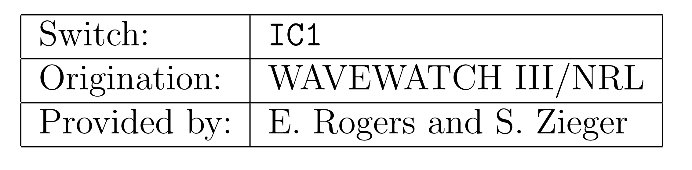

第一个实现的方法（IC1）允许用户直接指定 $k_i(x,t)$，其在频率空间中为常数，即 $C_{\mathrm{ice},1} = k_i$，而参数 $C_{\mathrm{ice},2}, \ldots, C_{\mathrm{ice},5}$ 不使用。例如，可设置 $C_{\mathrm{ice},1} = 2 \times 10^{-5}$。关于 IC2 和 IC3 的具体说明将在后续章节中给出。

IC1 的完整描述见 Rogers 和 Orzech（2013），简要总结见 Rogers 等（2018a）。这种简单方法已应用于 Li 等（2015），并作为模型--数据反演方法中的建模部分，被 Rogers 等（2016）、Rogers 等（2018a）和 Rogers 等（2018b）采用。

### 2.4.2 $S_{ice}$ ：海冰阻尼（Liu 等人）

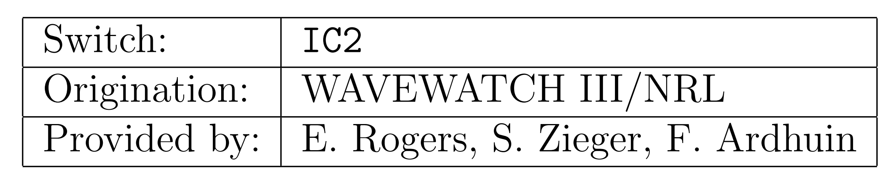

这种用于表示波--冰相互作用导致波能耗散的方法基于 Liu 和 Mollo-Christensen（1988）、Liu 等（1991）以及 Ardhuin 等（2015）的研究。主要的输入冰参数为冰厚（单位：米），该参数可以随时间和空间变化，并作为强迫场 $C_{\mathrm{ice},1}$。

该模型用于描述连续冰盖引起的波浪衰减，假设耗散源于冰下边界层中的摩擦作用，并将海冰视为连续的薄弹性板。若在 IC2 namelist 的 SIC2 参数中设置 IC2DISPER = .TRUE.，则激活 Liu 和 Mollo-Christensen（1988）的原始形式。该形式假设边界层始终为层流，但采用可以随空间变化的涡粘系数 $\nu$，其作为强迫场 $C_{\mathrm{ice},2}$。

IC2 与 IS2 还可以选择共同使用 Liu 和 Mollo-Christensen（1988）针对未破碎冰盖提出的色散关系。

$$\sigma^2=\begin{pmatrix}gk_{ice}+Bk_{ice}^5\end{pmatrix}/\left(1/\tanh(k_{ice}H)+\frac{\rho_{ice}hk_{ice}}{\rho_w}\right)\tag{2.201}$$

$$c_g=(g+(5+4k_{ice}M)Bk_{ice}^4)/(2\sigma(1+k_{ice}M)^2)\tag{2.202}$$

其中 $B$ 和 $M$ 分别量化了波浪作用下海冰弯曲效应和海冰惯性效应。基于同一色散关系推导得到的冰下群速度被用于模块 W3SIS2MD，并在 W3DISPMD 中计算。具体细节可参见 Liu 和 Mollo-Christensen（1988）。

对于 IC2，色散关系定义为：

$$\sigma^2=(gk_r+Bk_r^5)/(\coth(k_rh_w)+k_rM)\tag{2.203}$$
$$c_g=(g+(5+4k_rM)Bk_r^4)/(2\sigma(1+k_rM)^2)\tag{2.204}$$
$$\alpha=(\sqrt{\nu\sigma}k_r)/(c_g\sqrt{2}(1+k_rM))\tag{2.205}$$

$h_w$ 是水深， $h_i$ 是冰厚。变量 $B$ 和 $M$ 分别量化冰弯曲和冰惯性的影响。这两个变量都取决于 $h_i$ （参见 Liu 和 Mollo-Christensen，1988；Liu 等人，1991）。

仅当 MISC 名单中 ICEDISP=TRUE 时，此方程才能求解。否则，$k_{ice}=k$，就像在开放水域中一样。请注意，$k_{ice}$ 的效果不会传回主程序。

斯托帕等人。 (2016) 通过添加更好的替代耗散涡流粘度表示法来改进 IC2。它们区分层流和湍流状态，允许通过设置 IC2DISPER=.FALSE 来激活它。在这种情况下，当雷诺数高于用户定义的阈值 IC2REYNOLDS 时，耗散从使用分子粘度乘以经验调整因子 IC2VISC 的层流形式转变为由因子 IC2TURB 放大的湍流形式。考虑到波场的随机性质，这种过渡在 IC2SMOOTH 范围内进行平滑。在湍流状态下，摩擦系数根据用户指定的冰下粗糙度长度 IC2ROUGH 进行估计，预计约为 $10^{-4}$ m 的量级。当絮凝物直径比海浪波长短得多时，还可以执行启发式降低耗散率的操作（详细信息请参见 Ardhuin 等人）。它依赖于这样的假设：在这些条件下，浮冰至少部分地跟随水平运动，因此降低冰与水之间的相对速度（据此估计消散率）是合乎逻辑的。这种减少是由 Ardhuin 等人中称为 $r_D$ 的因素控制的，该值可以通过名单参数 IC2MAX 设置。对于长度超过 $D_{max}/r_D$（$D_{max}$ 是最大絮凝物尺寸）的波，耗散率会降低，并且波长数量级或更大的最大絮凝物直径不会减少。

参数 IC2TURBS 是南半球湍流耗散的临时增强，引入该参数是为了进行测试以调查偏差来源。这将在未来版本中被弃用。现在看来，将 IC2 与 IS2 中的非弹性耗散相结合可以为两个半球的主波提供良好的结果（Ardhuin 等人）。

IC2 原始形式的完整描述可以在 Rogers 和 Orzech (2013) 中找到。它被应用于 Li 等人。 （2015）。 Rogers 等人给出了当前代码的简明摘要。 （2018a）。 IC2耗散机制改进的描述可以在Stopa等人的附录B中找到。 （2016），它的使用地点。

### 2.4.3 Sice：海冰阻尼（Shen 等人）

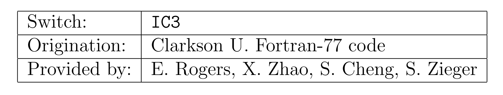

第三种波--冰相互作用表示方法来自 Wang 和 Shen（2010）。该模型将海冰视为黏弹性层（visco-elastic layer）。

在该方案（IC3）中，输入参数含义如下：

- $C_{\mathrm{ice},1}$：冰厚（m）
- $C_{\mathrm{ice},2}$：动力粘度系数（m$^2$ s$^{-1}$）
- $C_{\mathrm{ice},3}$：冰密度（kg m$^{-3}$）
- $C_{\mathrm{ice},4}$：有效剪切模量（Pa）
- $C_{\mathrm{ice},5}$：未使用

一个示例设置为：$C_{\mathrm{ice},1\ldots4} = [0.1, 1.0, 917.0, 0.0]$

在 WAVEWATCH III 第 4 版中，该海冰源项方法（IC3）的计算成本显著高于 IC1 或 IC2。不过，这一问题在模型 5.16 版本中已基本得到改进和优化。

自 5.16 版本起，引入了新的 namelist ------ SIC3。相关 namelist 参数在文档中以列表形式给出，其中部分参数将在后续章节中作更详细说明。

IC3CHENG 技术解决方案在版本 5.16 中引入。默认值 = TRUE。
IC3HILIM 可选的冰厚限制。默认值 = 100（即默认情况下该选项不使用）。
IC3KILIM 可选的耗散率 ki 限制。默认值 = 100（即默认情况下该选项不使用）。
USECGICE 当设置为 TRUE 时，模型将考虑冰对群速度的影响。默认值 = FALSE。
IC3VISC 如果用户希望使用恒定且均匀的有效粘度，现在可以通过 namelist 实现。默认值 = N/A。
IC3ELAS 与 IC3VISC 类似，但用于有效弹性。默认值 = N/A。
IC3DENS 与 IC3VISC 类似，但用于冰密度。默认值 = N/A。
IC3HICE 与 IC3VISC 类似，但用于冰厚。默认值 = N/A。
IC3MAXCNC 参数，可用于在某些冰况下可选择地切换到另一种耗散（见下文）。默认值=100（即不使用此选项）。正常范围为 0 到 1。
IC3MAXTHK 同上。默认值=100（即不使用此选项）。正常范围为 0 到 10 米。
IC2REYNOLDS 与 IC2 非色散湍流边界层方案相关的参数。默认值=1.5e+5。
IC2ROUGH 同上。默认值=0.02。
IC2SMOOTH 同上。默认值=7.0e+4。
IC2VISC 同上。默认值=2.0。
IC2TURB 同上。默认值=2.0。
IC2TURBS 同上。默认值=0.0。

IC3CHENG 选项是在模型第 5 版中新引入的。当设为 TRUE 时，模型采用 S. Cheng 提供的一种替代求解方法。该方法具有两个重要特点：第一，提高了数值稳定性，因此无需再使用冰厚限制参数 IC3HILIM；第二，该方法要求四个冰流变参数中的三个必须为时空不变且均匀的，并通过 namelist 参数输入。

如果 IC3CHENG 设为 FALSE，建议使用冰厚限制参数 IC3HILIM 以保证稳定性（推荐取值为 25--100 cm）。参数 IC3KILIM 在早期开发版本中用于保证稳定和提高计算效率，但在当前版本中已不再需要，用户可以忽略。

在模型 4.18 版本中，四个冰流变参数（冰厚、有效黏度、有效弹性模量和冰密度）可以设置为非定常且空间非均匀。这些参数可以通过 ww3 prep 提供；若使用 ww3 shel 且不需要空间非均匀输入，则可以使用其 "homogeneous" 选项输入流变参数。自 5.16 版本起，增加了通过 namelist SIC3 指定四个冰流变参数的选项，但需满足两项限制：

1）若 IC3CHENG = FALSE 且 USECGICE = TRUE，则不能使用 namelist 方法；

2）若 IC3CHENG = TRUE，则必须通过 namelist 方法输入其中三个参数（有效黏度、有效弹性模量和冰密度）。

当 IC3CHENG = TRUE 或 USECGICE = FALSE 时，第四个参数（冰厚）可以通过任一方法输入。模型会进行错误检查，以确保每个参数仅通过一种方式输入。

冰影响下修正的波数 $k_r$ 通过群速度 $c_g$ 和相速度 $c$ 的计算被纳入控制方程（2.8）左端项中。修正后的波数和群速度可以选择性地反馈到主程序，从而产生类似于地形引起的折射和浅化效应。但该功能目前主要用于学术研究，而非常规业务应用。

若要启用浅化效应，需要设置 USECGICE = TRUE；若要启用折射效应，则需在编译时开启 REFRX 开关。在该开关下，模型基于包含冰影响的相速度空间梯度计算折射，而非采用无冰色散关系。相关效应在回归测试 ww3 tic1.3 中有所展示。

当使用 IC3CHENG 求解器且冰厚为零时，计算得到的群速度并不能完全退化为开阔水域色散关系的结果。这源于数值计算 $c_g = \partial \sigma / \partial k = \Delta \sigma / \Delta k$ 时的误差。这些小差异会在启用浅化和折射时带来轻微误差。在冰厚严格为零时，误差小于 10%，且与频率有关。当前通过在冰厚精确为零时跳过求解器来避免该问题；若冰厚接近但不等于零，则可能出现可察觉差异。对于其他参数（有效黏度、有效剪切模量）趋近于零时的解，尚未进行系统测试。即便在相同冰参数下，IC3CHENG = FALSE 与 TRUE 之间也可能存在小但实质性的差异。

USECGICE = TRUE 是产生浅化效应的必要条件。然而，由于某些冰流变条件可能导致群速度增加，这会影响 CFL 稳定条件，从而可能需要减小时间步长。因此，不希望处理该问题的用户建议将 USECGICE 设为 FALSE。

在 5.16 版本中，还增加了一个非默认选项，使得在特定冰况下改变耗散参数化方式：当冰浓度超过 IC3MAXCNC 且冰厚超过 IC3MAXTHK 时，采用 IC2 的耗散方案（更具体地说，是 IC2 中非默认、非色散的边界层子方案）替代 Wang 和 Shen（2010）基于色散关系的耗散估算。由于该方案为非色散形式，因此不应与 USECGICE = TRUE 同时使用。

IC3 首次出现在 WAVEWATCH III 第 4 版中，最初的简单测试见 Rogers 和 Zieger（2014）。此后，该方法已被 Li 等（2015）、Wang 等（2016）、Rogers 等（2016）以及 Cheng 等（2017）等研究采用。

### 2.4.4 $S_{ice}$ ：海冰的经验/参数阻尼

| 开关：   | IC4                      |
|----------|--------------------------|
| 起源：   | WAVEWATCH III/NRL        |
| 提供者： | C. Collins and E. Rogers |

第四种海冰衰减方案（IC4）最早由 Collins 和 Rogers（2017）提出。该方案提供多种简单的经验或参数化形式，用于表示海冰对波浪能量的耗散。IC4 的设计目标是构建一个简单、灵活且计算高效的源项，在高度参数化的框架下再现波--冰相互作用的一些基本物理特征。具体方法通过 namelist 参数 IC4METHOD 的整数取值（目前为 1--10）进行选择。

前六种方法包括：

1）对 Wadhams 等（1988）现场数据进行指数拟合；  
2）Meylan 等（2014）的多项式拟合；  
3）基于 Kohout 和 Meylan（2008）计算结果的二次拟合（见 Horvat 和 Tziperman，2015）；  
4）Kohout 等（2014）的公式（其论文中的公式 1）；  
5）最多 4 阶的分段阶跃函数（可设为非定常、非均匀）；  
6）最多 10 阶的分段阶跃函数（必须为定常且均匀）。

方法 7、8 和 9 采用多变量幂函数形式，衰减同时依赖频率和冰厚。除 IC4 的第四种方法外，其余方法均具有频率相关的衰减特性。第四种方法中，衰减随波高变化，但在频率空间上均匀。

在下文中，用 IC4M1 表示 IC4 方法 1，依此类推。IC4 通过开关启用，并在文件 ww3 grid.inp 中通过 namelist 形式指定，例如 IC4METHOD=1。与 IC1 中 Cice,1 表示用户直接给定的衰减系数不同，在 IC4 中 Cice,n 的含义依方法而变化：

- 在 IC4M1、IC4M2 和 IC4M4 中，Cice,n 为方程中的常数参数；
- 在 IC4M3、IC4M7、IC4M8 和 IC4M9 中，Cice,1 表示冰厚；
- 在 IC4M5 中，Cice,n 控制阶跃函数形式；  
- 在 IC4M6 中，阶跃函数由 namelist 变量控制。

对于使用 Cice,n 的方法，用户可以类似于水位输入的方式，将其设置为非定常或空间非均匀分布。

IC4M1 采用指数形式来拟合 Wadhams 等（1988）表 2 中的数据，从而对高频波产生更强的衰减。这种形式参数化了海冰对波谱的低通滤波效应。其表达式为：

$$\alpha=\exp\left[\frac{-2\pi C_{ice,1}}{\sigma}-C_{ice,2}\right]\tag{2.206}$$

这里，$\alpha$ 是能量的指数衰减率，其数值为振幅衰减率的两倍：$\alpha = 2k_i$。根据数据得到的参数取值为 $C_{ice,1...2} = [0.18, 7.3]$，但用户可以自行修改。这种方法在 Collins 和 Rogers（2017）中进行了描述和应用。

IC4M2：在该方法中，耗散项采用用户指定的多项式形式表示。这是一种功能强大的方法，因为它能够表示多种函数形状，例如通过拟合基于观测的耗散率。该方法同样在 Collins 和 Rogers（2017）中进行了描述和应用。其方程如下：

$$\alpha=C_{ice,1}+C_{ice,2}\left[\frac{\sigma}{2\pi}\right]+C_{ice,3}\left[\frac{\sigma}{2\pi}\right]^{2}+C_{ice,4}\left[\frac{\sigma}{2\pi}\right]^{3}+C_{ice,5}\left[\frac{\sigma}{2\pi}\right]^{4}\tag{2.207}$$

如果用户希望采用 Meylan 等（2014）的方法，建议的系数取值为 $C_{ice,1...5} = [0, 0, 2.12 \times 10^{-3}, 0, 4.59 \times 10^{-2}]$。其他推荐的多项式形式可参见 Rogers 等（2018b）。

通过适当选择系数，该多项式方法可以再现所谓的"roll-over 效应"，即衰减在频率空间中呈现非单调变化。然而，近期的一些研究并未显示这一效应，例如 Rogers 等（2016）以及 Li 等（2017）。因此，该效应可能只是早期观测研究中的一种伪影。

尽管 $C_{ice,1...5}$ 可以设定为随时间和空间变化，但在实际应用中很少使用这一功能。大多数用户更倾向于使用常数值。为方便起见，可以通过 namelist 参数进行设置，其中 $C_{ice,i}$ 在 SIC4 namelist 中以 $IC4CN(i)$ 的形式指定，而不是通过 $ww3\_prep$ 等方式作为输入场提供。

IC4M3：Horvat 和 Tziperman（2015）将 Kohout 和 Meylan（2008）计算得到的衰减系数拟合为关于频率 $T$ 和冰厚 $h$ 的二次函数。衰减随冰层变厚以及频率升高（周期降低）而增强。由于该二次方程所需系数量过多，不适合由用户自行设定，因此方程被内置于程序中，唯一可调参数 $C_{ice,1}$ 即为冰厚 $h$。该方法在 Collins 和 Rogers（2017）中进行了描述和应用。

作为参考，其方程如下：

$$\ln\alpha(T,h) =-0.3203+2.058h-0.9375T-0.4269h^{2}+0.1566hT+0.0006T^{2} $$

关于 IC4M3，有以下四点需要注意。

第一，该方程本身是对 Kohout 和 Meylan（2008）中用于计算衰减系数的原始冰厚范围 $h$ 的外推。该原始范围为 $0.5 \text{ m} \le h \le 3 \text{ m}$，详见 Horvat 和 Tziperman（2015）。

第二，在 Kohout 和 Meylan（2008）中，预测的波浪衰减基于散射机制（守恒过程）；而在 IC4M3 中，波浪衰减被作为耗散过程（非守恒过程）处理。

第三，不建议将 IC4M3 与散射方案 IS1 或 IS2 结合使用，因为这会导致散射效应被重复计算。

第四，该实现假设每米路径上遇到一个冰浮块。这一点不同于 Horvat 和 Tziperman（2015）中的处理方式，后者允许该长度尺度变化。更多细节可参见文件 w3sic4md.F90 中的内嵌文档说明。

IC4M4：Kohout 等（2014）发现，衰减是显著波高的函数。衰减随 $H_s$ 线性增加，直到 $H_s = 3 \text{ m}$，此时衰减达到上限，即：

$$\begin{aligned} 
\frac{\partial H_s}{\partial dx}&=C_{ice,1}\times H_s\quad&&\text{for}~H_s\leq3~\text{m}\\\\\frac{\partial H_s}{\partial dx}&=C_{ice,2}\quad&&\text{for}~H_s>3~\text{m}\end{aligned}\tag{2.209}$$

其中 $k_i=\frac{\partial H_s}{\partial dx}/H_s$ 。

Kohout 等（2014）给出的参数取值为 $C_{ice,1...2} = [5.35 \times 10^{-6}, 16.05 \times 10^{-6}]$。

示例可参见回归测试 ww3_tic1.1/input_IC4_M4。该方法在 Collins 和 Rogers（2017）中进行了描述和应用。

IC4M5：这是一种最多包含 4 个阶跃的简单阶跃函数。它由可选的、非定常且空间非均匀的参数 $C_{ice,1...7}$ 控制。其中，$C_{ice,1...4}$ 控制阶跃水平（以耗散率 $k_i$ 表示），$C_{ice,5...7}$ 控制阶跃边界（单位为 Hz）。示例可参见回归测试 ww3_tic1.1/input_IC4_M5。该方法在 Collins 和 Rogers（2017）中进行了描述。

IC4M6：这是一种最多包含 10 个阶跃的简单阶跃函数。它由定常且空间均匀的 namelist 参数 IC4KI 和 IC4FC 控制。数组 IC4KI 控制阶跃水平（以耗散率 $k_i$ 表示，单位为 rad/m），数组 IC4FC 控制阶跃边界（单位为 Hz）。示例可参见回归测试 ww3_tic1.1/input_IC4_M6。

IC4M7：这是 Doble 等（2015）提出的耗散公式，针对松饼冰与针状冰的混合冰况，基于在 Weddell Sea（南极）采集的数据建立。该公式依赖于波浪频率和冰厚：

$$\alpha=2k_i=0.2h^1f^{2.13}\tag{2.210}$$

Rogers 等人描述了该方法。 （2018a）。

IC4M8：与IC4M7一样，该方法的一般形式为

$$k_i=C_{hf}h^mf^n \tag{2.211}$$

该公式来源于 Meylan 等（2018），文中将其称为 "Model with Order 3 Power Law"。该模型被 Liu 等（2020）应用，并称为 "M2" 模型。模型设定 $m = 1$、$n = 3$，其中 $C_{hf}$ 为用户指定的校准系数。

Liu 等（2020）给出了两个现场案例的校准结果，Rogers 提供了第三个现场案例的校准，详见 Rogers。第三组校准结果被设为 IC4M8 的默认值，即 $C_{hf} = 0.059$，但可以通过 namelist 参数 $IC4CN$（定常且均匀设置）进行修改，或通过空间和/或时间可变参数 $C_{ice,2}$ 进行设置。关于校准的更多细节可参见 $w3sic4md.F90$ 中的内嵌文档说明。

该方法在功能上与 IC5 中的 "M2" 模型相同（即 IC5 且 IC5VEMOD = 3），由于其形式与 IC4M7 和 IC4M9 同属方程 $(2.211)$ 的"家族"，因此作为 IC4M8 冗余地包含于此。

关于 namelist 参数设置示例，可参见 /regtests/ww3_tic1.1/input_IC4_M8。

IC4M9：该公式来源于 Rogers 等（2021a）第 2.2.3 节中的 "monomial power fit"。与 IC4M7 和 IC4M8 类似，它是方程 $(2.211)$ 一般形式的一个特例，其特征约束为 $m = n/2 - 1$。

该约束由 Rogers 等（2021a）通过引用 Yu 等（2019）的尺度关系推导得到，该尺度关系基于以冰厚为特征长度尺度的雷诺数。这一关系也作为方程 2 出现在 Yu 等（2022）中。

默认 namelist 设置为 $C_{hf} = 2.9$ 和 $n = 4.5$，这些取值来源于 Rogers 等（2021a）和 Yu 等（2022）对 Rogers 的校准结果。更多细节（包括如 Yu（2022）等其他校准方案）可参见 w3sic4md.F90 中的内嵌文档说明。

常数值可通过 namelist 参数设置，其中 $C_{hf}$ 和 $n$ 分别对应 IC4CN(1) 和 IC4CN(2)。其空间和/或时间变化形式可分别通过 $C_{ice,2}$ 和 $C_{ice,3}$ 指定。

IC4M8 和 IC4M9 中 namelist 的默认 $C_{hf}$ 值与 SWAN team（2023）中实现的相同公式保持一致。

IC4M10 是一种基于 Meylan 等（2021）的海冰浮块散射衰减方法，其衰减取决于冰厚和浮块尺寸。

### 2.4.5 $S_{ice}$：海冰阻尼（有效介质模型）

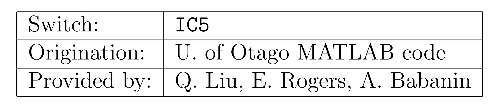

第五种表示海冰引起的波浪衰减的方法（IC5）由 Liu 等（2020）提出。该方法提供三种不同模型来估算衰减率 $k_i$，包括两个黏弹性（VE）梁模型（Mosig 等，2015）以及一个黏性模型（Meylan 等，2018）。

两个黏弹性模型分别为扩展的 Fox--Squire 模型（以下简称 EFS 模型；参见 Fox 和 Squire，1994）以及 Robinson--Palmer 模型（Robinson 和 Palmer，1990，以下简称 RP 模型）。这两种模型都将无限长的漂浮冰层描述为均质的黏弹性介质，其特性由两个经验流变参数表示，即冰层的弹性剪切模量 $G$ 和冰层的黏度 $\eta$。

在该理论框架下，色散关系被修正为（Mosig 等，2015）：

$$Qg\kappa\tanh(\kappa d)-\sigma^2=0 \tag{2.212}$$

其中，$d$ 为水深，$\kappa = k_r + i k_i$ 为冰--波耦合波的复波数。其实部 $k_r = 2\pi/\lambda$ 表征海冰对波长的影响，虚部 $k_i$ 表示波振幅的衰减率。

式 $(2.212)$ 中的 $Q$ 项，在 EFS 和 RP 模型中的表达为：

$$\begin{aligned} 
Q_{EFS}&=\frac{G_{\eta}h_{i}^{3}}{6\rho_{w}g}(1+\nu)\kappa^{4}-\frac{\rho_{i}h_{i}\sigma^{2}}{\rho_{w}g}+1,\\\\
Q_{RP}&=\frac{Gh_{i}^{3}}{6\rho_{w}g}(1+\nu)\kappa^{4}-\frac{\rho_{i}h_{i}\sigma^{2}}{\rho_{w}g}+1-i\frac{\sigma\eta}{\rho_{w}g}\end{aligned}\tag{2.214}$$

其中，$\rho_w$（$\rho_i$）分别为水（海冰）的密度，$h_i$ 为冰层厚度， $G_\eta = G - i \sigma \rho_i \eta$ 为复剪切模量，$\nu \simeq 0.3$ 为海冰的泊松比。

对于 EFS 模型，黏度参数 $\eta$ 的量纲为运动黏度（单位：$\text{m}^2\,\text{s}^{-1}$）；而在 RP 模型中，$\eta$ 表示单位面积、单位速度下的恒定黏性阻尼力（单位：$\text{kg}\,\text{m}^{-2}\,\text{s}^{-1}$；Meylan 等，2018）。

由于两种模型形式高度相似，式 $(2.213)$ 和 $(2.214)$ 可通过同一个求解器使用 Newton--Raphson 迭代方法进行计算（参见 Liu 等，2020，附录）。

通过详细的理论分析，Meylan 等（2018）指出，在假设 $k_r$ 与开阔水域波数 $k_0$ 的偏差不显著，且衰减率 $k_i$ 较弱的条件下，上述两种黏弹性模型预测：

$$k_i^{EFS}\propto\eta h_i^3\sigma^{11}\tag{2.215}$$

$$k_i^{RP}\propto\frac{\eta}{\rho_wg^2}\sigma^3\tag{2.216} $$

而既往的现场观测（例如 Meylan 等，2018）则支持幂律关系 $k_i \propto \sigma^{n}$，其中 $n$ 介于 2 和 4 之间。

式 $(2.215)$ 和 $(2.216)$ 表明，在某些特定条件下（即 $k_r \approx k_0$ 且 $k_i$ 较小），EFS 模型中的 $k_i$ 对波频率过于敏感，而 RP 模型中的 $k_i$ 则不随冰厚变化。

IC5 模块中包含的第三种模型基于 Meylan 等（2018，第 6.2 节）提出的 "Model with Order 3 Power Law"（以下简称 M2 模型）。该模型假设波能量损失与冰层的水平速度平方及冰厚成正比。其衰减率表示为：

$$k_i^{M2}=\frac{\eta h_i}{\rho_wg^2}\sigma^3 \tag{2.217}$$

其中，$k_i$ 与 $h_i$ 呈线性关系，这与 Doble 等（2015）在松饼冰条件下获得的现场观测结果类似。此处 $\eta$ 的单位为 $\text{kg}\,\text{m}^{-3}\,\text{s}^{-1}$。

与 IC3 类似，IC5 需要四个海冰参数作为输入：

- $C_{ice,1}$：冰厚 $h_i$（m）；
- $C_{ice,2}$：有效黏度 $\eta$（单位取决于所选模型，见上文）；  
- $C_{ice,3}$：冰密度 $\rho_i$（$\text{kg}\,\text{m}^{-3}$）；
- $C_{ice,4}$：有效剪切模量 $G$（Pa）。

Liu 等（2020）展示了 IC5 模块在两个案例研究中的应用。关于该冰模块的使用方法，可参阅该文献以及回归测试 ww3_tic1.1。

namelist SIC5 包含如下汇总参数：

IC5MINIG 允许的最小剪切模量 G；默认值=1 Pa（即不允许 G 为零）。
IC5MINWT 允许的最小波周期 T；默认值=0 s（即默认情况下，此选项不使用）。
IC5MAXKRATIO 允许的最大 kow/kr，其中 kow 为开水波数；默认值=1E9（即默认情况下，此选项不使用）。
IC5MAXKI 允许的最大 ki；默认值=100 m−1（即默认情况下，此选项不使用）。
IC5MINHW 允许的最小水深 d；默认值=0 m（即默认情况下，此选项不使用）。
IC5MAXITER 允许的最大迭代次数；默认值=100。
IC5VEMOD 要选择的海冰模型：1 - EFS，2 - RP，3 - M2；默认值=3（即选择 M2 模型）。

前 6 个参数用于提高 EFS 模型数值求解器的稳定性（在极少数情况下，尤其是在水深 $d$ 较浅且 $G$ 较低时，小波周期条件下求解器可能会失败；参见 Liu 等，2020）。不过，自 7.12 版本起，M2 模型已成为默认选项，因此这些限制参数在默认设置下不再使用。

### 2.4.6 Sis：海冰的漫散射（简单）

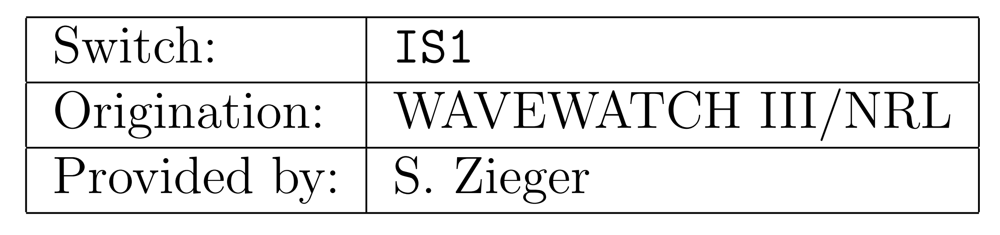

海冰对波浪的非守恒效应已在开关 IC1 至 IC3 中实现（见第 2.4.1--2.4.3 节）。

海冰的守恒效应则通过开关 IS1 实现，表示一种简单形式的散射过程。该方法假设浮冰尺寸小于网格尺度，并且入射波能量中的一部分 $\alpha_{ice}$ 被各向同性散射。

该比例通过海冰浓度 ICE 并采用简单的线性转换函数确定：

$$\alpha_{ice} = \max \{0, C_1 \text{ICE} + C_2\}\tag{2.218}$$

系数 $C_1$ 和 $C_2$ 可通过 namelist SIS1 中的参数 ISC1 和 ISC2 进行自定义设置。

在每一个离散频率和方向上，波能量会减少 $\alpha_{ice}$ 的份额，并在相同离散频率下重新分配到所有方向，以保证能量守恒。

### 2.4.7 $S_{is}$ ：取决于浮体尺寸的散射和耗散

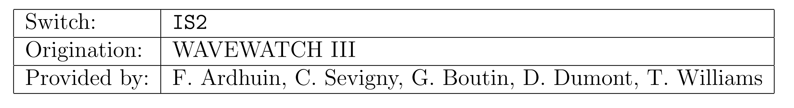

该散射项的实现总体遵循 Meylan 和 Masson（2006）的方法。在此基础上，增加了基于波浪导致海冰破碎的估算，从而能够更新最大浮冰直径。此外，还将基于蠕变机制的耗散过程与散射相结合。

散射源项由散射系数 $\beta_{\mathrm{is,MIZ}}(\theta - \theta')$ 定义。默认情况下，该系数为各向同性；但可通过在 namelist SIS2 中设置 IS2ISOSCAT = FALSE 来赋予其任意方向依赖性。因此，源项表示为：

$$\frac{S_{\mathrm{is}}(k, \theta)}{\sigma} = \int_{0}^{2\pi} \beta_{is,\text{MIZ}}(\theta - \theta')[s_{\text{scat}}N(k, \theta') - N(k, \theta)]~d\theta'\tag{2.219}$$

其中，$s_{scat}$ 默认取值为 $1.0$，但可以通过 namelist SIS2 中的参数 IS2BACKSCAT 进行修改。

散射系数 $\beta_{is,MIZ}$ 的确定基于理论反射系数 $\alpha_n(\sigma, h)$。该系数描述了在法向入射条件下，波浪从开阔水域半平面传播至具有恒定冰厚 $h$ 的覆冰水域半平面时的反射特性。

当 IS2WIM1 = 0 时， $\alpha_n(\sigma, h)$ 采用 Kohout 和 Meylan（2008）的计算结果；当 IS2WIM1 = 1 时，则采用 Bennetts 和 Squire（2012）的计算结果。这些 $\alpha_n(\sigma, h)$ 的数值已在模块 W3SIS2MD 中制表存储。

按照 Dumont 等（2011）的方法，破碎海冰被视为一系列这样的冰--水界面。在忽略多次反射的情况下，散射参数化假设网格单元中覆冰部分可表示为由平均直径 $D_m$ 的浮冰连续排列而成，并且每个浮冰均具有部分反射系数 $\alpha_n(\sigma, h)$。由此，单位时间内的衰减可表示为：

$$\beta_{\mathrm{is,MIZ}}=c_ic_g\alpha_n(\sigma,h)/D_m\tag{2.220}$$

其中 $c_i$ 是冰浓度。

平均浮冰直径 $D_m$ 的估算基于一个假设：直径为 $D$ 的浮冰数量满足幂律分布，与 $D^{-\gamma}$ 成正比。该幂律关系被假定在 $D_\mathrm{min}$ 至 $D_\mathrm{max}$ 的范围内成立。因此，其平均值可表示为：

$$D_m=\frac{\gamma}{\gamma-1}\times\frac{D_{\max}^{-\gamma+1}-D_{\min}^{-\gamma+1}}{D_{\max}^{-\gamma}-D_{\min}^{-\gamma}}\tag{2.221}$$

目前， $D_\mathrm{min}$ 为用户指定的数值。

$D_\mathrm{max}$ 可以作为外部强迫场输入，例如来自海冰模式或观测数据；或者当 namelist 参数 IS2BREAK = TRUE 时，根据局地波场对海冰的破碎作用进行估算。

如果 namelist 参数 IS2DUPDATE = TRUE，则即使波浪已减弱到不足以将海冰破碎至该尺度，较小的 $D_\mathrm{max}$ 数值仍会保持不变。当存在外部强迫或耦合（例如海冰模式中冰属性的平流过程）时，这通常是更合理的使用方式。相反，若 IS2DUPDATE = FALSE，则 $D_\mathrm{max}$ 将始终根据局地海况进行调整，即便这意味着增大 $D_\mathrm{max}$ 。

假设波长为 $\lambda$ 的波浪会将海冰破碎为直径为 $\lambda/2$ 的浮冰。在参数化方案中，当满足以下三个条件时，发生海冰破碎（Williams 等，2013）：

1.  $\lambda / 2\geq D_{\min }$ 和$\:\lambda/2\leq D_\max$

2.  $D_{\max}>D_{c}$ ，因为它存在一个临界直径，该直径取决于冰的支撑-极限值，低于该极限值不可能发生弯曲失效

3.  $\varepsilon>\varepsilon_c$ ，入射波引起的应变必须大于定义的临界应变

第一个判据仅用于检查新的 $D_{\mathrm{max}}$ 是否大于 $D_\mathrm{min}$ 且小于先前的 $D_{\mathrm{max}}$ 。

第二个判据基于 Mellor（1986）的理论，并采用 Boutin 等（2018）给出的修正，其中临界直径 $D_c$ 定义为：

$$D_c=\dfrac{1}{2}\left(\dfrac{\pi^4Y^*h^3}{48\rho g(1-\nu^2)}\right)^{1/4}\tag{2.222}$$

第三个判据对应于弯曲应变阈值。波浪引起的水平应变与冰层曲率有关。在一维情况下，应变表示为 $\varepsilon=0.5h\partial^2\eta_{\mathrm{i}ce}/\partial x^2$ 。应变方差表示为：

$$\langle\varepsilon^2\rangle=\left(\frac{h}{2}\right)^2\int_{k_1}^{k_2}k_{ice}^4F(k)~dk \tag{2.223}$$

其中，$h$ 为冰厚，$k_{ice}$ 为波数 $2\pi/\lambda_{ice}$。借鉴波浪破碎理论（Banner 等，2000），曲率方差的积分被限制在局地波数 $k_{ice}$ 附近进行。

此外，我们定义了一个有效的最小冰厚 $h_\mathrm{min}$ 。当 $h < h_\mathrm{min}$ 时，在计算应变方差时采用 $h = h_\mathrm{min}$ ，以避免模型中出现"不可破碎"的弹性薄冰，这种情况通常与实际观测不符。

因此， $D_\mathrm{max}$ 被取为满足下述判据的最短波长对应值的一半，即：

$$F_{break}\sqrt{\varepsilon^2}>\frac{\sigma_c}{Y^*}\tag{2.224}$$

其中，$\sigma_c$ 为海冰的抗弯强度。$F_{break}$ 为表示随机波效应的因子，可通过 namelist SIS2 中的参数 IS2BREAKF 进行调节。从理论上讲，它应当依赖于海冰受波浪作用的持续时间；基于 500 个服从 Rayleigh 分布波浪的典型最大值估算，取 $F_{break} = 3.6$。因此，$F_{break} E_s$ 表示随机波作用下的最大应变。

非弹性（anelastic）或非弹性耗散未包含在 ICn 中，而是在该程序中实现，因为其大小强烈依赖于浮冰尺度。按照 Boutin 等（2018）的处理方法，假定浮冰变形并非完全弹性，波浪引起的周期性应变与应力会导致波能以热的形式耗散。

冰层的周期性变形可能需要远大于重力势能的弹性能，但这一情况仅在海冰未发生破碎时成立。因此，若直接使用波面谱 $E(k)$，当海冰破碎或重新形成时，$E(k)$ 可能会出现显著变化。为此，更倾向于采用能量谱 $R C_g E(k) / C_{g,ice}$，其中 $R$ 为 Wadhams（1973）提出的系数，表示弹性能与重力势能之比。对于未破碎海冰，$R$ 为：

$$R=1+C_R\frac{4Y^*h^3\pi^4}{3\rho g\lambda^4(1-\nu^2)}\tag{2.225}$$

需要注意，Wadhams（1973）在定义中使用的冰厚为 $2h$。参数 $C_R$ 默认通过 namelist 参数 IS2BREAKE 设为 $1.0$，但也可以设为 $0$，以直接使用真实的波面谱。该因子 $R$ 同样应用于波浪导致海冰破碎的计算中。

默认情况下，启用非弹性耗散项（anelastic dissipation），通过 namelist 参数 IS2ANDISB = TRUE 激活。非弹性耗散指在波浪引起的循环应力作用下，位错振荡运动过程中转化为热量的能量损失。这种行为会在应力--应变图中表现为滞回现象，例如当海冰受到正弦应力作用时，如 Cole 等（1998）图 4 所示。

该文还提出了一种海冰非弹性行为模型，通过应力--应变关系可计算由滞回产生的椭圆面积。非弹性耗散被线性化表示为 $S_{ane} = -\alpha_{ane} E_{ice}$。

Boutin 等（2018）基于 Cole 等（1998）的模型，在单色应力条件下推导得到 $\alpha_{ane}$：

$$\alpha_{\text{ane}}=\dfrac{A}{6}\left(k_i^2\dfrac{Y^*}{(1-\nu^2)\rho gG}\right)^2h^3\dfrac{C_g}{GC_{g,i}}F_{\text{broken}}\tag{2.226}$$

其中，$F_{broken}$ 是一个启发式的平滑过渡函数，用于描述从未破碎海冰到破碎海冰的转变过程。因此，当波长远大于浮冰尺度时，耗散会逐渐趋近于零，因为在这种情况下海冰几乎不发生形变，也就不会产生波能耗散。

$$F_{\text{broken}}=\tanh\left(\frac{D_{\text{max}}-C_{\lambda}\lambda_{ice}}{D_{\text{max}}C_{smooth}}\right)\tag{2.227}$$

非弹性（或非弹性）耗散在更新 $D_\mathrm{max}$ 之后计算。该平滑过渡中的两个参数 $C_{\lambda}$ 和 $C_{smooth}$ 默认分别设为 $0.5$ 和 $0.4$ ，这是根据南大洋波浪数据校准得到的。它们可以通过 namelist 参数 IS2CREEPD 和 IS2CREEPC 进行修改。最后，$A$ 表示为：

$$A = \frac{4}{3}\sigma\alpha_{d}\delta D^{d}\frac{1}{\exp(\alpha_{d}s) + \exp(-\alpha_{d}s)}\tag{2.228}$$

其中各项的具体定义见本节末尾的表格。耗散强度由位错弛豫参数 $\delta D^d$ 控制。

另一种非弹性耗散形式可通过将 IS2ANDISB 设为 FALSE 来启用。在这种情况下，采用如下耗散表达式：

我们采用浮冰尺度分布定律：

$$\left(\frac{d\varepsilon}{dt}\right)_{ij} = \frac{\tau^{2}}{B^{3}}\sigma_{ij}'\tag{2.229}$$

$B$ 为浮冰定律常数，是冰温的函数。根据 Cole 等（1998）基于实验室试验得到的归一化参数，取 $A = 10^{11}$，并假设冰温均匀为 $270\,\text{K}$ 时，可得到 $B = 10^{7}\,\text{s}^{1/3}$。

体积耗散率表示为：

$$\frac{de}{dt} = |\sigma_{xx}^{4}/(2B)^{3}|\tag{2.230}$$

非弹性耗散被线性化表示为 $S_{\text{ine}} = -\alpha_{\text{ine}}E_{ice}$ 。系数 $\alpha_\mathrm{creep}$ 由 Wadhams（1973）的单色波公式改写而来，其表达式为：

$$\alpha_{\text{ine}} = 0.05Bh^{5}\left(\frac{Y^{*}}{2B(1-\nu^{2})}\right)^{4}I_{3}k^{4}\frac{C_{g}^{2}}{\rho gC_{g_{ice}}R^{2}}F_{\text{broken}}\int_{k_{1}}^{k_{2}}k_{\text{ice}}^{4}E(k)dk \tag{2.231}$$

其中 $I_{3} = \frac{1}{\pi}\int_{0}^{\pi}\sin^{4}\beta d\beta$ 和 $F_{\text{broken}}$ 已在上面定义。 Boutin 等人给出了计算的详细信息。 （2018）。

最后我们回顾一下下表中 IS2 中使用的各种模型参数。有些在 W3IS2MD 模块中定义为常量，其他可以使用 SIS2 namelist 进行调整。

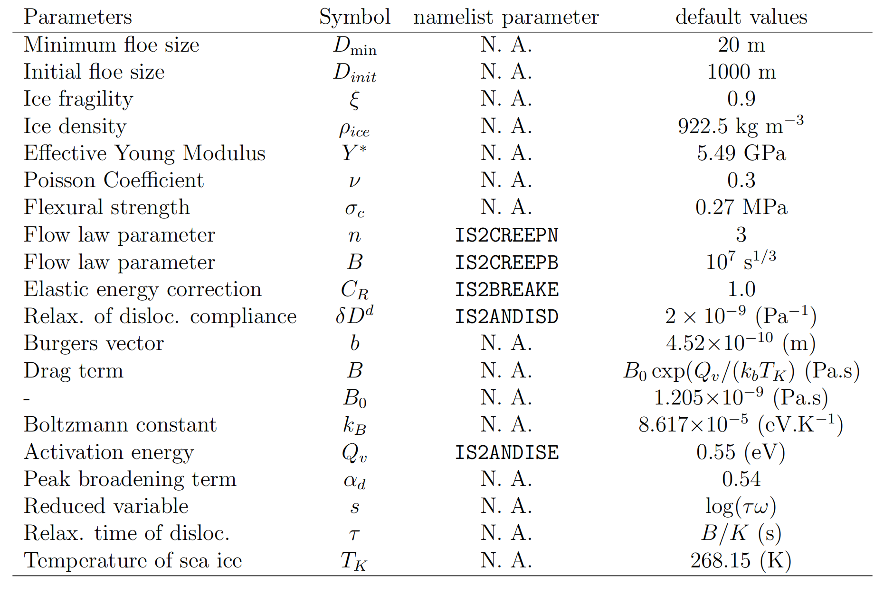

### 2.4.8 $S_{\text{ref}}$ : 海岸线和冰山的能量反射

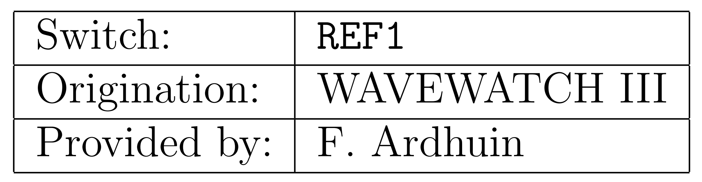

海岸线和冰山的波浪反射可通过启用开关 REF1 实现，并在 namelist REF1 中将参数 REFCOAST、REFSUBGRID 或 REFBERG 设为非零值。这些值表示目标反射系数 $R_0^2$（对应波能量）。

若同时启用开关 IG1，则海岸线处的能量源项还包括入射和出射方向上的自由次重力波（infragravity waves）。该源项的详细说明见第 2.4.9 节。

$R_0^2$ 还可以随波高和周期变化，采用类似 Miche 参数化的方法进行调节。该功能通过将 REFFREQ 设为非零值来激活，基于 Elgar 等（1994）的现场观测结果。

这些反射系数也可以设置为空间可变，通过将 REFMAP 设为非零值实现。在这种情况下，ww3_grid 会在读取 ww3_grid.inp 中的水深和障碍物信息之后，额外读取一行数据，用于定义海岸坡度分布图。该分布图中的数值将与 REFMAP 相乘。

海岸线的波浪反射率可从不足百分之一到约 50% 的入射波能量不等，并可能对方向谱结构以及原本受遮蔽区域的波浪气候产生重要影响（O'Reilly 等，1999）。此外，波浪反射对于海洋波浪产生地震噪声也具有重要意义。

由于反射涉及不同传播方向的波列，在类似 WAVEWATCH III 的模型中，其相互作用只能通过方程右端的源项来表示。不过，从物理上讲，它仍然与波浪传播过程紧密相关。

在实际计算中，对于规则网格和曲线网格，反射源项会将适当数量的能量注入反射方向，并在下一时间步通过传播过程移除该能量。在忽略近岸向流的情况下，其表达式为：

$$\mathcal{S}_{ref}(k,\theta)=\int R^{2}(k,\theta,\theta')\frac{C_{g}(k)}{\Delta A}\left[\cos(\theta-\theta_{q})\Delta q+\sin(\theta-\theta_{p})\Delta p\right]N(k,\theta')~\mathrm{d}\theta' $$

其中，$R^2$ 为能量反射系数，$\Delta p$ 和 $\Delta q$ 为网格两个方向上的网格间距，$\Delta A$ 为网格单元面积。基于陆海掩膜确定海岸线方向的方法见 Ardhuin 等（2011b）。该方法尚未在 SMC 网格上测试，且预计不适用于该类型网格。

对于非结构化网格，边界上出射方向的谱密度会直接设定为预期的反射值，边界条件由数值格式专门处理。

反射系数 $R^2$ 仅在满足 $\cos(\theta - \theta') < 0$ 的方向上取非零值。其幅值为反射系数 $R_0^2(k)$（对散射方向 $\theta$ 积分）与围绕镜面反射方向 $\theta_s$ 的方向分布函数 $R^2(\theta, \theta')$ 的乘积，即：

$$R^2(k,\theta,\theta')=R_0^2(k)R_2(\theta,\theta')\tag{2.233}$$

该方向分布函数有三种形式：

- 在与入射方向相反的所有方向上各向同性分布：适用于子网格岛屿、冰山或海岸线尖锐转角；

- 与 $\cos(\theta - \theta_s)^2$ 成正比：适用于中等坡度的海岸线；

- 与 $\cos(\theta - \theta_s)^n$ 成正比：适用于小坡度（近似直线）海岸线。

其中默认 $n = 4$，可通过 namelist REF1 中的参数 REFCOSP_STRAIGHT 修改为任意值。该参数化方法由 Ardhuin 和 Roland（2012）进行了详细描述。

对于冰山和子网格岛屿，反射能量会在与入射波方向相反的 $90^\circ$ 范围内均匀分布。对于已解析的陆地区域，根据局地点周围 8 个网格点的陆海分布状态（见图 2.2），定义一个垂直于岸线的平均方向 $\theta_n$。

对于每一个邻接陆地的模型网格点，通过对陆海几何关系的分析，可在 16 个可能方向中确定一个 $\theta_n$。结合任意入射波方向 $\theta_i$，可得到镜面反射方向 $\theta_r = 2\theta_n - \theta_i + \pi$。

对于每一个朝向海岸传播的谱分量（即满足 $\cos(\theta_i - \theta_n) > 0$），总反射能量为 $R^2$ 乘以入射能量。该反射能量 $R^2 E(f) M(f, \theta_i)$ 将围绕镜面反射方向 $\theta_r$ 重新分配，其分布形式与 $\cos^n(\theta - \theta_r)$ 成正比，其中指数 $n$ 取决于局地海岸线几何形态。

为此，根据图 2.2 所示的局地几何关系，将海岸线分为三类：

- 若邻域中有 3 个相连的陆地点（直线型海岸），取 $n = 2$；

- 若邻域中有 2 个陆地点（缓和转角），取 $n = 1$；

- 若在 4 个最近邻点中仅有 1 个陆地点（尖锐转角），取 $n = 0$，此时处理方式与子网格岛屿和冰山相同。

在 $0 \le n \le 2$ 范围内改变 $n$ 对结果影响较小。$n = 1$ 对应于 Lambert 型表面近似，该近似常用于粗糙表面的电磁波散射。若 $n \to \infty$，则对应纯镜面反射。

更严格的处理方法应考虑海岸线方向在海洋波长尺度（约 $100\,\text{m}$ 量级）上的分布特征。

<figure>
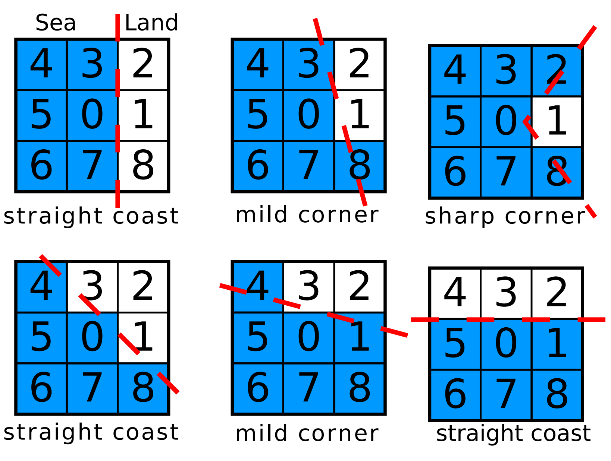
<figcaption aria-hidden="true">400</figcaption>
</figure>

图 2.2：基于陆海掩膜确定海岸线方向和几何形态的示意图。对于任意一个海洋网格点（编号 0，蓝色），只要其至少有一个相邻陆地点（白色），则利用其周围 8 个邻点（编号 1 至 8）来确定海岸线的几何形态。对于"缓和"转角和直线型海岸，利用估算得到的海岸线方向（虚线表示）来计算反射波能量的方向分布。

### 2.4.9 二阶谱和自由次重力波

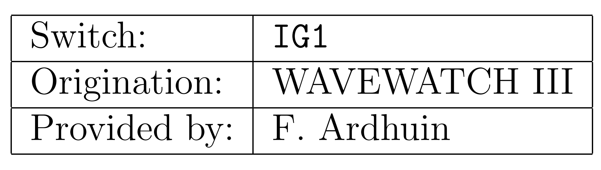

**警告**：在非结构化网格中，IG 波源项存在一个已知缺陷。目前将提供一个基于旧版本代码的模型补丁以修复该问题。

第 2.1 节中采用的线性色散关系对于大部分波能而言是良好的近似，但在高频部分（通常频率超过风海峰值频率的三倍，例如 Leckler，2013）仍存在显著的非线性谱能量。在浅水区域，谱的另一类强非线性成分出现在极低频段，被称为次重力波（infragravity waves）。

在水平均匀且底床平坦的条件下，低频与高频的非线性分量均可通过微扰理论由线性波谱估算（例如 Hasselmann，1962）。此外，均匀波场的非线性演化也更适合用这种"线性化谱"来描述。因此，在模型计算中使用"线性化谱"，并在后处理阶段将其转换为包含非线性分量的可观测谱，是一种实用做法。

一种常用的转换方法是 Krasitskii（1994）提出的正则变换（canonical transformation）。该变换的性质由 Janssen（2009）进一步研究，并在 ECMWF 版本的 WAM 模型中用于后处理。

由 P. Janssen 编写的正则变换代码已与 WAVEWATCH III 接口耦合。若启用开关 IG1 并在 namelist SIG1 中设置参数 IGADDOUTP = 2，则在输出点谱时将采用这种保持能量守恒的正则变换。若 IGADDOUTP = 1，则基于二阶理论（例如 Hasselmann，1962）将二阶谱叠加到模型谱上。该选项不守恒能量，并且在高频部分不一致，因为忽略了二阶谱中的准线性项（Janssen，2009）。

在与观测比较时，应注意不同观测仪器对非线性谱分量的响应不同。例如，随波漂移浮标同样会对谱进行线性化处理，且二阶压力场与二阶波面起伏之间并不满足线性波理论中的关系。因此，正则变换仅适用于在固定位置测量波面起伏的波浪仪。

当波场不再均匀时，波浪的非线性特性会导致不同模态之间的能量交换。在浅水区域，这通常表现为能量向次重力波转移，这些波在岸线附近释放并以自由波形式传播。开关 $IG1$ 允许通过多种参数化方法表示该过程。相较于需要在冲浪带以高空间分辨率求解双谱演化的完整水动力方法（例如 Herbers 和 Burton，1997），这些方法仍较为粗略。

默认 namelist 设置对应于 Ardhuin 等（2014）提出的参数化方案，并在 6.06 版本中做了小幅调整。其中，在 $E_b^{IG}(f)$ 的定义中，频率幂指数由 $f^{1.5}$ 改为 $f^{1.0}$，相应常数由 $0.015$ 调整为 $0.013$。

在实际计算中，自由次重力波能量通过源项 $S_{ref}$ 加入，可在 namelist SIG1 中将 IGSOURCE 设为 1 或 2。

第一种方法（IGSOURCE = 1）中，二阶谱通过 Hasselmann 微扰方法（IGMETHOD = 1）或正则变换（IGMETHOD 取其他值）计算，如 Janssen（2009）所述。该方法可能改进 IG 波能量的方向分布，但仍在测试中。

第二种方法（IGSOURCE = 2）中，自由 IG 谱由以下表达式给出：

$$\begin{equation}
A_{IG} = H_s T_{m0,-2}^2,
\tag{2.234}
\end{equation}$$

$$\begin{equation}
\widehat{E}_{IG}(f) = 1.2 \alpha_1^2 \frac{k g^2}{c_g 2 \pi f} \frac{(A_{IG}/4)^2}{\Delta_f} [\min (1., 0.013 Hz/f)]^{1.0},
\tag{2.235}
\end{equation}$$

$$\begin{equation}
\widehat{E}_{IG}(f,\theta) = \widehat{E}_{IG}(f)/(2 \pi),
\tag{2.236}
\end{equation}$$

其中平均周期定义为 $T_{m0,-2} = \sqrt{m_{-2}/m_0}$ 矩

$$\begin{equation}
m_n = \int_{f_{min}~\mathrm{Hz}}^{0.5 ~\mathrm{Hz}} E (f) ~f^n \mathrm{~d}f,
\tag{2.237}
\end{equation}$$

经验系数 $\alpha_1$ 的量级约为 $10^{-3}\ \mathrm{s}^{-1}$，由 SIG1 namelist 中的参数 IGEMPIRICAL 设定。

用于定义 $T_{m0,-2}$ 的最小频率 $f_{min}$ 由 namelist 参数 IGMAXFREQ 指定，同时它也是施加该能量源的 IG 频带上限频率。

此外，在该频带内，海岸处的 IG 能量可以叠加到已有能量之上，或者将已有能量重置为零。默认行为为后者，由参数 IGBCOVERWRITE = 1 控制。若选择其他设置（IGBCOVERWRITE = 0），则结果对允许的最大岸线反射系数非常敏感，该系数由 namelist REF1 中的参数 REFRMAX 定义。

最后，IG 能量也可以在频率高于 $f_{min}$ 的范围内加入。这是默认行为，通过设置 IGSWELLMAX = TRUE 激活。对于该部分 IG 波场，IG 波源项将被额外乘以一个 $1/4$ 的因子（该因子已在 w3ref1md.ftn 中硬编码）。这一设置应与最大反射系数（由 REF1 namelist 中的参数 REFRMAX 定义）相互协调调整。

在当前版本中，选项 IGSWELLMAX = TRUE 在非结构化网格上表现不佳。因此建议在此类网格中使用 IGSWELLMAX = FALSE。需要注意的是，这将导致 IG 频带与涌浪--风海频带之间出现一个谱隙。

## 2.5 海空过程

### 2.5.1 一般概念

WAVEWATCH III 中还提供了若干附加子程序，可用于耦合海洋--波浪或海洋--大气系统。这些子程序用于计算与海表波浪场相关的附加物理量，并将其传递给外部模型（例如海洋模式）。其主要目的是使外部模型能够考虑波浪对风应力及上层海洋湍流等过程的影响。

**海况依赖的海气通量**

海气动量通量（即总风应力）由两部分组成：一部分输入到表面波浪中，另一部分输入到次表层洋流中。未考虑表面重力波影响的耦合大气--海洋模式通常通过风速与风应力之间的经验关系（通过阻力系数 $C_d$）来计算总风应力。

所提供的 FLD 子程序允许基于 WAVEWATCH III 的波数--方向谱来计算总风应力，以供耦合数值模式使用。

在一阶近似下，总风应力等于以下两部分之和：

- 输入到表面波浪中的动量通量（即波浪形状阻力，form drag）
- 通过黏性应力直接输入到次表层洋流中的动量通量

输入到波浪中的动量通量可表示为波浪方差谱与波浪增长率（即动量吸收率）的乘积积分。

在计算波浪形状阻力时需要若干假设：

1.  **高频谱尾的影响**

波浪形状阻力在一阶上对高频波（即谱尾部分）的能量水平非常敏感。然而该频段在波浪模式中存在较大不确定性，因此在计算风应力时通常需要对其进行单独参数化。尤其在风速高于 $15\ \mathrm{m/s}$ 时，观测资料不足，对高频部分的约束较弱。

2.  **波浪增长率函数的假设**

波浪增长率历史上通常依据风速或风应力进行参数化，因此在增长率函数中需要引入经验系数，这些系数依赖于波长以及波向相对于风向和/或风应力方向的关系。

3.  **波浪形状阻力的反馈作用**

波浪形状阻力会影响波浪边界层（约为海气界面以上 10 米范围内）的湍流结构和风速剖面。这种反馈对风应力及平均风速剖面的影响程度尚未完全明确。

4.  **破碎与非破碎波的差异**

已知破碎波与非破碎波的增长率不同，但目前尚无简单方法能够在风应力计算模型中显式区分破碎与非破碎波的影响。因此，在现有 FLD 子程序中未对两类波的增长率作区分。

在一阶近似下，总海气动量通量可表示为：

$$\vec{\tau}=\vec{\tau}_\nu+\vec{\tau}_f \tag{2.238}$$

其中，$\vec{\tau}_\nu$ 为黏性应力向量，$\vec{\tau}_f$ 为波浪形状阻力。在海气界面处，波浪形状阻力可表示为所有波浪的动量通量贡献：

$$\vec{\tau}_f=\rho_w\int_{k_{min}}^{k_{max}}\int_{-\pi}^\pi\beta_g(k,\theta)\sigma F(k,\theta)d\theta\vec{k}dk \tag{2.239}$$

其中，$\rho_w$ 为水密度，$k$ 为波数，$\theta$ 为波向，$\sigma$ 为角频率，$\beta_g(k,\theta)$ 为增长率，$F(k,\theta)$ 为波方差谱，$k_{\min}$ 和 $k_{\max}$ 分别为贡献波的最小和最大波数。增长率的表达式根据模型中应用的理论而变化，在后续各理论描述中分别说明。

在风速超过 15 m/s 时，谱尾的水平在观测和理论上都没有很好约束。因此，FLD 子程序中谱尾水平采用经验参数化，使得平均阻力系数与建模系统中使用的标准整体阻力系数一致。这样，使用显式海况依赖风应力公式不会改变风应力的平均值，但应力会根据海况偏离平均值。假设谱尾水平仅为风速的函数，与海况无关。

### 2.5.2 海况相关 $\tau$ Reichl 等人 2014年

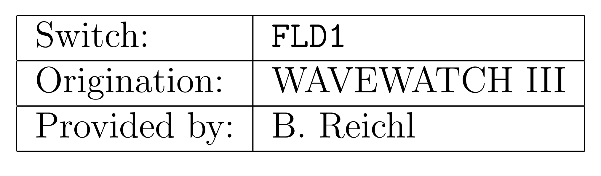

根据 Reichl（2014），总风应力在高度上保持恒定，但可分解为两个随高度变化的分量，表示为：

$$\vec{\tau}=\vec{\tau}_t(z)+\vec{\tau}_f(z)\tag{2.240}$$

其中，$\tau_t$ 为湍流应力，在靠近海面处等于黏性应力。波浪形状应力可表示为：

$$\vec{\tau}_f(z)=\rho_w\int_{k_{min}}^{k=\delta/z}\int_{-\pi}^\pi\beta_g(k,\theta)\sigma F(k,\theta)d\theta\vec{k}dk\tag{2.241}$$

即高度 $z$ 处的波浪形状应力等于对波数低于 $k = \delta / z$ 的波浪在海面处应力的积分，其中 $\delta/k$ 为波数 $k$ 波的内层高度（Hara 和 Belcher，2004）。该表达式假设波浪引起的应力从海面到内层高度显著，而在更高处可忽略不计。

$$\vec{\tau}=\vec{\tau}_\nu+\vec{\tau}_f(z=0)=\vec{\tau}_\nu+\rho_w\int_{k_{min}}^{k_{max}}\int_{-\pi}^\pi\beta_g(k,\theta)\sigma F(k,\theta)d\theta\vec{k}dk$$

$z$ 高度处的湍流应力可表示为：

$$\vec{\tau}_t(z)=\vec{\tau}_\nu+\rho_w\int_{k=\delta/z}^{k_{max}}\int_{-\pi}^{\pi}\beta_g(k,\theta)\sigma F(k,\theta)d\theta\vec{k}dk\tag{2.243}$$

在该模型中，假设内层高度 $z = \delta/k$ 处的湍流应力决定波数 $k$ 波的增长率：

$$\beta_g(k,\theta)=c_\beta\sigma\frac{|\tau_t(z=\delta/k)|}{\rho_wc^2}\cos^2(\theta-\theta_\tau)\tag{2.244}$$

其中， $\theta_\tau$ 为内层高度处湍流应力的方向。内层高度处的湍流应力取代总风应力用于计算增长率，因为长波会削弱对短波的有效风迫（波浪遮蔽效应）。增长率系数 $c_\beta$ 随波相速度与局地湍流摩擦速度（内层高度处摩擦速度） $u_{\star }^{l}= \sqrt {\tau _{t}( z= \delta / k) / \rho _{a}) }$ 的比值而变化。

$$c_\beta=\left\{\begin{array}{cll}25&:\cos(\theta-\theta_w)>0&:c/u_\star^l<10\\10+15\cos[\pi(c/u_\star-10)/15]&:&:10\leq c/u_\star^l<25\\-5&:&:25\leq c/u_\star^l\\-25&:\cos(\theta-\theta_w)<0\end{array}\right.$$

风剖面通过波浪边界层中的能量守恒约束显式计算。从黏性子层顶部到最短波的内层高度，风切变表示为：

$$\dfrac{d\vec{u}}{\partial z}=\dfrac{\rho_a}{\kappa z}\left|\dfrac{\vec{\tau}_\nu}{\rho_a}\right|^{3/2}\dfrac{\vec{\tau}_\nu}{\vec{\tau}_\nu\cdot\vec{\tau}_{tot}}\quad\text{for}\quad z_\nu<z<\delta/k_l\tag{2.246}$$

在最短波的内层高度与最长波的内层高度之间，风切变表示为：

$$\frac{d\vec{u}}{dz}=\left[\frac{\delta}{z^{2}} \tilde{F}_{w}\left(k=\frac{\delta}{z}\right)+\frac{\rho_{a}}{\kappa z}\left|\frac{\vec{\tau}_{t}(z)}{\rho_{a}}\right|^{3 / 2}\right] \times \frac{\vec{\tau}_{t}(z)}{\vec{\tau}_{t}(z) \cdot \vec{\tau}_{t o t}}~\text{for}~\delta / k_{l} \leq z\tag{2.247}$$

其中 $\tilde{F}_{w}\left(k=\delta / z\right)$ 是表面波吸收的能量

$$\tilde{F}_{w}\left(k=\delta / z\right)=\rho_{w} \int_{-\pi}^{\pi} \beta_{g}(k, \theta) g F(k, \theta) k ~d \theta  \tag{2.248}$$

最后，在最长波浪的内层高度之上，波浪效应可以忽略不计，风切变与风应力方向一致：

$$\frac{d \vec{u}}{d z}=\frac{u_{*}}{\kappa z} \frac{\vec{\tau}_{t o t}}{\left|\vec{\tau}_{t o t}\right|} \tag{2.249}$$

请注意，使用 FLD1 开关时，粘性应力、摩擦速度、表面粗糙度长度和 Charnock 参数的内部变量和输出值将被重新计算和覆盖。

### 2.5.3 取决于海况的 $\tau$ ：Donelan 等人。 2012 年

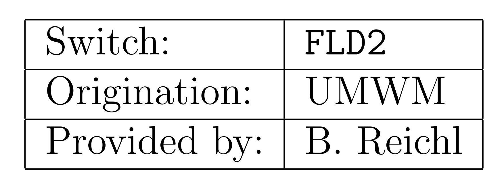

根据 Donelan（2012），式 (2.239) 中的增长率参数表示为：

$$\beta_{g}(k, \theta)=A_{1} \sigma \frac{\left[u_{\lambda / 2} \cos (\theta-\theta_{w})-c\right]\left[u_{\lambda / 2} \cos (\theta-\theta_{w})-c\right]}{c^{2}} \frac{\rho_{a}}{\rho_{w}}\tag{2.250}$$

$$A_1=\left\{\begin{array}{lll}0.11,&:u_{\lambda/2}\cos\theta>c,&\text{for wind forced sea}\\0.01&:0<u_{\lambda/2}\cos\theta<c,&\text{for swell faster than the wind}\\0.1&:\cos\theta<0,&\text{for swell opposing the wind}\end{array}\right.\tag{2.251}$$

其中，$A_1$ 为经验确定的比例系数（以使模型波谱与现场观测一致），$u_{\lambda/2}$ 为半波长高度处的风速（最高可达 20 m），$\theta_w$ 为风向，$c$ 为波相速度。风速通过粗糙表面的壁面定律计算：

$$u(z)=\frac{u_\star}{\kappa}\ln\left(\frac{z}{z_0}\right)\tag{2.252}$$

其中 $\kappa$ 是 von Kármán 系数（默认 0.4）。粘性应力是根据光滑表面的壁定律计算的。调整粘性阻力系数 $Cd_\nu$ 以考虑遮挡：

$$Cd'_{\nu}=\dfrac{Cd_{\nu}}{3}\left(1+\dfrac{2Cd_{\nu}}{Cd_{\nu}+Cd_{f}}\right)\tag{2.253}$$

其中， $Cd_f$ 为波浪形状阻力系数。黏性应力可表示为：

$$\vec{\tau}_{\nu}=\rho_{a}Cd_{\nu}^{\prime}\left|\mathbf{u_{z}}\right|\mathbf{u_{z}}\tag{2.254}$$

请注意，使用 FLD2 开关时，粘性应力、摩擦速度、表面粗糙度长度和 Charnock 参数的内部变量和输出值将被重新计算和覆盖。

注意，使用 FLD2 开关时，黏性应力、摩擦速度、表面粗糙长度和 Charnock 参数的内部变量及输出值会被重新计算并覆盖。

## 2.6 输出参数

波浪模式可以在模型的地理网格上输出参数，这些参数可以是积分参数，也可以是频率函数参数，每个频率对应一个网格。所有作为频率函数的参数（例如 EF 或 USF）需要在 OUTS namelist 中设置特定参数，该 namelist 在 ww3_grid.inp 或 ww3_grid.nml 中定义。这样做可在不需要这些参数时减少内存使用。

下面给出输出场参数的简要定义。参数定义表可在示例文件 ww3_shel.inp 的第 4.4.10 节找到。该输入文件还提供了标志列表，用于指示不同输出文件类型（ASCII、grib、igrads、NetCDF）是否可输出这些参数。关于这些参数如何计算的详细信息，可查阅 w3iogo 子程序在 w3iogomd.F90 模块中的实现。

在 ww3_shel.nml 或 ww3_shel.inp 中选择输出场最简单的方法是提供所需参数列表，例如 HS DIR SPR 将请求计算显著波高、平均方向和方向展宽。这些结果将存储在 out_grd.XX 文件中，可用于后处理，例如使用 ww3_ounf 处理 NetCDF 文件。示例在第 4.4.12 和 4.4.15 节给出。namelist 名称为加粗显示，例如 HS。

所有下列列出的参数都可在 ASCII 和 NetCDF 输出文件中获得。如果选择的输出文件类型为 grads 或 grib，则部分参数可能不可用。可用性在示例输入文件第 4.4.10 节的字段输出参数表中前两列标明。该表还给出所有参数的 WAVEWATCH III 内部代码标签、输出标签（ASCII 文件扩展名、NetCDF 变量名和基于 namelist 的选择）、以及参数的全称/定义。

当结果对谱中未解析部分（$f < f_{NK}$）的贡献不敏感时，谱尾的贡献采用幂律衰减参数化，默认 $E(f, \theta) = E(f_{NK}, \theta),(f_{NK}/f)^{-5}$。对于某些参数，这一处理可能不必要或具有误导性，积分仅计算到 $f_{NK}$。

最后，所有定义中的频率均为相对频率。因此，在存在洋流情况下，仅可与漂移观测数据或通过波数转换得到的频率数据比较。与固定仪器数据比较时，需要使用完整谱并进行适当的固定参考系转换。

### 2.6.1 强迫场

1)  DPT 平均水深（米）。这包括不同的水位。
2)  CUR 平均当前速度（矢量，m/s）。
3)  WND 平均风速（矢量，m/s）。这个风速是
    始终将速度作为模型的输入，即不针对
    当前速度。
4)  AST 海气温差 (°C)。
5)  WLV 水位。
6)  ICE 冰浓度。
7)  IBG 冰山引起的波浪衰减：该参数是与小冰山区域波浪能量损失相关的 e 折叠尺度的倒数（Ardhuin 等，2011b）。
8)  D50 沉积物中值粒径 ( $D_{50}$ )。
9)  IC1 冰厚度。
10) IC5 最大冰流直径， $D_{\text{max}}$ 。

### 2.6.2 标准平均波参数

1)  HS 有义波高 (m) \[见公式 2.29\]

$$H_s = 4 \sqrt{E}\tag{2.255}$$

2)  LM 平均波长 (m) \[见公式2.28\]

$$L_m = 2 \pi k^{-1}\tag{2.256}$$

3)  T02 平均波周期 (s) \[见公式 2.28\]

$$T_{m02}=2\pi/\sqrt{\overline{\sigma^2}}\tag{2.257}$$

4)  T0M1 平均波周期 (s) \[见公式 2.28\]

$$T_{m0,-1} = 2 \pi \overline{\sigma^{-1}}\tag{2.258}$$

5)  T01 平均波周期（s）\[见方程 2.28\]

$$T_{m0,1} = 2 \pi / \overline{\sigma}\tag{2.259}$$

6)  FP 峰值频率 (Hz)，使用围绕离散峰值的抛物线拟合从一维频谱计算得出。

7)  DIR 平均波向（度，气象惯例）

    $$\theta_m = \arctan \left( \frac{b}{a} \right)\tag{2.260}$$
    $$a = \int_0^{2 \pi} \int_0^\infty \cos(\theta) F(\sigma, \theta) ~d\sigma ~d\theta\tag{2.261}$$

    $$b = \int_0^{2 \pi} \int_0^\infty \sin(\theta) F(\sigma, \theta) ~d\sigma ~d\theta\tag{2.262}$$

8)  SPR 平均方向扩散（度；Kuik 等人，1988）

$$\sigma_{\theta}=\left[2\left\{1-\left(\frac{a^{2}+b^{2}}{E^{2}}\right)^{1/2}\right\}\right]^{1/2}\tag{2.263}$$

9)  DP 峰值方向 (degr.)，定义类似于平均方向，使用包含仅包含峰值频率的频谱 $F(k)$ 的频率/波数箱。

10) HIG 次重力高度。

11) MXE 最大表面高度（时空极限，STE）

12) MXES 最大表面标高的 St Dev (STE)

13) MXH 最大波高 (STE)

14) MXHC 距波峰最大波高 (STE)

15) MXC 极域 SDMH St Dev (STE)

16) MXHC (STE) 的 SDMHC St Dev

17) WBT 主浪破碎概率 $b_{T}$ (2.165)

18) TP 峰值波周期，由峰值频率 (FP) 的倒数得出。

### 2.6.3 光谱参数（前 5 个矩和波数）

所有这些参数都是频率的函数，因此它们是三维数组。由于内存使用量较大，这些参数的计算需要激活 OUTS 名单中的开关。

1)  EF Wave 频谱 ( $m^{2}/\mathrm{Hz}$ )

$$E(f)=2\pi\int F(\sigma,\theta)\mathrm{d}\theta\ \tag{2.264}$$

2)  TH1M 每个频率的平均方向（度；Kuik 等人，1988）
$$\theta_{1}(f)=\operatorname{atan}\left(\frac{b_{1}(f)}{a_{1}(f)}\right)\ \tag{2.265}$$

$$a_{1}(f)=2\pi\int_{0}^{2\pi}\int_{0}^{\infty}\cos(\theta)F(\sigma,\theta)\ \mathrm{d}\theta\ \tag{2.266}$$

$$b_{1}(f)=2\pi\int_{0}^{2\pi}\int_{0}^{\infty}\sin(\theta)F(\sigma,\theta)\ \mathrm{d}\theta\ \tag{2.267}$$

3)  STH1M 每个频率的第一个定向扩展 (degr.; )

$$\sigma_{1}(f)=\left[2\left\{1-\left(\frac{a_{1}(f)^{2}+b_{1}(f)^{2}}{E(f)^{2}}\right)^{1 / 2}\right\}\right]^{1 / 2}\tag{2.268}$$

4)  TH2M 从 $a_{2}$ 和 $b_{2}$ 开始的平均方向（度）

$$\theta_{2}(f)=\operatorname{atan}\left(\frac{b_{2}(f)}{a_{2}(f)}\right)\tag{2.269}$$
$$a_{2}(f)=2 \pi \int_{0}^{2 \pi} \int_{0}^{\infty} \cos (2 \theta) F(\sigma, \theta) \mathrm{d} \theta\tag{2.270}$$

$$b_{2}(f)=2 \pi \int_{0}^{2 \pi} \int_{0}^{\infty} \sin (2 \theta) F(\sigma, \theta) \mathrm{d} \theta\tag{2.271}$$

5)  STH2M 从 $a_{2}$ 和 $b_{2}$ 定向传播（度）

$$\sigma_{2}(f)=\left[0.5\left\{1-\left(\frac{a_{2}(f)^{2}+b_{2}(f)^{2}}{E(f)^{2}}\right)^{1 / 2}\right\}\right]^{1 / 2}\tag{2.272}$$

6)  WN 波数 $k(\sigma)$ (rad/m)

$$\sigma^{2}=g k \tanh (k D)\tag{2.273}$$

### 2.6.4 谱分区参数

这些输出参数基于将频谱划分为各个波场。

1)  PHS 频谱分区的波高 $H_{s}$ （见下文）。
2)  频谱分区的 PTP 峰值（相对）周期（抛物线拟合）。
3)  PLP 光谱分区的峰值波长（来自峰值周期）。
4)  PSP 频谱分区的平均方向。
5)  频谱划分的定向扩展 Cf 等式（2.263）。
6)  PWS 风海频谱划分部分。使用 Hanson 和 Phillips (2001) 的方法，按所述实施

这样，就引入了"风海分数" $W$

$$W = E^{-1} E|_{U_p > c} \tag{2.274}$$

其中 $E$ 是总谱能量， $E|_{U_p > c}$ 是谱中预测风速 $U_p$ 大于局部波相速度 $c=\sigma/k$ 的能量。后者定义了频谱中受风直接影响的区域。为了允许非线性相互作用将该边界移至较低频率，并随后在该区域内形成完全生长的风海， $U_p$ 包含一个乘数 $C_{mult}$

$$U_p = C_{mult} U_{10} \cos(\theta - \theta_w) \tag{2.275}$$

乘数可由用户设置。默认值为 $C_{mult} = 1.7$ 。

7)  PDP 光谱分区的峰值方向。
8)  PQQ Goda 光谱分区的峰值。
9)  PPE JONSWAP 光谱分区的峰值增强因子。它是光谱峰值相对于相应皮尔森和莫斯科维茨光谱峰值的放大程度的度量。
10) PGW 频谱分区的高斯频率宽度 (Hz)。高斯谱与一维谱分区的最小二乘拟合。
11) PSW 光谱分区的光谱宽度 (Longuet-Higgins, 1984)
12) PTE 频谱分区的波能周期 \[见方程 2.258\]
13) PT1 频谱分区的平均波周期 \[见方程 2.259\]
14) PT2 波频谱分区的过零周期 \[参见方程 2.257\]
15) PEP Wave 分区峰值谱密度
16) TWS 整个频谱中的风海部分。
17) PNR 频谱中找到的分区数。


### 2.6.5 大气波层

1)  UST 摩擦速度 $u_*$ （标量）。定义取决于所选源项参数化 (m/s)。另一种载体
    压力版本可用于研究（需要用户干预代码）。

2)  海气摩擦力的 CHA Charnock 参数（无量纲）

3)  CGE 能量通量 (W/m)

$$C_g E = \rho_w g \overline{C_g} E\tag{2.276}$$

4)  FAW 风浪能通量
5)  TAW 净波浪支撑应力（风向波浪动量通量）
6)  TWA 波浪支撑应力的负部分
7)  WCC Whitecap 覆盖范围（无尺寸）
8)  WCF 波浪到风动量通量
9)  WCH 白浪平均厚度 (m)
10) WCM 平均破波高度（米）（尚不可用）

### 2.6.6 波浪海洋层

1)  SXY 辐射应力

$$S_{xx} = \rho_w g \iint (n - 0.5 + n \cos^2 \theta) F(k, \theta) \, dk ~d\theta\tag{2.277}$$
$$S_{xy} = \rho_w g \iint n \sin \theta \cos \theta F(k, \theta) \, dk ~d\theta\tag{2.278}$$

$$S_{yy} = \rho_w g \iint (n - 0.5 + n \sin^2 \theta) F(k, \theta) \, dk ~d\theta\tag{2.279}$$

其中

$$n = \frac{1}{2} + \frac{k d}{\sinh 2 k d}\tag{2.280}$$

2)  两个波浪到海洋动量通量 ( $\mathrm{m}^2/\mathrm{s}^2$ )

3)  BHD 伯努利头 ( $\mathrm{m}^2/\mathrm{s}^2$ )

$$J = g \iint \frac{k}{\sinh 2 k d} F(k, \theta) \, dk ~d\theta\tag{2.281}$$

4)  FOC 波浪到海洋能量通量 (W/$\mathrm{m}^2$ )

5)  TUS 斯托克斯体积传输 ( $\mathrm{m}^2/\mathrm{s}$ )

$$(M_x^w, M_y^w) = g \iint \frac{(k \cos(\theta), k \sin(\theta))}{\sigma} F(k, \theta) \, dk ~d\theta\tag{2.282}$$

6)  USS 海面漂流 (m/s)

$$(U_{ssx}, U_{ssy}) = \iint \sigma \cosh 2kd \frac{(k\cos(\theta), k\sin(\theta))}{\sinh^2 kd} F(k, \theta) ~dk ~d\theta\tag{2.283}$$

7)  P2S 二阶压力方差 ( $m^2$ ) 和该压力的峰值周期 (s)，对声学和地震噪声有贡献，

$$F_{p2D}(k=0) = \int_0^\infty \frac{4\sigma}{C_g} \int_0^\pi F(k, \theta) F(k, \theta + \pi) d\theta ~dk\tag{2.284}$$

8)  USF 海面 Stokes 漂移频谱 (m/s/Hz)

$$(U_{ssx}(f), U_{ssy}(f)) = \int \sigma \cosh 2kd \frac{(k\cos(\theta), k\sin(\theta))}{\sinh^2 kd} F(k, \theta) \frac{2\pi}{C_g} d\theta\tag{2.285}$$

请注意，必须在 ww3_grid.inp OUTS 名称列表中设置 US3D=1，才能激活 USF 输出所需的 3D 数组。

9)  P2L 二阶压力频谱 ( $m^2$ s)，它对声学和地震噪声有贡献，

$$F_{p2D}(k=0, f) = \frac{2\sigma}{\pi} \int_0^\pi \frac{4\pi^2}{C_g^2} F(k, \theta) F(k, \theta + \pi) d\theta\tag{2.286}$$

10) TWI 波浪对海冰应力

11) FIC 波浪到海冰的能量通量

12) USP 表面斯托克斯漂移分为运行时定义的频率分量 (m/s)

$$(U_{ssp}, V_{ssp})(n) = \iint_{k_n} \sigma \cosh 2kd \frac{(k\cos(\theta), k\sin(\theta))}{\sinh^2 kd} F(k, \theta) dk d\theta\tag{2.287}$$

分区 $k_n$ 的数字 $n$ 和中心波数是"运行时"的，因为它们是在 ww3_grid.inp 生成的模型定义文件中定义的（有关设置这些量的详细信息，请参阅示例输入文件）。每个 $n$ 分区的波数积分范围划分模型波谱以适应 $k_n$ 的规定值。

13) TOC 总海洋压力 (Pa)

$$\tau_{oc} = \tau_a - \tau_{aw} + \tau_{woc}\tag{2.288}$$

### 2.6.7 波底层

1)  ABR 近底均方根偏移幅度

$$a_{b, rms} = \left[2 \iint \frac{1}{\sinh^2 kd} F(k,\theta) dk d\theta\right]^{1/2}\tag{2.289}$$

2)  UBR 近底均方根轨道速度

$$u_{b, rms} = \left[2 \iint \frac{\sigma^2}{\sinh^2 kd} F(k,\theta) dk d\theta\right]^{1/2}\tag{2.290}$$

3)  BED 床形参数：波纹高度和方向（尚未测试）
4)  WBBL 中的 FBB 能量耗散
5)  TBB WBBL 动量损失

### 2.6.8 频谱参数

1)  MSS $u$ 和 $c$ 方向的均方斜率（斜率方差的下波和横波分量）。
2)  MSC 频谱尾电平（无尺寸）
3)  MSD 最大斜率方差的方向 mss $_u$
4)  MCD 谱尾方向
5)  QP 峰值参数 (Goda, 1970)

$$Q_p = \frac{2}{E^2} \int_0^{f_{NK}} f \left(\int_0^{2\pi} F(f,\theta) d\theta\right)^2 df \tag{2.291}$$

6)  QKK 波数峰值（De Carlo 等人，2023）

$$Q_{kk} = \frac{1}{E^2} \int_0^{f_{NK}} \int_0^{2\pi} 0.5 \left[A(k,\theta) + A(k,\theta+\pi)\right]^2 \frac{\sigma^2}{kC_g} \mathrm{~d}\theta \mathrm{~d}\sigma\tag{2.292}$$

7)  SKW 以零斜率采样的表面高程的偏度。这是在 ? 中定义的 $\lambda_1$ 参数。或 Sroczak (1986) 中的 $\lambda_{3,0,0}$ 。它是使用 P. Janssen 的 ECWAM 代码对表面高程进行二阶校正计算得出的。

8)  EMB 为 $-\gamma/8 = -(\lambda_{1,2,0} + \lambda_{1,0,2} - 2\lambda 0,1,1\lambda 1,1,1)/8(1-\lambda_{0,1,1}^2)$ ，因此斜率为零的点的平均海平面为 EMB $\times H_s$ 。

9)  EMC 这是附加跟踪器偏差系数，等于 $-\lambda_{3,0,0}/24$ ，特定于重跟踪器的选择，请参阅？中的 $J_z$ 函数。

### 2.6.8 数值诊断

1)  DTD 源项积分中的平均时间步长。
2)  FC 截止频率$f_c$（Hz，取决于输入和耗散的参数化）。
3)  CFX 空间平流最大 CFL 数
4)  CFD 角平流的最大 CFL 数
5)  CFK 波数平流的最大 CFL 数

### 2.6.9 用户定义

1)  U1 用于用户定义参数的插槽（需要修改代码）。
2)  U2 同上。

## 2.7 导出参数

### 2.7.1 方向斜率和近最低点反向散射

在线性波假设下，表面斜率是高斯的，并且完全由均方斜率张量 $\text{mss}_x$ 、 $\text{mss}_y$ 、 $\text{mss}_{xy}$ 规定。在 WAVEWATCH III 中，计算的 $\text{mss}$ 参数是下行波 $\text{mss}_u$ （方向由 $\text{mss}_d$ 给出）和交叉波 $\text{mss}_c$ （位于垂直维度）。

因此，在将 $\text{mss}_d$ 转换为弧度后，由波模型解析的（长）波的均方斜率张量由下式给出

$$\text{mss}_{x,\text{long}} = \text{mss}_u \cos^2(\text{mss}_d) + \text{mss}_c \sin^2(\text{mss}_d)\tag{2.293}$$


$$\text{mss}_{y,\text{long}} = \text{mss}_u \sin^2(\text{mss}_d) + \text{mss}_c \cos^2(\text{mss}_d)\tag{2.294}$$


$$\text{mss}_{xy,\text{long}} = 0.5 (\text{mss}_u - \text{mss}_c) \sin(2\text{mss}_d)\tag{2.295}$$

对于与观测数据（如近天顶光学或雷达散射功率 $\sigma_0$ ，包括高度计、GPM 或 CFOSAT/SWIM 数据）比较，应将高于模式最大频率的短波贡献加到这些均方坡度上。

### 2.7.2 斯托克斯漂移剖面

表面斯托克斯漂移的频谱有两个组成部分：

计算为

    usf( IK) = SUM( E( IK, ITH) * ECOS( ITH) * DTH( ITH) 
    )*DK(IK)*2*WN(IK,ISEA)*FACT(KD)/DF(IK)
    vsf(IK)=SUM( E(IK,ITH)*ESIN(ITH)*DTH(ITH)
    )*DK(IK)*2*WN(IK,ISEA)*FACT(KD)/DF(IK)

其中 WN 是波数，FACT(KD) 是非维水深。

从该频谱来看，任意深度 z 处的斯托克斯漂移均计为正值，从参考 z = 0 向上，由下式给出

    Us(z)= SUMIK=I1,I2 ( usf(IK) * FACT2(z,KD)*DF(IK)) Vs(z)=
    SUMIK=I1,I2 ( vsf(IK) * FACT2(z,KD)*DF(IK))

这需要了解当地的水深 D 和平均海平面 LEV 以及波数 WN (IK)。因此，KD=D\*WN (IK) 是频率/波数索引 IK 的局部函数。系数 FACT2 (z, KD) 当 KD \> 6 时等于 EXP (2\*WN (IK)\*(z-LEV))，否则

    FACT2 (z, KD)=COSH (2*WN (IK)*(z+H))/COSH (2*WN (IK)*D)

# 3 数值方法

笛卡尔坐标系 (2.8) 或球坐标系 (2.12) 下的波作用量方程是波浪模式的基本方程。然而，在模型中使用的是这些方程的修正形式，其中：

(a) 方程在可变波数网格上求解（见下文）；  
(b) 在某些数值格式中，为了正确描述离散方程的色散特性，采用了修正形式（见第 3.4 节）；  
(c) 考虑了子网格尺度障碍物（如岛屿）的影响（见第 3.4 节）。

## 3.1 谱离散

如果直接求解式 (2.8) 或式 (2.12)，在浅水中会出现有效谱分辨率降低的问题（Tolman 和 Booij，1998）。若在可变波数网格上求解该方程，则可避免这种分辨率损失，因为该网格隐式包含了由于变浅（shoaling）引起的运动学波数变化。这样的波数网格对应于相对频率上的时空不变网格（Tolman 和 Booij，1998）。

相应的局地波数网格可由不变频率网格和色散关系 (2.1) 直接计算得到，因此成为局地水深 $d$ 的函数。

为便于高效计算 $S_{\mathrm{nl}}$ 并实现对涌浪频率的良好分离，采用频率按指数递增的离散方式，使频率分辨率与局地频率成正比：

$$\sigma_{m+1}=X_\sigma\sigma_m \tag{3.1}$$

其中，$m$ 为波数空间中的离散网格计数器。$X_\sigma$ 由用户在程序输入文件中定义。在多数第三代模式应用中，通常取 $X_\sigma \simeq 1.1$。

下面仅讨论空间变化网格对笛卡尔形式方程 (2.8) 的影响，推广到球坐标形式是直接的。将可变波数网格记为 $\kappa$，则平衡方程写为：

$$\begin{aligned}\frac{\partial}{\partial t}\frac{N}{c_g}+\frac{\partial}{\partial x}\frac{\dot{x}N}{c_g}+\frac{\partial}{\partial y}\frac{\dot{y}N}{c_g}+\frac{\partial}{\partial\kappa}\frac{\dot{\kappa}N}{c_g}+\frac{\partial}{\partial\theta}\frac{\dot{\theta}N}{c_g}=\frac{S}{\sigma c_g}\end{aligned}
\tag{3.2}$$

$$\begin{aligned}\dot{\kappa}\frac{\partial k}{\partial\kappa}=c_g^{-1}\frac{\partial\sigma}{\partial d}\left(\frac{\partial d}{\partial t}+\mathbf{U}\cdot\nabla_xd\right)-\mathbf{k}\cdot\frac{\partial\mathbf{U}}{\partial s}\end{aligned}\tag{3.3}$$

## 3.2 波作用量方程的分裂

在 WAVEWATCH III 中，式 (3.2) 采用分步（fractional step）方法求解。

第一步处理水深的时间变化以及相应的波数网格变化。正如 Tolman 和 Booij（1998）所讨论的，这一步可以不频繁调用。通过将（水位）时间变化的影响分离出去，网格保持不变，而水深在后续分步中可视为准稳态。

其余分步分别处理空间传播、谱内传播以及源项。自 5.10 版本起，源项 $S$ 进一步分解为无冰源项 $S_{no\ ice}$ 和冰源项 $S_{ice}$。

对于单一模型网格，W3WAVE 例程按如下顺序进行积分：

1.  水位更新  
2.  谱内传播第 1 步：在 $\Delta t_g/2$ 时间内对

$$\frac{\partial}{\partial t}\frac{N}{c_g}+\frac{\partial}{\partial \kappa}\frac{\dot{\kappa}N}{c_g}+\frac{\partial}{\partial \theta}\frac{\dot{\theta}N}{c_g}=0  $$

进行积分

3.  空间传播：在 $\Delta t_g$ 时间内对

$$\frac{\partial}{\partial t}\frac{N}{c_g}+\frac{\partial}{\partial x}\frac{\dot{x}N}{c_g}+\frac{\partial}{\partial y}\frac{\dot{y}N}{c_g}=0  $$

进行积分

4.  谱内传播第 2 步：在 $\Delta t_g/2$ 时间内对

$$\frac{\partial}{\partial t}\frac{N}{c_g}+\frac{\partial}{\partial \kappa}\frac{\dot{\kappa}N}{c_g}+\frac{\partial}{\partial \theta}\frac{\dot{\theta}N}{c_g}=0  $$

进行积分

5.  无冰源项积分：在 $\Delta t_g$ 时间内对

$$\frac{\partial}{\partial t}\frac{N}{c_g}=\frac{S_{no,ice}}{\sigma c_g}  $$

进行积分

6.  冰源项积分：在 $\Delta t_g$ 时间内对

$$\frac{\partial}{\partial t}\frac{N}{c_g}=\frac{S_{ice}}{\sigma c_g}  $$

进行积分

这 6 个步骤的连续执行在 $\Delta t_g \to 0$ 的极限下，等价于在一个全局时间步长 $\Delta t_g$ 上对式 (3.2) 的积分。将方程分裂为多个步骤既有利于高效的向量化计算，也有利于并行化处理。此外，时间分裂还允许在不同分步中采用独立的部分时间步长或动态调整的时间步长。

WAVEWATCH III 区分 4 种不同的时间步长。

1.  "全局"时间步长 $\Delta t_g$ 是所有分步子积分的公共时间步。从这个意义上讲，它是能够得到物理上有意义解的最小时间步长，因为方程中的所有项都已在该时间步上完成积分。因此，该时间步可用于模型输出评估或与其他模型耦合；在多重网格系统中，它也是网格之间进行通信的时间步。在强迫（而非耦合）模式下，输入的风场和流场在该全局时间步上进行插值。该时间步由用户在 ww3_grid 输入文件中给定，但模型内部可根据所需输入或输出时间进行缩减。

2.  第二种时间步长为空间传播时间步。对于基于三角形的网格不使用该时间步，因为在显式格式下，平流步骤会针对每个谱分量在模型内部自动调整。对于其他类型网格，用户需给定一个参考的最低模型频率下的最大传播时间步 $\Delta t_{p,r}$（假设无流且网格不移动）。对于频率计数器为 $m$ 的频率，其最大时间步 $\Delta t_{p,m}$ 在模型中计算为：

$$\Delta t_{p,m}=\frac{\dot{x}_{p,r}}{\dot{x}_{p,m}}\Delta t_{p,r}\tag{3.4}$$

其中，$\dot{x}_{p,r}$ 为在无流且无网格移动情况下最长波的最大平流速度，$\dot{x}_{p,m}$ 为频率 $m$ 的实际最大平流速度（包括流速）。若传播时间步小于全局时间步 $\Delta t_g$，则传播过程通过多个连续的小时间步完成。这通常意味着最低频率需要多个部分时间步，而最高频率可在 $\Delta t_g$ 内通过一次计算完成。后者显著提高了模型效率，尤其是在采用高阶精度传播格式时。注意，$\Delta t_{p,m}$ 也可设定为大于 $\Delta t_g$，在存在（强）流的情况下，这可能对计算效率产生影响。

3.  第三种时间步长为谱内传播时间步。对于大尺度深水网格，该时间步通常可取为全局时间步 $\Delta t_g$。对于浅水网格，较小的谱内传播时间步可在满足格式稳定性约束的前提下增强折射效应。需注意，为提高数值精度，空间传播与谱内传播的调用顺序会交替进行。若长周期涌浪发生强折射，可能导致平均波参数出现明显起伏。可通过将该时间步设为 $\Delta t_g$ 的偶数分之一来避免此问题。

4.  最后一种时间步为源项积分时间步。该时间步针对每个网格点和每个全局时间步 $\Delta t_g$ 动态调整（见第 3.6 节）。这在风浪条件快速变化时可提高计算精度，在缓慢变化条件下则更具计算效率。为限制计算时间，用户需定义一个最小时间步。

以下各节将分别讨论分步方法中的各个步骤及相关问题。主要内容包括：第 3.3 节（水深时间变化处理）、第 3.4 节（空间传播）、第 3.5 节（谱内传播）、第 3.6 和 3.7 节（无冰与冰源项的数值积分）。其他章节还涉及附加数值方法与技术，包括风和流的处理（第 3.9 节）、潮汐（第 3.10 节）、时空极值计算（第 3.11 节）、冰的处理（第 3.8 节）、谱分区及波系的时空追踪（第 3.12、3.13 节），以及嵌套（第 3.14 节）。

## 3.3 水深的时间变化

水深的时间变化会导致局地波数网格的改变。由于波数谱对水深的时间变化保持不变，这相当于将谱从旧网格简单插值到新网格，而谱形状不发生改变。如前所述，新网格由全局不变的频率网格、新的水深 $d$ 以及色散关系式 (2.1) 直接确定。水位更新时间步通常由水位变化的物理时间尺度决定，而非数值稳定性约束（Tolman 和 Booij，1998）。

向新波数网格的插值采用简单的守恒插值方法。首先将旧谱乘以谱区间宽度，转换为离散作用量密度。然后通过常规线性插值方式将该离散作用量重新分配到新网格上。随后再除以新的谱区间宽度，将新的离散作用量转换回谱形式。

由于旧网格通常不能完全覆盖新网格，因此在高频和低频端需要对原谱进行参数化延拓。在旧谱中低波数但新网格无法解析的能量/作用量将被移除；在新网格中低波数但旧网格未解析的部分，假定能量/作用量为零；在新网格高波数端，如有需要，则采用常规参数化谱尾。后一种修正较少发生，因为最高波数通常对应深水条件。

在实际应用中，网格修改通常只影响少量网格点。为避免不必要的计算，仅当离散谱中最小相对水深 $kd$ 小于 4 时才进行网格转换。此外，仅当网格点未被海冰覆盖，且最大波数变化至少为 $0.05\Delta k$ 时才进行谱插值。

## 3.4 空间传播

### 3.4.1 基本概念

WAVEWATCH III 中的空间传播由式 (3.2) 的前几项描述。对于球坐标形式 \[式 (2.12)\]，对应的空间传播步骤为：

$$\frac{\partial\mathcal{N}}{\partial t}+\frac{\partial}{\partial\phi}\dot{\phi}\mathcal{N}+\frac{\partial}{\partial\lambda}\dot{\lambda}\mathcal{N}=0 \tag{3.5}$$

其中，传播量 $\mathcal{N}$ 定义为 $\mathcal{N} \equiv \mathcal{N} c_g^{-1}\cos\varphi$ 。对于笛卡尔网格，相应形式为 $\mathcal{N} \equiv \mathcal{N} c_g^{-1}$ 。本节仅给出较为复杂的球坐标形式方程，转换为笛卡尔坐标通常更为简化且直接。

式 (3.5) 在形式上与传统深水传播方程相同，但同时包含有限水深和流的影响。在陆海边界处，假设向陆地方向传播的波作用量被吸收而不发生反射；而从海岸向外传播的波在海岸线处被视为无能量。对于所谓的"活动边界点"（即规定边界条件的边界点），采用类似处理方法：向边界传播的作用量被吸收，而边界点处的作用量用于估算向模型内部传播分量的作用量通量。

空间网格可采用两种坐标系统：一种为"平面"笛卡尔坐标系，通常用于小尺度或理想化测试；另一种为球坐标（经纬度）系统，用于大多数实际应用。在模型 3.14 版本中，坐标系统在编译时通过 XYG 或 LLG 开关选择。在较新的版本中，网格类型作为变量在 ww3_grid 中定义，并存储于 mod_def.ww3 文件。

对于球坐标网格，可选择简单闭合方式，即在经度方向上周期性闭合，例如能量可从最大经度向东传播至最小经度。这种闭合称为"简单"，因为纬度索引在该"接缝"处不发生变化。还允许"非简单"闭合方式，与三极网格相关。三极网格属于不规则网格类型，其闭合方式将在第 3.4.3 节进一步讨论。

在 3.14 版本之前，WAVEWATCH III 仅支持规则离散网格，即两个主轴 $(x,y)$ 采用固定间距 $\Delta x$ 和 $\Delta y$ 离散。在 7.14 版本中，新增了曲线网格和非结构网格等选项。下文将介绍这些网格方法，随后讨论其他传播相关问题，包括喷灌效应（3.4.6）、连续移动网格（3.4.8）、未解析岛屿（3.4.7）以及旋转网格（3.4.9）。

### 3.4.2 传统规则网格

传统规则网格的传播格式在编译时通过开关选择。WAVEWATCH III 提供了多种传播格式。下文将按复杂程度依次进行说明。

#### First-order scheme

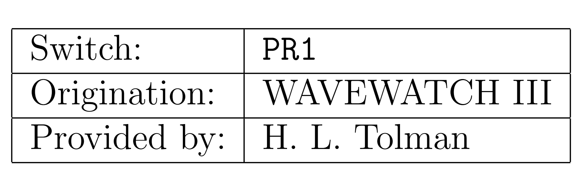
提供了一种简单且计算量低的一阶迎风格式，主要用于 WAVEWATCH III 开发阶段的测试。为保证作用量的数值守恒，采用通量或控制体积形式。在 $\phi$ 空间中，计数器为 $i$ 和 $i-1$ 的网格点之间的通量 $\mathcal{F}_{i,-}$ 计算为：

$$\mathcal{F}_{i,-}=\begin{bmatrix}\dot{\phi}_b~\mathcal{N}_u\end{bmatrix}_{j,l,m}^n \tag{3.6}$$


$$\dot{\phi}_b=0.5\left(\dot{\phi}_{i-1}+\dot{\phi}_i\right)_{j,l,m} \tag{3.7}$$


$$\mathcal{N}_u=\left\{\begin{array}{ccc}\mathcal{N}_{i-1}&\mathrm{for}&\dot{\phi}_b\geq0\\\mathcal{N}_i&\mathrm{for}&\dot{\phi}_b<0\end{array}\right. \tag{3.8}$$

其中，$j$、$l$ 和 $m$ 分别为 $\lambda$、$\theta$ 和 $k$ 空间中的离散网格计数器，$n$ 为离散时间步计数器。$\dot{\phi}_b$ 表示位于 $i$ 与 $i-1$ 两点之间"单元边界"处的传播速度，下标 $u$ 表示"上游"网格点。在陆海边界处，$\dot{\phi}_b$ 以海洋点处的 $\dot{\phi}$ 替代。

$i$ 与 $i+1$ 两点之间的通量 $\mathcal{F}_{i,+}$ 通过将 $i-1$ 替换为 $i$ 、将 $i$ 替换为 $i+1$ 得到。在 $\lambda$ 空间中的通量计算方式类似，仅需相应更改网格计数器和网格间距。

时间步 $n+1$ 时刻的"作用量密度" $\mathcal{N}^{n+1}$ 估算为：

$$\mathcal{N}_{i,j,l,m}^{n+1}=\mathcal{N}_{i,j,l,m}^n+\frac{\Delta t}{\Delta\phi}\left[\mathcal{F}_{i,-}-\mathcal{F}_{i,+}\right]+\frac{\Delta t}{\Delta\lambda}\left[\mathcal{F}_{j,-}-\mathcal{F}_{j,+}\right] \tag{3.9}$$

其中， $\Delta t$ 为传播时间步长， $\Delta \phi$ 和 $\Delta \lambda$ 分别为纬度和经度方向的网格间距。式 (3.6) 至 (3.8) 在陆地点取 $\mathcal{N}=0$ ，并仅在海洋点应用式 (3.9)，即可自动满足所需的边界条件。

需要注意，式 (3.9) 是该格式的二维实现形式，因此在式 (3.4) 中需使用实际平流向量的模值。此外，这意味着整个方程需满足 CFL 稳定性条件，其限制通常比下文所述将 $\lambda$ 与 $\phi$ 方向传播分别处理的三阶格式更为严格。对于在两个方向上网格间距相等的情况，一阶格式允许的最大时间步约为三阶格式的 $1/\sqrt{2}$ 。

#### Second-order scheme (UNO)

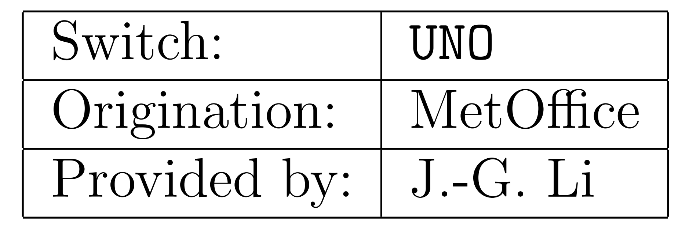

上游无振荡二阶（UNO）平流格式（Li，2008）是在 MINMOD 格式（Roe，1986）基础上的改进与扩展。在 UNO 格式中，单元 $i-1$ 与单元 $i$ 之间单元面的中间通量点处，波作用量的插值值表示为：

$$\begin{aligned}N_{i-}^*&=N_c+sign\left(N_d-N_c\right)\frac{(1-C)}{2}\min\left(|N_u-N_c|,|N_c-N_d|\right)\end{aligned}\tag{3.10}$$

其中，$i-$ 为单元面索引；$C=\left|\dot{\phi}_b\right|\Delta t/\Delta\phi$ 为绝对 CFL 数；下标 $u$、$c$ 和 $d$ 分别表示相对于该 $i-$ 单元面速度 $\dot{\phi}_b$ 的上游（upstream）、中心（central）和下游（downstream）单元。

当 $\dot{\phi}_b>0$ 时，对于位于单元 $i-1$ 与单元 $i$ 之间的单元面，有 $u=i-2,\quad c=i-1,\quad d=i$。

当 $\dot{\phi}_b\le 0$ 时，有 $u=i+1,\quad c=i,\quad d=i-1$ 。

UNO 格式的详细描述见 Li (2008)，其中通过标准数值试验表明，在笛卡尔多单元网格上，当 $C<1.0$ 时，该格式具有无振荡、守恒、保持形状以及相较传统格式更高计算效率等特性。

其通量计算与单元值更新形式与一阶迎风格式相同，即：

$$\mathcal{F}_{i-}=\phi_b\dot{N}_{i-}^*;\quad N_i^{n+1}=N_i^n+\frac{\Delta t}{\Delta\phi}\left(\mathcal{F}_{i-}-\mathcal{F}_{i+}\right)\tag{3.11}$$

其中， $\mathcal{F}_{i,+}$ 为单元 $i$ 与单元 $i+1$ 之间单元面的通量。其计算方式与式 (3.10) 类似，只需将其中的 $i$ 替换为 $i+1$ ，在对应单元面中点处构造插值的波作用量值，然后按控制体守恒形式计算通量。

为将 UNO 格式推广至多维情形，采用了对流--守恒混合算子（Leonard 等，1996）。该混合算子能够在保持守恒性的同时减小时间分裂误差，从而提高多维计算中的数值精度与稳定性。

#### Third-order scheme (UQ)


WAVEWATCH III 中提供的三阶精度传播格式为 QUICKEST 格式（Leonard，1979；Davis 和 More，1982），并结合 ULTIMATE TVD（Total Variation Diminishing，全变差减小）限制器（Leonard，1991）。该格式是 WAVEWATCH III 的默认传播方案。

该方法在空间与时间上均达到三阶精度，其选用基于对多种高阶有限差分格式在水质模型中的系统对比研究（Cahyono，1994；Falconer 和 Cahyono，1993；Tolman，1995b）。

在实现上，该格式分别对经度方向与纬度方向的传播进行处理，并交替改变优先计算的方向，以提高整体数值精度。

在 QUICKEST 格式中， $\phi$ 方向上网格点计数为 $i$ 与 $i-1$ 之间的通量 $\mathcal{F}_{i,-}$ 计算形式为：

$$\mathcal{F}_{i,-}=\left[\dot{\phi}_b~\mathcal{N}_b\right]_{j,l,m}^n \tag{3.12}$$


$$\dot{\phi}_b=0.5\left(\dot{\phi}_{i-1}+\dot{\phi}_i\right) \tag{3.13}$$


$$\begin{aligned}\mathcal{N}_b=\frac{1}{2}\left[(1+C)\mathcal{N}_{i-1}+(1-C)\mathcal{N}_i\right]-\left(\frac{1-C^2}{6}\right)\mathcal{CU}\Delta\phi^2\end{aligned} \tag{3.14}$$


$$\mathcal{CU}=\left\{\begin{array}{ll}(\mathcal{N}_{i-2}-2\mathcal{N}_{i-1}+\mathcal{N}_{i})\Delta\phi^{-2}&\mathrm{for}\quad\dot{\phi}_{b}\geq0\\\\(\mathcal{N}_{i-1}-2\mathcal{N}_{i}+\mathcal{N}_{i+1})\Delta\phi^{-2}&\mathrm{for}\quad\dot{\phi}_{b}<0\end{array}\right.  \tag{3.15}$$


$$C=\frac{\dot{\phi}_b\Delta t}{\Delta\phi} \tag{3.16}$$

其中， $\mathcal{CU}$ 为波作用量分布在上游方向上的曲率项； $C$ 为包含传播方向符号的 CFL 数。与一阶迎风格式类似，当满足 $|C|\le 1$ 时，该格式可保持数值稳定。

为防止该高阶格式产生非物理极值，QUICKEST 格式与 ULTIMATE 限制器联合使用。该限制器采用中心点、上游点和下游点的作用量密度值（下标分别为 $c$ 、 $u$ 和 $d$ ），其定义为：

$$\begin{array}{cccc}\mathcal{N}_c=\mathcal{N}_{i-1},&\mathcal{N}_u=\mathcal{N}_{i-2},&\mathcal{N}_d=\mathcal{N}_i&\mathrm{for}&\dot{\phi}_b\geq0\\\mathcal{N}_c=\mathcal{N}_i,&\mathcal{N}_u=\mathcal{N}_{i+1},&\mathcal{N}_d=\mathcal{N}_{i-1}&\mathrm{for}&\dot{\phi}_b<0\end{array} \tag{3.17}$$

为判断初始状态与数值解是否具有相同的单调或非单调特性，定义归一化作用量 $\tilde{\mathcal{N}}$ 为：

$$\tilde{\mathcal{N}}=\frac{\mathcal{N}-\mathcal{N}_u}{\mathcal{N}_d-\mathcal{N}_u} \tag{3.18}$$

若初始状态为单调（即 $0 \le \tilde{\mathcal{N}}_c \le 1$ ），则单元边界处的（归一化）作用量 $\mathcal{N}_b$ 被限制为：

$$\begin{aligned}\tilde{\mathcal{N}}_c\leq\tilde{\mathcal{N}}_b\leq1,\quad\tilde{\mathcal{N}}_b\leq\tilde{\mathcal{N}}_cC^{-1}\end{aligned} \tag{3.19}$$

除此以外

$$\tilde{\mathcal{N}}_b=\tilde{\mathcal{N}}_c \tag{3.20}$$

若单元边界相邻的两个网格点之一位于陆地，或为活动边界点，则需采用替代格式。在这种情况下，式 (3.7) 与式 (3.14) 被替换为：

$$\dot{\phi}_b=\dot{\phi}_s \tag{3.21}$$


$$\mathcal{N}_b=\mathcal{N}_u \tag{3.22}$$

其中，下标 $s$ 表示海洋点（或海洋点的平均值）。该边界条件对应一个简单的一阶迎风格式，不需要使用限制器 (3.17) 至 (3.20)。

最终的传播格式（类似于式 (3.9)）为：

$$\mathcal{N}_{i,j,l,m}^{n+1}=\mathcal{N}_{i,j,l,m}^n+\frac{\Delta t}{\Delta\phi}\left[\mathcal{F}_{i,-}-\mathcal{F}_{i,+}\right] \tag{3.23}$$

$\lambda$ 方向上的传播格式可通过对上述方程中的索引与网格间距进行相应轮换直接得到。

需要注意，ULTIMATE QUICKEST 格式是以交替的一维格式实现的，因此在式 (3.4) 中必须采用各分量平流速度的最大值。为保持一致性，对于给定频率分量， $\lambda$ 与 $\phi$ 两个方向的传播始终使用相同的时间步长。

### 3.4.3 曲线网格


作为对传统"规则"网格的扩展，WAVEWATCH III 支持在"不规则"网格上进行计算。这使模型能够运行在其他投影方式下（例如 Lambert 正形圆锥投影）、旋转网格，或沿岸线加密、近岸高分辨率的网格上。不过，由条件稳定格式所决定的时间步长限制仍然适用。传播计算仍采用与规则网格相同的数值格式（见 3.4.2 节）。

其实现方法详见 Rogers 和 Campbell（2009），简要概括如下：利用 Jacobian 将整个计算区域在原始弯曲空间与"拉直"的计算空间之间进行转换。该转换仅在传播子程序内部执行，而不是在拉直空间中完成整个模型积分。每次调用传播子程序（即每个时间步、每个谱分量）时，按如下三步进行：

1.  使用 Jacobian 将因变量（波作用量密度）转换到拉直空间；
2.  在两个网格方向上分别调用传播子程序完成传播计算；
3.  将更新后的波作用量密度再转换回原始弯曲空间。

实际通量计算方法与原规则网格形式相比并无本质改变。无论网格类型为规则或不规则，上述处理过程相同；对于规则网格，Jacobian 恒为 1。

在用户接口方面：在 ww3_grid.inp 中，通过字符串指定网格类型。当该字符串为 RECT 时，模型按规则网格处理输入；当为 CURV 时，则按不规则网格处理。自 WAVEWATCH III 4.00 版本起，坐标系统（如度或米）及闭合方式（如全球环绕网格）也在 ww3_grid.inp 中指定；编译开关 LLG 和 XYG 已弃用。

自 WAVEWATCH III 5 版本起，模型增加了对一种特殊曲线网格------"三极网格"（tripole grid）的支持，并采用一阶传播格式。在北半球，该网格使用两个位于陆地上的极点以避免网格间距奇异性。这类网格常见于海洋模式（如 Murray，1996；Metzger 等，2014）。使用时无需特殊编译开关，与其他不规则网格一样读入，但需在 ww3_grid.inp 中将闭合类型（CSTRG）设为 TRPL。传播和梯度计算已针对该闭合方式进行相应修改。TRPL 仅与一阶 PR1 传播格式兼容。

三极网格的一个优点是可使用单一网格覆盖至北极。但尽管三个极点均位于陆地上，靠近极点的海域网格仍存在子午线汇聚问题，导致实际物理距离上的网格间距高度不均匀（这将影响最大传播时间步）。通过多重网格技术可以获得在真实距离意义上更均匀的网格分布，从而提高计算效率。需要指出的是，该方法虽然解决了极区网格间距奇异问题，但并未解决波向定义上的奇异性问题。

### 3.4.4 三角形非结构网格


在 WAVEWATCH III 中，可通过基于轮廓残差分配（CRD, Contour Residual Distribution）（Ricchiuto 等，2005）的数值方法，在三角形非结构网格上离散空间导数。这些方法已由 Roland（2009）推广至波作用量平衡方程，并实现于 WWM-II 与 WW3 中。

在时间积分方面，非结构网格既可采用显式格式，也可采用隐式格式。

若采用显式求解器，则沿用 WW3 原有的分裂步法：地理空间中的二维双曲部分在非结构网格上按 CRD 方法求解，而谱空间传播与源项积分方式与结构网格版本一致。时间步定义也基本相同，但非结构部分的子迭代次数根据全域最大 CFL 数自动估计。

若采用隐式方法，则基于 CRD-N 格式组装线性方程组（Roland，2009）。谱传播部分采用简单的一阶迎风隐式格式；源项按 WW3 动态格式的方式写入矩阵（式 3.61 中取 $\varepsilon=1$），并按 Patankar 方法组装方程组。相关实现细节见 Roland 等（2019）。

当 CFL\<1 时，显式与隐式方法在解析与数值试验中均表现出相似结果（例如 Abdolali 等，2018；Smith 等，2018）。当 $CFL>1$ 时，由于源项在时间上被线性化，隐式方法的瞬态解对时间步存在依赖性。隐式方法中时间步等于全局时间步，其余谱空间或源项时间步不起作用。分裂步法同样存在时间步依赖性，尤其在浅水区域更为明显（Roland，2009）。因此，两种方法均需结合全局时间步与空间分辨率进行收敛性分析。

该选项通过在 ww3_grid.inp 中将网格字符串设为 UNST 激活。已实现四种格式，并通过 UNST namelist 选择：

- CRD-N 格式（一阶）  
- CRD-PSI 格式（优于一阶，在规则三角网格上为二阶）  
- CRD-FCT 格式（时空二阶）  
- 隐式 N 格式

默认格式为计算效率最高但数值耗散较大的显式 N 格式。

该类平流格式未包含"花园喷洒效应"（GSE）修正。一般而言，N 格式的数值横向扩散足以补偿该效应；但较高阶格式（如 CRD-PSI 或 CRD-FCT）在特定空间分辨率下可能产生明显的 GSE。

并行化可采用与结构网格相同的 Card Deck 方法，或采用基于 ParMetis（Karypis，2011）的区域分解方法。区域分解通过 Fortran 接口库 PDLIB 实现，后者提供基于 Fortran 2002 标准的通信例程。使用该并行方式需安装 ParMetis 并通过 MPI 编译。

在数值实现中，谱在节点处定义，其演化基于对应中值对偶单元中的通量收敛重分配。对于每个谱分量，式 (3.5) 在中值对偶单元上求解：流入通量决定对应节点处波作用量的变化率。不同格式的差别主要体现在通量估计方法上。

显式非结构格式的 CFL 条件等价于：对偶单元面积除以时间步与进入该单元的正通量涨落之和。边界节点不参与 CFL 计算，入射能量设为零，出射能量完全吸收，仅反射部分允许进入计算域。

岸线边界条件取决于波向与岸线方向的相对关系，通过数组 IOBPD 实现，并随网格状态映射 MAPSTA 更新。水深与流速梯度在节点处通过三角形线性形函数插值估计。强迫场插值与输出插值均采用三角形内线性插值。

所有三角几何运算均假设局地平面地球近似。水深与流速梯度在网格节点处通过三角形内插计算，采用线性形函数进行估计。

### 3.4.5 球面多单元（SMC）网格

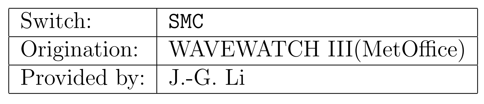

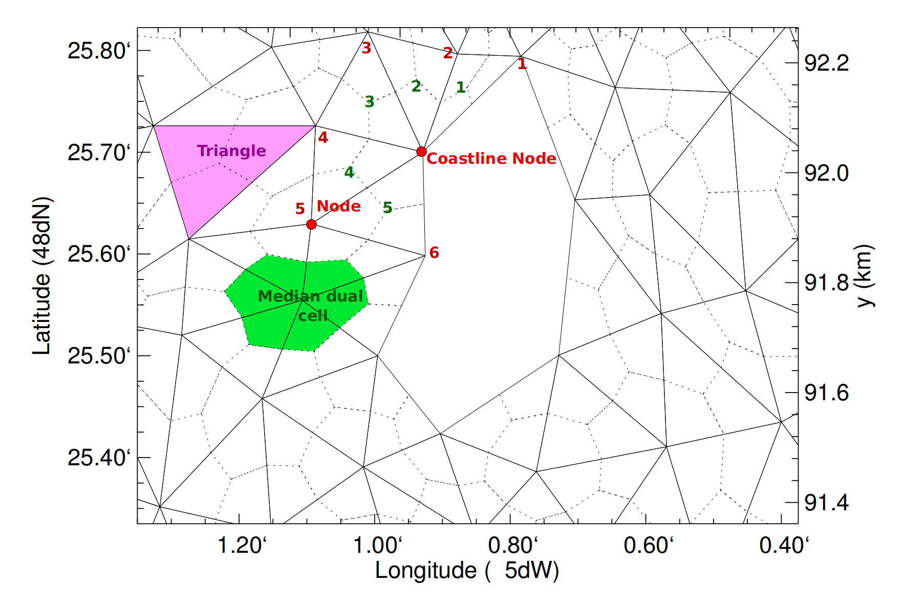
图 3.1：三角形网格局部区域示例（以法国 Bannec 小岛为例）。若水深大于最小水深阈值，则岸线节点为活动节点。在所示示例中，这些节点的相邻节点数为 6，而相邻三角形数为 5。

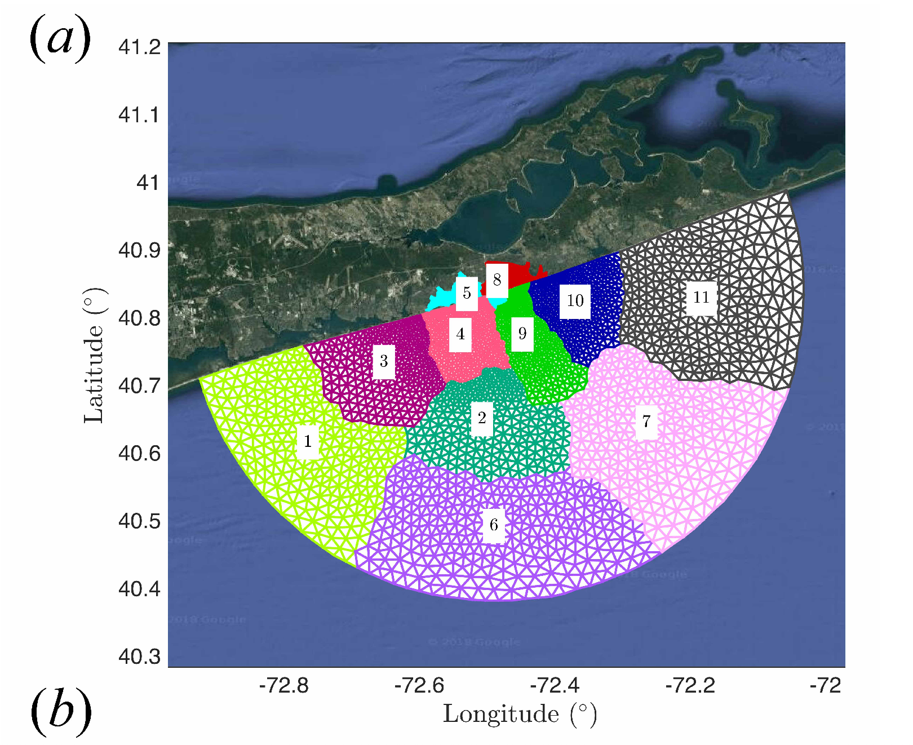
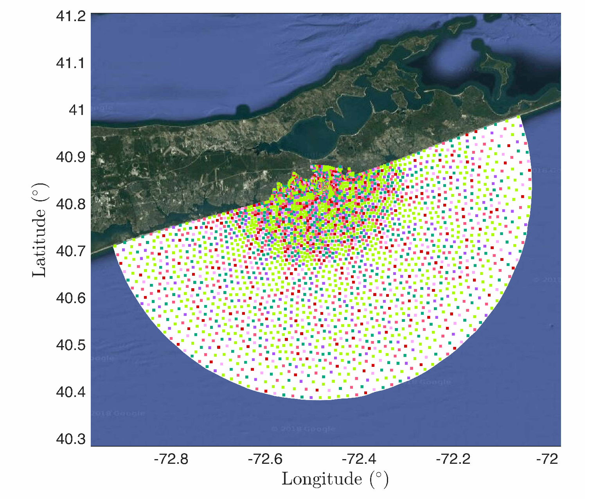
图 3.2：区域分解方法（a）与 Card Deck 方法（b）的示意差异。图中不同颜色表示 11 个计算核心。所示网格约包含 $3\times10^3$ 个节点，基于纽约 Shinnecock Inlet 的 ADCIRC 示例问题构建。

球面多单元（SMC, Spherical Multiple-Cell）网格（Li，2011）是在球坐标系上对笛卡尔多单元网格（Li，2003）的扩展。该网格属于非结构网格，但保留了传统经纬度网格单元形式，因此球坐标下的传播公式及所有有限差分格式仍然适用。

SMC 网格通过类似缩减网格（Rasch，1994）的方式放宽高纬度地区的 CFL 限制。通过引入极区单元，将微分输运方程在极点处转换为积分形式，从而消除极点奇异性。空间传播与谱内传播均采用上游无振荡二阶（UNO2）平流格式（Li，2008）。通过 PSMC namelist 中的逻辑变量 UNO3，可改用三阶格式。UNO3 类似于 UQ 格式，但其通量限制器由 UNO2 格式替代。

波折射与大圆转向采用简单旋转格式（Li，2012）。折射格式在任意时间步下无条件稳定，但单步折射角受物理极限约束，同时可通过 PSMC namelist 中参数 RFMAXD 限制单步最大折射角（默认 36.0°）。为减弱"花园喷洒效应"，采用类似 Booij 和 Holthuijsen（1987）的扩散项，但扩散系数简化为单一均匀参数（式 (3.32) 中的 $D_{nn}$）。此外，可通过逻辑变量 AVERG 启用 1-2-1 加权平均格式。

相较传统规则网格，SMC 网格在计算效率上具有显著优势，原因在于高纬度时间步限制放宽及陆地点从模型中移除。针对高纬度标量假设失效问题，提供了扩展至整个北冰洋的修正方案（Li，2016），可通过设置 Arctic=.TRUE. 激活。

SMC 网格可替代规则经纬度网格，使模型域扩展至高纬度甚至北极，而无需缩小时间步。实现时除需准备额外输入文件（单元数组与单元面数组）外，对原规则网格模型改动较少。单元数组可基于现有规则网格水深数据生成，仅保留海点，并在若干纬度带上沿经向合并单元（Li，2011）。

SMC 网格亦支持多分辨率结构。基础单元可通过经纬度各减半划分为 4 个子单元；细化单元可继续递归细分，从而形成多层分辨率结构。单分辨率 SMC 网格视为仅有一个层级。传统规则网格输入文件（如水深、陆海掩膜、子网格阻塞）不再需要，取而代之的是仅含海点的单元与单元面数组文件，以及子网格阻塞文件。水深以米为单位整数形式存储在单元数组第五列。

风场与海流强迫默认可采用基础分辨率的规则网格输入，并在模型内部插值至细化层级。也可通过 SEAWND 逻辑变量启用仅海点输入方式，从而无需内部插值，并允许不同分辨率风场或流场混合输入，实现真正的多分辨率驱动。

SMC 网格单元在数据结构上不要求按物理位置顺序排列。为便于多分辨率计算，单元按尺度排序，同一层级单元在共享子时间步循环中处理。细化层级的时间步按网格尺度减半，从而避免因局部细化单元的 CFL 限制而拖慢整体计算。传播所需的邻接信息通过预计算的单元面数组提供，无需将海点单元扩展为完整规则网格。

对于区域 SMC 网格，需提供边界单元序号列表，并通过 PSMC namelist 参数 NBISMC 指定边界单元数量。边界输入文件格式与规则经纬度网格一致，可由规则网格或全球 SMC 网格模型生成。
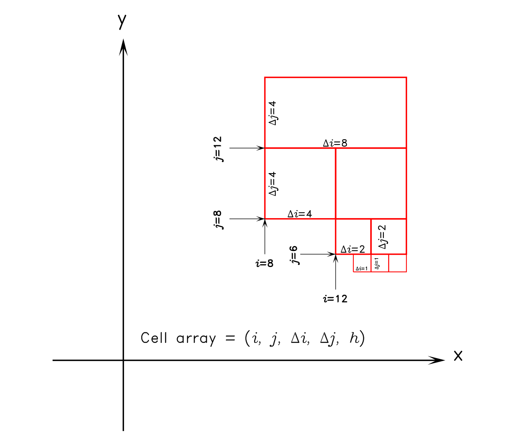
图 3.3：SMC 网格中所使用的单元数组示意图。

已开发若干 IDL 与 F90 程序，用于生成 SMC 网格的单元数组与单元面数组，以及网格结构和波场的可视化，但尚未正式纳入 WW3 软件包。

在 smc_docs/SMCG_TKs/ 目录中提供了 IDL 程序 Glob50SMCels.pro，可基于规则 50 km 网格水深文件（G50kmBathy.dat）生成全球 50 km SMC 网格。

单元面数组由两个 F90 程序生成：全球部分使用 G50SGlSide.f90 ，北极部分使用 G50SAcSide.f90 。由于极区单元的特殊处理方式（Li，2012），北极极点单元的面数组生成方法不同于其他单元。

在生成单元面数组前，需使用 Linux 脚本 countcells 对单元数组文件排序。生成后的单元面数组还需通过 countijsd 脚本排序，以确定多层级子循环计数。

可运行独立的谱传播测试程序 G50SMCSRGD.f90 对单元与单元面数组进行检验，其输出结果可通过 IDL 脚本 g50smstrspb.pro 可视化。该脚本调用 SMC 网格可视化程序 g50smcgrids.pro 生成的投影文件。通过修改 g50smcgrids.pro 中的投影参数，用户可设定经纬度视角并保存投影，用于模型输出的可视化。

子网格阻塞文件可通过 IDL 程序 Glob50SMCObstr.pro 生成。

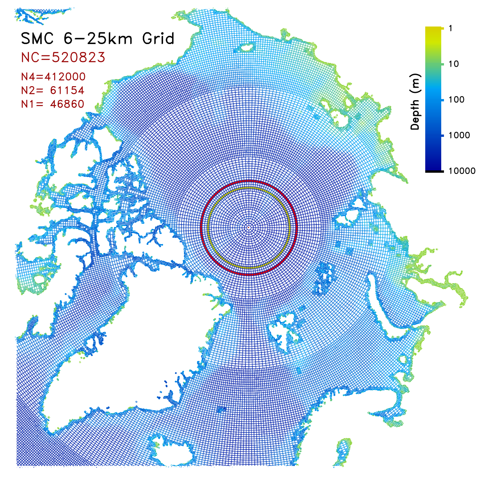

图 3.4：6--12--25 km 三层多分辨率 SMC 网格中的北极区域示意图。

SMC 网格的编译方式与规则经纬度网格基本相同，但需额外启用开关 SMC。由于 SMC 网格与规则经纬度网格共享部分网格变量，仍需同时选择规则网格传播开关（如 PR2 UNO 或 PR3 UQ）。在 ww3_grid.inp 中，将网格类型由 RECT 改为 SMCG 以定义 SMC 网格类型 SMCTYPE。

SMC 网格构建于规则经纬度基础网格之上，因此在 ww3_grid.inp 中仍需提供基础分辨率的规则网格参数，如 NX、NY、SX、SY、X1、Y1 等。规则网格的水深、陆海掩膜和子网格阻塞输入文件不再需要，改由 SMC 海点单元数组文件替代（水深存储于单元数组中，子网格阻塞如 G50GObstr.dat）。不过，ww3_grid.inp 中水深和陆海掩膜输入行仍保留，用于传递诸如最小水深等参数。由于高纬度单元合并及可能存在的多级细化，规则网格映射数组会作相应调整以保持与 SMC 单元一致。示例可参见 regtests/ww3_tp2.10（Lake Erie 三层 SMC 网格）。

针对 SMC 网格模型，ww3_ounf 与 ww3_outf 已开发后处理功能。

- ww3_ounf 可选择输出原生多分辨率海点数据，或生成任一分辨率层级的规则网格输出。

- ww3_outf 可输出为基础分辨率的完整展开规则经纬度网格，或以 ASCII 格式输出全部 SMC 海点数据（type-4）。

对于规则网格输出，参数值通过对重叠 SMC 单元进行面积加权平均获得。海点输出的经纬度对应原始模型单元中心。ww3_ounf 的 netCDF 海点输出还包含单元尺度变量。

当前版本未提供官方可视化工具，但可通过 Met Office 获取示例。针对 netCDF 海点输出，已有基于 Python 的 GUI 工具。ASCII 海点输出可结合输入单元数组文件进行可视化（输出顺序与输入单元顺序一致）。IDL 脚本 g50smcswhglb.pro 为全球 50 km SMC 网格有效波高绘图示例，依赖 g50smcgrids.pro 生成的投影文件。

SMC 网格自第 7 版起支持 WW3 多重网格模式。目前仅支持同等级 SMC 子网格并行运行。SMC 子网格生成方式类似单一区域 SMC 网格，但需提供各自的边界单元列表。建议边界单元采用相邻子网格的重复单元，以实现完整谱复制交换，无需插值。规则经纬度子网格也可加入同等级组，但边界交换仍为整谱交换方式，不启用原规则网格的边界插值，从而降低 MPI 通信负担，但若边界单元中心未对齐可能影响精度。示例见 regtests/mww3_test_09（Great Lakes 三子网格，0.5--1--2 km）。

SMC 网格支持混合并行（MPI + OpenMP）。在 Cray XC40 上使用 3 或 6 个 OpenMP 线程时，总运行时间可减少约一半；继续增加线程效果有限。混合并行结合多重网格并行，可扩展至百节点规模运行。

建议参考 smc_docs/SMC_Grid_Guide.pdf 或 Li 和 Saulter（2017）的会议论文获取更多信息。

### 3.4.6 花园喷洒效应

高阶传播格式具有较低数值扩散，因此可能产生所谓的"花园喷洒效应"（GSE）：连续涌浪场由于谱的离散表示而分裂为若干离散涌浪条带（Booij 和 Holthuijsen，1987）。WAVEWATCH III 提供多种 GSE 缓解方法。

#### 无 GSE 修正

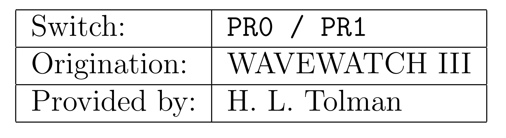

当不进行传播计算（开关 `PR0`），或在传统规则网格或曲线网格上采用一阶传播格式时，不提供也无需 GSE 修正。

#### Booij 和 Holthuijsen（1987）方法


经典的 GSE 修正方法由 Booij 和 Holthuijsen（1987）提出。该方法针对离散谱推导了替代传播方程，在传播方程中加入扩散修正项，以补偿连续色散过程在离散谱表示下的不足。

该修正仅影响空间传播部分。对于一般空间坐标 $(x,y)$，传播方程可写为：

$$\begin{aligned}\frac{\partial\mathcal{N}}{\partial t}+\frac{\partial}{\partial x}\left[\dot{x}\mathcal{N}-D_{xx}\frac{\partial\mathcal{N}}{\partial x}\right]+\frac{\partial}{\partial y}\left[\dot{y}\mathcal{N}-D_{yy}\frac{\partial\mathcal{N}}{\partial y}\right]-2D_{xy}\frac{\partial^2\mathcal{N}}{\partial x\partial y}=0\end{aligned} \tag{3.24}$$


$$D_{xx}=D_{ss}\cos^2\theta+D_{nn}\sin^2\theta \tag{3.25}$$


$$D_{yy}=D_{ss}\sin^2\theta+D_{nn}\cos^2\theta \tag{3.26}$$


$$D_{xy}=\begin{pmatrix}D_{ss}-D_{nn}\end{pmatrix}\cos\theta\sin\theta \tag{3.27}$$


$$D_{ss}=(\Delta c_g)^2T_s/12\tag{3.28}$$


$$D_{nn}=(c_g\Delta\theta)^2T_s/12\tag{3.29}$$

其中， $D_{ss}$ 为沿离散波分量传播方向的扩散系数， $D_{nn}$ 为沿波峰方向的扩散系数， $T_s$ 为自涌浪生成以来经历的时间。在当前的分裂步方法中，扩散过程可作为一个独立步骤加入。

$$\begin{aligned}\frac{\partial\mathcal{N}}{\partial t}=\frac{\partial}{\partial x}\left[D_{xx}\frac{\partial\mathcal{N}}{\partial x}\right]+\frac{\partial}{\partial y}\left[D_{yy}\frac{\partial\mathcal{N}}{\partial y}\right]+2D_{xy}\frac{\partial^2\mathcal{N}}{\partial x\partial y}\end{aligned} \tag{3.30}$$

该方程在实现时作了两项简化，其合理性见 Tolman (1995b) 的讨论。

第一，涌浪"年龄" $T_s$ 在整个模型中取为常数（由用户指定，无默认值）。

第二，扩散系数 $D_{ss}$ 与 $D_{nn}$ 在计算时假定为深水条件。

$$D_{ss}=\left((X_\sigma-1)\frac{\sigma_m}{2k_m}\right)^2\frac{T_s}{12} \tag{3.31}$$


$$D_{nn}=\left(\frac{\sigma_m}{2k_m}\Delta\theta\right)^2\frac{T_s}{12} \tag{3.32}$$

其中，$X_\sigma$ 的定义同式 (3.1)。在上述两项假设下，对于每一个谱分量，扩散张量在整个空间域内均为常数。

式 (3.30) 采用前向时间--中心空间（FTCS）格式求解。在 $\phi(x)$ 方向上，位于网格点 $i$ 与 $i-1$ 之间单元界面的式 (3.30) 右端第一项括号内表达式（记为 $\mathcal{D}_{i,-}$ ）估算为：

$$D_{xx}\frac{\partial\mathcal{N}}{\partial x}\approx\mathcal{D}_{i,-}=D_{xx}\left.\left(\frac{\mathcal{N}_i-\mathcal{N}_{i-1}}{\Delta x}\right)\right|_{j,l,m} \tag{3.33}$$

对应于计数 $i$ 与 $i+1$ 的界面值，以及 $\lambda$（或 $y$）方向上的梯度项，均可通过对索引与网格间距进行相应轮换得到。若相邻两个网格点之一位于陆地，则式 (3.33) 取为零。

式 (3.30) 右端的混合偏导项（记为 $D_{ij,--}$ ），在 $x$ 方向网格点 $i$ 与 $i-1$ ，以及 $y$ 方向网格点 $j$ 与 $j-1$ 处估算为：

$$\begin{aligned}\mathcal{D}_{ij,--}&=D_{xy}\left.\left(\frac{-\mathcal{N}_{i,j}+\mathcal{N}_{i-1,j}+\mathcal{N}_{i,j-1}-\mathcal{N}_{i-1,j-1}}{0.5(\Delta x_j+\Delta x_{j-1})\Delta y}\right)\right|_{l,m}\end{aligned} \tag{3.34}$$

需要注意的是，由于采用球面网格，网格间距 $\Delta x$ 为 $y$ 的函数。该混合项仅在所涉及的四个网格点均为海点时才进行计算，否则取为零。

对式 (3.30) 左端第一项采用时间前向差分，对右端第一项剩余部分及第二项采用空间中心差分离散后，最终算法可写为：

$$\begin{aligned}\mathcal{N}_{i,j,l,m}^{n+1}&=\mathcal{N}_{i,j,l,m}^n+\frac{\Delta t}{\Delta x}\left(\mathcal{D}_{i,+}-\mathcal{D}_{i,-}\right)+\frac{\Delta t}{\Delta y}\left(\mathcal{D}_{j,+}-\mathcal{D}_{j,-}\right)\\&+\frac{\Delta t}{4}\left(\mathcal{D}_{ij,--}+\mathcal{D}_{ij,-+}+\mathcal{D}_{ij,+-}+\mathcal{D}_{ij,++}\right)\end{aligned}\tag{3.35}$$

稳定解可在满足如下条件时获得（例如，Fletcher，1988，第 I 部分第 7.1.1 节）：

$$\begin{aligned}\frac{D_{\max}\Delta t}{\min(\Delta x,\Delta y)^2}\leq0.5\end{aligned} \tag{3.36}$$

其中，$D_{\max}$ 为扩散系数的最大值（通常取 $D_{\max}=D_{nn}$）。由于该稳定性条件与网格间距的平方成正比，在大尺度应用中高纬度地区可能面临显著的稳定性限制。

为避免对模型时间步施加过于严格的约束，引入修正后的涌浪年龄 $T_{s,c}$ 。

$$T_{s,c}=T_s\min\left\{1,\left(\frac{\cos(\phi)}{\cos(\phi_c)}\right)^2\right\} \tag{3.37}$$

其中， $\phi_c$ 为用户定义的截止纬度。

上述扩散修正主要用于涌浪传播，对于增长中的风浪并不现实。对于风浪，未包含色散修正的 ULTIMATE QUICKEST 格式已足够平滑，可得到稳定的有限风区增长曲线（Tolman，1995b）。

为消除微小振荡，对增长中的波分量加入小幅各向同性扩散。为保证该扩散足够小且对所有谱分量等效，其数值通过预设单元雷诺数（或单元 Peclet 数）确定： $\mathcal{R}=c_g\Delta xD_g^{-1}=10$ , 其中， $D_g$ 为增长波分量的各向同性扩散系数。

$$D_g=\frac{c_g\min(\Delta x,\Delta y)}{\mathcal{R}}\tag{3.38}$$

涌浪和风浪的扩散通过线性组合计算，取决于无量纲风速或逆波龄： $\begin{aligned}u_{10}c^{-1}=u_{10}k\sigma^{-1}\end{aligned}$

$$X_g=\min\left\{1,\max\left[0,3.3\left(\frac{ku_{10}}{\sigma}\right)-2.3\right]\right\}\tag{3.39}$$


$$D_{ss}=X_gD_g+(1-X_g)D_{ss,p} \tag{3.40}$$


$$\begin{aligned}D_{nn}=X_gD_g+(1-X_g)D_{nn,p}\end{aligned} \tag{3.41}$$

其中，下标 $p$ 表示传播扩散，如公式 $(3.31)$ 和 $(3.32)$ 所定义。公式 $(3.38)$ 和 $(3.39)$ 中的常数在模型中已预设。

#### 空间平均

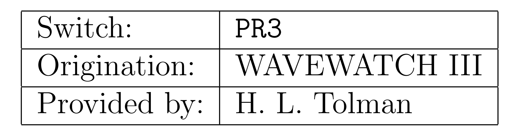

上述 GSE 缓解方法的主要缺点是其可能对模型计算效率产生影响，如公式 $(3.36)$ 及 Tolman (2001, 2002a) 所讨论。因此，为 WAVEWATCH III 开发了另一种附加的 GSE 缓解方法。

该方法是 WAVEWATCH III 的默认方法，用它来替代附加的扩散步骤 $(3.30)$ ，采用一个单独的分数步，在该步骤中考虑对特定谱分量的能量密度场进行直接平均。每个网格点周围进行平均的区域沿传播方向 $(\mathrm{s})$ 和法向 $(\mathrm{n})$ 扩展，如下：

$$\pm\gamma_{a,s}~\Delta c_g~\Delta t~\mathrm{s},\pm\gamma_{a,n}~c_g~\Delta\theta~\Delta t~\mathrm{n} \tag{3.42}$$

其中 $\gamma_{a,s}$ 和 $\gamma_{a,n}$ 是可调常数，默认值设为 $1.5$。该平均方法如图 $3.5$ 所示。需要注意的是，这些值在实际应用中可能需要重新调节，如 Tolman (2002a) 所讨论。该文献的附录 A 给出了平均方案的详细说明，包括守恒性考虑。此外，与 Booij 和 Holthuijsen (1987) 方法的一致性意味着 $\gamma_{a,s}$ 和 $\gamma_{a,n}$ 应随空间网格分辨率变化（参见 Chawla 和 Tolman, 2008, 附录）。

这种以主方向 $(\mathrm{s})$ 和 $(\mathrm{n})$ 进行的平均类似于 Booij 和 Holthuijsen (1987) 的扩散方法，也使用相同的主要方向。然而，该平均方法不会影响时间步长，因为它完全独立于实际传播。此外，如果使用显式格式，通常 $c_g \Delta t / \Delta x < 1$ ，显然按照公式 $(3.42)$ 定义的区域平均一般只需要直接相邻的空间网格点信息，如图 $3.5$ 所示。此外，该方法不需要高纬度滤波。

如 Tolman (2002a,d) 所示，该方法给出的结果几乎与前述方法相同，但计算成本略低。对于高分辨率应用，该平均方法可能大幅提高计算效率。

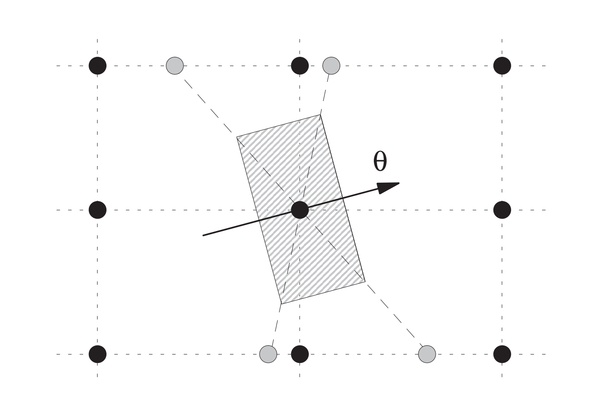
图 3.5：空间平均 GSE 缓解技术示意图。实心圆和虚线表示空间网格。阴影区域表示需要考虑的平均区域。角点值由中心网格点和灰色点的值确定，灰色点的值通过邻近网格点插值得到（摘自 Tolman, 2002a）。

最后，可以通过确保离散谱方向不与空间网格线重合，从而在一定程度上缓解 GSE。这可以通过将第一个离散方向 $\theta_1$ 定义为：

$$\theta_1=\alpha_\theta\Delta\theta \tag{3.43}$$

其中 $-0.5 \le \alpha_\theta \le 0.5$ 可由用户定义。需要注意的是，将 $\alpha = 0$ 对一阶格式有利，但对三阶格式几乎没有影响。

### 3.4.7 未解析障碍物


即使在 WAVEWATCH III 版本 1.15 最初调试时（Tolman, 2002f），未解析的岛屿群已被明确认为是局部波浪模型误差的主要来源。这在 Tolman (2001, 图 3) 和 Tolman 等 (2002, 图 8) 中有更详细的说明。在 WAVEWATCH III 中，有两种方法用于未解析障碍物的参数化。第一种方法最初来自 SWAN（Booij 等, 1999；Holthuijsen 等, 2001），在数值格式中将未解析障碍物的效应应用于空间网格的单元边界，并适用于规则网格。第二种方法由 Mentaschi 等 (2015b) 提出，基于源项，可应用于不同类型的网格。在本节中介绍第一种方法，第二种方法的描述请参见第 2.3.22 节。

在基于传播的方法中，通过单元共有边界的数值通量会根据未解析障碍物造成的阻塞程度进行抑制。在该方法中，公式 $(3.23)$ 的 ULTIMATE QUICKEST 数值传播格式被修改为：

$$\begin{aligned}\mathcal{N}_{i,j,l,m}^{n+1}&=\mathcal{N}_{i,j,l,m}^n+\frac{\Delta t}{\Delta\phi}\left[\alpha_{i,-}\mathcal{F}_{i,-}-\alpha_{i,+}\mathcal{F}_{i,+}\right]\end{aligned} \tag{3.44}$$

其中 $\alpha_{i,-}$ 和 $\alpha_{i,+}$ 表示相应单元边界的"透过率"，范围从 $0$ （封闭边界）到 $1$ （无阻碍）。对于出流边界，透过率按定义为 $1$ ，否则能量会在单元内人工累积。对于入流边界，透过率小于 $1$ 会导致单元边界的受阻能量被消除。该方法如图 $3.6$ 所示。类似方法也可轻松应用于一阶和二阶格式。此外，Hardy 和 Young (1996) 及 Hardy 等 (2000) 使用了基于谱方向 $\theta$ 的另一种阻塞方法。

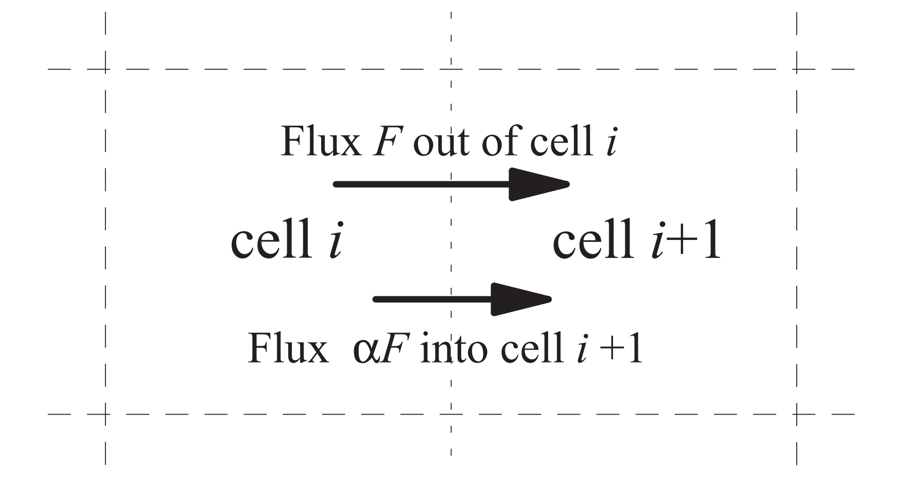
图 3.6：未解析障碍物处理示意图。单元共有边界（虚线）具有透过率 $\alpha$ 。虚线表示其他单元边界。数值通量从左向右流动。

模型中提供了两种定义阻塞的方法。第一种直接在网格边界定义阻塞，需要生成交错的深度-透过率网格。第二种允许用户在相同网格上定义深度和透过率。在这种情况下，入流边界的透过率为 $0.5(1 + \alpha_i)$，出流边界按定义为 $1$。为了完成总透过率 $\alpha_i$，流向下一个单元的入流透过率为 $2\alpha_i / (1 + \alpha_i)$。如果连续单元部分受阻，则采用各单元透过率的乘积。

该方法也可用于连续模拟冰覆盖对波传播的影响，详见第 3.8 节。岛屿和冰的子网格处理细节可参见 Tolman (2003b)。该方法在大尺度波浪模型中的影响研究见 Tolman (2002d, 2003b)。

WAVEWATCH III 的默认设置是不包括障碍物的子网格建模。生成阻塞网格可能劳动量大，因此 Chawla 和 Tolman (2007, 2008) 开发了生成底部和阻塞网格的自动化方法。该选项无需在编译层面选择，完全由网格预处理器控制（见第 4 章）。

### 3.4.8 连续移动网格

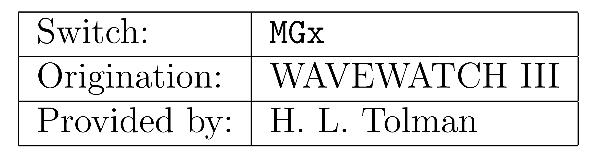

为了应对在快速变化的小尺度条件下（如飓风）出现的波浪生长问题，模型在版本 3.02 中增加了一个选项，可将给定的连续平流速度叠加到网格上。该版本模型在 Tolman 和 Alves (2005) 中有详细描述，此处仅作简要说明。

------------------------------------------------------------------------

WAVEWATCH III 的连续移动网格版本仅用于在高度理想化条件下测试波浪模型特性。该版本模型应仅用于无平均流和陆地存在的深水环境。此外，为避免大圆传播带来的复杂性，仅应使用笛卡尔网格。该选项仅在传播选项 pr1 和 pr3 下实现。需要注意的是，这在脚本或程序中既不会在编译时也不会在运行时进行检查。该选项不适用于一般应用。

------------------------------------------------------------------------

对于上述应用，公式 $(2.8)$ 可写为：

$$\frac{\partial N}{\partial t}+(\mathbf{\dot{x}}-\mathbf{v}_g)\cdot\nabla_xN=\frac{S}{\sigma} \tag{3.45}$$

其中 $\mathbf{v_g}$ 表示网格的平流速度。该选项在编译模型时选择。第二个编译级选项允许将网格平流速度 $\mathbf{v_g}$ 加入风场，从而提供一种简单方法，确保风场的质量守恒，而不依赖于实际瞬时的网格平流速度。平流速度 $\mathbf{v_g}$ 可随时间变化，由用户在模型运行时提供（见下文）。

对于公式 $(3.45)$ 适用的简化条件，如果考虑到该公式等价于：

$$\begin{aligned}\frac{\partial N}{\partial t}+\nabla_x\cdot\left(\mathbf{\dot{x}}-\mathbf{v}_g\right)N=\frac{S}{\sigma}\end{aligned} \tag{3.46}$$

这反过来意味着，平流速度 $\mathbf{v_g}$ 可以直接加到 $\dot{x}$ 上，用于任意求解公式 $(2.8)$ 的数值格式。由于这会影响净平流速度，也会影响稳定性特性。通过在公式 $(3.4)$ 中将移动网格速度纳入实际传播时间步的计算，这一影响已被自动考虑。因此，用户只需为 $\mathbf{v_g}  = 0$ 提供适当的最大传播时间步。

网格运动对花园喷洒效应（GSE）有明显影响，这是由于相同频率但传播方向不同的谱分量在网格中的滞留时间不同。当前的 GSE 缓解方法对年轻涌浪比老涌浪更有效。因此，在移动网格中滞留时间较长的涌浪往往表现出更明显的 GSE（见 Tolman 和 Alves, 2005）。为了缓解 GSE 缓解中的这种明显不平衡，公式 $(3.42)$ 被替换为：

$$\pm\gamma_a\gamma_{a,s}~\Delta c_g~\Delta t~\mathbf{s},\pm\gamma_a\gamma_{a,n}~c_g~\Delta\theta~\Delta t~\mathbf{n} 
\tag{3.47}$$

$$\gamma_a=\left(\frac{|\dot{\mathbf{x}}|}{|\dot{\mathbf{x}}-\mathbf{v_g}|}\right)^p \tag{3.48}$$

其中 $\gamma_a$ 是考虑网格运动的校正因子，幂次 $p$ 是可调参数。通过此修改，可根据相应谱分量在移动网格中的预期滞留时间，重新调整平滑量，使 GSE 的影响在网格上分布得更均匀（见 Tolman 和 Alves, 2005）。

要启用移动网格选项或对风场及 GSE 的校正，WAVEWATCH III 源代码中添加了三个可选开关（另见第 5.9 节）：

- MGP：对连续移动网格应用平流校正。

- MGW：对连续移动网格应用风场校正。

- MGG：对连续移动网格应用 GSE 缓解。

平流速度和方向的输入方式与均匀流场相似（参见第 4.4.10 节 ww3_shel.inp 文件底部），将关键字 CUR 替换为 MOV。平流速度可像所有均匀输入场一样随时间变化。运行移动网格模型的示例见测试用例 ww3_ts3。在第 4.4.12 节的 ww3_multi.inp 中也有类似功能，并在测试用例 mww3_test_05 中进行了测试。

### 3.4.9 旋转网格

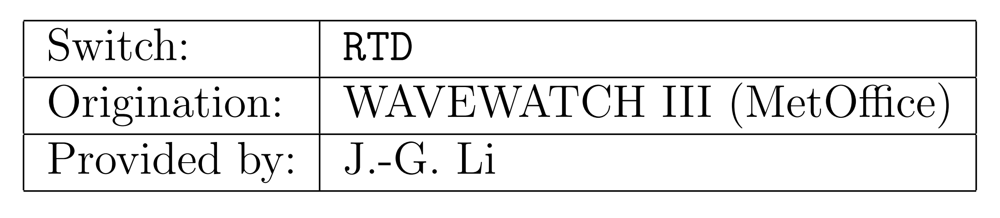

旋转网格是一个纬度-经度（lat-lon）网格，通过沿经度 $\lambda_p$ 将北极旋转到标准纬度-经度系统中纬度 $\phi_p$ 的新位置获得。选择新的极点位置是为了使感兴趣的模型域可以围绕旋转后的赤道区域布置，从而获得均匀间距的 lat-lon 网格。因此，旋转网格也被称为赤道网格。例如，英国气象局使用的北大西洋和欧洲波浪（NAEW）模型，其旋转极点设置在 37.5N, 177.5E，使伦敦（约 51.5N, 0.0E）几乎位于旋转赤道上。与同一区域的标准 lat-lon 网格相比，旋转网格在 NAEW 域内允许获得更均匀的 lat-lon 网格。

在 WAVEWATCH III 中，旋转网格的实现对原始 lat-lon 网格的更改最小。实际上，在模型内部旋转网格与标准 lat-lon 网格相同。要设置并运行旋转网格模型配置，用户应选择常规 lat-lon 网格并启用 RTD 开关。旋转极点位置通过输入文件 ww3_grid.inp 中 ROTD namelist 下的 PLAT 和 PLON 变量设置（见 G.1.1 节）。若设置 PLAT = 90.0, PLON = -180.0，则网格被视为标准 lat-lon 系统。

模型输入文件，如风场、流场和冰场文件，应映射到旋转网格上。为方便在标准 lat-lon 网格框架下进行嵌套，提供给旋转网格的边界条件数据以及从旋转网格输出的数据，其谱参考标准北方向和标准 lat-lon 网格点值，这些数据在 WAVEWATCH III 内部被转换为旋转网格的 lat-lon。ww3_shel.inp 或 ww3_shel.nml 中二维谱输出位置列表也以标准 lat-lon 指定。

从标准网格嵌套到旋转网格模型时，外层和内层网格在编译模型可执行文件时都应启用 RTD 开关。从旋转网格嵌套到标准网格模型时，内层（标准）网格不需要启用 RTD。

对单向嵌套内层网格的边界点谱输出按附录 B 描述进行传递。边界条件输出在输入文件中定义（见 ww3_grid.inp, G.1.1 节），为内层网格坐标下的直线序列。如果内层网格是旋转网格，其极点位置必须在外层网格的 ROTB namelist 下通过数组元素 BPLAT(n) 和 BPLON(n) 定义，数组索引 n 为边界条件文件 nestn.ww3 的索引（1:9）。

旋转网格的方向和 xy 向量输出可通过在 ww3_grid.inp ROTD namelist 中将 UNROT 变量设为 True 转换为标准网格北方向参考。设置后，对于点输出的 lat-lon 位置，所有方向值如风向、流向和二维谱都转换为标准 lat-lon 方向。网格场去旋转功能在 ww3_ounf、ww3_outf 和 ww3_grib 中应用。运行 ww3_ounf 和 ww3_ounp 时，生成的 netCDF 文件将包含变量属性 direction reference，描述使用的是标准（True North）还是旋转网格方向参考框架。ww3_ounf 生成的网格 netCDF 文件还包含描述旋转模型单元中心在标准 lat-lon 参考框架中位置的二维数组 standard latitude 和 standard longitude。

若用户希望使用 ww3_bound 或 ww3_bounc 边界处理程序生成旋转极点网格的边界条件，需要注意这些程序的输入谱始终应在标准极点上定义。

模块 w3servmd.ftn 提供了六个子程序用于旋转网格转换。

w3spectn 将波谱按 AnglD 逆时针旋转  
w3acturn 将波动能量谱 (k,nth) 按 AnglD 逆时针旋转  
w3thrtn 将方向参数按 AnglD 逆时针旋转  
w3xyrtn 将 xy 向量参数按 AnglD 逆时针旋转  
w3lltoeq 将标准 lat/lon 转换为旋转后的 lat/lon 并加上 AnglD  
w3eqtoll w3lltoeq 的逆操作，但 AnglD 保持不变

这些子程序是自包含的，可在模型之外用于旋转网格文件的前处理或后处理。基于这些子程序已经开发了一些转换工具，但尚未包含在 WAVEWATCH III 中。有关旋转网格模型（NAEW）的示例，可参考回归测试 regtests/ww3_tp2.11。用户还可以在 smc_docs/Rotated_Grid.pdf 中找到更多信息，或联系 Jian-Guo Li 获取帮助（<Jian-Guo.Li@metoffice.gov.uk>）。

## 3.5 谱内传播

### 3.5.1 一般概念

数值分数步算法的第三步考虑折射和残余（流引起的）波数偏移。无论空间网格离散方式和坐标系统如何，此步要解的方程为：

$$\frac{\partial N}{\partial t}+\frac{\partial}{\partial k}\dot{k}_gN+\frac{\partial}{\partial\theta}\dot{\theta}_gN=0 \tag{3.49}$$

$$\dot{k}_g=\frac{\partial\sigma}{\partial d}\frac{\mathbf{U}\cdot\nabla_xd}{c_g}-\mathbf{k}\cdot\frac{\partial\mathbf{U}}{\partial s} \tag{3.50}$$

其中 $\dot{k}_g$ 是相对于网格的波数速度，$\dot{\theta}_g$ 由公式 $(2.15)$ 和 $(2.11)$ 给出。该方程在 $\theta$ 空间不需要边界条件，因为模型按定义使用完整（闭合）的方向空间。然而，在 $k$ 空间中，需要边界条件。在低波数处，假设离散域外不存在波动能量，因此假设在低波数离散边界处不会有能量进入模型。在高波数边界处，跨离散边界的传输按公式 $(2.18)$ 给出的参数化谱形计算。计算 $\dot{\theta}$ 所需的深度导数大多采用中心差分法，对于邻近陆地的点，则只使用海洋点的一侧差分法。

在 $\theta$ 空间的传播在显式数值格式中可能引起实际问题，因为在极浅水或强流切变条件下，折射速度可能变得非常大。类似地，在 $k$ 空间的传播在极浅水中也会遇到类似问题。为了避免因折射导致需要极小时间步，$\theta$ 空间和 $k$ 空间的传播速度（公式 $(2.11)$）需要进行滤波处理。

$$\dot{\theta}=X_{rd}(\lambda,\phi,k)\left(\dot{\theta}_d+\dot{\theta}_c+\dot{\theta}_g\right) \tag{3.51}$$

其中下标 $d$、$c$ 和 $g$ 分别表示公式 $(2.11)$ 中与深度、流和大圆相关的折射速度分量。滤波因子 $X_{rd}$ 对每个波数和位置单独计算，其确定方式保证由于深度折射项引起的 $\theta$ 空间传播的 CFL 数不超过预设（用户定义）值（默认 0.7）。这相当于对某些低频波分量的底坡进行缩减。

在中纬度地区，受影响的分量预计携带的能量较少，因为它们处于极浅水域。携带显著能量的长波分量通常向海岸传播，其能量无论如何都会被耗散。该滤波对短波和靠近极地的情况也很重要。通过减少谱内折射的时间步并检查模型输出中的最大 CFL 数，可以测试该滤波的效果。CFL 数在应用滤波前计算。

谱空间始终使用恒定方向增量和对数频率网格（公式 $(3.1)$ ）离散，以便进行非线性相互作用 $S_{nl}$ 的计算。模型提供一阶、二阶和三阶格式，具体内容将在后续章节中介绍。

### 3.5.2 一阶格式

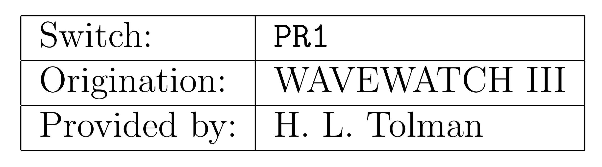

在一阶格式中， $\theta$ 空间和 $k$ 空间的通量通过公式 $(3.6)$ 到 $(3.8)$ 计算（将 $\mathcal{N}$ 替换为 $N$ 并旋转相应计数器）。完整的一阶格式为：

$$\begin{aligned}N_{i,j,l,m}^{n+1}=N_{i,j,l,m}^n+\frac{\Delta t}{\Delta\theta}\left[\mathcal{F}_{l,-}-\mathcal{F}_{l,+}\right]+\frac{\Delta t}{\Delta k_m}\left[\mathcal{F}_{m,-}-\mathcal{F}_{m,+}\right]\end{aligned} \tag{3.52}$$

其中 $\Delta \phi$ 是方向增量， $\Delta k_m$ 是（局部）波数增量。低波数边界条件通过取 $F_{m,-} = 0$ 对 $m = 1$ 应用，高波数边界条件则使用公式 $(2.18)$ 对 $N$ 进行参数化近似计算，将离散网格在高波数方向上扩展一个网格点。

### 3.5.3 二阶格式（UNO）

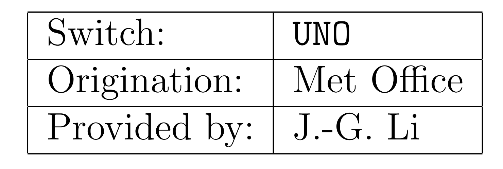

对于方向 $\theta$ 空间，UNO 格式与常规网格相同，假设方向区间间距均匀。然而，对于 $k$ 空间，UNO 格式使用其非规则版本，通过局部梯度而非差分来估计谱分量 $i-1$ 和 $i$ 之间单元面的中点波动能量值，即：

$$N_{i-}^*=N_c+sign\left(N_d-N_c\right)\frac{\left(\Delta k_c-|\dot{k}_{i-}|\Delta t\right)}{2}\min\left(|\frac{N_u-N_c}{k_u-k_c}|,|\frac{N_c-N_d}{k_c-k_d}|\right) $$

其中 $i-$ 是波数 $k$ 的区间索引；下标 $u$、$c$ 和 $d$ 分别表示相对于给定 $i-$ 面速度 $\dot{k}_{i-}$ 的上游、中心和下游单元；$k_c$ 是中心区间波数，$\Delta k_c$ 是中心区间宽度。非规则网格 UNO 格式的详细内容见 Li (2008)。

$\theta$ 空间的边界条件为自然周期条件。对于 $k$ 空间，由于 UNO 格式为二阶精度，在波谱域的两端各增加两个零谱区间。

### 3.5.4 三阶格式（UQ）

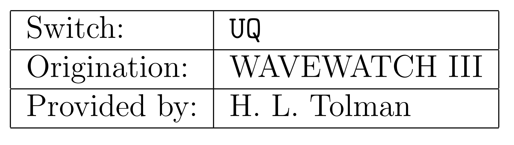

$\theta$ 空间的 ULTIMATE QUICKEST 格式的实现类似于物理空间的格式，但闭合方向空间不需要边界条件。$k$ 空间的可变网格间距需要对格式进行一些修改，如 Leonard (1979, 附录) 所述。此时，公式 $(3.12)$ 到 $(3.16)$ 变为：

$$\mathcal{F}_{m,-}=\left[\dot{k}_{g,b}~N_b\right]_{i,j,l}^n \tag{3.54}$$


$$\dot{k}_{g,b}=0.5\left(\dot{k}_{g,m-1}+\dot{k}_{g,m}\right) \tag{3.55}$$


$$\begin{aligned}N_b=\frac{1}{2}\left[(1+C)N_{i-1}+(1-C)N_i\right]-\frac{1-C^2}{6}\mathcal{CU}~\Delta k_{m-1/2}^2\end{aligned}\tag{3.56}$$


$$\mathcal{CU}=\left\{\begin{array}{cc}\frac{1}{\Delta k_{m-1}}\left[\frac{N_m-N_{m-1}}{\Delta k_{m-1/2}}-\frac{N_{m-1}-N_{m-2}}{\Delta k_{m,-3/2}}\right]&\mathrm{for}\quad\dot{k}_b\geq0\\\\\frac{1}{\Delta k_m}\left[\frac{N_{m+1}-N_m}{\Delta k_{m+1/2}}-\frac{N_m-N_{m-1}}{\Delta k_{m-1/2}}\right]&\mathrm{for}\quad\dot{k}_b<0\end{array}\right.\tag{3.57}$$


$$C=\frac{\dot{k}_{g,b}\Delta t}{\Delta k_{m-1/2}}\tag{3.58}$$

其中 $\Delta k_m$ 是网格点 $m$ 处的离散区间或单元宽度， $\Delta k_{m-1/2}$ 是计数器 $m$ 和 $m-1$ 网格点之间的距离。若使用公式 $(3.58)$ 的 CFL 数，可按公式 $(3.17)$ 到 $(3.20)$ 应用 ULTIMATE 限制器。在低波数和高波数边界处，通量仍采用一阶迎风法估算，边界条件与一阶格式中定义的相同。 $k$ 空间的最终格式为：

$$N_{i,j,l,m}^{n+1}=N_{i,j,l,m}^n+\frac{\Delta t}{\Delta k_m}\left[\mathcal{F}_{m,-}-\mathcal{F}_{m,+}\right]\tag{3.59}$$

## 3.6 非冰源项积分

不涉及冰的源项通过求解以下方程进行处理：

$$\frac{\partial N}{\partial t}=\mathcal{S}_{no ~ice} \tag{3.60}$$

与 WAM 相同，采用半隐式积分格式。在该格式中，波动能量密度的离散变化 $\Delta N$ 表示为（WAMDIG, 1988）：

$$\Delta N(k,\theta)=\frac{\mathcal{S}(k,\theta)}{1-\epsilon D(k,\theta)\Delta t} \tag{3.61}$$

其中 $D$ 表示 $S$ 对 $N$ 的导数的对角项（WAMDIG, 1988，公式 4.1 至 4.10），$\epsilon$ 定义了格式的偏置。最初，$\epsilon = 0.5$ 用于获得二阶精度格式。目前使用 $\epsilon = 1$，因为在谱的平衡区大时间步情况下更为合适（Hargreaves 和 Annan, 1998, 2001），且能使谱的积分更加平滑。改变 $\epsilon$ 对平均波浪参数影响不大，但能使下文描述的动态时间步积分更加高效。

半隐式格式在动态时间步框架下应用（Tolman, 1992）。在该框架中，全局时间步 $\Delta t_g$ 内的积分可分为若干动态时间步 $\Delta t_d$，具体取决于净源项 $S$、波动能量密度的最大变化 $\Delta N_m$ 以及 $\Delta t_g$ 内剩余时间。对于在区间 $\Delta t_g$ 内积分的第 $n$ 个动态时间步，$\Delta t_d^n$ 的计算分三步进行：

$$\Delta t_d^n=\min_{f<f_{hf}}\left[\frac{\Delta N_m}{|\mathcal{S}|}\left(1+\epsilon D\frac{\Delta N_m}{|\mathcal{S}|}\right)^{-1}\right] \tag{3.62}$$


$$\Delta t_d^n=\max\begin{bmatrix}\Delta t_d^n,\Delta t_{d,\min}\end{bmatrix} \tag{3.63}$$


$$\begin{aligned}\Delta t_d^n&=\min\left[\Delta t_d^n,\Delta t_g-\sum_{i=1}^{n-1}\Delta t_d^i\right]\end{aligned} \tag{3.64}$$

其中 $\Delta t_{\text{min}}$ 是用户定义的最小时间步，用于避免时间步过小。对应的新谱 $N^n$ 为：

$$\begin{aligned}N^n=\max\left[0,N^{n-1}+\left(\frac{\mathcal{S}\Delta t_d}{1-\epsilon D\Delta t_d}\right)\right]\end{aligned} \tag{3.65}$$

波动能量密度的最大变化 $\Delta N_m$ 由波动能量密度的参数化变化 $\Delta N_p$ 和滤波后的相对变化 $\Delta N_r$ 决定。

$$\Delta N_m(k,\theta)=\min[\Delta N_p(k,\theta),\Delta N_r(k,\theta)]\tag{3.66}$$

$$\begin{aligned}\Delta N_p(k,\theta)=X_p\frac{\alpha}{\pi}\frac{(2\pi)^4}{g^2}\frac{1}{\sigma k^3}\end{aligned} \tag{3.67}$$

$$\Delta N_r(k,\theta)=X_r\mathrm{~max~}\begin{bmatrix}N(k,\theta),N_f\end{bmatrix} 
\tag{3.68}$$

$$N_f=\max\left[\Delta N_p(k_{\max},\theta),X_f\max_{\forall k,\theta}\left\{N(k,\theta)\right\}\right] \tag{3.69}$$

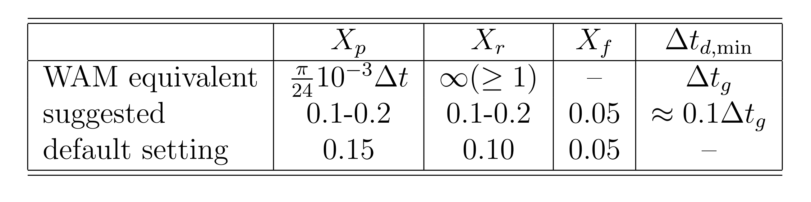

表 3.1：源项积分格式中的用户自定义参数

其中 $X_p$、$X_r$ 和 $X_f$ 是用户定义的常数（见表 3.1），$\alpha$ 是谱峰能量水平（设置为 $\alpha = 0.62 \times 10^{-4}$），$k_{\text{max}}$ 是最大离散波数。公式 $(3.67)$ 中的参数化谱形在深水中对应著名的一维频谱高频形状 $F(f) \propto f^{-5}$。公式 $(3.69)$ 中滤波水平与最大参数化变化之间的关系用于确保在极小波能量情况下动态时间步仍保持合理。

为保证积分稳定性，波动能量密度的离散变化在公式 $(3.63)$ 决定 $\Delta t_d^n$ 的条件下被限制为最大参数化变化 $(3.67)$。此时公式 $(3.63)$ 成为类似 WAM 模型的限制器。限制器的影响可参见 Hersbach 和 Janssen (1999, 2001)、Hargreaves 和 Annan (2001) 以及 Tolman (2002c) 的讨论。

动态时间步对每个网格点单独计算，仅对谱发生快速变化的网格点增加额外计算量。源项在每个动态时间步重新计算。

WAVEWATCH III 可以在不使用线性增长项的情况下编译。在这种情况下，波浪只能在谱中已有能量时增长。在持续低风速的小尺度应用中，部分模型区域的波能可能完全消失。为了确保风增大时波浪能够增长，WAVEWATCH III 提供了所谓的播种（seeding）选项（在编译时选择）。如果选择播种选项，播种频率 $\sigma_{\text{seed}} = \min(\sigma_{\max}, 2\pi f_{\text{hf}})$ 处的能量水平至少应包含最小波动能量密度。

$$\begin{aligned} 
N_{\min}(k_{seed},\theta)&=6.25\times10^{-4}\frac{1}{k_{\mathrm{seed}}^3\sigma_{\mathrm{seed}}}\max\left[0.,\cos^2(\theta-\theta_w)\right]\\\\&\min\left[1,\max\left(0,\frac{|u_{10}|}{X_\mathrm{seed}g\sigma_\mathrm{seed}^{-1}}-1\right)\right]\end{aligned}
\tag{3.70}$$

其中 $g\sigma_{\text{seed}}^{-1}$ 近似最高离散频率的平衡风速。该最小波动能量分布沿风向排列，在低风速下趋于零，在高风速下与积分限制器 $(3.67)$ 成正比。$X_{\text{seed}} \ge 1$ 是用户定义参数，用于将播种频率向高频偏移。当风速达到最高离散频率平衡风速的 $X_{\text{seed}}$ 倍时，播种开始；当风速达到该值两倍时，播种达到最大强度。模型默认设置包含播种算法，$X_{\text{seed}} = 1$。

在模型版本 3.11 中，引入了近岸区物理参数化。该物理过程，特别是深度引起的破浪作用，其时间尺度远小于远海和非近岸浅水区物理过程。为确保在较大时间步下的合理行为，从 SWAN 模型采用了一个附加可选限制器，可代替显式建模近岸破浪。该限制器类似于深度受限破浪源项（公式 $(2.184)$ ）中的 Miche 风格最大波高。在该限制器中，最大波能量 $E_m$ 计算为：

$$E_m=\frac{1}{16}[\gamma_{lim}\tanh(\overline{k}d)/\overline{k}]^2\tag{3.71}$$

其中 $\gamma_{\text{lim}}$ 是一个与公式 $(2.184)$ 中 $\gamma_M$ 类似的系数，但不同之处在于，$\gamma_M$ 代表单个波，而 $\gamma_{\text{lim}}$ 代表有效波高 $H_s$。对于单色波，Miche (1944) 的原始表达式对应 $\gamma_{\text{lim}} = 0.94$，并将 $H_s$ 替换为波高 $H$。这里该思想被应用于随机波。在浅水中，该限制器将 $H_s$ 限制为小于 $\gamma_{\text{lim}} d$。

若总谱能量 $E$ 大于最大能量 $E_m$，则通过将谱按因子 $E/E_m$ 重新缩放来应用限制器，这大致遵循 Eldeberky 和 Battjes (1996) 的论证，并在第 2.3.19 节中使用。该限制器可在模型编译时开启或关闭，$\gamma_{\text{lim}}$ 可由用户调整。默认设置为 $\gamma_{\text{lim}} = 1.6$，因为实际记录中 $H_{\text{rms}}$ 值接近水深 $d$，并且取 $H_s/H_{\text{rms}} = 1.4$，使用 1.6 可使这种大陡度略微超出一定余量。需要注意的是，该限制器应仅作为"安全阀"，因此其约束应比显式建模的破浪或白浪源项的破碎判据宽松。

此外，该限制器不能保证谱的所有部分都真实合理。实际上，如 Komen 等耗散方法中使用平均波数，可能导致涌浪存在时短波过于陡峭。该限制器未来的扩展可通过对频率进行部分谱积分来限制陡度，以确保各尺度波浪的陡度均不过大。

## 3.7 冰源项积分

由于冰中的衰减和散射可能非常强（尽管它们是线性的），因此对冰源项 $S_{\text{ice}} = S_{\text{id}} + S_{\text{is}}$ 进行单独积分是更为方便的。这包括一个耗散项

$$S_{\mathrm{id}}/\sigma=\beta_{\mathrm{id}}N\tag{3.72}$$

以及一个散射项，其形式为：

$$\begin{aligned}\frac{S_{\mathrm{is}}(k,\theta)}{\sigma}&=\int_0^{2\pi}\beta_{\mathrm{is}}[N(k,\theta^{\prime})-N(k,\theta)]d\theta^{\prime}\end{aligned}\tag{3.73}$$

其中散射系数 $\beta_{\text{is}}$ 是先验的，它依赖于入射方向 $\theta'$ 与散射方向 $\theta$ 的差异，以及冰块的形状。通常，方向谱 $N(k, .)$ 是一个包含 $N_{\text{TH}}$ （方向数量）分量的向量，而源项也是同样大小的向量，可表示为矩阵乘积 $S/\sigma = M N(k,.)$ ，其中 $M$ 是一个正对称的 $N_{\text{TH}} \times N_{\text{TH}}$ 方阵，其分量由 $\beta_{\text{id}}$ 值给出。矩阵 $M$ 可容易地对角化为：

$$M=VDV^T\tag{3.74}$$

其中 $D$ 是包含所有特征值的对角矩阵， $V$ 是特征向量矩阵， $V^T$ 是其转置。因此，冰源项的分裂波动能量方程为：

$$\frac{\partial}{\partial t}\frac{N}{c_g}=\frac{S_{\mathrm{id}}}{\sigma c_g}\tag{3.75}$$

可对每个特征向量 $V_i$ 对应的波动能量 $N_i$ （特征值为 $\lambda_i$ ）重写为：

$$\begin{aligned}\frac{\partial}{\partial t}\frac{N_i}{c_g}&=\frac{\beta_{\mathrm{id}}+\lambda_i}{\sigma c_g}N_i\end{aligned} \tag{3.76}$$

其精确解为：

$$\begin{aligned}N_i(t+\Delta t_g)=N_i(t)\exp\left[(\beta_{\mathrm{id}}+\lambda_i)+\Delta t_g\right]\end{aligned} \tag{3.77}$$

在所有情况下，对应各向同性谱的特征向量的特征值为 $\lambda = \beta_{\text{id}}$ 。对于各向同性后向散射，其余特征值都等于 $(\beta_{\text{id}} + \beta_{\text{is}})$ 。这种在两个特征空间上的分解将解简化为：

$$\begin{aligned}N(t+\Delta t_g)=\exp(\beta_\mathrm{id}\Delta t_g)\overline{N}(t)+\exp\left[\left(\beta_\mathrm{id}+\beta_\mathrm{is}\right)\Delta t_g\right]\left[N(t)-\overline{N}(t)\right]\end{aligned} \tag{3.78}$$

其中 $\overline{N}$ 是对所有方向的平均值。因此，对于空间均匀场，谱会以时间尺度 $1/(\beta_{\text{id}})$ 指数趋向各向同性。

## 3.8 简单冰阻塞（IC0）

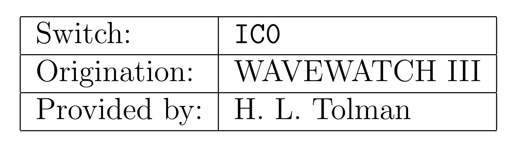

在 WAVEWATCH III 中，冰覆盖海域被视为"陆地"，假设波能为零，并且冰缘处的边界条件与海岸线处相同。当冰浓度超过用户定义的临界值时，相应网格点将不参与计算；当冰浓度低于该临界值时，该网格点被"重新激活"。随后，谱将使用基于局地风向的 PM 谱进行初始化，其峰值频率对应于网格中第二高的离散频率。采用低能量谱以确保即使在浅水沿海点，谱形也保持合理。

上述不连续冰处理是 WAVEWATCH III 的默认设置。在第 3.4.7 节讨论的未解析障碍物建模框架下，也提供了一种连续方法，如 Tolman (2003b) 所述。在该方法中，给定用户定义的临界冰浓度 $\epsilon_{c,0}$（开始阻塞）和 $\epsilon_{c,n}$（完全阻塞），默认值为 $\epsilon_{c,0} = \epsilon_{c,n} = 0.5$，即不连续冰处理。根据这些临界浓度，计算相应的衰减长度尺度为：

$$l_0=\epsilon_{c,0}\min(\Delta x,\Delta y)\tag{3.79}$$

$$l_n=\epsilon_{c,n}\min(\Delta x,\Delta y)\tag{3.80}$$

由此可计算 $x$ 和 $y$ 方向上的单元透过率（分别为 $\alpha_x$ 和 $\alpha_y$ ），其表达式为：

$$\alpha_x=\left\{\begin{array}{ccc}1&\mathrm{for}&\epsilon\Delta x<l_0\\0&\mathrm{for}&\epsilon\Delta x>l_n\\\frac{l_n-\epsilon\Delta x}{l_n-l_0}&\mathrm{otherwise}\end{array}\right.,\alpha_y=\left\{\begin{array}{ccc}1&\mathrm{for}&\epsilon\Delta y<l_0\\0&\mathrm{for}&\epsilon\Delta y>l_n\\\frac{l_n-\epsilon\Delta y}{l_n-l_0}&\mathrm{otherwise}\end{array}\right.$$

该模型的详细内容可参见 Tolman (2003b)。

模型中冰图的更新发生在离散模型时间上，大约位于旧冰图和新冰图有效时间之间的中点。如果两个冰场的时间标记相同，则不会更新冰图。

上述描述对应开关 IC0。需要注意的是，传播中的冰透过率方法（IC0）与将冰作为源项的方法（IC1、IC2、IC3）二者只能选择其一，不能同时使用。

## 3.9 风和流

模型输入主要包括风场和流场。在模型内部，风和流在每个时间步 $\Delta t_g$ 更新，并表示该时间步结束时的数值。提供多种插值方法（在编译时选择）。默认情况下，时间插值采用速度和方向的线性插值（风或流按最小角度变化）。

风速或流速也可选择进行校正，以（近似）守恒能量，而非直接对风速进行线性插值。相应的校正因子 $X_u$ 计算为：

$$X_u=\max\left[1.25,\frac{u_{10,rms}}{u_{10,l}}\right]\tag{3.82}$$

其中 $u_{10,l}$ 是线性插值得到的风速，$u_{10,\text{rms}}$ 是均方根插值得到的风速。最后，风场也可选择保持常值并进行不连续更新（该选项不适用于流场）。

需要注意的是，WAVEWATCH III 的辅助程序包括一个用于输入场预处理的程序（见第 4.4.7 节）。该程序将网格化场插值到波浪模型网格上。对于风和流，该程序采用矢量分量的双线性插值。通过使用类似于公式 $(3.82)$ 的校正因子，可以对该插值进行校正，以（近似）守恒风或流的速度或能量。

## 3.10 潮汐分析的使用


为减少输入文件体积，水位和流场可通过其潮汐振幅和相位来定义。启用 TIDE 开关后，模型会在 current.ww3 和 level.ww3 文件中识别所需信息。潮汐分析可使用 ww3_prnc 预处理程序，从 NetCDF 格式的流场或水位文件中执行。该分析方法采用 Foreman 等（2009）提出的灵活潮汐分析工具。预计算的潮汐分量可在运行时由 ww3_shel 使用。

然而，由于需要存储大量潮汐分量，该方法可能效率不高，因为与其他强迫参数类似，这些分量不会在处理器之间分解：每个处理器都存储完整空间网格的强迫参数。为避免这一问题，可使用潮汐分量通过潮汐预报程序 ww3_prtide 生成时间序列，该程序输出常规的 current.ww3 或 level.ww3 文件。

用于分析和预报的潮汐分量在 ww3_prnc 和 ww3_prtide 的输入文件中指定。定义了两个快捷选项。其中 VFAST 包含以下 20 个分量：Z0（平均值）、SSA、MSM、MSF、MF、2N2、MU2、N2、NU2、M2、S2、K2、MSN2、MN4、M4、MS4、S4、M6、2MS6 和 M8。使用 ww3_shel 进行潮汐预报时，流场或水位的时间步设为 1800 s。

在 ww3_prtide 中，还对潮汐分量值进行质量检查：可在 ww3_prtide.inp 中定义某些分量振幅的不合理上限。若模型网格点的振幅超过该上限，则除 UNST 网格外，所有分量均设为零；对于 UNST 网格，则搜索邻近点以提供合理数值，避免出现强梯度。

## 3.11 波峰与波高的时空极值


WAVEWATCH III 中的时空（ST）极端波基于欧拉示性数（EC）方法进行建模。该方法指出，对于给定的多维（二维空间 + 时间）、统计上均匀且平稳的高斯随机波场，最大海面位移的超越概率可通过欧拉示性数的平均值进行近似（Fedele 等，2012）。

此处使用的 ST 极端海面位移模型由 Fedele (2012) 针对高斯海浪提出，并由 Fedele 等（2013）扩展至二阶非线性空间波场，由 Benetazzo 等（2015）扩展至时空波场。所提出的 ST 线性极值模型已通过数值模拟进行评估（Barbariol 等，2015，2016），其二阶非线性扩展则通过立体成像观测得到验证（Fedele 等，2013；Benetazzo 等，2015）。

根据上述模型，当阈值 $z_2$ 相对于海面位移标准差 $\sigma$ 足够大时，二阶非线性时空最大波峰高度 $\eta_{2ST_m}$ 的超越概率可近似表示为：

$$\begin{aligned}P(\eta_{2ST_m}>z_2)&\approx\left[N_{3D}\left(\frac{z_1}{\sigma}\right)^2+N_{2D}\left(\frac{z_1}{\sigma}\right)+N_{1D}\right]\exp\left(-\frac{z_1^2}{2\sigma^2}\right)\end{aligned} \tag{3.83}$$

其中，非线性阈值 $z_2$ 通过 Tayfun 二次方程与其线性近似 $z_1$ 相联系，该关系使用陡度参数 $\mu$ 表示。该关系在严格意义上适用于深水条件，并考虑了谱带宽效应。

参数 $N_{3D}$、$N_{2D}$ 和 $N_{1D}$ 分别表示在时空区域内三维、二维和一维波的平均个数。这些参数由方向波谱 $S(k,\theta)$ 的谱矩 $m_{ijl}$ 决定，其定义如下：

$$m_{ijl}=\int k_x^ik_y^j\omega^lS(k,\theta)~dk~d\theta \tag{3.84}$$

式 (3.83) 中的平均波数还取决于所选时空区域的尺度，即：沿平均波传播方向的空间尺度 $X$、与平均传播方向正交的空间尺度 $Y$，以及持续时间 $D$。

随机变量 $\eta_{2ST_m}$ 的期望值 $\overline{\eta}_{2ST_m}$ （输出参数 STMAXE，单位为米）表示为：

$$\begin{aligned}&\bar{\eta}_{2ST_m}=\mathbb{E}\left\{\eta_{2ST_m}\right\}=\\&\sigma\left[(h_1+\frac{\mu}{2}h_1^2)+\gamma\left(h_1-\frac{2N_{3D}h_1+N_{2D}}{N_{3D}h_1^2+N_{2D}h_1+N_{1D}}\right)^{-1}(1+\mu h_1)\right]\end{aligned} \tag{3.85}$$

其中， $\gamma \approx 0.5772$ 为 Euler-Mascheroni 常数， $h_1$ 为无量纲（相对于海面位移标准差 $\sigma$ ）的最可能极值（即众数），它是关于 $h$ 的隐式方程的最大解：

$$\begin{bmatrix}N_{3D}h^2+N_{2D}h+N_{1D}\end{bmatrix}\exp\left(-\frac{h^2}{2}\right)=1\tag{3.86}$$

波峰高度 $\eta_{2ST_m}$ 的标准差 $\sigma_{2m}$ （输出参数 STMAXD，单位为米）表示为：

$$\sigma_{2_m}=std(\eta_{2ST_m})=\sigma\frac{\pi}{\sqrt{6}}\left(h_1-\frac{2N_{3D}h_1+N_{2D}}{N_{3D}h_1^2+N_{2D}h_1+N_{1D}}\right)^{-1}(1+\mu h_1)$$

时空极端波峰---波谷波高的期望值采用准确定性（Quasi-Determinism, QD）模型进行计算。该模型用于预测波群在达到峰值发展阶段附近的平均形态。

根据 QD 模型，具有线性极端波峰高度 $\overline{\eta}_{1ST_m}$ 的波，其峰---谷波高的期望值 $\bar{H}_{1cm}$ （输出参数 HCMAXE，单位为米）表示为：

$$\begin{aligned}\bar{H}_{1_{cm}}=\mathbb{E}\left\{H_{1_{cm}}\right\}=\bar{\eta}_{1ST_m}(1-\psi_1^*/\sigma^2)\end{aligned}\tag{3.88}$$

其中， $\psi_1^{*} < 0$ 为时间自协方差函数的第一个极小值，该自协方差函数由谱计算得到，其表达式为：

$$\psi_1(\tau)=\int S(\omega)\cos{(\omega\tau)}d\omega\tag{3.89}$$

并且， $\bar{\eta}_{1ST_m}\psi_1^*/\sigma^2<0$ 表示与期望线性极端波峰高度 $\overline{\eta}_{1ST_m}$ 相邻（之前或之后）的波谷的期望位移。该值通过在式 (3.85) 中令波陡度 $\mu = 0$ 计算得到。

对于给定的线性波群， $\bar{H}_{1_{cm}}$ 通常小于最大期望波高 $\bar{H}_{1_m}$ （输出参数 HMAXE，单位为米），其计算公式为：

$$\bar{H}_{1_m}=\mathbb{E}\left\{H_{1_m}\right\}=\bar{\eta}_{1ST_m}\sqrt{2(1-\psi_1^*/\sigma^2)}\tag{3.90}$$

二阶非线性对波高的影响通常较小，尤其是在窄频带海况下。因此，在当前实现中为降低计算成本，将忽略二阶非线性效应。

$\bar{H}_{1_{cm}}$ （输出参数 HCMAXD，单位为米）和 $\bar{H}_{1_m}$ （输出参数 HMAXD，单位为米）的不确定性，通过 ${\eta}_{1ST_m}$ 的标准差 $\sigma_{1m}$ 来确定。该 $\sigma_{1m}$ 由式 (3.87) 在令波陡度 $\mu = 0$ 时计算得到，其表达式为：

$$\begin{aligned}std(H_{1_m})=&~\sigma_{1_m}\sqrt{2(1-\psi_1^*/\sigma^2)}\\\\std(H_{1_{cm}})=&~\sigma_{1_m}(1-\psi_1^*/\sigma^2)\end{aligned}\tag{3.91}$$

要在 WAVEWATCH III 中启用波峰与波高的时空极值计算，用户需要在 ww3_grid.inp 文件的 MISC namelist 中，将参数 STDX、STDY 和 STDT 设置为不同于 -1 的数值（默认值 -1 用于在不需要该功能时避免额外计算开销）。

- STDX 和 STDY：用于计算极值的空间尺度；

- STDT：用于计算极值的时间长度。

若 STDX 和 STDY 保持默认值（-1），而 STDT 被设置为非默认值（例如大于 0），则计算的是某一点随时间变化的极值。

相反，若 STDT 保持默认值（-1），而 STDX 和 STDY 大于 0，则计算的是某一时刻空间范围内的瞬时极值。

当三个参数均大于 0 时，则同时计算时空联合极值概率及对应数值。

波峰与波高的时空极值输出遵循 WAVEWATCH III 的标准参数框架，需在 ww3_shel.inp 或 ww3_multi.inp 中通过 namelist 或标志进行指定。启用后，这些变量将被包含在模型运行期间生成的标准网格二进制输出文件中。因此，在后处理网格输出文件以生成可读格式时，也必须在相应的后处理程序中指定这些参数。

WAVEWATCH III 中可用的时空极值输出参数列于表 3.2。

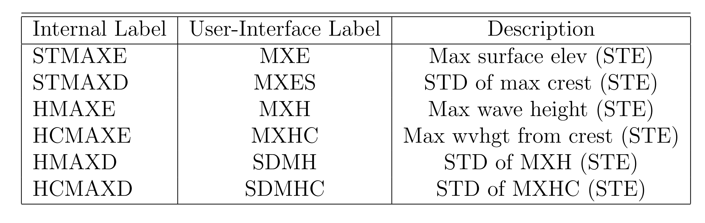

表 3.2：波峰与波高时空极值计算中的用户自定义参数。

## 3.12 谱分区


数值波浪模式预测的海况通常较为复杂，这是由于局地风作用以及远处风暴所形成的多个波系共同存在所致。为了在不处理完整波谱复杂性的情况下，更好地描述局地风浪和远程涌浪成分，可以将波谱划分为若干谱单元集合，从中提取更易识别的波浪统计量（如波高、周期、方向）。

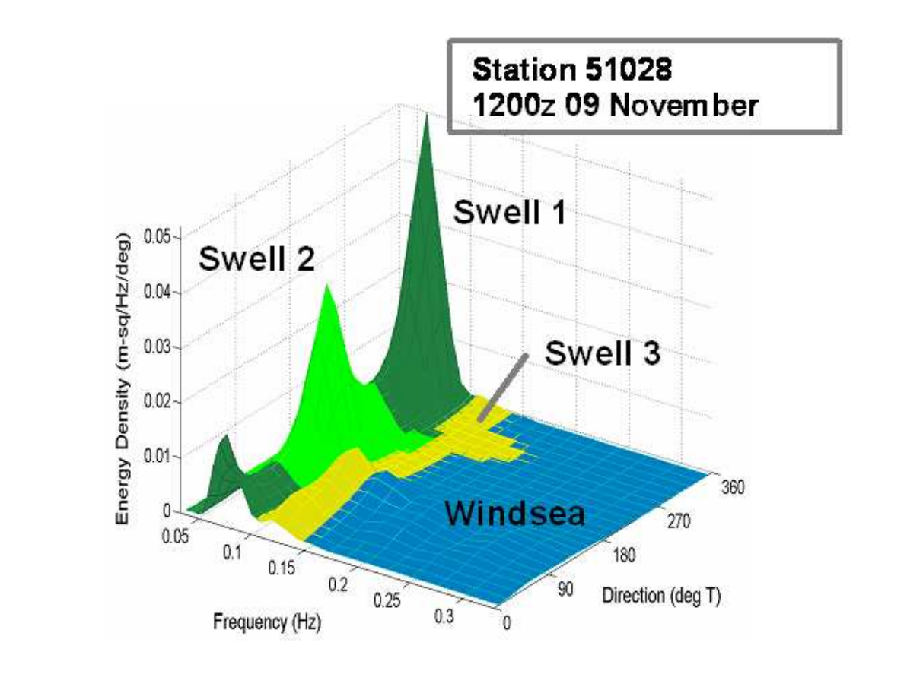
图 3.7：能量密度谱的表面图，显示风浪和三个涌浪波系的谱分区。这是 2000 年 11 月 9 日 12:00 UTC 在圣诞岛（NOAA 浮标 51028）处回算海况的一个瞬时快照。

图 3.7 给出了某一时刻某一网格点处能量密度谱的表面图示例。该表面表示各频率---方向交点处的能量密度大小。图中表面被划分为若干阴影区域或分区，代表谱中子峰对应的能量。图 3.7 显示了四个谱分区，包括一个风浪区和三个涌浪波系。该谱所表示的总能量可以用整体参数（如有效波高 $H_s$）来描述。阴影区域即谱分区，反映了该网格点能量分布的谱子结构特征。

WAVEWATCH III 提供点输出和场输出选项，用于给出各个谱分区的定量描述，包括分区波高、分区峰值周期（抛物线拟合）、分区峰值波长、分区平均方向、分区风浪比例（$W$，由式 (2.274) 计算）以及分区数量。在场输出中，这些参数对应谱分区输出场 1 至 17，详见第 2.7 节。

在波浪预报领域，不同的谱分区方法以及风浪与涌浪的判别方法已被采用。W3PARTMD 模块提供两类分区方法：

1.  地形分区方法，将谱单元分组为多个独立的波系；  
2.  基于简单频率截止的方法，生成两个分区：一个位于截止频率以上，另一个位于截止频率以下。

WAVEWATCH III 中的地形分区方法均基于分水岭技术，采用 B. Tracey 实现的原始分区代码（见下文）。这些方法还根据分区被判定为风浪或涌浪的方式进一步分类。

频率截止方法则根据用户选择而变化：可以使用固定频率（例如区分高频风浪与低频涌浪），也可以根据局地风速和风向动态调整阈值频率。

### 3.12.1 地形分区方法


图 3.7：能量密度谱的表面图，显示风浪和三个涌浪波系的谱分区。这是 2000 年 11 月 9 日 12:00 UTC 在圣诞岛（NOAA 浮标 51028）处回算海况的一个瞬时快照。

由于图 3.7 中的二维波谱类似于一个拓扑表面，因此采用将谱面视为地形表面的图像处理分区算法是合理的。图 3.7 所示的分区基于数字图像处理中的分水岭算法（Vincent and Soille, 1991），该方法最早由 Hanson 和 Jensen（2004）用于海洋波浪数据分析。

美国大陆分水岭是分水线的典型例子：其以东的水流入大西洋，以西的水流入太平洋。海洋代表极小值，从而确定分水线的位置。若将谱面倒置，则谱峰变为汇水盆地，可利用 Vincent and Soille（1991）算法确定分水线或分区边界。随后可计算各谱分区的参数，并应用 Hanson and Phillips（2001）所述的波系分析方法。

Hanson 和 Jensen（2004）以及 Hanson 等（2006）使用 MATLAB 代码实现 Vincent and Soille（1991）算法。该代码自 WAVEWATCH III 3.11 版本起已转换为高效的 FORTRAN 程序。其实现遵循 Vincent and Soille（1991）的算法，同时结合了 Tracy 等（2006）提出的高效排序算法（时间复杂度为 $O(n)$）。

### 3.12.2 风浪/涌浪分类与分区方法

分区过程的第二阶段是在点输出或场输出中，将各个分区划分为（风）浪和涌浪类别。在 WAVEWATCH III 的默认设置中，包含一个风浪分区（分区 1）以及若干按波高排序的涌浪分区。选择其他分区方法时，分类方式将相应改变。

分区方法通过 ww3_grid.inp 文件中 MISC namelist 的 PTM 参数进行设置：

- PTM=1：采用地形分区方法定义风浪和涌浪，并通过风浪比例阈值进行分类（WAVEWATCH III 默认方案）。输出包括风浪以及涌浪 1、2、3 等。

- PTM=2：采用地形分区方法并结合谱波龄截止来定义风浪和涌浪。输出包括风浪以及涌浪 1、2、3 等。

- PTM=3：仅采用地形分区方法定义波浪成分。输出按波高排序的分区 1、2、3 等。

- PTM=4：采用谱波龄截止方法定义风浪和涌浪。输出包括风浪和单一涌浪分区。  

- PTM=5：采用用户自定义频率截止（PTFCUT）定义波浪成分。输出高频分区和低频分区。

在 PTM1 中，对于风浪能量比例超过设定阈值的地形分区，将其合并并归类为风浪分区（例如第一个分区）。其余分区则按波高递减顺序归类为涌浪分区。

PTM2 的工作方式与 PTM1 非常相似。首先识别一个主风浪分区，并将其设为第一个分区；随后识别若干涌浪（或次级风浪）分区。具体做法为：先通过地形方法建立一组次级谱分区，然后逐一检查每个分区，将其中受风影响的谱单元（基于波龄判据）移除，并将其作为独立的次级风浪分区。默认情况下，这些次级风浪分区会合并为一个单一分区；若在 namelist 中将参数 FLC 设为".False."，则它们可以保持独立。随后，涌浪分区和次级风浪分区按波高递减排序。英国气象局的业务预报表明，当 PTM2 采用默认的单一风浪分区时，相比 PTM1，可在空间上获得更平滑的分区过渡，并使主风浪成分与风速之间的联系更加直接。在默认设置下，除主风浪分区外，其余分区的风浪比例应接近 0.0。

PTM3 不对地形分区进行风浪或涌浪分类，而仅按波高排序。当用于仅采用有限数量分区进行谱重构应用（例如 Bunney 等，2013）时，该方法较为有用，因为此时分区是风浪还是涌浪并不如其所占总谱能量比例重要。

PTM4 和 PTM5 不使用分水岭分区方法，而采用更简单的频率截止方式，仅生成两个分区。PTM4 使用基于局地风速推导的波龄判据，将波谱划分为风浪和单一涌浪分区。在该方法中，波速大于局地风速在波传播方向上的分量的波被视为自由传播的涌浪（即不受风强迫）。这与 WAM 模式中常用的风浪与涌浪划分方法类似。

PTM5 的方法类似，但采用用户定义的静态频率截止将波谱划分为低频和高频两个分区。截止频率在 MISC namelist 中通过 PTFCUT 指定，默认值为 0.1 Hz。当下游应用将周期大于某一固定值的波简单定义为涌浪时，该方法较为适用。这与 SWAN 模式中的默认分区方法类似。

对于 PTM1、PTM2 和 PTM4 方法，可通过修改 MISC namelist 中的 WSM 因子来控制风速截止。该因子对风速施加一个常数乘数，默认值为 1.0。

目前，采用 PTM1 和 PTM2 方法的输出可通过任何 WAVEWATCH III 标准输出处理工具获得。全部分区方法均可通过 ww3_ounf 模块用于网格输出，生成的 netCDF 文件将在变量属性中包含所使用的分区方法信息。

需要注意的是，对于 PTM4 和 PTM5 方法，只会生成两个分区，因此 MISC namelist 中的 NOSWLL 参数（默认值为 5）将被覆盖为 2。同样，风浪比例截止值 WSCUT 将被设为 0.0。

回归测试 regtests/ww3_tpt1.1 提供了各分区方法的示例。

## 3.13 波系的时空跟踪

上述谱分区过程是在谱空间内进行的，并且在每一个地理网格点上相互独立地执行。因此，在地理空间和时间上，各分区之间不存在连贯性。根据 Voorrips 等（1997）、Hanson 和 Phillips（2001）以及 Devaliere 等（2009）的方法，需要增加一个空间相关步骤。

该步骤通过一个向外扩展的螺旋路径实现，该螺旋从计算域内部的某一点（通常为中心点）开始。图 3.8 给出了在包含陆地的规则海岸计算网格上应用该跟踪螺旋的示例。在螺旋起点（位置 1），为每一个谱分区赋予一个初始波系编号。随后沿螺旋向外移动，对后续地理位置（2、3、4......）逐点进行空间相关分析。

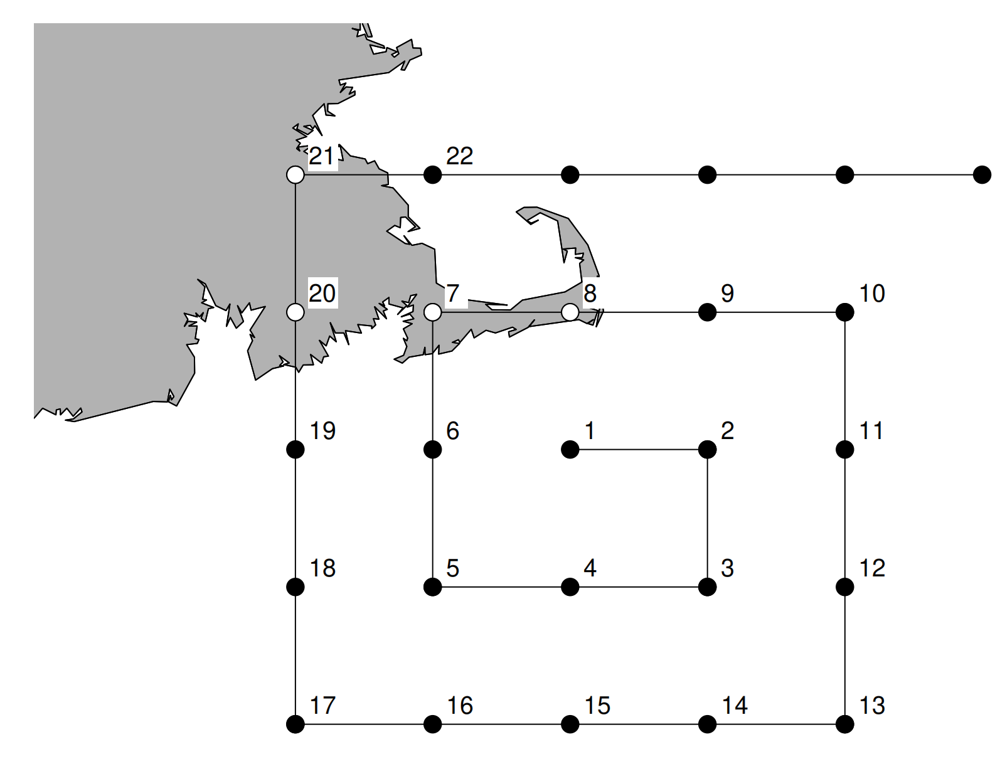

图 3.8：在包含陆地（阴影部分）的沿海规则计算网格上应用跟踪螺旋的示例。黑点表示活动网格点，白点表示非活动（干）网格点。

在每一个新的地理位置处，其各谱分区的峰值周期 $T_p$ 、峰值方向 $\theta_p$ 和有效波高 $H_{m0}$ ，与其邻近地理网格点（以上标 $n$ 表示）中已被赋予某一波系 $i$ 的对应参数空间平均值 $\tilde{T}_{p,i}^{n}$ 、 $\tilde{\theta}_{p,i}^{n}$ 和 $\tilde{H}_{m0,i}^{n}$ 进行相关比较。

当前网格点的分区将被归入使以下拟合优度（Goodness-of-Fit，GoF）函数最小的邻近波系 $i$：

$$GoF_i=\left(\frac{T_{\mathrm{p}}-\tilde{T}_{\mathrm{p},i}^\mathrm{n}}{\Delta T_{\mathrm{n}}}\right)^2+\left(\frac{\theta_{\mathrm{p}}-\tilde{\theta}_{\mathrm{p},i}^\mathrm{n}}{\Delta\theta_{\mathrm{n}}}\right)^2+\left(\frac{H_{\mathrm{m}0}-\tilde{H}_{\mathrm{m}0,i}^\mathrm{n}}{\Delta H_{\mathrm{n}}}\right)^2\tag{3.92}$$

其中，$\Delta T^n$、$\Delta \theta^n$ 和 $\Delta H^n$ 为组合判据（Van der Westhuysen 等，2016）。若式 (3.92) 右侧前两项中的任意一项在最优匹配情况下超过 1，则认为差异过大，该分区将被赋予一个新的波系编号。此处邻近点的搜索范围设为 1，因此最多可找到四个先前已关联的邻近点（例如位置 15 的已处理邻点为 3、4、5 和 14）。在某些情况下，需要进行迭代合并。

下一步是在时间上对这些波系进行关联。在当前时刻 $t$ 的每一个波系 $i$，都会与前一时刻 $(t-1)$ 的各波系 $j$ 中与之最接近的一个进行匹配。在该过程中考虑三个波系特征：

(i) 波系的空间平均峰值周期 $\tilde{T}_{p,t,i}^{s}$，其中 $s$ 表示系统空间平均；  
(ii) 空间平均峰值方向 $\tilde{\theta}_{p,t,i}^{s}$  
(iii) 两个波系在地理空间上的重叠网格点数 $\cap_{i,j}$。

这些特征被组合成如下的拟合优度（GoF）函数：

$$GoF_{i,j}=\left(\frac{\tilde{T}_{\mathrm{p},t,i}^\mathrm{s}-\tilde{T}_{\mathrm{p},t-1,j}^\mathrm{s}}{\Delta T_\mathrm{s}}\right)^2+\left(\frac{\tilde{\theta}_{\mathrm{p},t,i}^\mathrm{s}-\tilde{\theta}_{\mathrm{p},t-1,j}^\mathrm{s}}{\Delta\theta_\mathrm{s}}\right)^2+\left(\frac{N_{t-1,j}-\cap_{i,j}}{0.5N_{t-1,j}}\right)^2$$

其中，$\Delta T^{s}$ 和 $\Delta \theta^{s}$ 为组合判据，$N$ 为一个波系所包含的网格点总数，详见 Van der Westhuysen 等（2016）。为使跟踪过程更关注波场中的高能区域，各波系的空间平均峰值周期和峰值方向均以有效波高的平方进行加权。

在当前时刻 $t$ 的波系 $i$，将被赋予前一时刻 $(t-1)$ 中使式 (3.93) 最小的波系 $j$。若对该最优匹配波系而言，式 (3.93) 右侧三项中的任意一项超过 1，则为其分配一个新的波系编号。对于最后一项，这意味着需要满足最小空间重叠要求，此处任意设定为 50%。该项主要在大洋尺度计算区域中起作用，因为此时波系通常小于整个计算区域。

为提高稳健性，已识别波系的详细信息将被保留五个时间层次，之后才释放其波系关联。

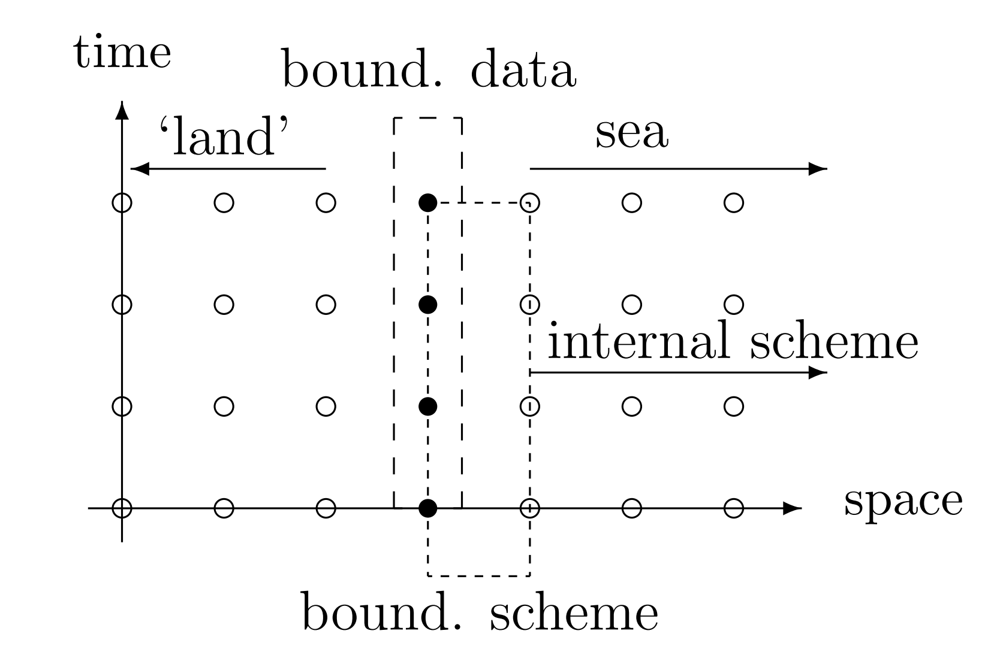

图 3.9：ww3_shel 中使用的传统单向嵌套方法示意图。为便于说明，采用空间与时间的一维表示方式，符号表示网格点。

## 3.14 嵌套


传统上，波浪模式仅采用单向嵌套方式，即由低分辨率网格向高分辨率网格提供边界数据。该方法在 WAVEWATCH III 中一直可用，并在第 3.14.1 节中介绍。自 3.14 版本起，引入了多网格波浪模式驱动程序，实现网格之间的完全双向嵌套，该方法在第 3.14.2 节中介绍。以下示意图基于规则网格，但所述原理同样适用于曲线网格和三角网格。

### 3.14.1 传统单向嵌套

常规波浪模式程序 ww3_shel 仅处理单一波浪模式网格。该程序包含将大尺度计算的边界条件传递至小尺度计算的选项。每次计算可同时接收一组边界条件数据，并最多生成 9 组边界条件数据。

为保证在水深和流场不一致情况下波能守恒，边界数据采用能量谱 $F(\sigma,\theta)$。数据文件包含生成计算中网格点处的谱以及用于在所需边界点处插值谱的信息。若小尺度计算的输入点位于大尺度计算的网格线上，则可最小化传输文件大小。作为输入使用时，谱将在每个全局时间步 $\Delta t_g$ 上进行空间和时间插值，谱分量采用线性插值方法。

在波浪模式中引入边界数据的数值方法如图 3.9 所示。网格中设置活动边界点，以区分海洋点与陆地点或其他被停用的网格点。在活动边界点与海洋点之间应用局地边界格式（通常为一阶）。在模型内部的海洋点上，则采用所选传播格式。

传统单向嵌套方法的实际应用细节在附录 B 中有更详细讨论。

### 3.14.2 双向嵌套

模式 3.14 版本提供了通过 ww3_multi 程序采用多网格或拼接（mosaic）方法进行波浪模拟的选项（Tolman，2006，2007，2008b）。该程序可同时处理任意数量、任意分辨率的网格，并在每个相关的模式时间步之间进行数据交换。

各网格被赋予一个等级编号，等级越低表示分辨率越低；等级相同表示分辨率相近（但不一定完全相同）。考虑三种网格间数据传输方式：

- 从低等级网格向高等级网格传输数据；
- 从高等级网格向低等级网格传输数据；  
- 等等级网格之间的数据传输。

从低等级向高等级网格的数据传输通过向高等级网格提供边界数据实现，与前一节和图 3.9 所述的传统单向嵌套方法相同。

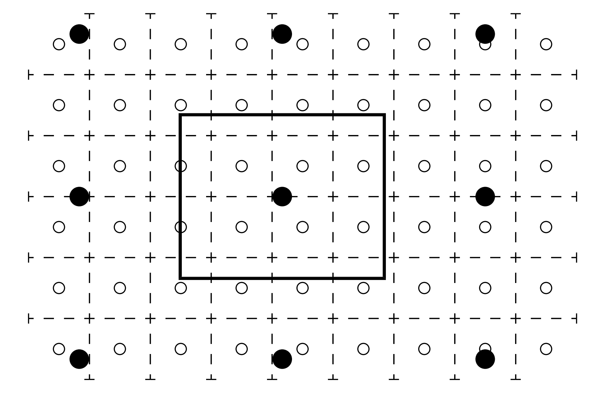

图 3.10：双向嵌套方法中协调低等级网格与高等级网格的概念示意图。◦ 及虚线表示高等级网格点和网格单元，• 及实线表示低等级网格及其中心网格单元。

当该方法与从高等级网格向低等级网格的数据传输相结合时，即形成完整的双向嵌套方案。在 ww3_multi 中，当高等级网格在时间上"追上"低等级网格后，需要将低等级网格中的数据与高等级网格中的数据进行协调一致。

由于低等级网格的分辨率按定义低于高等级网格，因此，从高等级网格中的能量 $E_{h,j}$ 估算低等级网格中的能量 $E_{l,i}$ 的一种自然方式为：

$$E_{l,i}=\sum w_{i,j}E_{h,j} \tag{3.94}$$

其中， $i$ 和 $j$ 分别为两个网格中的网格编号， $w_{i,j}$ 为加权系数。为保证波能守恒，这些权重可定义为：高等级网格中覆盖低等级网格单元 $i$ 的网格单元 $j$ 的面积，与低等级网格单元 $i$ 的面积之比。该方法如图 3.10 所示。为避免循环协调，对于那些向高等级网格提供边界数据的低等级网格点，不采用上述方式更新。

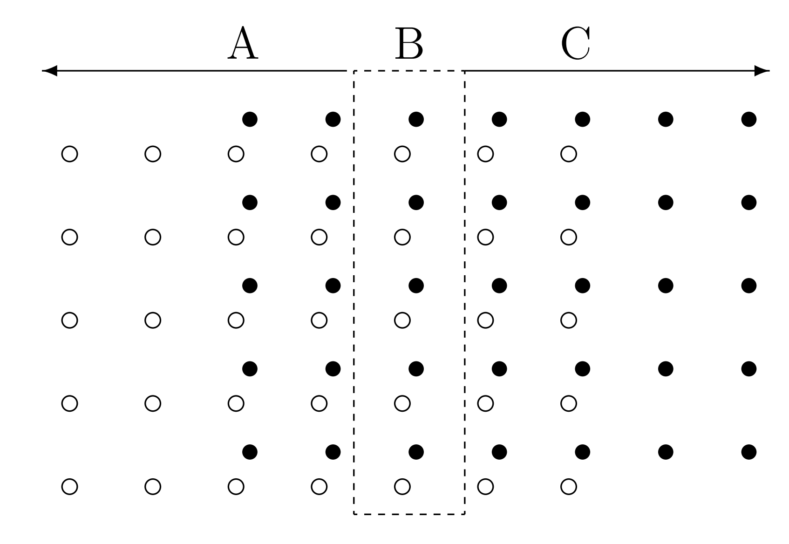
图 3.11：用于协调等级相同、因此分辨率相近的网格的概念示意图。◦ 表示网格 1 的网格点，• 表示网格 2。

对于等级相同且存在重叠的网格，不能采用上述双向嵌套技术进行一致的数据交换。此时，各网格先推进一个时间步，然后按照图 3.11 所示进行协调。以网格 1（图 3.11 中的 ◦）为例，可划分为两个区域。在区域 C 中，自上一次协调以来，边界影响已传播进入网格内部。实际的传播深度取决于数值格式的模板宽度以及传播时间步数。在区域 A 和 B 中，边界信息尚未传播到，可视为网格 1 的"内部"区域。类似地，区域 A 表示网格 2（图 3.11 中的 •）的边界影响传播深度，而区域 B 和 C 为网格 2 的内部区域。

在网格 1 和网格 2 之间进行简单且一致的协调方式为：在区域 A 中仅使用网格 1 的数据（必要时将网格 1 的数据插值到网格 2 的网格点）；在区域 C 中仅使用网格 2 的数据；在区域 B（两个网格内部区域重叠部分）中，通过对两个网格的数据进行加权平均获得一致解。该方法可方便地扩展至多个重叠网格。

对于显式数值传播格式以及分辨率相同且网格点重合的重叠网格，只要重叠区域足够宽，重叠网格与等效单一网格的解可以保持一致。

ww3_multi 中的双向嵌套技术在很大程度上是自动化实现的。每个网格单独准备，并可具有自身的时间步长设置。各网格中需从低等级网格获取边界数据的位置，按单向嵌套方式进行标记。实现双向嵌套所需的其他管理工作均自动完成，但可能需要一定的迭代，以确保每个网格定义的所有输入边界点都能从多网格系统中的其他网格获得边界数据。

或者，各网格也可像传统嵌套方法那样从外部数据文件获取边界数据。在当前实现中，每个网格必须完全从单一文件获取边界数据，或完全从多网格系统中的其他网格获取边界数据，不能同时从文件和其他网格接收数据。关于同时运行多个网格的管理算法细节，可参见 Tolman（2007，第 3.4 节）和 Tolman（2008b）。

需要注意的是，ww3_multi 中使用的各网格不必具有相同的谱离散方式。谱在 ww3_multi 中可实时转换。该方法所采用的数值技术详见 Tolman（2007，第 3.5.5 节）。在这种方法下，多网格生成过程可能较为复杂，并且为保证模式结果一致性，各网格之间必须保持一致性。为此，Chawla 和 Tolman（2007，2008）开发了自动化网格生成工具。

# 4 波浪模型结构和数据流

## 4.1 程序设计

WAVEWATCH III 的核心是波浪模型子程序，该子程序既可以由独立运行的程序外壳调用，也可以由任何需要动态更新波浪数据的其他程序调用。WAVEWATCH III 发布版本中提供了两个此类程序（例如 ww3_shel 和 ww3_multi）。

辅助程序包括：网格预处理程序 ww3_grid、用于生成人工初始条件的程序 ww3_strt、适用于单网格 ww3_shel 或多网格 ww3_multi 应用的通用程序外壳、两个输入预处理程序（ww3_prep 和 ww3_prnc），以及用于网格化输出数据（ww3_outf 和 ww3_ounf）和点位输出数据（ww3_outp 和 ww3_ounp）的后处理程序。

本节中需注意：文件名以 file 字体标识，文件内容以 code 字体标识，Fortran 程序元素以 fortran 字体标识。主波浪模型子程序为 W3WAVE。

数据文件通常以扩展名 .ww3 标识，但在多网格波浪模型 ww3_multi 中，文件扩展名用于区分多网格拼接中的各个独立网格。为简化说明，本章统一使用扩展名 .ww3。

包含基本数据流程的关系图见图 4.1。图中展示了典型工作流程如下：网格预处理程序 ww3_grid 生成模型定义文件 mod_def.ww3，其中包含底床和遮挡信息，以及定义物理和数值方法的参数值。

波浪模型可以采用冷启动或热启动。热启动需要重启文件 restart.ww3，该文件可以由模型之前运行生成，或由初始条件程序 ww3_strt 创建。如果没有可用的重启文件，模型将自动初始化。若开启线性增长或谱播种选项，模型可从平静海面（$H_s = 0$）开始；否则，初始条件将基于初始风场生成一个参数化的受限程谱（参见初始条件程序中的相应选项）。

波浪模型例程（w3wave）可选择生成最多 9 个重启文件 restart$n$.ww3，其中 n 为单个数字整数。对于逐级嵌套应用，模型还可选择从文件 nest.ww3 读取边界条件，并为后续嵌套运行生成边界条件文件 nest$n$.ww3。

此外，模型会将原始数据输出至文件 out_grd.ww3、out_pnt.ww3、track_o.ww3 和 partition.ww3，分别对应网格平均波浪参数、指定位置谱、沿轨迹谱以及分区波浪数据。需要输出谱的轨迹在文件 track_i.ww3 中定义。

需要注意，波浪模型不向标准输出写入信息，因为在集成模型中这样做会带来不便。模型维护独立的日志文件 log.ww3，并在共享内存版本中可选生成测试输出文件 test.ww3，在分布式内存版本中生成 test $nnn$.ww3，其中 $nnn$ 为从 1 开始的处理器编号。

此外，还提供多种输出后处理程序，包括对原始网格场、点位输出和轨迹输出文件的二进制后处理；将波浪数据打包为 NetCDF 和 GRIB(2) 格式；以及用于后续 GrADS 图形处理的网格和谱数据后处理。各程序模块及其输入文件的更详细说明将在下文给出。每个例程的源代码均附有完整注释文档，这些文档也是了解 WAVEWATCH III 的重要资料。

WAVEWATCH III 专用文件在程序子程序中按名称打开，而文件单元号由用户在各自的 inp 文件中定义，从而为集成模型中的实现提供最大灵活性。

除波浪模型子程序外，还提供了初始化例程和用于数据同化的接口例程。该例程包含一个通用接口，提供执行完整谱数据同化所需的全部模型组件。该例程已集成到通用波浪模型外壳中，用于管理带或不带数据同化的时间步推进。该外壳还提供一种简单而灵活的方式，为数据同化方案提供多种类型的数据。目前，多网格波浪模型外壳尚未集成数据同化功能。

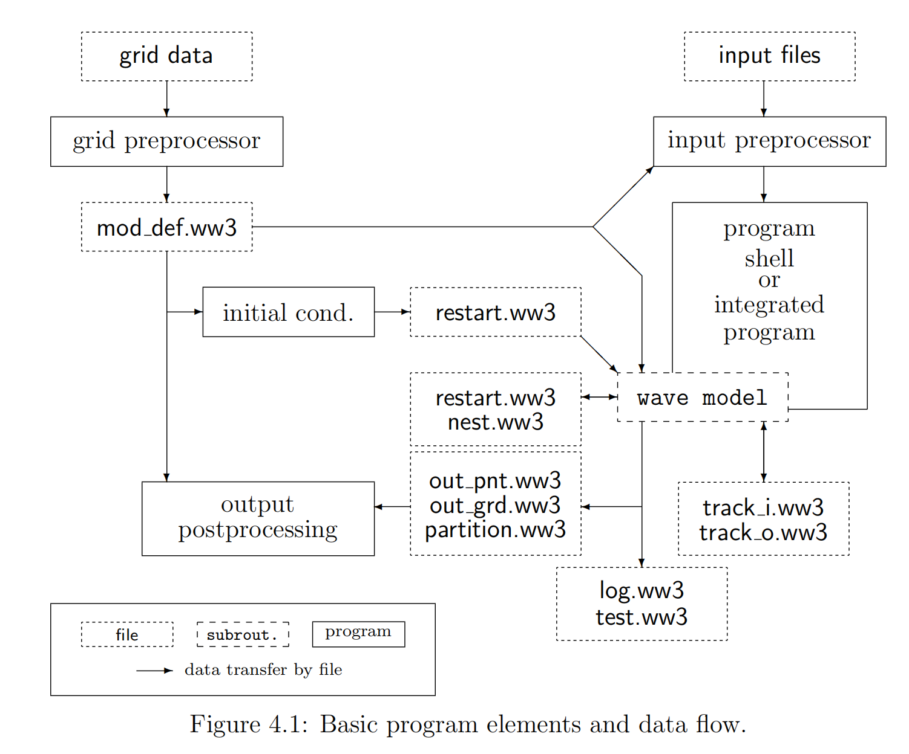


## 4.2 波浪模型例程

波浪模型驱动程序是 WAVEWATCH III 框架包中的一个子程序。要运行该驱动子程序，需要一个程序外壳。WAVEWATCH III 提供了一个简单的独立外壳（见第 4.4.10 节）以及一个更为复杂的多网格模型外壳（见第 4.4.12 节）。本节重点介绍波浪模型驱动子程序。

波浪模型初始化例程 W3INIT 用于单个波浪模型网格的初始化，包括：设置部分 I/O 系统（定义单元号）、初始化内部时间管理、处理模型定义文件（mod_def.ww3）、处理初始条件（restart.ww3）、准备模型输出以及计算与网格相关的参数。如果模型在 MPI 环境下编译，则会确定并初始化计算与输出所需的全部通信（模型在整个运行过程中使用持久 MPI 通信）。

在完成初始化后，波浪模型例程 W3WAVE 可被调用任意次数，以在时间上推进单个网格的波场。经过初始检查后，该子程序会对风场和流场进行插值，更新海冰浓度和水位，传播波场，并在若干时间步内施加所选源项。内部时间步由计算时间间隔及所需输出时间共同决定。计算结束后，例程向调用程序提供所请求的波浪数据场。关于 W3WAVE 接口的说明可在源代码（w3wavemd.ftn）中查阅。

除上述原始数据文件外，程序还维护日志文件 log.ww3。该文件由 W3INIT 打开（W3INIT 包含于 W3WAVE，位于 w3wavemd.ftn 中），并写入说明性的文件头信息。随后每次调用 W3WAVE，都会在该日志文件中的"操作表"添加若干行（见图 4.2）。

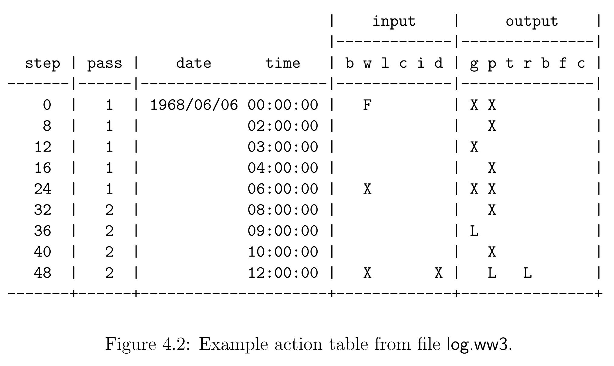

其中，"step" 列表示当前离散时间步；"pass" 列表示 w3wave 的调用序号，例如 3 表示该操作发生在第三次调用 w3wave 时；第三列为该时间步的结束时间。在输入和输出列中列出了模型的相应操作。符号 X 表示输入已更新或输出已执行；F 表示首次读入某字段；L 表示最后一次输出。

七个输入列分别表示：边界条件（b）、风场（w）、水位（l）、流场（c）、海冰浓度（i）以及同化数据（d）。需要注意，数据同化在时间步结束、波浪例程调用之后进行。

七个输出列分别表示：网格输出（g）、点位输出（p）、沿轨迹输出（t）、重启文件（r）、边界数据（b）、分区谱数据（f）以及耦合输出（c）。

对于多网格波浪模型（Tolman, 2008b，ww3_multi），在基本波浪模型例程之外构建了一组例程。三个主要例程分别为初始化例程 wminit、时间推进例程 wmwave 以及结束例程 wmfinl，其功能与上述单网格例程类似。

需要注意的是，在多网格拼接中，每个独立网格都会生成各自的原始输入和输出文件，其文件扩展名由标准".ww3"替换为用户在 ww3_grid.inp 文件中为每个网格指定的唯一标识。此外，每个独立网格均维护各自的日志文件，同时还生成一个总体日志文件 log.mww3。

## 4.3 数据同化接口

如前所述，波浪模型子程序配有一个数据同化接口例程（w3wdas，位于 w3wdasmd.ftn）。该例程已集成到独立运行外壳中（见第 4.4.10 节），用于管理波浪模型与数据同化相结合的时间步推进。目前尚未集成到多网格模型驱动程序中，但在多网格模型管理算法中已对此进行了考虑。

该实现采用一种较为简单的方法：波浪模型持续向前推进，而数据同化在选定时间执行。在外壳设置中，当模型达到目标时间但尚未生成输出时执行数据同化。数据同化完成后，再次调用波浪模型例程，仅用于生成所请求的输出。因此，某一时刻的模型输出将包含该目标时间的数据同化效果。

通用程序外壳还负责处理多种待同化数据，并将其传递给数据同化接口例程。所有数据都需通过波浪模型输入预处理程序（见第 4.4.7 节）进行预处理，并由通用外壳通过文件名进行识别。目前最多可使用三种不同的数据文件，初步设想分别为：平均波浪参数、一维谱数据和二维谱数据。不过，这些类型并未在模型中硬性限定，实际内容需由用户自行定义。

目前尚未提供现成的数据同化软件包。因此，用户需自行提供数据同化方案，并通过接口例程（w3wdas，位于 w3wdasmd.ftn）将其集成到波浪模型中。该接口例程的文档已提供足够的编程说明。关于如何将用户自编软件加入 WAVEWATCH III 编译系统的详细信息，可参见下一章。尽管 NCEP 正在开展波浪数据同化技术研究，但目前没有计划将波浪数据同化软件作为 WAVEWATCH III 软件包的一部分进行发布。

## 4.4 辅助程序

### 4.4.1 一般概念

除轨迹输出后处理程序外，此处介绍的所有辅助程序均从预定义的输入文件读取数据。该文件的内容决定了用户对各辅助程序的设置选项。

输入文件允许包含注释行，注释字符由用户自行指定：输入文件第一行的第一个字符将被视为注释字符，用于标识整个输入文件中的注释行。该注释字符必须位于输入行的首位才会生效。

在以下各节的示例中，输入文件第一行的第一个字符为"$”。因此，所有以“$"开头的行均为注释行，不会被辅助程序解析。作为统一规范，所有辅助程序都会将格式化输出写入标准输出单元。

在以下各节中，将通过示例输入文件介绍所有可用的辅助程序。这些示例文件位于 WAVEWATCH III 软件包中的 inp 目录下。每个示例输入文件中均包含用户可激活的所有可能选项，其中大多数以"\$"开头的注释形式给出。本节所列文件内容均为示例文件的实际内容。

下文还将列出与所示输入文件对应的可执行程序名称、程序名（即 program 语句中的名称）、源代码文件，以及输入和输出文件及其单元号（文件名后括号中标示）。标有"∗"的输入和输出文件为可选文件。

下文提到的中间文件均为非格式化文件，此处不作详细说明。每个文件均由单一例程写入和读取，相关例程中包含进一步的说明文档。

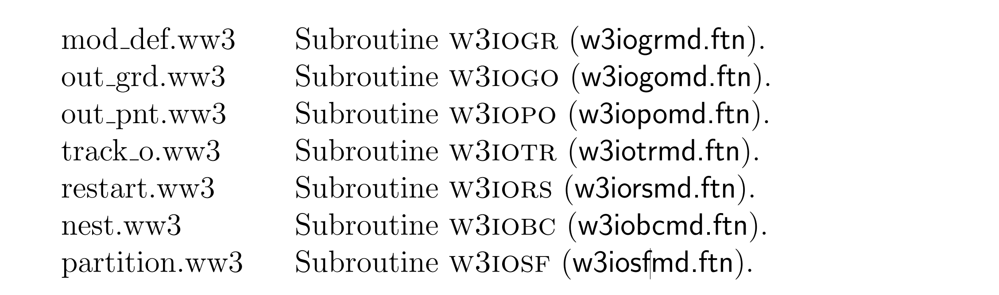

程序的预处理和编译将在接下来的两章中进行说明。模型测试运行示例随源代码一并提供。

### 4.4.2 配置文件

这里介绍的所有辅助程序都读取参数和配置来自 namelist（新格式）或 inp（旧格式）。尽管大多数辅助程序都提供名单文件选项，但有些程序仍然仅限于使用旧的输入文件形式。的名单文件后面的程序将在未来的公开版本中提供。对于节目已经使用名单，模板文件存储在 model/nml 目录中。还可以使用以下命令将传统的 inp 文件转换为新的 nml 格式bash 工具存储在 model/aux/bash 目录中。如果 inp 和 nml 文件是两者都存在于运行目录中，优先级将给予名单文件。

对于 regtest，默认行为是使用 inp 运行所有程序文件中，必须添加选项 -N 才能使用 nml 文件。一些新功能目前仅提供名单，未来的发展主要是专为名单使用而设计。专用于程序的名单配置文件提供了更多可读且自适应的文件。

nml 文件包含一个或多个名称列表每个参数的默认值，可以通过以下方式覆盖它们用户定义的值。定义的名单没有强制顺序 nml 文件。名单以"&SOMETHING NML"开头，以"/"结束。如果一个部分从名单文件中跳过，将使用所有默认值。当程序读取其名称列表文件时，所有默认值和用户定义值所有名单都将输出到日志文件中，以提高可追溯性。

读取程序配置的传统方法是从预定义的输入文件中读取。输入文件第一行的第一个字符将被认为是注释字符，标识注释行输入文件。该评论字符必须出现在第一个位置输入线有效。在以下各节的所有示例中以"\$"开头，因此仅包含注释。该计划还全部将格式化输出写入标准输出单元。下面是 inp 文件的一部分以及 nml 文件的相应部分：示例输入文件的开头（传统形式）

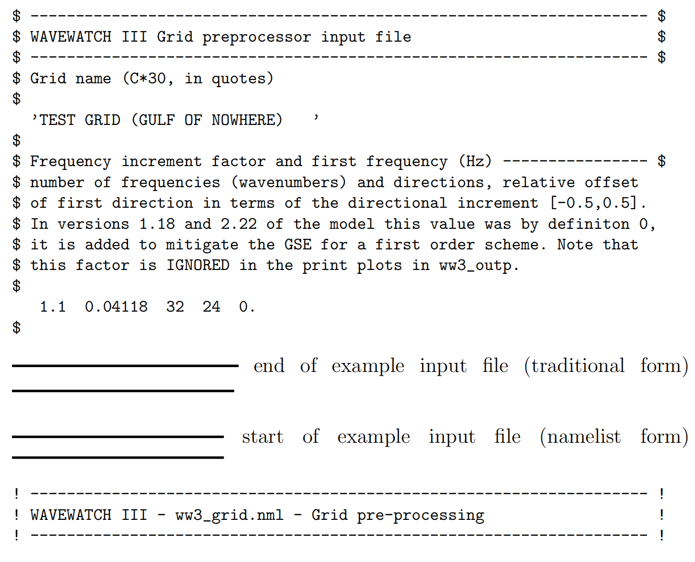
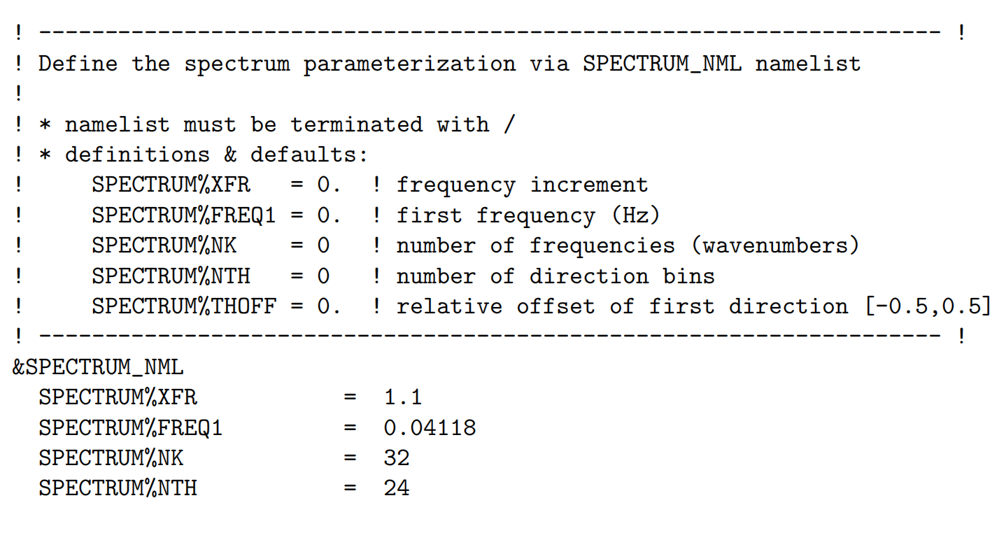

### 4.4.3 ww3_grid

| 类别   | 名称                        | 说明                               |
|--------|-----------------------------|------------------------------------|
| 程序   | ww3_grid                    | WAVEWATCH III 网格生成程序         |
| 源代码 | ww3_grid.ftn                | Fortran 源代码文件                 |
| 输入   | ww3_grid.nml                | Namelist 配置文件（附录 G.1.2）    |
| 输入   | ww3_grid.inp                | 传统格式配置文件（附录 G.1.1）     |
| 输入   | 网格文件（grid file）\*     | 包含海底水深数据的文件             |
| 输入   | 障碍物文件（obstr. file）\* | 子网格障碍物数据文件               |
| 输入   | 掩膜文件（mask file）\*     | 网格掩膜文件                       |
| 输出   | 标准输出（standard out）    | 程序运行的格式化输出信息           |
| 输出   | mod_def.ww3                 | WAVEWATCH III 格式的模型定义文件   |
| 输出   | mask.ww3 \*                 | 陆海掩膜文件（需开启 o2a 开关）    |
| 临时   | ww3_grid.scratch            | 程序运行过程中使用的格式化临时文件 |

### 4.4.4 ww3_strt

| 类别   | 名称                     | 说明                           |
|--------|--------------------------|--------------------------------|
| 程序   | ww3_strt                 | WAVEWATCH III 启动程序         |
| 源代码 | ww3_strt.ftn             | Fortran 源代码文件             |
| 输入   | ww3_strt.inp             | 传统格式配置文件（附录 G.2.1） |
| 输入   | mod_def.ww3              | 模型定义文件                   |
| 输出   | 标准输出（standard out） | 程序运行的格式化输出信息       |
| 输出   | restart.ww3              | WAVEWATCH III 格式的重启动文件 |

### 4.4.5 ww3_bound

| 类别   | 名称                     | 说明                             |
|--------|--------------------------|----------------------------------|
| 程序   | ww3_bound                | WAVEWATCH III 边界条件生成程序   |
| 源代码 | ww3_bound.ftn            | Fortran 源代码文件               |
| 输入   | ww3_bound.inp            | 传统格式配置文件（附录 G.3.1）   |
| 输入   | mod_def.ww3              | 模型定义文件                     |
| 输入   | 谱文件（spectra file）\* | 包含波浪谱的输入文件（可为多个） |
| 输出   | 标准输出（standard out） | 程序运行的格式化输出信息         |
| 输出   | nest.ww3                 | 边界条件文件                     |

注意：当使用该程序为采用旋转极点网格构建的模型生成边界输入时，输入谱始终被假定为基于标准极点坐标系。

### 4.4.6 ww3_bounc

| 类别   | 名称                     | 说明                                |
|--------|--------------------------|-------------------------------------|
| 程序   | ww3_bounc                | WAVEWATCH III 边界条件转换程序      |
| 源代码 | ww3_bounc.ftn            | Fortran 源代码文件                  |
| 输入   | ww3_bounc.nml            | Namelist 配置文件（附录 G.4.2）     |
| 输入   | ww3_bounc.inp            | 传统格式配置文件（附录 G.4.1）      |
| 输入   | mod_def.ww3              | 模型定义文件                        |
| 输入   | 谱文件（spectra file）\* | NetCDF 格式的波浪谱文件（可为多个） |
| 输出   | 标准输出（standard out） | 程序运行的格式化输出信息            |
| 输出   | nest.ww3                 | 边界条件文件                        |

注意：当使用该程序为采用旋转极点网格构建的模型生成边界输入时，输入谱始终被假定是在标准极点坐标系下定义的。

### 4.4.7 ww3_prep

| 类别   | 名称                     | 说明                                     |
|--------|--------------------------|------------------------------------------|
| 程序   | ww3_prep (w3prep)        | WAVEWATCH III 外部场与同化数据预处理程序 |
| 源代码 | ww3_prep.ftn             | Fortran 源代码文件                       |
| 输入   | ww3_prep.inp             | 传统格式配置文件（附录 G.5.1）           |
| 输入   | mod_def.ww3              | 模型定义文件                             |
| 输入   | 用户输入（user input）\* | 用户提供的数据，示例见说明               |
| 输出   | 标准输出（standard out） | 程序运行的格式化输出信息                 |
| 输出   | level.ww3\*              | 水位场文件                               |
| 输出   | current.ww3\*            | 海流场文件                               |
| 输出   | wind.ww3\*               | 风场文件                                 |
| 输出   | ice.ww3\*                | 海冰场文件                               |
| 输出   | data0.ww3\*              | 同化数据（平均量，mean）                 |
| 输出   | data1.ww3\*              | 同化数据（一维波谱，1-D spectra）        |
| 输出   | data2.ww3\*              | 同化数据（二维波谱，2-D spectra）        |

需要注意的是，这些可选输出文件专用于 ww3_shel 和 ww3_multi，但并不由实际的波浪模型例程处理。因此，如果波浪模型例程在其他外壳程序或集成程序中使用，则不需要这些文件。

不过，读写这些文件的例程是系统无关的，因此可用于基于基本波浪模型的定制应用。这些文件的读写由子程序 w3fldg（位于 w3fldsmd.ftn）完成。有关更多说明及文件格式信息，请参阅该例程。

### 4.4.8 ww3_prnc

| 类别   | 名称                     | 说明                                   |
|--------|--------------------------|----------------------------------------|
| 程序   | ww3_prnc (w3prnc)        | WAVEWATCH III 外部场与同化数据处理程序 |
| 源代码 | ww3_prnc.ftn             | Fortran 源代码文件                     |
| 输入   | ww3_prnc.nml             | Namelist 配置文件（附录 G.6.2）        |
| 输入   | ww3_prnc.inp             | 传统格式配置文件（附录 G.6.1）         |
| 输入   | mod_def.ww3              | 模型定义文件                           |
| 输入   | 用户输入（user input）\* | 用户提供的数据，示例见说明             |
| 输出   | 标准输出（standard out） | 程序运行的格式化输出信息               |
| 输出   | level.ww3\*              | 水位场文件                             |
| 输出   | current.ww3\*            | 海流场文件                             |
| 输出   | wind.ww3\*               | 风场文件                               |
| 输出   | ice.ww3\*                | 海冰场文件                             |
| 输出   | data0.ww3\*              | 同化数据（平均量，mean）               |
| 输出   | data1.ww3\*              | 同化数据（一维波谱，1-D spectra）      |
| 输出   | data2.ww3\*              | 同化数据（二维波谱，2-D spectra）      |

有关可用于在自定义程序中打包输入文件的工具，请参见上一节（4.4.7）末尾的说明。

### 4.4.9 ww3_prtide

| 类别   | 名称                               | 说明                            |
|--------|------------------------------------|---------------------------------|
| 程序   | ww3_prtide (w3tide)                | WAVEWATCH III 潮汐预报/处理程序 |
| 源代码 | ww3_prtide.ftn                     | Fortran 源代码文件              |
| 输入   | ww3_prtide.inp                     | 传统格式配置文件（附录 G.7.1）  |
| 输入   | mod_def.ww3                        | 模型定义文件                    |
| 输入   | current.ww3_tide 或 level.ww3_tide | 含潮汐分量的输入文件            |
| 输出   | 标准输出（standard out）           | 程序运行的格式化输出信息        |
| 输出   | current.ww3 或 level.ww3           | 潮位或潮流强迫文件              |

用户提供的文件 current.ww3_tide 或 level.ww3_tide 为二进制文件，可通过运行 ww3_prnc 并选择 "AT" 选项生成，然后将生成的文件 current.ww3 或 level.ww3 重命名为 current.ww3_tide 或 level.ww3_tide。用于潮汐预报的潮汐分潮可以是这些文件中包含分潮的子集，也可以全部采用。

由于干湿变化或网格不匹配，某些 WAVEWATCH III 网格节点上的潮汐分潮可能存在错误或缺失。可通过为特定分潮设置最大振幅阈值来识别错误数据。当振幅超过该最大值时，将从最近的节点对潮汐分潮进行外推。该功能目前仅在三角网格上进行了测试。

### 4.4.10 ww3_shel

| 类别   | 名称                     | 说明                                      |
|--------|--------------------------|-------------------------------------------|
| 程序   | ww3_shel (w3shel)        | WAVEWATCH III 波浪模式主运行程序（shell） |
| 源代码 | ww3_shel.ftn             | Fortran 源代码文件                        |
| 输入   | ww3_shel.nml             | Namelist 配置文件（附录 G.8.2）           |
| 输入   | ww3_shel.inp             | 传统格式配置文件（附录 G.8.1）            |
| 输入   | mod_def.ww3              | 模型定义文件                              |
| 输入   | restart.ww3              | 重启动文件                                |
| 输入   | nest.ww3\*               | 边界条件文件                              |
| 输入   | level.ww3\*              | 水位场文件                                |
| 输入   | current.ww3\*            | 海流场文件                                |
| 输入   | wind.ww3\*               | 风场文件                                  |
| 输入   | ice.ww3\*                | 海冰场文件                                |
| 输入   | data0.ww3\*              | 同化数据                                  |
| 输入   | data1.ww3\*              | 同化数据                                  |
| 输入   | data2.ww3\*              | 同化数据                                  |
| 输入   | track_i.ww3\*            | 轨迹输出控制信息                          |
| 输出   | 标准输出（standard out） | 程序运行的格式化输出信息                  |
| 输出   | log.ww3                  | 波浪模式运行日志（见第 4.2 节）           |
| 输出   | test.ww3\*               | 波浪模式测试输出                          |
| 输出   | restartn.ww3\*           | 新生成的重启动文件                        |
| 输出   | nestn.ww3\*              | 嵌套边界输出文件                          |
| 输出   | out_grd.ww3\*            | 格点场原始输出                            |
| 输出   | out_pnt.ww3\*            | 波谱原始输出                              |
| 输出   | track_o.ww3\*            | 沿轨迹的波谱原始输出                      |
| 临时   | ww3_shel.scratch         | 程序运行使用的格式化临时文件              |

### 4.4.11 ww3_gspl

| 类别 | 名称 | 说明 |
|----|----|----|
| 程序 | ww3_gspl (w3gspl) | WAVEWATCH III 网格拆分程序 |
| 源代码 | ww3_gspl.ftn | Fortran 源代码文件 |
| 输入 | ww3_gspl.inp | 传统格式配置文件（附录 G.9.1） |
| 输入 | mod_def.xxx | 待拆分网格的模型定义文件 |
| 输出 | 标准输出（standard out） | 程序运行的格式化输出信息 |
| 输出 | xxx.bot | 子网格的水深（地形）文件 |
| 输出 | xxx.obst | 子网格的障碍物文件 |
| 输出 | xxx.mask | 子网格的掩膜文件 |
| 输出 | xxx.tmpl | 子网格使用的 ww3_grid.inp 模板文件 |
| 输出 | ww3_multi.xxx.n | ww3_multi.inp 中需修改部分的模板 |
| 输出 | ww3_gspl.ww3 | 子网格分布示意的 GrADS 图形文件（需开启 o16 开关） |
| 输出 | ww3.ctl | GrADS 图形控制文件（o16） |

为进一步自动化网格拆分过程，提供了脚本 ww3_gspl.sh。该脚本会运行 ww3_gspl，并随后为所有子网格生成 mod_def 文件。如果提供了文件 ww3_multi.inp，该文件也会被一并更新。

通过在命令行中添加 -h 选项，可查看该脚本的使用说明，其输出示例如图 4.3 所示。

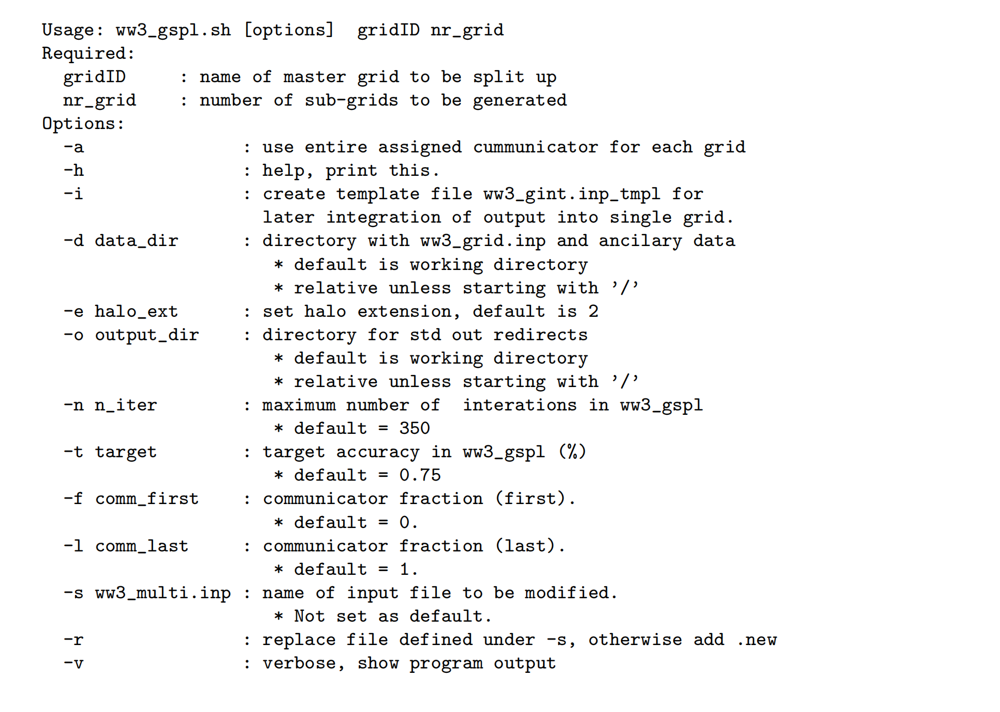

图 4.3：运行 ww3 gspl. sh 并使用 -h 命令行选项时获得的选项。

### 4.4.12 ww3_multi

| 类别   | 名称                     | 单元号 | 说明                                 |
|--------|--------------------------|--------|--------------------------------------|
| 程序   | ww3_multi (w3mlti)       | ---    | WAVEWATCH III 多网格波浪模式驱动程序 |
| 源代码 | ww3_multi.ftn            | ---    | Fortran 源代码文件                   |
| 输入   | ww3_multi.nml            | 8      | Namelist 配置文件（附录 G.10.2）     |
| 输入   | ww3_multi.inp            | 8      | 传统格式配置文件（附录 G.10.1）      |
| 输出   | 标准输出（standard out） | 6      | 程序运行的格式化输出信息             |
| 输出   | log.mww3                 | 9      | 波浪模式驱动程序运行日志             |
| 输出   | test.mww3\*              | 自动   | 波浪模式测试输出                     |

该波浪模型程序需要并生成大量输入和输出文件，其格式与第 4.4.10 节中 ww3_shel 的文件一致，只是文件扩展名 .ww3 被替换为对应特定网格的标识符。需要注意的是，所有文件均通过文件名打开，单元号的分配为动态且自动完成。

为使所有现有功能均可使用，提供了基于 namelist 的新版输入文件格式。该格式将在未来版本中得到支持，因为其更便于灵活扩展新功能。需要注意的是，GCC 编译器在 4.8.2 版本之前不支持 namelist 格式。

### 4.4.13 ww3_gint

| 类别 | 名称 | 说明 |
|----|----|----|
| 程序 | ww3_gint (w3gint) | WAVEWATCH III 网格积分/合并后处理程序 |
| 源代码 | ww3_gint.ftn | Fortran 源代码文件 |
| 输入 | ww3_gint.inp | 传统格式配置文件（附录 G.11.1） |
| 输入 | mod_def.\* | 基础网格与目标网格的模型定义文件（WAVEWATCH III 格式） |
| 输入 | out_grd.\* | 基础网格的格点场输出文件（WAVEWATCH III 格式） |
| 输出 | 标准输出（standard out） | 程序运行的格式化输出信息 |
| 输出 | out_grd.\* | 目标网格的格点场输出文件（WAVEWATCH III 格式） |

该后处理程序从多个重叠网格中获取场数据，并生成统一的输出文件。不同的模型定义文件和场输出文件通过与每个特定网格关联的唯一标识符来区分。目前，该程序可处理曲线网格和矩形网格。程序会生成一个权重文件 WHTGRIDINT.bin，在后续使用相同起点-终点网格的运行中可读取此文件，从而在输入网格数量多或目标网格分辨率高的情况下节省大量时间。

网格整合程序可使用线性插值或最近邻插值。对于分区输出用于谱重建的情况，推荐使用最近邻插值。线性插值可能导致能量条带的产生，因为分区会相互渗透并人为增加总能量。需要注意的是，该程序可以与网格拆分程序 ww3_gspl 配合使用，且 ww3_gspl.sh 提供生成该程序模板输入文件的选项（见第 4.4.11 节）。

### 4.4.14 ww3_outf

| 类别   | 名称                        | 说明                                   |
|--------|-----------------------------|----------------------------------------|
| 程序   | ww3_outf (w3outf)           | WAVEWATCH III 输出后处理与格式转换程序 |
| 源代码 | ww3_outf.ftn                | Fortran 源代码文件                     |
| 输入   | ww3_outf.inp                | 传统格式配置文件（附录 G.12.1）        |
| 输入   | mod_def.ww3                 | 模型定义文件                           |
| 输入   | out_grd.ww3                 | 原始格点场输出数据                     |
| 输出   | 标准输出（standard out）    | 程序运行的格式化输出信息               |
| 输出   | 传输文件（transfer file）\* | 数据传输/交换用文件                    |

对于 itype = 3 的传输文件，其文件名的扩展名用于标识文件内容。每种数据类型对应的文件扩展名列于第 236 页的表 4.1 中。

### 4.4.15 ww3_ounf

| 类别   | 名称                     | 说明                                     |
|--------|--------------------------|------------------------------------------|
| 程序   | ww3_ounf (w3ounf)        | WAVEWATCH III 格点输出 NetCDF 后处理程序 |
| 源代码 | ww3_ounf.ftn             | Fortran 源代码文件                       |
| 输入   | ww3_ounf.nml             | Namelist 配置文件（附录 G.13.2）         |
| 输入   | ww3_ounf.inp             | 传统格式配置文件（附录 G.13.1）          |
| 输入   | mod_def.ww3              | 模型定义文件                             |
| 输入   | out_grd.ww3              | 原始格点场输出数据                       |
| 输入   | NC_globatt.inp           | 额外的 NetCDF 全局属性文件（已弃用）     |
| 输入   | ounfmeta.inp             | 用户自定义元数据属性文件                 |
| 输出   | 标准输出（standard out） | 程序运行的格式化输出信息                 |
| 输出   | .nc                      | NetCDF 格式输出文件                      |

当单个场数据被写入文件时，每种数据类型对应的缩写字段名（来自 ww3 outf 的文件扩展名）列于第 236 页的表 4.1 中。

用户元数据配置：默认情况下，每个 WAVEWATCH III 输出变量在生成的 netCDF 文件中都会包含元数据（属性）。如果需要，用户可以通过名为 ounfmeta.inp 的输入文本文件覆盖现有元数据或配置额外元数据。

ounfmeta.inp 文件可以用于以下操作：

- 修改或扩展网格化输出变量的 netCDF 属性
- 修改或扩展全局（global）netCDF 属性  
- 定义或重新定义坐标参考系统
- 为分区参数输出变量生成属性定义模板字符串

在 ounfmeta.inp 文件中，条目通过关键字标记的段落进行配置。空行和以 \$ 开头的注释行会被忽略。注意：所有关键字和"字段名称 ID"（如 HS）不区分大小写，但所有 netCDF 属性名区分大小写。

修改或添加 WW3 网格化输出字段的属性：使用 META 关键字选择输出字段，后跟整数对 GroupNum 和 ParamNum，或通过 FldTag 字符串指定；这些值对应于 ww3 shel.nml 或 ww3 shel.inp 中的"输出字段参数定义表"。对于多分量字段（如 WND 和 CUR 的 U、V 分量），可在其后可选跟一个整数 IFC，用于选择具体分量。

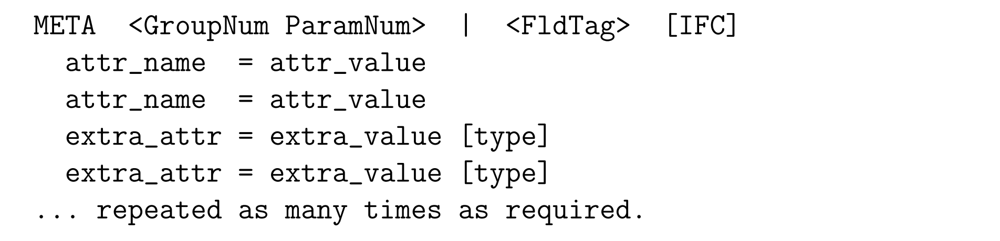

每个属性名对应于已有变量的属性，可以是以下之一（括号中为内部替代名称）：

| 属性名称      | 变量名 | 类型   | 说明                                      |
|---------------|--------|--------|-------------------------------------------|
| 标准名称      | varns  | string | CF（Climate and Forecast）标准名称        |
| 长名称        | varnl  | string | 描述性的完整名称                          |
| GlobWAVE 名称 | varng  | string | 可选的 GlobWAVE 标准名称                  |
| 方向参考      | varnd  | string | 方向场使用的可选参考坐标系                |
| 注释          | varnc  | string | 可选说明或备注信息                        |
| 单位          | ---    | string | 变量的物理单位                            |
| 有效最小值    | vmin   | float  | 数据允许的最小有效值                      |
| 有效最大值    | vmax   | float  | 数据允许的最大有效值                      |
| 缩放因子      | fsc    | float  | 数据缩放因子，仅在变量类型为 SHORT 时使用 |

任何其他属性名都被视为可选的"额外"属性。该额外属性可以使用可选的 type 关键字来指定元数据的变量类型。如果未指定类型，则默认为字符型。有效类型为 \[c, r, i\]，分别对应字符/字符串、实数/浮点数或整数值。注意：空格分隔的字符串额外字段应加引号。

修改"全局"元数据：全局元数据（即与文件相关，而非特定变量）可以通过特殊的 META global 关键字组合来指定。

``` sh
META global [nodefault]
extra_attr = extra_value [type]
extra_attr = extra_value [type]
```

可选的 nodefault 关键字将抑制输出默认的 WW3 全局元数据。

修改/定义坐标参考系统（CRS）：可以使用 CRS 关键字为所有格点输出字段指定一个"坐标参考系统"。至少必须指定网格映射名称属性。如果定义了 CRS 部分，所有输出字段将增加一个引用 CRS 变量的网格映射属性。crs vaname 将作为标量 NF90 CHAR 变量在输出文件中创建。

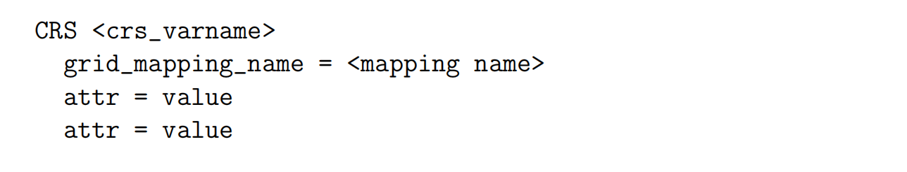

对于普通的经纬度网格和旋转极点网格，ww3_ounf 会生成相应的坐标参考系统，但也可以使用 CRS 关键字进行覆盖。

分区参数模板字符串：为分区输出指定元数据的方式略有不同；一个元数据条目可用于字段的所有分区。通过模板字符串可以将元数据指定给特定的分区编号。内置了两个模板字符串：SPART 和 IPART。它们分别提供"字符串"描述（如 "wind sea"，"primary swell" 等）或整数分区编号（1、2、3 等）。在元数据属性值中可通过 \<...\> 引用模板名，例如 \<SPART\>。

也可以使用 TEMPLATE 关键字在 ounfmeta.inp 文件中提供用户自定义的分区参数模板字符串。

``` swift
TEMPLATE <template-name>
String for partition 0
String for partition 1
String for partition 2
String for partition 3
... etc
```

指定 \<template-name\> 并在末尾加下划线，将生成以下划线 `_` 分隔的字符串，而不是空格分隔的字符串（这对于 netCDF 的 "standard name" 值很有用）。

示例 ounfmeta. inp 文件：

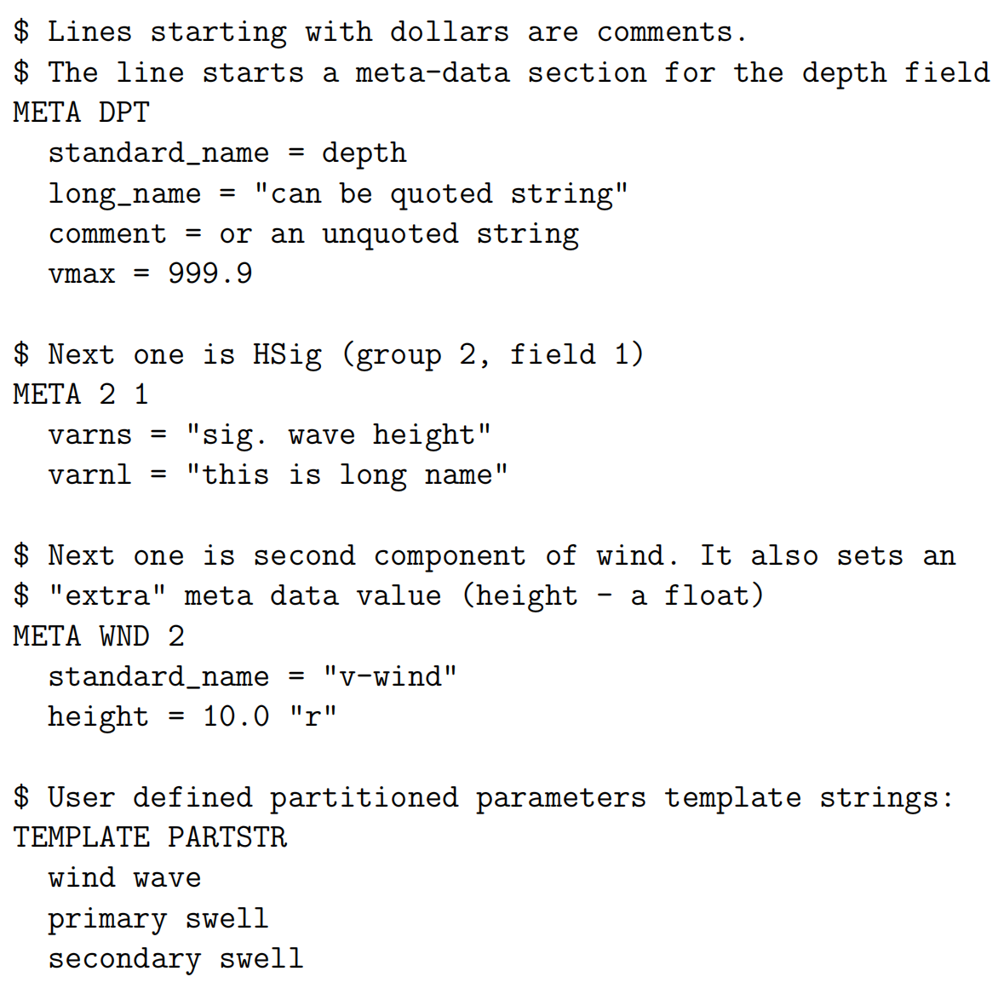
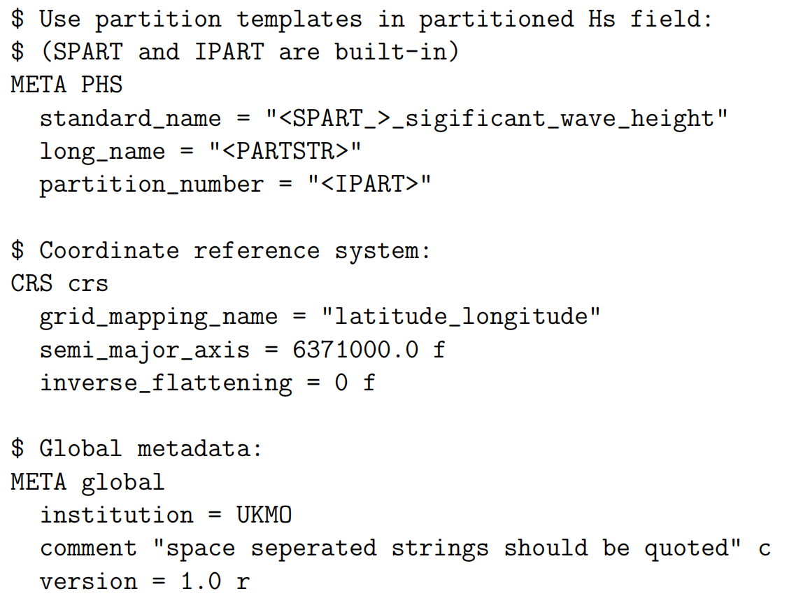

添加"预报变量"：使用 ww3_ounf.nml 输入文件时，可以将可选的辅助"预报变量"加入输出的 netCDF 文件（参见 ww3_ounf.nml）。当 FCVARS = T 时，将生成以下变量：

- 预报参考时间：与当前预报"分析"关联的时间。对于跨多天拆分的文件非常有用，因为它允许将特定时间的预报与其分析或起始时间对应起来。

- 预报周期：自关联的"预报参考时间"以来经过的时间（以秒为单位）。

预报参考时间默认使用 ww3_ounf.nml 中指定的 TIMESTART。但是，如果模型运行包括某种形式的历史重现期，则预报参考时间应设置为相应的分析时间。此外，如果调用 ww3_ounf 时 TIMESTART 与模型起始时间不一致，则需要显式指定正确的预报参考时间，以确保预报周期计算正确。

### 4.4.16 GrADS 的网格输出后处理器

| 类别   | 名称                     | 说明                                      |
|--------|--------------------------|-------------------------------------------|
| 程序   | gx_outf (gxoutf)         | WAVEWATCH III 格点输出的 GrADS 后处理程序 |
| 源代码 | gx_outf.ftn              | Fortran 源代码文件                        |
| 输入   | gx_outf.inp              | 传统格式配置文件（附录 G.14.1）           |
| 输入   | mod_def.ww3              | 模型定义文件                              |
| 输入   | out_grd.ww3              | 原始格点场输出数据                        |
| 输出   | 标准输出（standard out） | 程序运行的格式化输出信息                  |
| 输出   | ww3.grads                | GrADS 数据文件                            |
| 输出   | ww3.ctl                  | GrADS 控制文件                            |

该后处理程序生成带网格化模型参数的输入文件，用于 Grid Analysis and Display System（GrADS，Doty, 1995）。尽管 GrADS 也可以处理 GRIB 文件，但推荐使用此预处理程序，因为数据文件还提供了陆地-海洋-冰层地图的访问。

### 4.4.17 ww3_grib

| 类别   | 名称                     | 说明                                     |
|--------|--------------------------|------------------------------------------|
| 程序   | ww3_grib (w3grib)        | WAVEWATCH III 格点输出的 GRIB 后处理程序 |
| 源代码 | ww3_grib.ftn             | Fortran 源代码文件                       |
| 输入   | ww3_grib.inp             | 传统格式配置文件（附录 G.15.1）          |
| 输入   | mod_def.ww3              | 模型定义文件                             |
| 输入   | out_grd.ww3              | 原始格点场输出数据                       |
| 输出   | 标准输出（standard out） | 程序运行的格式化输出信息                 |
| 输出   | gribfile                 | GRIB 格式输出文件                        |

该后处理程序将平均波浪参数字段打包为 GRIB 格式，使用 GRIB 版本 II 以及 NCEP 的 w3 和 bacio 库例程，或使用 GRIB2，通过 NCEP 的操作包进行打包。更多打包数据可参见第 236 页的表 4.1。

GRIB 打包采用 NCEP 的 GRIB 表（见 NCEP, 1998）。由于 w3 和 bacio 例程并非完全可移植，因此代码中不提供，用户需自行提供相应例程。建议通过 WAVEWATCH III 的附加开关激活这些例程，通常与必需开关组中的 nogrb 开关配合使用，如同 NCEP 例程的现状。GRIB2 打包依据 WMO (2001) 标准，并使用 NCEP 的标准操作包执行。

表 4.1 显示了 GRIB 打包的 kpds(5) 数据值。对于分区数据，第一个数字表示风浪，第二个数字表示涌浪。大多数数据以表面数据形式打包（kpds(6) = 0）。然而，对于分区涌浪字段，连续字段按连续层打包，层类型指示符设置为 kpds(6) = 241，kpds(7) 标识实际的层或涌浪字段编号。

表 4.1 还给出了 GRIB2 打包的若干 kpds 数据值。表中第一个数字表示 listsec0(2)，用于标识学科类型（如海洋学、气象学等）；第二个数字表示 kpds(1)，用于标识该学科类型中的参数类别（如波浪、环流、冰层等）；第三个数字表示 kpds(2)，用于标识实际参数。对于分区数据，A/B 表示 A 对应风浪，B 对应涌浪。此外，kpds(10) = 0 表示表面数据，kpds(10) = 241 用于在连续层上打包连续涌浪字段。kpds(12) 标识实际层或涌浪字段编号。

虽然上述输入文件包含了 WAVEWATCH III 的全部 31 个输出字段的标志，但并非所有字段都可以打包为 GRIB。如果选择了无法打包的参数，程序将向标准输出打印提示信息。表 4.1 显示了可打包为 GRIB 的参数。

在 NCEP，引入分区波浪模型输出时，GRIB 转 GRIB2 的过程发生了，这导致 GRIB 中需要一些重复定义，同时 GRIB 与 GRIB2 打包之间存在一些表面不一致之处。

### 4.4.18 ww3_outp

| 类别   | 名称                        | 说明                            |
|--------|-----------------------------|---------------------------------|
| 程序   | ww3_outp (w3outp)           | WAVEWATCH III 点输出后处理程序  |
| 源代码 | ww3_outp.ftn                | Fortran 源代码文件              |
| 输入   | ww3_outp.inp                | 传统格式配置文件（附录 G.16.1） |
| 输入   | mod_def.ww3                 | 模型定义文件                    |
| 输入   | out_pnt.ww3                 | 原始点位输出数据                |
| 输入   | NC_globatt.inp              | 额外的 NetCDF 全局属性文件      |
| 输出   | 标准输出（standard out）    | 程序运行的格式化输出信息        |
| 输出   | tabnn.ww3\*                 | 平均参数表，其中 nn 为两位整数  |
| 输出   | 传输文件（transfer file）\* | 数据传输文件                    |

在 WAVEWATCH III 之前的版本中，频谱公报是使用 ITYPE = 1、OTYPE = 3 生成的频谱数据传输文件以及 w3split 程序（见第 5.2 节）生成的。该程序已过时，仅为向后兼容而保留。该程序从标准输入读取以下五条记录（不允许注释行）：

- 输出位置的名称。
- 表格中使用的运行标识符。
- 输入文件的名称。
- 标识是否为未格式化输入文件的逻辑值。
- 输出文件的名称。

上述所有字符串均以字符形式读取，使用自由格式，因此需要用引号括起来。

### 4.4.19 ww3_ounp

| 类别   | 名称                        | 说明                                   |
|--------|-----------------------------|----------------------------------------|
| 程序   | ww3_ounp (w3ounp)           | WAVEWATCH III 点输出 NetCDF 后处理程序 |
| 源代码 | ww3_ounp.ftn                | Fortran 源代码文件                     |
| 输入   | ww3_ounp.nml                | Namelist 配置文件（附录 G.17.2）       |
| 输入   | ww3_ounp.inp                | 传统格式配置文件（附录 G.17.1）        |
| 输入   | mod_def.ww3                 | 模型定义文件                           |
| 输入   | out_pnt.ww3                 | 原始点位输出数据                       |
| 输出   | 标准输出（standard out）    | 程序运行的格式化输出信息               |
| 输出   | 传输文件（transfer file）\* | 数据传输文件                           |

### 4.4.20 GrADS 的点输出后处理器

| 类别   | 名称                     | 说明                                    |
|--------|--------------------------|-----------------------------------------|
| 程序   | gx_outp (gxoutp)         | WAVEWATCH III 点输出的 GrADS 后处理程序 |
| 源代码 | gx_outp.ftn              | Fortran 源代码文件                      |
| 输入   | gx_outp.inp              | 传统格式配置文件（附录 G.18.1）         |
| 输入   | mod_def.ww3              | 模型定义文件                            |
| 输入   | out_pnt.ww3              | 原始点位输出数据                        |
| 输出   | 标准输出（standard out） | 程序运行的格式化输出信息                |
| 输出   | ww3.spec.grads           | 含波谱与源项的 GrADS 数据文件           |
| 输出   | ww3.mean.grads           | 平均波浪参数与环境场数据文件            |
| 输出   | ww3.spec.ctl             | GrADS 控制文件                          |

该后处理程序用于生成数据文件，使 GrADS（见前一节）能够绘制频谱和源项的极地图。为此，频谱和源项被存储为"经纬度"网格。

对于每个输出点，会生成不同的数据名称，通常为 locnnn。当数据文件被加载到 GrADS 中时，变量 loc001 将包含第一个请求输出点在第 1 层的频谱网格、第 2 层的输入源项，依此类推。第二个输出点的数据存储在 loc002，以此类推。实际输出点名称通过控制文件 ww3.spec.ctl 传递给 GrADS。波高和环境数据则来自 ww3.mean.grads。用户无需了解 GrADS 数据文件和数据存储的具体细节。

提供了 GrADS 脚本 spec.gs、source.gs 和 1source.gs，可自动从该后处理程序的输出文件生成频谱图。

注意：为了使 GrADS 脚本正常工作，输出点的名称中不应包含空格。

### 4.4.21 ww3_trck

| 类别   | 名称                     | 说明                             |
|--------|--------------------------|----------------------------------|
| 程序   | ww3_trck (w3trck)        | WAVEWATCH III 轨迹输出后处理程序 |
| 源代码 | ww3_trck.ftn             | Fortran 源代码文件               |
| 输入   | ww3_trck.inp             | 传统格式配置文件（附录 G.19.1）  |
| 输入   | track_o.ww3              | 原始轨迹输出数据                 |
| 输出   | 标准输出（standard out） | 程序运行的格式化输出信息         |
| 输出   | track.ww3                | 格式化轨迹数据文件               |

该后处理程序将原始轨迹输出数据转换为整数压缩格式文件。文件包含以下头记录：

- 文件标识符（长度为 34 的字符串）。
- 频率和方向的数量、首个方向及方向增量（弧度，遵循海洋学惯例）。
- 每个频率箱的弧度频率。
- 相应的方向箱大小乘以频率箱大小，以获得每个箱的离散能量。

对于随时间和位置变化的每个输出点，记录如下：

- 日期和时间，格式为 yyyymmdd hhmmss，经度和纬度（度），以及状态标识符 "ice"、"lnd" 或 "sea"。以下两条记录仅对海点写入。

- 水深（米）、流速和风速的 u、v 分量（米/秒）、摩擦速度（米/秒）、空气-海洋温度差（摄氏度）以及频谱缩放因子。

- 整个频谱的整数压缩格式（可用自由格式读取）。

### 4.4.22 ww3_trnc

| 类别   | 名称                     | 说明                                     |
|--------|--------------------------|------------------------------------------|
| 程序   | ww3_trnc (w3trnc)        | WAVEWATCH III 轨迹输出 NetCDF 后处理程序 |
| 源代码 | ww3_trnc.ftn             | Fortran 源代码文件                       |
| 输入   | ww3_trnc.nml             | Namelist 配置文件（附录 G.20.2）         |
| 输入   | ww3_trnc.inp             | 传统格式配置文件（附录 G.20.1）          |
| 输入   | track_o.ww3              | 原始轨迹输出数据                         |
| 输出   | 标准输出（standard out） | 程序运行的格式化输出信息                 |
| 输出   | \*.nc                    | NetCDF 格式轨迹输出文件                  |

该后处理程序将原始轨迹输出数据转换为 NetCDF 文件。输出的 NetCDF 文件包含以下变量：

- 时间，自 1990-01-01 起的天数，使用 UTC 时间的儒略日。  
- 每个频率箱的频率（弧度）。
- 每个频率箱的下限频率（弧度）。  
- 每个频率箱的上限频率（弧度）。  
- 每个频率箱的频率宽度（弧度）。
- 每个方向箱的方向（遵循海洋学惯例）。  
- 随时间维度变化的纬度和经度（度）。

对于随时间和位置变化的每个输出点，记录如下：

- 轨迹名称（32 个字符）。
- 整个频谱（m²·s·rad⁻¹）。
- 水深（米）、流速和风速的 u、v 分量（米/秒）、摩擦速度（米/秒）、空气-海洋温度差（摄氏度）。

### 4.4.23 ww3_systrk

| 类别 | 名称 | 说明 |
|----|----|----|
| 程序 | ww3_systrk (w3systrk) | WAVEWATCH III 波系（系统）追踪后处理程序 |
| 源代码 | ww3_systrk.ftn | Fortran 源代码文件 |
| 输入 | ww3_systrk.inp | 传统格式配置文件（附录 G.21.1） |
| 输入 | partition.ww3 | 波谱分区文件 |
| 输入 | sys_restart.ww3\* | 含波系记忆的重启动文件 |
| 输入 | sys_mask.ww3\* | 掩膜文件 |
| 输出 | sys_log.ww3 | 输出日志文件（并行运行时附加处理器编号） |
| 输出 | sys_coord.ww3 | 波系场的经纬度坐标文件 |
| 输出 | sys_hs.ww3 | 各独立波系的有效波高场 |
| 输出 | sys_tp.ww3 | 各独立波系的峰值周期场 |
| 输出 | sys_dir.ww3 | 各独立波系的峰值方向场 |
| 输出 | sys_dspr.ww3 | 各独立波系的方向离散度场 |
| 输出 | sys_pnt.ww3 | 波系点输出文件（有效波高、峰值周期、峰值方向） |
| 输出 | sys_restart1.ww3 | 新生成的重启动文件 |
| 输出 | \*.nc | NetCDF 格式波系追踪输出文件 |

该程序目前仅适用于规则网格。空间和时间上的波浪系统追踪是基于频谱分区数据文件进行的。

追踪的时间间隔和地理范围可以是分区文件中数据的子集。参数 `dirKnob` 和 `perKnob` 用于控制地理空间上系统合并算法的严格程度，而 `dirTimeKnob` 和 `perTimeKnob` 则对应时间维度上的严格程度。数值越低，标准越严格，生成的系统数量越多、规模越小，同时处理时间通常也会增加。推荐值如前所述。

这些参数可以在局部区域（例如岛屿周围）通过定义掩码文件 `sys_mask.ww3` 进行调整。参数 `hsKnob` 和 `wetPts` 用作低能量和小系统的过滤器------平均显著波高 $H_{m0}$ 低于 `hsKnob` 或面积小于整体域面积 `wetPts*100%` 的波浪系统将被剔除。

参数 `seedLat` 和 `seedLon` 控制波浪系统搜索螺旋的起点，默认位于模型域中心（0, 0）。追踪运行结束时，系统记忆的最终状态将存储在 `sys_restart1.ww3` 文件中，该文件重命名为 `sys_restart.ww3` 后可用于从之前的系统记忆状态重新启动追踪序列。

### 4.4.24 ww3_uprstr

| 类别   | 名称                   | 说明                                 |
|--------|------------------------|--------------------------------------|
| 程序   | ww3_uprstr (ww3uprstr) | WAVEWATCH III 重启动文件更新程序     |
| 源代码 | ww3_uprstr.ftn         | Fortran 源代码文件                   |
| 输入   | ww3_uprstr.inp         | 传统格式配置文件（附录 G.22.1）      |
| 输入   | mod_def.ww3            | 模型定义文件                         |
| 输入   | restart.ww3            | 原始重启动文件                       |
| 输入   | XXXX.grbtxt            | grbtxt 格式的有效波高（SWH）分析文件 |
| 输出   | restart001.ww3         | 更新后的重启动文件                   |

#### 引言

大部分海面波观测数据都是诊断变量：显著波高（SWH）。因此，波浪数据同化（WDA）通常在 SWH 空间中进行，随后需要将这些信息转换到预报空间，即波谱（WS），以作为边界条件和/或初始条件（BIC）。

#### ww3_uprstr 的目的

将 SWH 分析结果中的能量重新分配到保存在重启文件中的波谱（WS）场中。

#### 核心算法

ww3_uprstr 将背景谱的 SWH 设置为分析得到的 SWH，并根据用户预设的谱形修改谱的形状。该程序作为重启文件读取程序的扩展实现，需要的输入包括：重启文件、分析得到的 SWH，以及用户定义选项的 ww3_uprstr.inp 文件；在运行过程中，可能还需额外文件以减少实时计算量。

#### 使用方法

使用 ww3_uprstr 时，用户需要遵循 WAVEWATCH III 所有程序的统一逻辑。简而言之：

1.  下载源码
ww3_uprstr 源代码包含在官方 WAVEWATCH 中 III 版本，从 6.07 版本开始。

2.  编译代码
ww3_uprstr 的编译方式与 WAVEWATCH III 的所有辅助程序相同，请参阅手册的相应部分。
对于调试输出，请在开关文件中使用 T 标志。

3.  测试可执行文件

回归测试 ww3_ta1 可用于测试 ww3_uprstr 的不同选项。

4.  运行 ww3_uprstr

运行 ww3_uprstr 的步骤说明：

<p class="day-night-paragraph2">

所需的输入文件：
</p>

- Restart 文件。该文件由 WW3 在模型回溯运行或上一个循环中生成。预期文件名：restart.ww3。

- mod def.ww3

- ww3_uprstr.inp。该文件是 ww3_uprstr 的输入文件。用户需要定义：i. 同化日期，ii. 能量重分配方法，iii. 根据方法选择百分比或输入文件。

- 分析输入文件。文件名可以任意，但后缀决定导入数据所用的读取器。大多数选项下，读取器仅支持 grbtxt 格式。该文本文件由 wgrib2 从分析的 grib2 文件生成，具有特定结构。

运行可执行文件：
<big><center> $EXE/ww3_uprstr</center></big>
如果所有输入准备正确，将生成新的重启文件（restart001.ww3）。ww3_uprstr 以与 restart.ww3 相同的格式导出更新后的谱。

要用于下一次预测周期的初始化，需要重命名：
<big><center>mv restart001.ww3 restart.ww3</center></big>
更新后的重启文件可按常规使用。

------------------------------------------------------------------------

- 重启文件必须使用与 ww3_uprstr 相同的 WW3 版本创建，不支持向后兼容。

- ww3_uprstr.inp 中定义的同化起始时间必须与重启文件中的时间一致。

- 如果在 ww3_uprstr.inp 中使用 T 选项，将会导出背景重启文件、分析文件以及更新后的重启文件的 SWH 场。此外，重启文件更新前后的频谱也会以文本文件形式导出。

------------------------------------------------------------------------

#### 更新方法

用户必须在 ww3_uprstr.inp 中定义所选择的更新算法。更新重启文件的选项通过 ww3_uprstr.inp 中的标志 UPD\[N\] 定义，其中 N 可以是 0F、0C、1、2 等。

对于 UPD\[N\] 且 N \< 2，相同的修正会应用于整个网格；输入要求为 PRCNTG，按照 fac 定义。

对于 UPD\[N\] 且 N \> 1，每个网格点有自己的更新因子，输入文件为 grb2txt 格式。更多实现细节请参见第 4.4 节。

可用的 UPD 选项如下：

1.  UPD0C：自版本 5.16 起已移除。选项 0C：所有频谱以常数更新：fac = (SWH_Bckg − SWH_Anl)/SWH_Anl

2.  UPD0F：选项 0F：所有频谱以常数更新：fac = SWH_Anl / SWH_Bckg

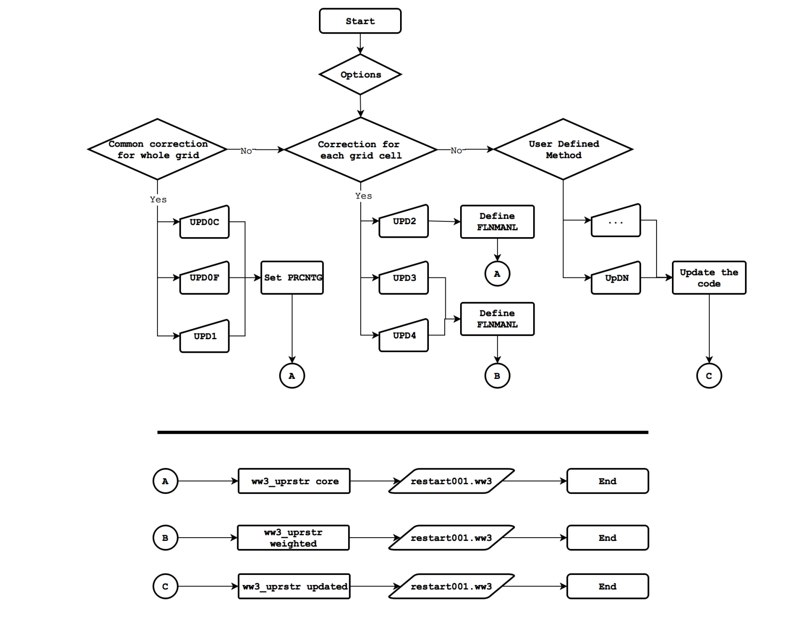

图 4.4：WW3 重启文件中波谱更新方法的流程图。可以通过在 namelist 中添加 UPD 选项来实现其他更新方法。

3.  UPD1：从 5.16 版本中删除。选项 1，fac(x,y,frq,theta) 按每个频谱箱的能量百分比加权，计算方法与 UPD0F 相同。

4.  UPD2：选项 2，fac(x,y,frq,theta) 在每个网格点根据背景 SWH 和分析 SWH 计算。

5.  UPD3：选项 3，更新因子为具有背景频谱形状的表面。

6.  UPD4：当前版本未包含，仅保留位置。选项 4，是 UPD3 的推广，更新因子为应用于背景频谱的多个表面之和。该算法需要将每个分区映射到单独频谱，以确定加权表面。

7.  UPD5：选项 5，按照 UPD2 计算校正，但仅在风浪为主导成分时应用于风浪部分，否则对整个频谱进行校正。所需输入包括分析 Hs 字段及背景风速和风向。建议使用带 WRST 开关编译的代码以包含风数据。

8.  UPD6：选项 6，按照 UPD5 计算校正，同时风浪成分在频率空间中根据 Toba (1973) 移位。所需输入同 UPD5。

任何用于将能量重新分配到频谱并修正相关风场的额外方法，都可以通过扩展输入文件并向 ww3_uprstr.ftn 添加源代码来实现。

<p class="day-night-paragraph2">

示例
</p>

本节讨论最简单的波浪数据同化（WDA）应用示例。图 4.5 展示了 ww3 uprstr 在简单波浪分析系统中的使用方式。

一次 WW3 模拟运行（来自前一循环或历史回溯）提供背景 SWH 场及相应时间的重启文件。背景 SWH 场的格式必须与 WDA 模块输入兼容。

WDA 模块使用背景场及可用观测数据生成分析结果，并将 SWH 字段以 grbtxt 格式导出（XXXX.grbtxt）。

分析文件、mod_def.ww3、restart.ww3 文件和 ww3_uprstr.inp 构成 ww3 uprstr 的输入文件。如果所有选项和输入文件准备正确，单处理器更新 260000 个网格节点并生成输出大约需要一分钟。更新后的重启文件需按预期文件名重命名，在本示例中为 restart.ww3。

------------------------------------------------------------------------

注意：所有 NCEP 的波浪数据同化（WDA）系统都使用 GRIB2 格式，因此总是需要一个中间步骤将 GRIB 文件转换为适当的格式。所使用的软件是 WGRIB2，更多信息可从官方网站获取。

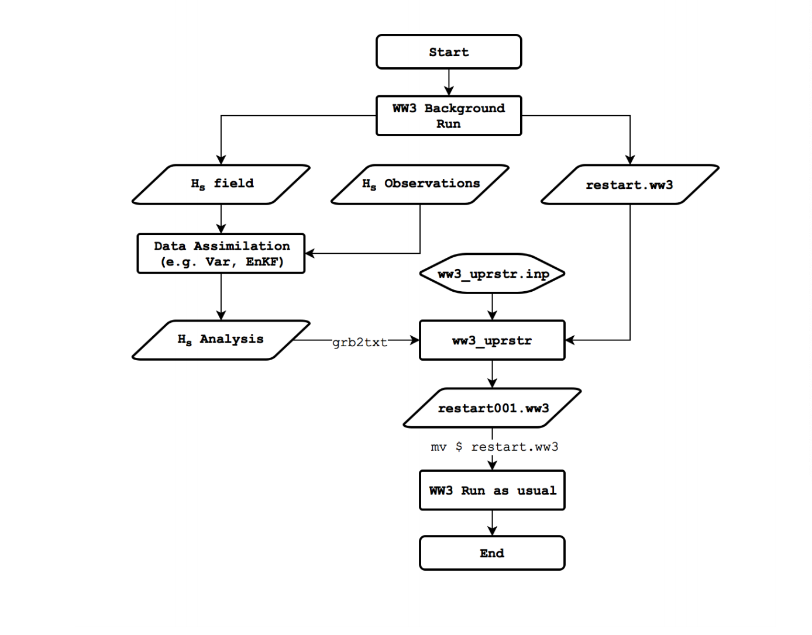

图 4.5：简化波浪数据同化系统流程图，显示了 ww3 uprstr 的作用、所需的输入文件以及更新后的重启文件的输出结果。

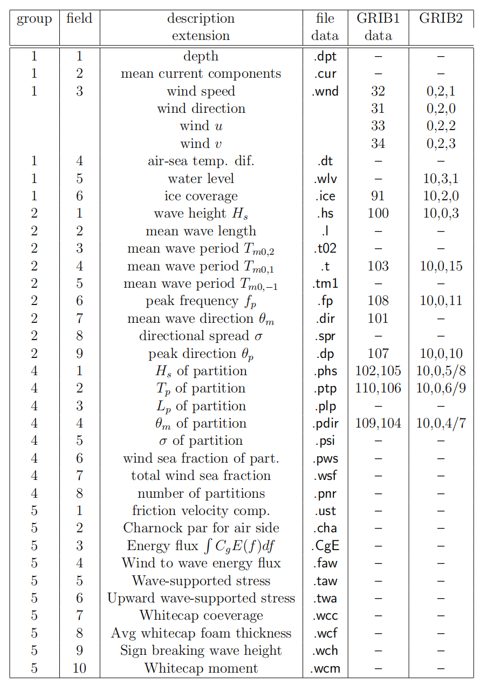


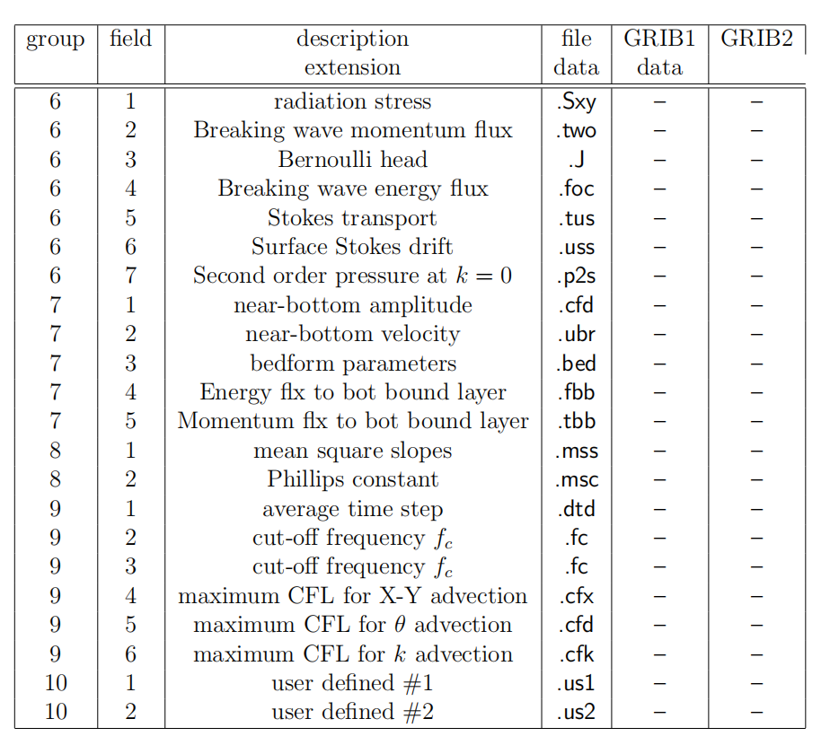


# 5 安装、编译与运行波浪模型

## 5.1 引言

WAVEWATCH III 使用 ANSI 标准 FORTRAN-90 编写，不包含与机器相关的元素，因此可以在大多数平台上直接安装，无需修改。WAVEWATCH III 使用自己的预处理器在编译阶段选择模型选项，并控制测试输出的开关。这种方法在 WAVEWATCH III 的开发过程中证明了其高效性，但也增加了安装的复杂性。

为了减少安装难度，提供了一套 UNIX/Linux 脚本，用于自动化安装过程，并简化预处理器的使用。需要注意的是，这些脚本不支持像 MS 系列操作系统。如果需要在这些平台上编译代码，建议先在 UNIX/Linux 环境中使用工具 w3_source 提取可用代码（见下文），然后将此干净代码移植到目标平台。

如果将版本 7.14 作为 WAVEWATCH III 的升级版本来使用，请注意该版本可能与之前的模型版本不兼容。因此，**不建议在旧版本基础上直接安装新版本**。

## 5.2 发布

在 5.16 版本之前，WAVEWATCH III 的公开发行版以 tarball 文件形式发布。在 6.07 版本公开发布后，WAVEWATCH III 转向开放开发模式，源代码通过 GitHub 分发。

## 5.3 安装

克隆源代码：

``` sh
git clone https://github.com/NOAA-EMC/WW3
```

可以通过检出标签访问公开发行版本：

``` sh
git checkout VERTAG  
```

其中 VERTAG 为公开发行标签，例如 v6.07。

## 5.4 配置

克隆 WAVEWATCH III 仓库后，需要执行两个步骤。

第一步是运行脚本 model/bin/w3_setup，该脚本会编译辅助程序并生成环境文件 WWATCH3.ENV，文件将保存在 bin 目录下。该文件设置了默认的 C 和 FORTRAN 编译器选项，仅在预处理器中使用。除特殊情况外，可直接使用默认设置。

运行脚本可显示完整用法；若要执行并指定源代码目录（model 目录位置），在顶层目录下运行：
<big>
<center>
./model/bin/w3_setup model
</center>
</big>
可通过重新运行 w3_setup 脚本或手动编辑 setup 文件修改配置。WAVEWATCH III 的"home"目录只能通过编辑或删除本地 wwatch3.env 文件修改。

以前版本需要定义用户环境变量 WWATCH3_ENV 来指定 wwatch3.env 的路径，现在已不再需要。同时，也不再提供全局安装选项。

第二步是运行脚本 /model/bin/ww3_from_ftp.sh，从 FTP 获取未存储在 Git 仓库中的二进制文件或大文件。在顶层目录下运行：

<big>
<center>

./model/bin/ww3_from_ftp.sh
</center>

</big>

该脚本中有三个需要用户输入的提示。第一个提示要求输入顶层目录的路径，第二个提示询问是否要删除复制的 tar 文件（通常回答 n，即不删除），第三个提示询问是否保留脚本使用的临时文件夹（通常回答 n，即不保留）。

## 5.5 目录结构

在克隆 WAVEWATCH III 仓库后，顶层目录包含以下子目录：

- manual：手册目录
- model：模型源代码、构建脚本等  
- regtests：WAVEWATCH III 可执行文件  
- guide：WAVEWATCH III 指南
- smc docs：SMC 网格的文档和相关文件

在 WAVEWATCH III 的 `model` 目录下，存在以下子目录：

- tools：原始辅助程序（源代码等）
- bin：用于编译和链接的可执行文件和 shell 脚本  
- ftn：源代码和 Makefile
- inp：输入文件
- nml：Namelist 输入文件

编译代码后，`model` 目录下还会生成以下目录：

- exe：WAVEWATCH III 可执行文件  
- mod：模块文件
- obj：目标文件

tools 目录中包含各种额外工具，包括贡献的 Matlab 代码、IDL 工具、bash 脚本以及 GrADS 和 FORTRAN 程序，具体内容可查看实际目录。

安装 WAVEWATCH III 并设置运行时，辅助程序首先会处理 FORTRAN 代码，使用 setup 中定义的编译器。

文件 wwatch3.env。注意，这些代码仍然是固定格式的 FORTRAN-77。可执行文件存放在 bin 目录中。有关这些程序的详细说明（包括运行可执行文件的说明）可参阅源代码文件中包含的文档。

在编译这些程序后，bin 目录中还会安装若干 UNIX shell 脚本和辅助文件：

- w3adc.f：WAVEWATCH III 的 FORTRAN 预处理器
- w3prnt.f：打印源代码文件，包括页码和行号  
- w3list.f：生成通用源代码列表
- w3split.f：生成频谱公告，用于识别点输出后处理器频谱中的各个波场（见 4.4.18 节）。这是一个历史遗留代码，现在已被直接从 ww3 outp 生成公告所取代，仅保留用于历史参考

bin 目录中还有多种 UNIX 脚本，用于管理 WAVEWATCH III 框架。使用这些脚本的方法在 5.7 节中说明。需要注意的是，以下脚本会从 WAVEWATCH III 环境设置文件中获取配置信息，该环境文件由 WWATCH3_ENV 定义，可由 w3_setenv 读取本地 wwatch3.env 文件，或者由用户环境文件定义。

主要程序包括：

- install_ww3_tar：从 tar 文件安装 WAVEWATCH III 的脚本  
- w3_setup：创建或编辑 WAVEWATCH III 环境设置文件的脚本，默认设置文件为 bin/.wwatch3.env，可在参数中指定开关和编译器  
- w3_clean：清理 WAVEWATCH III 目录中编译或测试过程中生成的文件，提供三级清理选项  
- w3_make：使用 makefile 编译和链接 WAVEWATCH III 组件，可在参数中指定程序列表
- w3_automake：根据开关文件内容自动编译顺序、分布式程序（MPI、OMP 或 HYB），可指定程序列表  
- w3_new：更新所有源代码文件时间戳，以应对编译器开关修改后的 makefile 编译
- ww3_gspl.sh：自动化使用 ww3_gspl 程序的脚本（见 4.4.11 节）  
- arc_wwatch3_tar：将 WAVEWATCH III 的版本归档到 arc 目录的程序
- ww3_from_ftp.sh：下载所有 git 未提供的二进制文件的脚本

提供的示例文件：

- switch_xxx：预处理器开关示例，由用户或开发者提供（见 5.9 节）

调用的子程序：

- w3_setenv：根据 bin/.wwatch3.env 设置环境的脚本，由所有辅助程序调用
- comp.tmpl：编译脚本模板 comp，用于 cmplr.env
- link.tmpl：链接脚本模板 link，用于 cmplr.env  
- cmplr.env：测试过的编译器选项，适用于 intel、mpt、gnu、pgi，包含优化和调试选项，与 comp.tmpl 和 link.tmpl 配合使用
- make_makefile.sh：根据 switch 文件的选择生成 makefile 的脚本
- ad3：运行预处理器 w3adc 并使用 comp 编译指定源代码文件的脚本
- ad3_test：ad3 的测试版本，展示对原始源文件的修改，不进行代码编译
- all_switches：生成源代码文件中所有 w3adc 开关的列表  
- find_switch：查找包含编译器开关（或任意字符串）的 WAVEWATCH III 源代码文件  
- sort_switch：对 switch 文件中的开关进行排序
- sort_all_switches：搜索 WAVEWATCH III 中所有 switch 文件并调用 sort_switch

额外程序：

- comp.xxx：高级设置的编译脚本
- link.xxx：高级设置的链接脚本
- make_MPI：分别编译 MPI 和非 MPI 程序（未来版本已废弃，使用 w3_automake）
- make_OMP：分别编译 OpenMP 和单线程程序（未来版本已废弃，使用 w3_automake）
- make_HYB：分别编译混合 MPI-OpenMP 和单线程程序（未来版本已废弃，使用 w3_automake）
- ln3：创建源代码文件到工作目录的符号链接（未使用）
- list：使用 w3prnt 打印源代码列表（未使用）
- w3_source：生成 WAVEWATCH III 程序元素的真实 FORTRAN 源代码（未使用）  
- WW3_switch_process：处理源文件中的 switch 的 Perl 脚本（未使用）

安装后，tools 目录中还包含若干 GrADS 脚本：

- cbarn.gs：用于显示颜色条的半标准 GrADS 脚本  
- colorset.gs：定义阴影颜色的脚本  
- profile.gs：显示 ww3_multi 生成的剖面数据
- source.gs：绘制频谱和源项的复合图（2D 极坐标或笛卡尔坐标，彩色或黑白）
- 1source.gs：绘制单一源项
- spec.gs：绘制频谱  
- spec_ids.gen：频谱/源项脚本使用的数据文件

## 5.6 可选环境设置

编译启用 NetCDF 的 WAVEWATCH III 程序需要 NetCDF 版本 4.1.1 或更高版本，同时需要设置环境变量：

NETCDF_CONFIG：指向 NetCDF-4 的 nc-config 工具程序路径

nc-config 用于确定编译和链接的正确选项。可以使用命令
<big>
<center>

nc-config --version
</center>

</big>
检查已安装 Fortran-NetCDF 库的版本。还需要确保 NetCDF-4 安装时启用了 NetCDF-4 API，可用命令
<big>
<center>

nc-config --has-nc4
</center>

</big>
验证。

编译带有 PDLIB 的 WAVEWATCH III（用于三角形非结构网格的显式/隐式域分解）需要设置环境变量：METIS_PATH：指向使用与 WW3 相同编译器编译的 Metis 和 ParMetis 的路径

关于模型的并行版本（OpenMP 和 MPI）还需注意两点：

1.  在为 MPI 环境准备可执行文件时可能会出现复杂问题，具体可参考附录 C。

2.  OpenMP 版本的代码应仅使用指令进行并行化，不要使用自动线程化的编译器选项。

## 5.7 编译与链接

在首次编译前，需要使用脚本 w3_setup 设置 WAVEWATCH III 环境，并提供 model 目录路径作为参数。一些可选项用于定义编译器选项和位于 bin 目录下的 switch 文件，例如：

<big>
<center>

w3_setup /home/user/WW3/model -c comp -s switch
</center>

</big>

- `<comp>` 可选值为 mpt、intel、gfortran、pgi，对应优化编译选项，也可以使用 mpt_debug、intel_debug、gfortran_debug、pgi_debug 进行调试编译。系统依赖的选项可通过修改脚本 cmplr.env 实现。旧的编译/链接模板仍存在，但不推荐使用。

- `<switch>` 为提供的 switch 文件后缀，也可以是用户自定义的 switch 文件。

运行该脚本将生成以下三个脚本/文件：

- comp：编译器脚本。该脚本基于 comp.tmpl，并使用提供的编译器及其选项定义。  
- link：链接器脚本。该脚本基于 link.tmpl，并使用提供的链接器及其选项定义。  
- switch：包含由预处理器 w3adc 识别的开关列表的文件。从 switch 复制。

环境文件 wwatch3.env 将被创建，或在已存在时更新。辅助的 FORTRAN 代码预处理程序将默认使用 GNU FORTRAN 编译器编译，这可能与 WAVEWATCH III 主程序使用的编译器不同。

编译 WAVEWATCH III 最简单的方法是使用脚本 w3_automake，它会自动检测需要编译的程序并进行编译。该脚本会强制将前处理和后处理程序编译为顺序实现，其余程序根据 openMP、MPI 或混合配置开关进行编译。如果 netCDF 库正确配置，专用的 netCDF 程序也会被编译。对于 SCRIPNC、PDLIB、OASIS、ESMF、TRKNC 和 TIDE 关键字，脚本也会进行相应检测，以确保程序以最优方式进行编译。例如：w3_automake

例如，对于几个程序，如 w3_automake、ww3_grid、ww3_shel、ww3_ounf，编译后的程序都会存放在 exe 目录中，同时会保留使用的 switch、comp 和 link 文件的副本。

如果在编译过程中出现问题，日志文件会存放在临时目录中，该目录根据运行模式不同而有所区分：顺序模式为 tmp_SEQ，分布式模式如 MPI 为 tmp_MPI，OpenMP 为 tmp_OMP，混合模式为 tmp_HYB。通常每个程序会生成三个日志文件：

ww3\_\<prog\>.l：完整程序，只包含与所选开关匹配的代码行，最后显示编译命令行。  
ww3\_\<prog\>.out：警告信息。  
ww3\_\<prog\>.err：错误信息。

要删除 WAVEWATCH III 框架中的所有用户生成文件，可以使用脚本 w3_clean：

只清理 model 目录：
<big>
<center>

w3_clean -m
</center>

</big>
清理整个 WW3 仓库：
<big>
<center>

w3_clean -c
</center>

</big>

## 5.8 详细编译

WAVEWATCH III 的编译通过 bin 目录下的脚本 w3_make 完成。如果该脚本在没有参数的情况下使用，将会编译 WAVEWATCH III 的所有基础程序。用户也可以在编译命令中指定要编译的程序名称。例如：

<big>
<center>

w3_make ww3_grid ww3_strt
</center>

</big>

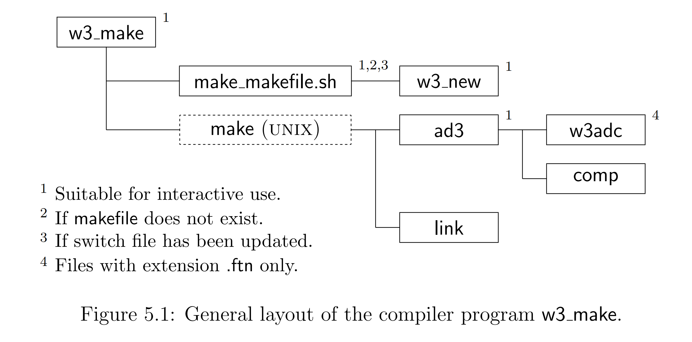

将只编译网格预处理程序和初始条件程序。

w3_make 使用了前一节中介绍的多个脚本。其工作流程可见图 5.1。如果需要，w3_make 会调用 make_makefile.sh 脚本生成 Makefile。make_makefile.sh 会根据 switch 文件中的程序开关生成需要链接的模块列表，并检查所有源文件的模块依赖关系。如果自上次调用 w3_make 以来更改了开关，w3_new 会被用来"touch"相关源代码或删除相关的目标文件。

在 Makefile 完成后，使用标准 UNIX make 工具编译和链接程序。Makefile 并非直接调用 FORTRAN 编译器，而是调用预处理器和编译脚本 ad3 与 comp，以及链接脚本 link。ad3 脚本根据文件名的扩展名决定所需操作：扩展名为 .ftn 的文件由 w3adc 处理，扩展名为 .f 或 .f90 的文件直接发送给 comp 脚本。虽然用户可以尝试交互式运行这些脚本，但通常只需要运行 w3_make 即可完成编译。

辅助脚本如 w3_make 等使用的是 WAVEWATCH III 主目录下 ./bin 目录中的 switch、comp 和 link 文件，而不是本地目录中的文件。

在进行适当修改或复制了示例脚本之后，WAVEWATCH III 的部分或全部程序即可进行编译和链接。首次编译程序时，建议逐个模块进行编译，以避免大量错误信息，同时在 comp 脚本中设置错误捕捉。一个好的起点是编译简单的测试代码 ctest。首先进入工作目录，并通过以下命令建立到该例程源代码的链接：
<big>
<center>

ln3 ctest
</center>

</big>
创建此链接是为了便于后续将错误加入测试或在 comp 脚本中设置错误捕捉。可以通过以下命令查看预处理器 w3adc 的工作过程：
<big>
<center>

ad3_test ctest
</center>

</big>
此命令显示 ctest.ftn、include 文件及程序开关如何构建实际源代码。接下来，可以通过以下命令测试该子程序的编译：
<big>
<center>

ad3 ctest 1
</center>

</big>
此命令调用预处理器 w3adc 和编译脚本 comp，末尾的 1 表示启用测试输出。如果省略该参数，命令将只输出一行，表明例程正在处理。若 ad3 正常运行，将生成对象文件 obj/ctest.o。若在初始设置中请求，将在 scratch 目录中生成源代码和列表文件（ctest.f 和 ctest.l）。若编译过程中 comp 检测到错误，列表文件也会被保留。此时可通过在 work 目录的 ctest.ftn 中加入错误和警告来测试 comp 脚本的错误捕捉功能，具体可参阅 comp 的文档。测试完成并删除 ctest.ftn 中的错误后，可删除工作目录的链接及 obj/ctest.o 文件。

在单个例程成功编译后，下一步是尝试编译并链接整个程序。例如，编译网格预处理程序可以输入：
<big>
<center>

w3_make ww3_grid
</center>

</big>
如果编译成功，并且输入文件已正确安装（见上文），可以在工作目录中通过输入
<big>
<center>

ww3_grid
</center>

</big>
来测试网格预处理程序。如果输入文件已安装，工作目录中将会有指向输入文件 ww3_grid.inp 的链接，网格预处理程序会运行并将输出显示在屏幕上。网格预处理程序生成的输出文件将出现在工作目录中。首次编译程序时，操作系统可能无法找到可执行文件。如果发生这种情况，可尝试输入
<big>
<center>

rehash
</center>

</big>
或打开一个新的 shell 来运行程序。通过这种方式，可以逐步编译和测试各个独立程序。要清理所有临时文件（例如列表文件）和测试运行生成的数据文件，可输入
<big>
<center>

w3_clean
</center>

</big>
需要注意的是，w3_make 仅会检查 switch 文件是否有更改。如果用户修改了编译和链接脚本 comp 和 link 中的编译选项，建议强制重新编译整个程序。这可以通过在运行 w3_make 前输入
<big>
<center>

w3_new all or w3_new
</center>

</big>
来实现。如果编译出现无法解释的失败，这种方法也可能有用。

## 5.9 选择模型选项

bin 目录下的 switch 文件包含了一组用于选择模型选项的字符串。可用选项很多。在多个选项组中，必须精确选择一个，这些强制性开关在 5.9.1 节中说明。其他开关为可选开关，在 5.9.2 节中说明。模型默认设置在 5.9.3 节中给出。switch 文件中开关的顺序是任意的。开关如何被包含进源代码文件在第 6.2 节中有详细说明。

### 5.9.1 强制性开关

硬件模型与消息传递协议 ：必须精确选择一项。注意 MPI 开关只能与 DIST 开关一起使用。  
SHRD 共享内存模型  
DIST 分布式内存模型  
SHRD 共享内存模型，无消息传递  
MPI 消息传递接口（MPI）

------------------------------------------------------------------------

传播方案与 GSE 缓解方法 ：此组开关依赖硬件模型选择，用户无法自行定义。

PR0 不使用传播方案/GSE 缓解  
PR1 一阶传播方案，不使用 GSE 缓解  
PR2 高阶方案，使用 BOOIJ 和 HOLTHUIJSEN (1987) 的色散修正  
PR3 高阶方案，使用 TOLMAN (2002A) 平均技术  
PR0 不使用传播方案  
PR1 一阶传播方案  
UNO 二阶（UNO）传播方案  
UQ 三阶（UQ）传播方案

------------------------------------------------------------------------

通量计算选择 ：

FLX0 不使用例程；通量计算包含在源项中  
FLX1 根据公式 (2.70) 计算摩擦速度  
FLX2 根据 TOLMAN 和 CHALIKOV 输入计算摩擦速度  
FLX3 同上，并加上公式 (2.92) 或 (2.93) 限制  
FLX4 根据公式 (2.156) 计算摩擦速度  
FLX5 根据大气应力计算摩擦速度（应力需作为输入）

------------------------------------------------------------------------

线性输入选择 ：

LN0 无线性输入  
SEED 根据公式 (3.70) 进行频谱播种  
LN1 CAVALERI 和 MALANOTTE-RIZZOLI 方法带滤波器

------------------------------------------------------------------------

输入和耗散选择（STABN 开关可选） ：

ST0 不使用输入和耗散  
ST1 WAM3 源项包  
ST2 TOLMAN 和 CHALIKOV (1996) 源项包（可选 STAB2 开关）  
STAB0 无稳定性修正，可兼容任何源项包，使用此开关无效果  
STAB2 启用稳定性修正 (2.109)-(2.112)，仅兼容 ST2  
ST3 WAM4 及其变体源项包  
STAB3 启用 ABDALLA 和 BIDLOT (2002) 稳定性修正，仅兼容 ST3 和 ST4  
ST4 ARDHUIN 等 (2010) 源项包  
ST6 BYDRZ 源项包

------------------------------------------------------------------------

非线性交互选择

NL0 不使用非线性交互  
NL1 离散交互近似（DIA）或高斯求积法（GQM）  
NL2 精确交互近似（WRT）  
NL3 广义多重 DIA（GMD）  
NL4 双尺度近似（TSA）

------------------------------------------------------------------------

底摩擦选择

BT0 不使用底摩擦  
BT1 JONSWAP 底摩擦公式  
BT4 SHOWEX 底摩擦公式  
BT8 DALRYMPLE 和 LIU 公式（流体泥质海底）  
BT9 NG 公式（流体泥质海底）

------------------------------------------------------------------------

海冰阻尼项选择

IC0 不使用海冰阻尼  
IC1 简单公式  
IC2 LIU 等公式  
IC3 WANG 和 SHEN 公式  
IC4 频率相关海冰阻尼

------------------------------------------------------------------------

海冰散射项选择

IS0 不使用海冰散射  
IS1 海冰扩散散射（简单）  
IS2 FLOE 尺寸相关散射与耗散

------------------------------------------------------------------------

反射项选择

REF0 不使用反射  
REF1 启用岸线和冰山反射

------------------------------------------------------------------------

深度诱导破碎选择

DB0 不使用深度诱导破碎  
DB1 BATTJES-JANSSEN

------------------------------------------------------------------------

三波相互作用选择

TR0 不使用三波相互作用  
TR1 聚合三波相互作用（LTA）方法

------------------------------------------------------------------------

底部散射选择

BS0 不使用底部散射  
BS1 MAGNE 和 ARDHUIN

------------------------------------------------------------------------

风/动量/空气密度插值方法（时间）

WNT0 不插值  
WNT1 线性插值  
WNT2 近似二次插值

------------------------------------------------------------------------

风/动量插值方法（空间）

WNX0 向量插值  
WNX1 近似线性速度插值  
WNX2 近似二次速度插值

------------------------------------------------------------------------

流场插值方法（时间）

CRT0 不插值  
CRT1 线性插值  
CRT2 近似二次插值

------------------------------------------------------------------------

流场插值方法（空间）

CRX0 向量插值  
CRX1 近似线性速度插值  
CRX2 近似二次速度插值

------------------------------------------------------------------------

用户提供 GRIB 包开关

NOGRB 不使用 GRIB 包  
NCEP2 IBM SP 上的 NCEP GRIB2 包

### 5.9.2 可选开关

以下所有开关在被选择时会激活模型行为，但不要求特定组合。以下开关控制 WAVEWATCH III 程序的可选输出。

O0 网格预处理器中输出 namelist  
O1 网格预处理器中输出边界点  
O2 网格预处理器中输出网格点状态图  
O2A 在网格预处理器中生成陆海掩膜文件 mask.ww3  
O2B 网格预处理器中输出障碍物图  
O2C 以 ww3_grid 可读取的格式打印状态图  
O3 字段预处理器中对字段循环的附加输出  
O4 初始条件程序中打印归一化一维能量谱图  
O5 打印二维能量谱  
O6 波高空间分布输出（不适用于分布式内存）  
O7 对通用 shell 的同质场输入数据回显  
O7A 输出点诊断输出  
O7B 在 ww3_multi 中同上  
O8 在波模型中过滤极小波高场输出（适用于某些传播测试）  
O9 将负能量赋值为负波高，用于新传播方案测试阶段  
O10 在标准输出中标识多网格模型扩展的主要元素  
O11 日志 log.mww3 中管理算法的附加日志输出  
O12 标识重叠网格中被移除的边界点（中心）  
O13 标识重叠网格中被移除的边界点（边缘）  
O14 为 ITYPE = 0 的 ww3_outp 输出生成浮标数据日志文件 buoy_log.ww3  
O15 为 ww3_prep 输入数据文件生成时间戳日志 times.XXX  
O16 在 ww3_gspl 中生成 GrADS 网格分区输出

以下开关启用模型的 OpenMP 指令并行化，也称为"线程化"。在 5.01 版本之前，线程化和使用 MPI 开关的并行化不能同时使用。自 5.01 版本起，纯 MPI、纯 OMP 和混合 MPI-OMP 方法可用。5.01 及以上版本使用的开关与之前版本不兼容。

OMPG 对循环的通用并行化指令，适用于纯 OpenMP 和混合 MPI-OpenMP

OMPH 仅用于混合 MPI-OpenMP 并行化的指令

PDLIB 三角形非结构网格显式/隐式求解器的域分解（需要 ParMetis）

B4B 强制 OpenMP 代码逐位可重复性。某些 OpenMP 操作（尤其是求和等归约运算）可能因浮点舍入误差而导致多次运行结果略有不同。启用此开关会增加中间步骤（例如将数值缩放为整数），以确保每次运行结果完全一致。该开关对于需要逐位可重复性的回归测试非常有用。目前仅影响使用 SMC 开关编译的代码。

注意，这些开关只能以特定组合使用，由模型安装脚本强制执行（尤其是 make_makefile.sh）。纯 MPI 方法需要同时启用 DIST 和 MPI 开关。纯 OpenMP 方法需要启用 SHRD 和 OMPG 开关，而混合方法则需要启用 DIST、MPI、OMPG 和 OMPH 开关。

以下开关与连续移动网格选项相关。第一个开关用于激活该选项，另外两个为可选附加功能。

MGP 激活传播修正 (公式 3.45)  
MGW 在移动网格方法中应用风修正  
MGG 激活 GSE 缓解修正 (公式 3.48)

其他杂项开关：

COU 激活耦合所需变量计算  
DSS0 关闭扩散色散修正中的频率色散  
FLD1 根据 Reichl 等 (2014) 的海况依赖 $τ$（2.5.2 节）  
FLD2 根据 Donelan 等 (2012) 的海况依赖 $τ$（2.5.3 节）  
IG1 二阶频谱与自由次重力波（2.4.9 节）  
MLIM 使用 Miche 样浅水限制器 (公式 3.71)  
MPIBDI 多网格模型初始化实验性并行化  
MPIT MPI 初始化测试输出  
MPRF 单个模型及嵌套在 ww3 multi 中的性能分析  
NCO NCEP 中央运行的操作实现修改（不建议一般使用）  
NLS 激活非线性平滑器（2.3.8 节）  
NNT 生成训练和测试用的频谱及非线性交互文件 test_data nnn.ww3  
OASIS 初始化 OASIS 耦合器（附录 E.3）  
OASACM OASIS 大气模型耦合字段（附录 E.3）  
OASOCM OASIS 海洋模型耦合字段（附录 E.3）  
OASICM OASIS 海冰模型耦合字段（附录 E.3）  
REFRX 基于相速度空间梯度启用折射（2.4.3 节）  
REFT 海岸线反射测试输出（ref1 开启时）  
RTD 旋转网格选项  
RWND 修正风速以考虑流速  
S 启用主 WAVEWATCH III 子程序的跟踪调用 strace  
SCRIP 启用 SCRIP 重映射例程（附录 D.3）  
SCRIPNC 在 NetCDF 文件中存储重映射权重（附录 D.3）  
SEC1 启用小于 1 秒的全局时间步，但不允许输出时间步小于 1 秒  
SMC 激活 SMC 网格  
T 启用程序中测试输出  
TN Id  
TDYN 扩散色散修正中涌浪年龄的动态增量（仅测试用例）  
TIDE 启用潮汐分析：输入文件预处理、运行时潮汐预测或 ww3 prtide 潮汐预测  
TIDET 潮汐分析测试输出  
TRKNC 激活波系统追踪后处理程序中的 NetCDF API  
UOST 启用未解析障碍源项  
WRST 在 restart 文件中保存风并用于第一步 wmesmf  
XW0 仅在 ULTIMATE QUICKEST 方法中应用涌浪扩散  
XW1 仅在 ULTIMATE QUICKEST 方法中应用波增长扩散

### 5.9.3 默认模型设置

在模型版本 3.14 之前，NCEP 的运行模型配置被视为默认模型设置。然而，随着 WAVEWATCH III 的后续版本发布，模型已发展为一个建模框架，而不再是单一模型。因此，WAVEWATCH III 在不同中心的运行方式各异，无法再明确识别一个"默认"模型版本。

为了在论文或报告中能够明确标识所使用的模型设置，现在在 BIN 目录中提供了各中心的"默认"配置。这些配置以示例 SWITCH 文件和 README 文件的形式提供，例如 SWITCH_NCEP_ST2 和 README.NCEP。

需要注意的是，这些文件仅用于简化模型版本的引用，并不意味着对特定模型配置的认可。在这种情况下，需要理解的是，运行中心的模型版本本质上处于持续开发状态。

## 5.10 修改源代码

显然可以通过编辑 FTN 目录下的源代码文件来修改源代码。然而，通常更方便的方法是在 WORK 目录中修改源代码文件。这可以通过在 FTN 和 WORK 目录之间生成链接来实现。生成链接的命令为：
<big>
<center>

ln3 文件名
</center>

</big>
其中，文件名可以是源代码文件或 include 文件的名称，可以带或不带其扩展名。

建议在 WORK 目录中进行操作，原因如下：

1.  可以在同一目录中测试程序，因为输入文件的链接相同。  
2.  该目录中已有相关 SWITCH、编译和 LINK 程序的链接可用。  
3.  容易跟踪已修改的文件（即只有创建了链接的文件可能已被修改）。  
4.  即使 WORK 目录中的文件（链接）被意外删除，源代码本身也不会丢失。

修改源代码非常直接。向现有子程序添加新开关，或添加新模块，则需要修改自动编译脚本。如果只是向已有模块添加新的子程序，则无需修改脚本。如果向 WAVEWATCH III 添加新模块，需要执行以下步骤以将其纳入自动编译流程：

1.  将文件名添加到 make_makefile.sh 的 2.b 和 2.c 节，以确保该文件在正确条件下包含在 Makefile 中。

2.  相应修改脚本的 3.b 节，以确保正确检查模块依赖关系。注意，依赖关系是针对目标代码进行检查的，允许文件中出现多个或不一致的模块名。

3.  交互式运行脚本，确保 Makefile 已更新。

有关模块包含的详细信息，请参见实际脚本。

向编译系统添加新开关需要执行以下操作：

1.  将开关加入所需的源代码文件。
2.  如果开关属于新的开关组，则向 w3_new 添加新的关键字。  
3.  如有必要，更新 w3_new 中需触碰的文件列表。
4.  更新 make_makefile.sh 中的开关和/或关键字。

这些修改仅在开关选择程序模块时才需要。对于测试输出等情况，只需在源代码中添加开关即可。

向附加子程序添加旧开关需要执行以下操作：

1.  更新 w3_new 中需触碰的文件列表。

如果修改了 WAVEWATCH III，建议保留之前版本的源代码和编译脚本。为简化此操作，提供了归档脚本 arc_wwatch3。该脚本生成 tar 文件，可通过安装程序 install_wwatch3 重新安装。归档文件存放在 arc 目录中，文件名可以包含用户定义的标识符（如果未使用标识符，则文件名与原 WAVEWATCH III 文件相同）。归档程序可通过输入以下命令调用：
<big>
<center>

arc_wwatch3
</center>

</big>
该脚本的交互式输入说明清晰明了。归档文件可以通过将对应的 tar 文件复制到 WAVEWATCH III 主目录，重命名为安装程序期望的文件名，然后运行安装程序来重新安装。

对于使用 NCEP svn 仓库的共同开发者，代码修改应遵循 Tolman (2014c) 中概述的最佳实践。

## 5.11 运行测试用例

如果 WAVEWATCH III 已成功安装和编译，可以通过交互方式运行不同的程序模块来进行测试。为此，首先创建一个名为 work 的顶层目录，并将输入文件从 model/inp 或 model/nml 目录中复制到该目录。现在不再提供通用开关文件，但可以从 bin 目录中选择一个开关文件，然后使用示例输入文件进行测试。因此，应该可以通过输入命令来运行所有模型模块。

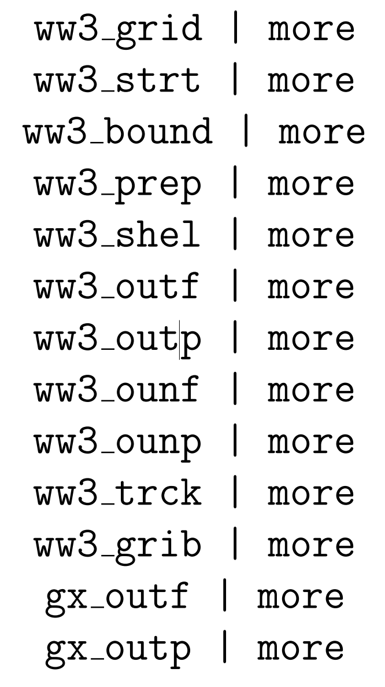

为了方便在屏幕上查看输出，可以在命令后添加 \| more。这个 \| more 也可以用输出重定向替代，例如：
<big>
<center>

ww3_grid > ww3_grid.out
</center>

</big>
需要注意的是，ww3_grib 只有在链接了用户提供的打包例程时才会生成 GRIB 输出。此外，ww3_multi 没有提供简单的交互式测试用例。可以在 work 目录下运行 GrADS 来生成这些计算的图形输出。所有中间输出文件都保存在 work 目录中，可以通过输入命令轻松删除：
<big>
<center>

w3_clean
</center>

</big>
在 3.14 版本之前，WAVEWATCH III 提供了一组简单测试，用于验证模型基本功能的正确性。在下一版本模型早期开发阶段，Erick Rogers 和 Tim Campbell 将这些测试转换为回归测试，以便更方便地自动化运行。到 4.06 版本，这些修改后的测试被集中在 nrltest 目录中，同时保留旧测试在 test 目录。到 4.07 版本，nrltest 被采纳为 WAVEWATCH III 的新测试用例，并放置在新的 regtests 目录中，而原有的实际应用测试从 test 目录迁移到 cases 目录，同时 test 目录被废弃。当前可用的回归测试位于 regtests 目录中。

ww3_tp1.1 赤道沿线全球一维波传播测试（无陆地）  
ww3_tp1.2 子午线方向一维波传播测试（无陆地）  
ww3_tp1.3 一维波传播，浅水波测试  
ww3_tp1.4 一维波传播，频谱折射测试（x方向）  
ww3_tp1.5 一维波传播，频谱折射测试（y方向）  
ww3_tp1.6 一维波传播，流阻挡波测试  
ww3_tp1.7 一维波传播，红外波生成测试  
ww3_tp1.8 一维波传播，海滩波破碎测试  
ww3_tp1.9 一维波传播，Beji 和 Battjes (1993) 堰槽实验

ww3_tp2.1 二维波传播，与网格夹角测试  
ww3_tp2.2 二维波传播，半球无陆地（有方向性扩展）  
ww3_tp2.3 二维波传播，GSE测试  
ww3_tp2.4 二维波传播，东太平洋曲线网格测试  
ww3_tp2.5 二维波传播，北极曲线网格测试  
ww3_tp2.6 二维波传播，Limon港非结构化网格测试  
ww3_tp2.7 二维非结构化网格反射测试  
ww3_tp2.8 二维规则网格潮汐分量测试  
ww3_tp2.9 阻挡网格测试  
ww3_tp2.10 SMC网格测试  
ww3_tp2.11 旋转网格测试  
ww3_tp2.12 系统追踪测试  
ww3_tp2.13 网格夹角传播测试（三极点）  
ww3_tp2.14 使用OASIS耦合器的示例模型测试  
ww3_tp2.15 时空极值参数测试  
ww3_tp2.16 SMC网格二维传播，北极处理  
ww3_tp2.17 非结构化网格与Card Deck对比显式/隐式域分解；使用ww3_gint进行网格积分；grib2输出（ww3_grib）  
ww3_tp2.18 ww3_prnc/ww3_prtide潮汐分量测试  
ww3_tp2.19 非结构化网格，域分解/隐式方案，Neumann边界条件，深度破碎和三元源项（Boers 1996）  
ww3_tp2.20 植被源项测试（Anderson 和 Smith 2012）  
ww3_tp2.21 全球非结构化网格（周期性和阻挡）；使用ww3_gint网格积分；ww3_grib输出

ww3_ts1 源项测试，时间限制增长  
ww3_ts2 源项测试，fetch限制增长  
ww3_ts3 源项测试，单一移动网格下飓风  
ww3_ts4 源项测试，未解析障碍

ww3_tic1.1 波-冰相互作用，1D Sice测试  
ww3_tic1.2 波-冰相互作用，1D 浅水效应测试  
ww3_tic1.3 波-冰相互作用，1D 折射效应测试  
ww3_tic1.4 波-冰相互作用，1D 冰板和冰厚度测试  
ww3_tic2.1 波-冰相互作用，2D Sice测试  
ww3_tic2.2 波-冰相互作用，2D 非均匀冰测试  
ww3_tic2.3 波-冰相互作用，2D 均匀冰厚度递增测试

ww3_tbt1.1 波-泥相互作用，1D Smud测试  
ww3_tbt2.1 波-泥相互作用，2D Smud测试

ww3_tpt1.1 替代频谱分区方法测试  
ww3_ta1 ww3_uprstrt，更新均匀条件重启文件（单点模型）

mww3_test_01 扩展网格掩膜测试（含干湿处理等）  
mww3_test_02 单内部网格双向嵌套测试  
mww3_test_03 重叠网格及双向嵌套测试（6网格版本，高分辨率网格含海滩）  
mww3_test_04 流或海底山测试，双向嵌套，固定涌浪条件  
mww3_test_05 三层嵌套飓风网格移动测试  
mww3_test_06 非规则网格测试，使用 ww3_multi  
mww3_test_07 非结构化网格测试，使用 ww3_multi  
mww3_test_08 风和冰输入测试  
mww3_test_09 平级 SMC 子网格测试

ww3_ufs1.1 全球 1 度网格测试，使用 ww3_multi/ww3_multi_esmf；风/流/冰输入；网格积分使用ww3_gint；grib2输出（ww3_grib）；重启/MPI任务/线程可重复性（ufs应用）

ww3_ufs1.2 GFSv16 配置测试，使用 ww3_multi/ww3_multi_esmf；风/流/冰输入；网格积分使用 ww3_gint；grib2 输出（ww3_grib）；重启可重复性（ufs应用）

这些回归测试现在通过 regtests/bin 目录下的 run_test 脚本运行（主要作者：Tim Campbell）。如何运行该脚本及其选项，可通过运行命令
<big>
<center>

run_test -h
</center>

</big>
查看。运行该命令的输出如图 5.2 所示。测试用例存储在 regtests 目录下的子目录中，例如 regtests/ww3_tp1.1。举例来说，/ww3_tp1.1 的内容可能包括：

info：包含测试用例信息的文件  
input：存放测试用例输入文件的永久目录  
work_PR3：模型输出的临时目录（在此示例中名为 work_PR3，因为用户在运行时指定了"run_test -w work_PR3 ..."）

此外，现在还提供了一个回归测试矩阵，用于代码开发者确保新版本模型不会破坏旧版本功能。该矩阵的核心文件是 regtests/bin/matrix.base。运行示例为 regtests/bin/matrix_zeus_HLT，这是 Hendrik 在 NCEP Zeus R&D 计算机上的矩阵驱动程序。运行步骤为在 regtests 目录下创建链接并在脚本中设置所需选项标志后执行。此操作将在 regtests 中生成文件 matrix，可交互或批量运行，也可以手动进一步编辑。

regtests 下的 bin 目录包含以下工具：  
cleanup：清理工作目录  
comp_switch：比较测试用例内部及跨测试用例的 switches  
comp_switch -h：提供文档说明  
matrix.base：生成测试用例矩阵的核心脚本  
matrix.comp：比较不同模型版本矩阵输出的脚本  
matrix_zeus_HLT：matrix.base 的示例驱动程序  
run_test：基本测试脚本

有效运行回归测试矩阵需要尽量减少在回归测试间重新编译代码的次数。这可以通过在 matrix.base 中排序测试用例实现。为了确保相同的 switch 文件被识别为一致，可以使用主 bin 目录下的 sort_switch 脚本系统地排序。这一脚本会为缺失的 switch 添加默认值，也可以用于从文件中增加或删除 switch。运行
<big>
<center>

comp_switch -h
</center>

</big>
可查看脚本文档。

最后，cases 目录包含实际案例测试，如下：  
mww3_case_01：大西洋案例，五个网格，重点关注特隆赫姆  
mww3_case_02：太平洋案例，三个网格，重点关注阿拉斯加  
mww3_case_03：原始多网格案例，用作 NCEP 全球模型

每个案例都是一个执行整个模型运行的单脚本。运行脚本前，需要根据脚本开头文档中指示的 switches 编译模型。脚本使用的额外数据存储在以下目录：  
mww3_data_00：所有示例案例使用的风场和冰数据  
mww3_data_nn：特定脚本 mww3_case_nn 需要的数据

这些示例可以作为搭建其他实际模型应用的蓝本。

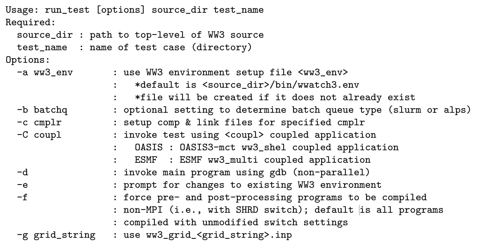
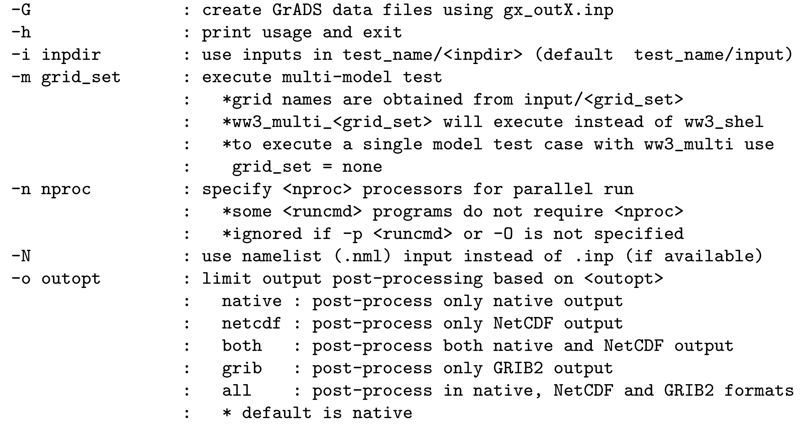
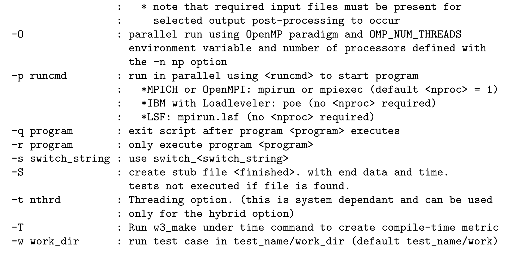

图 5.2：通过在命令行使用 -h 选项运行 run_test 获得的可用选项。

# 6 系统文档

## 6.1 介绍

本章简要介绍系统文档，讨论 WAVEWATCH III 使用的自定义预处理器（第 6.2 节）、不同源代码文件的内容（第 6.3 节）、优化（第 6.4 节）以及内部数据存储（第 6.5 节）。更详细的文档请参考源代码本身，其已完整注释说明。

## 6.2 预处理器

WAVEWATCH III 的源代码文件并非直接可用的 FORTRAN 文件；必须选择强制和可选的程序选项，并可激活测试输出。编译级别的选项通过"开关（switches）"激活。在 WAVEWATCH III 文件中，任意开关 `swt` 以注释形式包含，如 `!/swt`，其中开关名 `swt` 后跟一个空格或 `/`。

如果选择某开关，预处理器会移除注释字符，从而激活相应的源代码行。如果 `/` 紧跟在开关后，也会被移除，从而允许选择性地包含依赖硬件的编译器指令等。开关区分大小写，可用开关在第 5.9 节列出。

包含开关 `c/swt` 的文件可通过以下命令查找：  
<big>
<center>

find switch '!/SWT'
</center>

</big>
要获取 WAVEWATCH III 文件中所有开关的列表，可输入：  
<big>
<center>

all switches
</center>

</big>
传统上，每行源代码只能使用一个开关。然而，从 WAVEWATCH III ® 版本 7.00 开始，单行最多可以设置多个开关（最多 4 个）。

要使该行被编译，所有开关都必须被激活。多个开关必须在行首连续书写，中间不得有空格。每个开关必须以 `!/` 开头，并可选择以 `/` 结尾。

这种方式允许在源代码行仅在特定开关组合被激活时才被包含。例如，要仅在 `/OMPH` 和 `/T1` 开关同时被激活时启用某行代码：
<big>
<center>

!/OMPH!/!T1 ! Line included only if OMPH and T1 activated
</center>

</big>
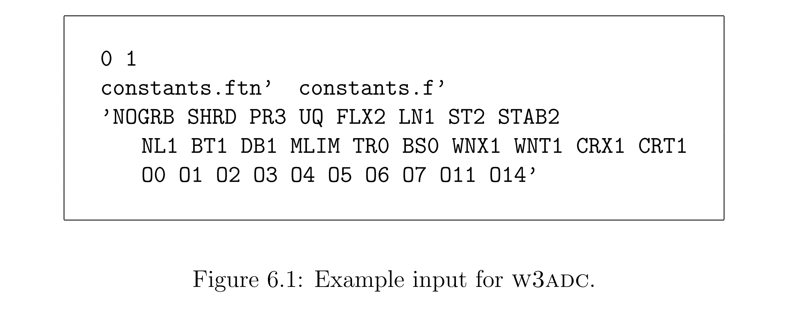

预处理由程序 w3adc 执行。该程序位于文件 w3adc.f 中，包含可直接编译的 FORTRAN 源代码以及完整的文档。w3adc 的各种属性在 w3adc.f 中通过参数语句设置，例如开关的最大长度、最大包含文件数量、包含文件的最大行数以及行长度。

w3adc 从标准输入读取其"命令"。一个 w3adc 的示例输入文件如图 6.1 所示。逐行内容包括：  
→ 测试指示器和压缩指示器。  
→ 输入代码和输出代码的文件名。  
→ 要启用的开关，以单个字符串形式给出（见第 5.9 节）。  
→ 可以提供包含文件的附加行，但在自动编译系统中已不再使用。

测试指示器为 0 时禁用测试输出，数值越大测试输出越详细。压缩指示器为 0 时文件保持原样；为 1 时，会删除所有由 `!` 标记的注释行，但保留空开关，即以 `!/` 开头的行；为 2 时，随后删除所有注释。输入文件中不允许包含注释行。

上述输入文件采用自由格式读取，因此字符串需要用引号括起。回显和测试输出会发送到标准输出设备。为了方便使用预处理器，WAVEWATCH III 提供了若干 UNIX 脚本（详见第 5.7 节）。需要注意的是，编译器指令通过开关定义，从而避免在文件压缩过程中被删除。

## 6.3 程序文件

WAVEWATCH III 的源代码文件以 `.ftn` 为扩展名存储。从版本 2.00 起，代码被组织为模块化结构，只有主程序未打包到模块中。最初，变量与代码模块捆绑在一起，形成单一的静态数据结构。在模型版本 3.06 中，引入了独立的动态数据结构，使单个程序中可以存在多个波浪网格，为多网格模型驱动程序的开发做准备。

模块中包含的子程序在下文中进行了详细描述。各子程序之间的关系在图 6.2 和图 6.3 中以图形方式展示。代码可分为三组：

第一组是主要的波浪模型子程序模块，通常以文件名结构 `w3xxxxmd.ftn` 标识，这些模块在第 6.3.1 节中描述。

第二组是多网格波浪模型驱动程序专用模块，通常以文件名结构 `wmxxxxmd.ftn` 标识，这些模块在第 6.3.2 节中描述。

第三组是辅助程序和波浪模型驱动程序，在第 6.3.4 节中描述。第 6.3.3 节简要介绍了数据同化模块。

### 6.3.1 波浪模型模块

波浪模型的核心包括波浪模型初始化模块和波浪模型模块。

主要波浪模型初始化模块 w3initmd.ftn

- w3init：初始化例程 w3init，为波浪模型的计算做好准备（内部使用）。
- w3mpii：MPI 初始化（内部使用）。
- w3mpio：用于 I/O 的 MPI 初始化（内部使用）。
- w3mpip：用于 I/O 的 MPI 初始化（仅限点输出，内部使用）。

主要波浪模型模块 w3wavemd.ftn

- w3wave：实际的波浪模型 w3wave。  
- w3gath：数据转置，将数据聚合到单个数组中以进行空间传播（内部使用）。  
- w3scat：对应的散布操作（内部使用）。
- w3nmin：计算每个处理器的最少海点数量（内部使用）。

主要波浪模型例程及其他所有子程序都需要依赖数据结构。该数据结构包含在以下模块中。

定义模型网格和参数设置 w3gdatmd.ftn

- w3nmod：设置需考虑的网格数量。
- w3dimx：设置空间网格维度并分配存储。
- w3dims：设置谱网格维度并分配存储。
- w3setg：设置指向所选网格的指针。
- w3dimug：为基于三角形的网格特定数组设置维度（网格连接等）。  
- w3gntx：开发非结构化网格结构。

描述海况的动态波浪数据 w3wdatmd.ftn

- w3ndat：设置需考虑的网格数量。
- w3dimw：设置维度并分配存储。  
- w3setw：设置指向所选网格的指针。

辅助存储 w3adatmd.ftn

- w3naux：设置需考虑的网格数量。  
- w3dima、w3xdma、w3dmnl：设置维度并分配存储。  
- w3seta、w3xeta：设置指向所选网格的指针。

模型输出 w3odatmd.ftn

- w3nout：设置需考虑的网格数量。

- w3dmo2、w3dmo3、w3dmo5：设置维度并分配存储。  

- w3seto：设置指向所选网格的指针。

模型输入 w3idatmd.ftn

- w3ninp：设置需考虑的网格数量。
- w3dimi：设置维度并分配存储。  
- w3seti：设置指向所选网格的指针。

程序中对传统配置文件（.inp）和 namelist 配置文件（.nml）的处理方式不同。传统配置文件由主程序直接读取，而 namelist 配置文件由以下模块中的子程序读取。

网格预处理器 namelist 模块 w3nmlgridmd.ftn

- w3nmlgrid：读取并报告所有 namelist。
- read_spectrum_nml：初始化并保存值到派生类型。
- read_run_nml：初始化并保存值到派生类型。
- read_timesteps_nml：初始化并保存值到派生类型。  
- read_grid_nml：初始化并保存值到派生类型。  
- read_rect_nml：初始化并保存值到派生类型。
- read_curv_nml：初始化并保存值到派生类型。  
- read_unst_nml：初始化并保存值到派生类型。  
- read_smc_nml：初始化并保存值到派生类型。  
- read_mask_nml：初始化并保存值到派生类型。
- read_obst_nml：初始化并保存值到派生类型。
- read_slope_nml：初始化并保存值到派生类型。
- read_sed_nml：初始化并保存值到派生类型。  
- read_inbound_nml：初始化并保存值到派生类型。  
- read_excluded_nml：初始化并保存值到派生类型。  
- read_outbound_nml：初始化并保存值到派生类型。
- report_spectrum_nml：输出默认值和用户定义值。
- report_run_nml：输出默认值和用户定义值。
- report_timesteps_nml：输出默认值和用户定义值。
- report_grid_nml：输出默认值和用户定义值。  
- report_rect_nml：输出默认值和用户定义值。  
- report_curv_nml：输出默认值和用户定义值。  
- report_smc_nml：输出默认值和用户定义值。  
- report_depth_nml：输出默认值和用户定义值。  
- report_mask_nml：输出默认值和用户定义值。  
- report_obst_nml：输出默认值和用户定义值。  
- report_slope_nml：输出默认值和用户定义值。  
- report_sed_nml：输出默认值和用户定义值。  
- report_inbound_nml：输出默认值和用户定义值。  
- report_excluded_nml：输出默认值和用户定义值。  
- report_outbound_nml：输出默认值和用户定义值。

NetCDF 边界条件 namelist 模块 w3nmlbouncmd.ftn

- w3nmlbounc：读取并报告所有 namelist。  
- read_bound_nml：初始化并保存值到派生类型。
- report_bound_nml：输出默认值和用户定义值。

NetCDF 输入场预处理器 namelist 模块 w3nmlprncmd.ftn

- w3nmlprnc：读取并报告所有 namelist。  
- read_forcing_nml：初始化并保存值到派生类型。
- read_file_nml：初始化并保存值到派生类型。  
- report_forcing_nml：输出默认值和用户定义值。  
- report_file_nml：输出默认值和用户定义值。

通用 shell namelist 模块 w3nmlshelmd.ftn

- w3nmlshel：读取并报告所有 namelist。
- read_domain_nml：初始化并保存值到派生类型。
- read_input_nml：初始化并保存值到派生类型。  
- read_output_type_nml：初始化并保存值到派生类型。  
- read_output_date_nml：初始化并保存值到派生类型。
- read_homogeneous_nml：初始化并保存值到派生类型。  
- report_domain_nml：输出默认值和用户定义值。
- report_input_nml：输出默认值和用户定义值。  
- report_output_type_nml：输出默认值和用户定义值。  
- report_output_date_nml：输出默认值和用户定义值。  
- report_homogeneous_nml：输出默认值和用户定义值。

多网格 shell namelist 模块 w3nmlmultimd.ftn

- w3nmlmultidef：设置模型网格和强迫网格数量。
- w3nmlmulticonf：读取并报告所有 namelist。  
- read_domain_nml：初始化并保存值到派生类型。  
- read_input_grid_nml：初始化并保存值到派生类型。  
- read_model_grid_nml：初始化并保存值到派生类型。  
- read_output_type_nml：初始化并保存值到派生类型。
- read_output_date_nml：初始化并保存值到派生类型。  
- read_homogeneous_nml：初始化并保存值到派生类型。  
- report_domain_nml：输出默认值和用户定义值。
- report_input_grid_nml：输出默认值和用户定义值。  
- report_model_grid_nml：输出默认值和用户定义值。  
- report_output_type_nml：输出默认值和用户定义值。  
- report_output_date_nml：输出默认值和用户定义值。  
- report_homogeneous_nml：输出默认值和用户定义值。

网格化输出 NetCDF 后处理器 namelist 模块 w3nmlounfmd.ftn

- w3nmlounf：读取并报告所有 namelist。  
- read_field_nml：初始化并保存值到派生类型。  
- read_file_nml：初始化并保存值到派生类型。  
- read_smc_nml：初始化并保存值到派生类型。
- report_field_nml：输出默认值和用户定义值。
- report_file_nml：输出默认值和用户定义值。  
- report_smc_nml：输出默认值和用户定义值。

点输出 NetCDF 后处理器 namelist 模块 w3nmlounpmd.ftn

- w3nmlounp：读取并报告所有 namelist。  
- read_point_nml：初始化并保存值到派生类型。
- read_file_nml：初始化并保存值到派生类型。  
- read_spectra_nml：初始化并保存值到派生类型。  
- read_param_nml：初始化并保存值到派生类型。  
- read_source_nml：初始化并保存值到派生类型。  
- report_point_nml：输出默认值和用户定义值。  
- report_file_nml：输出默认值和用户定义值。  
- report_spectra_nml：输出默认值和用户定义值。  
- report_param_nml：输出默认值和用户定义值。  
- report_source_nml：输出默认值和用户定义值。

轨迹输出 NetCDF 后处理器 namelist 模块 w3nmltrncmd.ftn

- w3nmltrnc：读取并报告所有 namelist。  
- read_track_nml：初始化并保存值到派生类型。  
- read_file_nml：初始化并保存值到派生类型。
- report_track_nml：输出默认值和用户定义值。
- report_file_nml：输出默认值和用户定义值。

输入场（如风和洋流）通过 w3wave 的参数列表传递给模型。这些信息在 w3wave 中由以下模块的例程处理：

输入更新模块 w3updtmd.ftn

- w3ucur：洋流场在时间上的插值。
- w3uwnd：风场在时间上的插值。
- w3uini：根据初始风场生成初始条件。
- w3ubpt：嵌套运行中边界条件的更新。
- w3uice：冰覆盖的更新。
- w3ulev：水位更新。
- w3utrn：网格单元透明度更新。  
- w3ddxy：水深的空间导数计算。
- w3dcxy：洋流的空间导数计算。

WAVEWATCH III 数据文件共有七种类型（不包括预处理的输入场，这些属于程序 shell 的一部分，而非实际波浪模型）。相应的例程被组织在六个模块中。

I/O 模块（mod_def.ww3）w3iogrmd.ftn

- w3iogr：读取和写入 mod_def.ww3 文件。

I/O 模块（out_grd.ww3）w3iogomd.ftn

- w3outg：计算格点输出参数。

- w3iogo：读取和写入 out_grd.ww3 文件。

I/O 模块（out_pnt.ww3）w3iopomd.ftn

- w3iopp：处理点输出请求。  
- w3iope：计算点输出数据。
- w3iopo：读取和写入 out_pnt.ww3 文件。

I/O 模块（track_o.ww3）w3iotrmd.ftn

- w3iotr：生成 track_o.ww3 文件的轨迹输出。

I/O 模块（restart.ww3）w3iorsmd.ftn

- w3iors：读取和写入 restartn.ww3 文件。

I/O 模块（nest.ww3）w3iobcmd.ftn

- w3iobc：读取和写入 nestn.ww3 文件。

I/O 模块（partition.ww3）w3iofsmd.ftn

- w3iofs：写入 partition.ww3 文件。

目前对于矩形和曲线网格提供了多种传播方案和 GSE 缓解技术，同时保留了用户自定义传播例程的接口；对于三角形网格，有四种传播方案。这些传播方案被打包在以下模块中：

传播模块（一级传播，无 GSE 缓解）w3pro1md.ftn

- w3map1：生成辅助地图。
- w3xyp1：物理空间传播。
- w3ktp1：谱空间传播。

传播模块（高阶方案，带 GSE 扩散）

- w3map2：生成辅助地图。
- w3xyp2：物理空间传播。
- w3ktp2：谱空间传播。

传播模块（高阶方案，带 GSE 平均）

- w3map3：生成辅助地图。  
- w3mapt：生成透明度地图。  
- w3xyp3：物理空间传播。  
- w3ktp3：谱空间传播。

传播模块（通用 UQ）

- w3qckn：在任意网格中执行 ULTIMATE QUICKEST (UQ) 方案（1:规则网格，2:不规则网格，3:带障碍物的规则网格）。

传播模块（通用 UNO）

- w3uno、w3unor、w3unos：类似于 UQ 方案。

SMC 网格例程 w3psmcmd.ftn

- W3PSMC：SMC 网格空间传播。  
- W3KSMC：通过 GCT 和折射进行谱修正。  
- SMCxUNO2/3：不规则网格 U 面的中间通量（UNO2/3）。  
- SMCyUNO2/3：不规则网格 V 面的中间通量（UNO2/3）。  
- SMCxUNO2r/3r：规则网格 U 面的中间通量（UNO2/3）。  
- SMCyUNO2r/3r：规则网格 V 面的中间通量（UNO2/3）。  
- SMCkUNO2：UNO2 的 k 空间折射偏移。  
- SMCGradn：计算单元中心的场梯度。
- SMCAverg：中心场的 1-2-1 加权平均。  
- SMCGtCrfr：theta 方向的折射和 GCT 旋转。  
- SMCDHXY：计算深度梯度并应用折射限制。  
- SMCDCXY：计算流速梯度。  
- W3GATHSMC / W3SCATSMC：收集和分散谱分量。

三角形网格传播方案 w3profsmd.ftn

- w3xypug：不规则网格传播方案接口。  
- w3cflug：计算空间传播的最大 CFL 数。  
- w3xypfsn2：N 方案。  
- w3xypfspsi2：PSI 方案。  
- w3xypfsnimp：N 方案隐式版本。  
- w3xypfsfct2：FCT 方案。  
- bcgstab：迭代 SPARSKIT 求解器的一部分，用于隐式方案。

源项计算与积分包含在多个模块中。w3srcemd.ftn 模块负责总体的源项计算与积分管理。其他模块则包含具体的源项选项，用于实现不同的物理过程和计算方法。

源项积分模块 w3srcemd.ftn  
w3srce：执行源项的积分计算。

流量（应力）模块（Wu, 1980） w3flx1md.ftn  
w3flx1：计算应力。

流量（应力）模块（Tolman 和 Chalikov） w3flx2md.ftn  
w3flx2：计算应力。

流量（应力）模块（Tolman 和 Chalikov，带上限） w3flx3md.ftn  
w3flx3：计算应力。

线性输入模块（Cavaleri 和 Malanotte Rizzoli） w3sln1md.ftn  
w3sln1：计算 $S_{lin}$ 。

输入与耗散模块（虚拟版本） w3src0md.ftn  
w3spr0：计算平均波参数（单网格点）。

输入与耗散模块 WAM-3 w3src1md.ftn  
w3spr1：计算平均波参数（单网格点）。  
w3sin1：计算 $S_{in}$ 。  
w3sds1：计算 $S_{ds}$ 。

输入与耗散模块 Tolman 和 Chalikov 1996 w3src2md.ftn  
w3spr2：计算平均波参数（单网格点）。  
w3sin2：计算 $S_{in}$ 。  
w3sds2：计算 $S_{ds}$ 。  
inptab：生成 $β$ 的插值表。  
w3beta：计算 $β$ 的函数（内部使用）。

输入与耗散模块 WAM-4 和 ECWAM w3src3md.ftn  
w3spr3：计算平均波参数（单网格点）。  
w3sin3：计算 $S_{in}$ 。  
w3sds3：计算 $S_{ds}$ 。  
tabu stress：根据 $U_{10}$ 和 $τ_w$ 制作风应力表。

tabu tauhf：短波支持应力表。  
calc ustar：利用应力表计算摩擦速度。

输入与耗散模块 Ardhuin 等（2010） w3src4md.ftn  
w3spr4：计算平均波参数（单网格点）。  
w3sin4：计算 $S_{in}$ 。  
w3sds4：计算 $S_{ds}$。  
tabu stress：根据 $U_{10}$ 和 $τ_w$ 制作风应力表。  
tabu tauhf：短波支持应力表。  
tabu tauhf2：带遮蔽效应的短波支持应力表。  
tabu swellft： $S_{in}$ 负值部分的振荡摩擦因子表。  
calc ustar：利用应力表计算摩擦速度。

输入与耗散模块 BYDRZ w3src6md.ftn  
w3spr6：按照 st1 计算积分参数。  
w3sin6：基于观测的风输入。  
w3sds6：基于观测的耗散。  
irange：生成整数序列。  
lfactor：计算 $S_{in}$ 的减弱因子。  
tauwinds：计算 $S_{in}$ 的法向应力。  
polyfit2：最小二乘法二次拟合。

涌浪耗散模块 w3swldmd.ftn  
w3swl4：Ardhuin 等（2010+）涌浪耗散。  
w3swl6：Babanin（2011）涌浪耗散。  
irange：生成整数序列。

非线性相互作用模块（DIA 或 GQM） w3snl1md.ftn  
w3snl1：计算 $S_{nl}$ 。  
insnl1： $S_{nl}$ 初始化。  
w3snlgqm：计算 $S_{nl}$ （GQM 方法）。  
w3scouple：计算耦合系数。  
gauleg：计算高斯-勒让德求积系数。  
INSNLGQM：使用 GQ 方法初始化 $S_{nl}$ 。

非线性相互作用模块（WRT） w3snl2md.ftn  
w3snl2： $S_{nl}$ 接口例程。  
insnl2： $S_{nl}$ 初始化。  
这些例程提供对 WRT 子例程的接口。WRT 子例程包含在 mod_constants.f90、mod_fileio.f90、mod_xnl4v4.f90 和 serv_xnl4v4.f90 文件中。详见 Van Vledder（2002b）。

非线性相互作用模块（GMD） w3snl3md.ftn  
w3snl3：计算 $S_{nl}$ 。  
expand：展开谱空间。  
expan2：将展开后的谱映射回原始谱空间。  
insnl3： $S_{nl}$ 初始化。

高频非线性滤波 w3snlsmd.ftn  
w3snls：计算滤波器。  
expand：展开谱空间。  
insnls：滤波器初始化。

底摩擦模块（JONSWAP） w3sbt1md.ftn  
w3bt1：计算 $S_{bot}$ 。

底摩擦模块（SHOWEX） w3sbt4md.ftn
insbt4： $S_{bot}$ 初始化。  
tabu erf：误差函数表。  
w3sbt4：计算 $S_{bot}$ ，以及向底部边界层传递的能量和动量通量。

流体泥耗散（Dalrymple 和 Liu, 1978） w3sbt8md.ftn  
w3sbt8：源项计算。

流体泥耗散（Ng, 2000） w3sbt9md.ftn  
w3sbt9：源项计算。

水深诱导破碎模块（Battjes-Janssen） w3sdb1md.ftn  
w3sdb1：计算 $S_{db}$ 。

三波交互作用模块（LTA） w3str1md.ftn  
w3str1：计算 $S_{tr}$ 。

底部散射模块 w3sbs1md.ftn  
w3sbs1：计算 $S_{bs}$ 及相关的底部动量通量。  
insbs1： $S_{bs}$ 初始化。

波-冰相互作用（简单） w3sic1md.ftn  
w3sic1：计算 $S_{id}$ 。

波-冰相互作用（Liu 等人方法） w3sic2md.ftn  
w3sic2：计算 $S_{id}$ 。  
插值表。

波-冰相互作用（Wang 和 Shen, 2010） w3sic3md.ftn  
w3sic3：计算 $S_{id}$ 。  
bsdet：计算色散关系的行列式。  
wn complex：计算冰中复数波数。  
cmplx root muller：复数求根方法。  
fun zhao：以下函数的包装器。  
func0 zhao, finc1 zhao  
w3sis2：计算 $S_{is}$ 。

冰中波散射及冰块破碎 w3sis2md.ftn

海岸线反射 w3ref1md.ftn  
w3ref1：计算 $S_{ref}$ 。

为了完整的基本波模型，还需要几个附加模块。实际服务模块内容请参见源代码文档。

constants.ftn：物理和数学常数，以及 Kelvin 函数。  
w3arrymd.ftn：数组操作例程，包括"打印绘图"例程。  
w3bullmd.ftn：为输出点执行公告样式输出。  
w3cspcmd.ftn：谱离散化转换。  
w3dispmd.ftn：求解拉普拉斯色散关系的例程（线性波、平底、无冰），包括插值表。也包括 Liu 前向色散和 Liu 反向色散的冰校正。

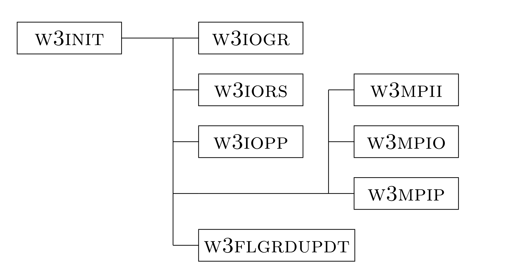

图 6.2：波模型初始化子程序的结构图（不包括服务例程、数据管理例程和 MPI 调用）。注意，W3IOGR 在读取数据时会调用所有必要的初始化例程，用于插值表和物理参数化。

w3gsrumd.ftn 重网格处理工具。  
w3partmd.ftn 对单一谱进行谱分区。  
w3servmd.ftn 通用服务例程。  
w3timemd.ftn 时间管理例程。  
w3triamd.ftn 三角形网格基础例程：读取数据、插值、定义各类数组、确定边界点。

至此完成了基础波浪模型例程的描述。初始化例程与其他例程的关系如图6.2所示。波浪模型主例程的类似关系图则见图6.3。

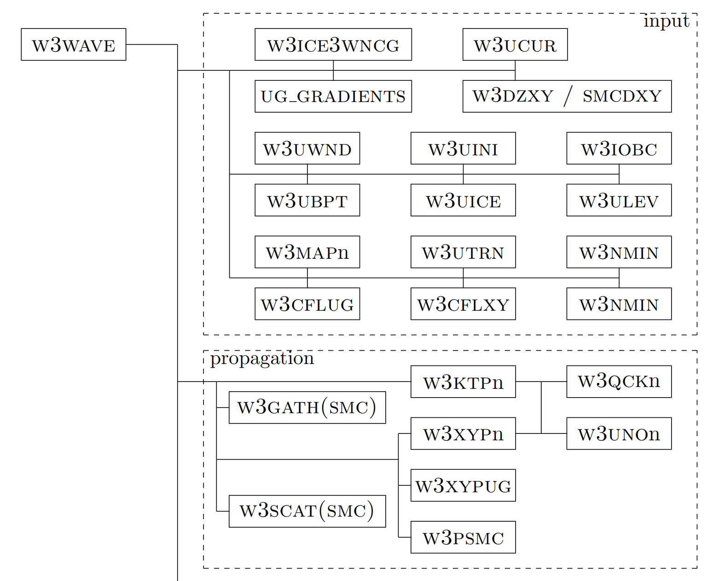

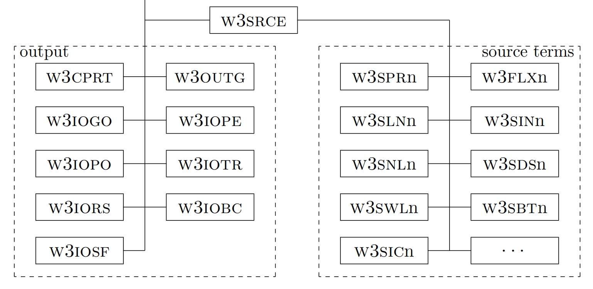

图6.3：波浪模型主例程的子程序结构图（不含服务例程、数据结构管理例程及MPI例程）。"..."表示其他附加的源项例程。

### 6.3.2 多网格模块

多网格波浪模型外壳 ww3_multi 为基本波浪模型提供了一个管理层，如上一节所述。该外壳负责多个波浪模型网格的并行运行以及网格之间的所有通信。为实现这一功能，开发了多种附加模块。

核心模块包括初始化模块、多网格模型模块以及最终化模块。

多网格模型初始化 wminitmd.ftn  
wminit 多网格模型初始化。

多网格模型运行 wmwavemd.ftn  
wmwave 多网格模型执行。  
wmprnt 输出到日志文件。  
wmbcst 非阻塞 MPI 广播。  
wmwout 同上。

多网格模型最终化 wmfinlmd.ftn  
wmfinl 多网格模型最终化。

这些例程旨在成为耦合模型的一部分。实际波浪模型例程的结构，可参考 Tolman (2007)。由此生成的多网格波浪模型驱动程序 ww3_multi 因此变得非常简单；它首先初始化 MPI 环境，然后依次调用上面提到的三个模块。

多网格波浪模型的主要例程需要扩展 WAVEWATCH III 使用的数据结构。此外，主要操作分散在各个模块的子程序中。

数据存储模块 wmmdatmd.ftn  
wmndat 设置需要考虑的网格数量。  
wmdimd、wmdimm 设置维度并分配存储空间。  
wmsetm 设置所选网格的指针。

确定网格关系模块 wmgridmd.ftn  
wmglow 低等级网格的关系。  
wmghgh 高等级网格的关系。  
wmgeql 同等级网格之间的关系。  
wmrspc 确定网格间是否需要谱转换。

更新模型输入模块 wmupdtmd.ftn  
wmupdt 通用输入更新例程。  
wmupd1 使用 w3fldsmd.ftn 从原生文件更新输入（参见 6.3.4 节）。  
wmupd2 从用户定义的输入网格更新输入。  
wmupdv 更新矢量场。  
wmupds 更新标量场。

执行内部通信模块 wminiomd.ftn  
wmiobs 暂存内部边界数据。  
wmiobg 收集内部边界数据。  
wmiobf 完成 wmiobs（仅 MPI）。  
wmiohs 暂存高到低等级的内部数据。  
wmiohg 收集高到低等级的内部数据。  
wmiohf 完成 wmiohs（仅 MPI）。  
wmioes 暂存同等级网格间的内部数据。  
wmioeg 收集同等级网格间的内部数据。  
wmioef 完成 wmioes（仅 MPI）。

统一点输出到单个文件模块 wmiopomd.ftn  
wmiopp 初始化例程。  
wmiopo 数据收集和写入例程（使用 W3IOPO，在 w3iopomd.ftn 中实现）。

为了完成多网格波浪模型，还需要一个附加的服务模块。实际内容请参阅源代码文件中的文档。

wmunitmd.ftn 动态单元号分配  
wmscrpmd.ftn SCRIP 工具函数

### 6.3.3 数据同化模块

WAVEWATCH III® 包含一个数据同化模块，可与主波浪模型例程配合使用，并集成在通用程序壳中。该模块用于作为用户提供的数据同化包的接口。

数据同化模块 w3wdasmd.ftn  
w3wdas 数据同化接口。

### 6.3.4 辅助程序

WAVEWATCH III® 具有多个辅助的预处理和后处理程序，以及两个波浪模型壳（见第 4.4 节）。这些辅助程序和一些附加例程存储在以下文件中。通常，仅被程序使用的子程序会作为主程序的内部子程序存储，在这种情况下不需要使用模块结构。例外是额外模块 w3fldsmd.ftn，用于管理波浪模型输入场在场预处理器和独立模型壳之间的数据流。该模块不依赖于任何显式的 WAVEWATCH III，因此可以集成到任何自定义数据预处理器中。

输入数据文件管理模块 w3fldsmd.ftn  
w3fldo 打开并检查 w3shel 的数据文件。  
w3fldg 读取和写入 w3shel 的数据文件（模型输入）。  
w3fldd 读取和写入 w3shel 的数据文件（数据同化）。  
w3fldp 准备从任意网格插值输入场。  
w3fldh 管理 w3shel 中的均匀输入场。  
w3fldm 处理 w3shel 中的移动网格数据。

网格预处理程序 ww3_grid.ftn  
w3grid 网格预处理器。  
readnl 读取 namelist 输入（内部使用）。

初始条件程序 ww3_strt.ftn  
w3strt 初始条件程序。

边界条件程序 ww3_bound.ftn  
NetCDF 边界条件程序 ww3_bounc.ftn  
w3bound 边界条件程序（NetCDF）。

输入场预处理程序 ww3_prep.ftn  
NetCDF 输入场预处理程序 ww3_prnc.ftn  
w3prep 为通用壳的输入场提供预处理。

潮汐预处理程序 ww3_prtide.ftn  
w3prtide 潮汐预处理器。

重启文件预处理程序 ww3_uprstr.ftn  
w3uprstr 重启文件预处理器。  
readnl 读取 namelist 输入（内部使用）。

通用波浪模型程序 ww3_shel.ftn
w3shel 通用程序壳。

多网格模型网格拆分程序 ww3_gspl.ftn  
w3gspl 网格拆分程序。  
grinfo, grtrim, grfill, grlost, grsqrg, grsngl, grsepa, grfsml, grfrlg, gr1grd  
用于逐步调整各个网格的例程。

通用多网格波浪模型程序 ww3_multi.ftn  
w3mlti 多网格程序壳。

多网格模型网格输出整合程序 ww3_gint.ftn  
w3gint 对平均波浪参数网格化字段进行整合的后处理程序。  
w3exgi 实际输出例程（内部使用）。

网格化数据后处理程序 ww3_outf.ftn  
w3outf 对平均波浪参数网格化字段进行后处理。  
w3exgo 实际输出例程（内部使用）。

网格化数据后处理程序（NetCDF） ww3_ounf.ftn  
w3ounf 使用 NetCDF3 或 NetCDF4 Fortran90 库对平均波浪参数网格化字段进行后处理。  
w3crnc 创建 NetCDF 文件，定义维度和头信息。  
w3exnc 实际输出例程（内部使用）。

网格化数据后处理程序（GrADS） gx_outf.ftn  
gxoutf 将平均波浪参数网格化字段转换为 GrADS 输入文件的后处理程序。  
gxexgo 实际输出例程（内部使用）。

网格化数据后处理程序（GRIB） ww3_grib.ftn  
w3grib 生成 GRIB 文件的后处理程序。  
w3exgb 实际输出例程（内部使用）。

点数据后处理程序 ww3_outp.ftn  
w3outp 对选定位置的输出进行后处理。  
w3expo 实际输出例程（内部使用）。

点数据后处理程序 ww3_ounp.ftn  
w3ounp 使用 NetCDF 对选定位置的输出进行后处理。  
w3crnc 创建 NetCDF 文件，定义维度和头信息。  
w3exnc 实际输出例程（内部使用）。

点数据后处理程序（GrADS） gx_outp.ftn
gxoutp 将选定位置的输出转换为 GrADS 输入文件的后处理程序。  
gxexpo 实际输出例程（内部使用）。

轨迹输出后处理程序 ww3_trck.ftn  
w3trck 将未格式化直接访问的轨迹输出文件转换为整数打包格式文件。

轨迹输出后处理程序（NetCDF） ww3_trnc.ftn  
w3trck 将未格式化直接访问的轨迹输出文件转换为 NetCDF 文件。  
w3crnc 创建 NetCDF 文件，定义维度和头信息。  
w3exnc 实际输出例程（内部使用）。

波场追踪后处理程序 ww3_systrk.ftn  
w3systrk 在空间和时间上追踪波场。

## 6.4 优化

WAVEWATCH III 的源代码采用 ANSI 标准 FORTRAN 90 编写，可在从个人电脑到超级计算机的多种平台上编译和运行。

针对向量计算机的优化通过尽可能将代码组织为长向量循环实现。最初的优化针对 Cray YMP 和 C90 平台进行，部分使用了向量化的编译器指令。需要注意的是，自 1997 年左右，向量优化未再更新，因此如果在向量计算机上使用该模型，需要重新评估和调整。

针对共享内存机器的并行化通过标准 OpenMP 指令实现，主要应用于调用源项计算子程序 w3srce 以及各类传播例程的循环中。OpenMP 指令通过相应的预处理开关（ompn）激活。

针对分布式内存机器的并行化将在 6.5.2 节中详细讨论。

优化的一个重要部分是使用插值表，用于求解色散关系以及计算风浪相互作用参数，从而减少重复计算，提高计算效率。

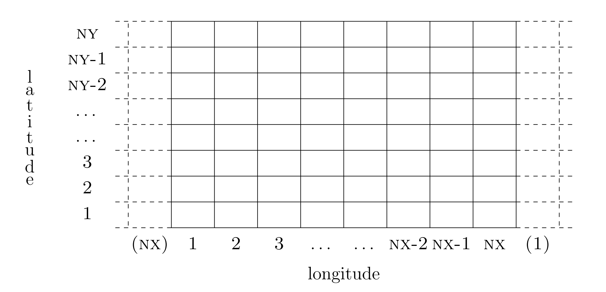

图 6.4：空间网格布局。网格点以方框表示，虚线方框表示在全球模型应用中重复的列。

## 6.5 内部数据存储

本章剩余部分将讨论 WAVEWATCH III 使用的内部数据存储。在 6.5.1 节中，将介绍 ww3 shel 中单个波浪模型网格的布局。在 6.5.2 节中，将讨论单个网格的并行化方法。在 6.5.3 节中，将讨论多个波浪网格的同时存储。最后，6.6 节将描述实际的波浪模型变量。需要注意的是，代码是完整记录的，包括定义数据存储的变量。

### 6.5.1 网格

为了方便编程并提高效率，空间网格和谱网格是分开考虑的。这种方法受到第 3 章中分裂技术的启发。对于空间传播，使用简单的"矩形"空间网格，如图 6.4 所示。网格可以是笛卡尔 `(x, y)` 网格、球面网格（在纬度和经度上等间距）、曲线网格，或者基于三角形的网格。

在球面网格中，经度在程序中用计数器 IX 表示，纬度用计数器 IY 表示，对应的网格维度为 (NX, NY)。所有空间场数组在代码中都是动态分配的，而对应的工作数组通常是自动分配的，以保证线程安全。在全球应用情况下，网格的闭合由模型内部处理，无需用户干预。为了简化特别是流场导数的计算，外层网格点（IX=1 或 NX，除非网格是全球网格）以及 (IY=1 或 NY) 被视为陆地点、非活动点或活动边界点。因此，网格的最小尺寸为 NX=3，NY=3，三角形网格除外。在三角形网格的情况下，所有节点被列为一个长向量，维度为 NX，而 NY=1，这样可以保持相同的代码结构。输入数组通常假定为如下形式：
<big>
<center>

ARRAY(NX,NY)
</center>

</big>
并按行逐行读取（参见第 4 章）。然而，在程序内部，它们通常以旋转索引的方式存储。
<big>
<center>

ARRAY(NY,NX)
</center>

</big>
这样可以更容易实现全球闭合，这通常需要扩展 x 轴。此外，这类二维数组通常被视为一维数组处理，以增加向量长度。数组 ARRAY、其一维等效 VARRAY 和 IXY 定义如下：
<big>
<center>

ARRAY(MY,MX) , VARRAY(MY*,MX) ,
<br>
IXY = IY + (IX-1)*MY
</center>

</big>
注意，这种网格表示仅在模型内部使用。

对于给定的空间网格点 (IX, IY)，谱网格的定义方式类似，使用方向计数器 ITH 和波数计数器 IK（见图 6.5）。谱网格的大小通过动态分配设置。与空间网格一样，频谱 a 的内部表示定义为：
<big>
<center>

A(NTH,NK)
</center>

</big>
在整个程序中使用等效的一维数组。在模型内部，方向始终采用笛卡尔坐标， $\theta = 0^\circ$ 对应于从西向东传播（正 $x$ 或 IX 方向）， $\theta = 90^\circ$ 对应于从南向北传播（正 $y$ 或 IY 方向）。输出方向采用其他约定，如第 4 章所述。

波谱的存储占用了模型所需内存的大部分，因为所使用的分割技术保证了模型的任何部分只在整个波场的一小部分上操作。为了最小化所需内存，仅存储实际海点的波谱。海点被定义为潜在需要波谱的点，包括活动边界点以及被冰覆盖的海点。

为了归档目的，使用计数器 ISEA 定义一维海点网格。波谱随后存储为
<big>
<center>

A(ITH,IK,ISEA)
</center>

</big>
存储网格相对于图 6.4 所示的完整网格的布局示例如图 6.6 所示。显然，存储网格与完整空间网格之间的关系需要一些管理。为此，定义了两个"映射" MAPFS 和 MAPSF 。

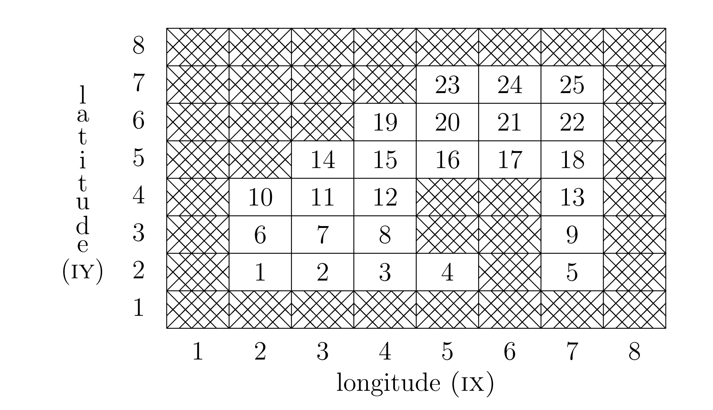

图 6.6：波谱的一维存储网格示例。阴影方格表示陆地点。方格内的数字表示存储网格的网格计数器 ISEA 。

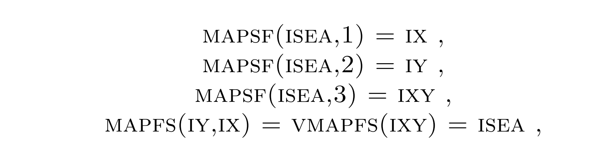

其中 MAPFS(IY,IX) = 0 表示陆地区域。最终，状态映射 MAPSTA(IY,IX) 和 MAPST2(IY,IX) 用于标识海域、陆地、活动边界和冰区。MAPSTA 表示网格的主要状态映射；

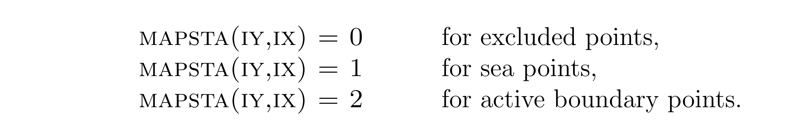

海域点和由于冰层存在而未被波浪模型考虑的活动边界点，用其对应的负状态指示符标记（-1 或 -2）。MAPST2 包含辅助信息。对于被排除的点，MAPSTA(IY,IX) = 0，此映射区分陆地点 MAPST2(IY,IX) = 0 和其他被排除的点 MAPST2(IY,IX) = 1。对于被禁用的海域点 MAPSTA(IY,IX) \< 0$，$MAPST2 中的连续位用于标识禁用原因（位值 1 表示该位置被禁用）。

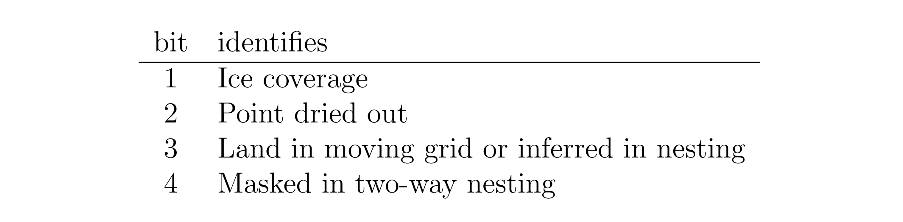

还需要考虑两个额外事项。首先，这两个状态映射可以合并为单个映射以进行存储。为了确保存储与以前的模型版本向后兼容，这两个映射被合并为单个映射 MAPTMP。

$$\mathrm{MAPTMP = MAPSTA + 8 \times MAPST2}$$

考虑到 MAPSTA 只有前几位包含有效数据。保存到 NetCDF 文件中的是 MAPTMP。原始的两个映射可以通过以下方式恢复：
<big>
<center>

MAPSTA =MOD(MAPTMP + 2, 8) - 2 <br>
MAPST2 = MAPTMP - MAPSTA
</center>

</big>
其次，为了简化网格点状态的绘图，在图形输出程序中使用了单一的映射。在图形文件中，该映射定义为：

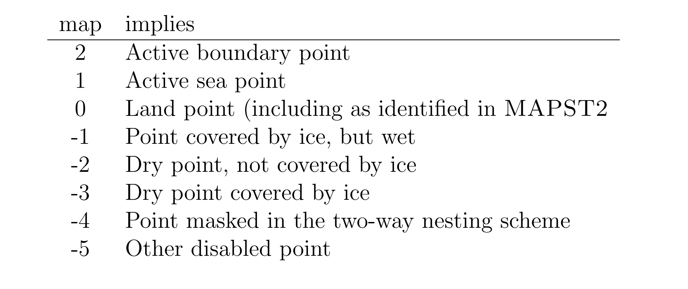

同样，在网格准备程序 ww3_grid 中也可以使用单一映射以简化处理。在该映射中，对各点的区分如下：

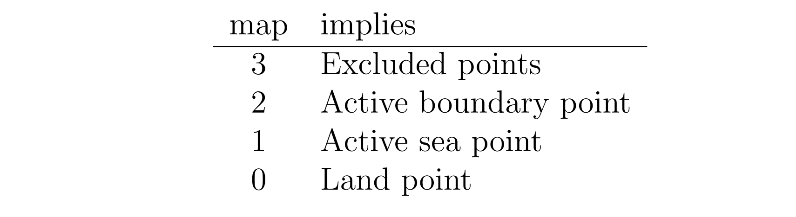

### 6.5.2 分布式内存概念

前一节描述的一般网格结构同时用于共享内存和分布式内存版本的模型，差别不大。对于分布式内存版本，并非所有数据都保存在每个处理器上。每个波谱仅保存在单个处理器上。存储网格上的波谱在可用处理器之间按照固定步长进行分配。由于在给定处理器上只存储部分波谱，因此需要区分全局海点计数器 ISEA 与局部海点计数器 JSEA。如果实际使用的处理器数量为 NAPROC，且处理器编号 IAPROC 范围为 1 到 NAPROC，则这些参数之间的关系如下：

$$\begin{aligned} 
\mathrm{ISEA} &= \mathrm{IAPROC + (JSEA - 1) \times NAPROC}
\\\\
\mathrm{JSEA} &= \mathrm{1 + \frac{ISEA - 1}{NAPROC}}  
\\\\
\mathrm{IAPROC} &= \mathrm{1 + \text{MOD}(ISEA - 1, NAPROC)}  \end{aligned}$$

在模型版本 3.10 中，引入了进一步的改进。实际使用的处理器数量 NAPROC 可以小于程序使用的总处理器数量 NTPROC。当 NAPROC \< IAPROC \< NTPROC 时，这些处理器仅用于输出处理。

通过这种数据分配，源项计算和频谱内传播可以在每个处理器上独立完成，无需处理器之间的通信。然而，对于空间传播，需要进行数据转置，将所有空间网格点的频谱分量 (ITH, IK) 收集到单个处理器上。在传播完成后，修改后的数据必须散回到各自的"原始"处理器。各个频谱分量被分配到特定处理器时，使得每个处理器执行的部分传播步骤数量大致相等，从而实现良好的负载均衡。具体算法见子程序 w3init (w3initmd.ftn) 的第 4.d 节。

收集操作的数据转置通过消息传递接口 (MPI) 标准分两步实现。首先，将每个空间网格点在给定频谱箱 (ITH, IK) 的值收集到单个目标处理器的一个一维数组 STORE(ISEA) 中，然后转换为完整的二维频谱分量场。在传播完成后，散射操作的转置过程反向执行，仍然使用同一个一维数组 STORE。

虽然将空间传播分配到各个处理器的算法保证了全局（每时间步）的负载均衡，但并不能保证通信同步，因为每个处理器的计算量可能不同。为了避免负载不均，使用了非阻塞通信。此外，一维数组 STORE(ISEA) 被替换为 STORE(ISEA, IBUF)，数组新增的维度提供了主动管理的缓冲空间（参见 W3GATH 和 W3SCAT 在 w3wavemd.ftn 中）。这些缓冲区允许在通信期间利用空闲时钟周期进行计算，并在硬件支持的情况下实现通信隐藏计算。为了避免 FORTRAN 与 MPI 的兼容性问题，使用了单独的收集和散射数据数组。缓冲数据转置的图示见图 6.7。更多细节见 Tolman (2002b)。

原则上，只有存储数组 A(ITH, IK, JSEA) 会受到数据分配的影响。输入场、地图以及平均波参数输出原则上在每个网格点都保留完整分辨率。每个处理器在计算的每个阶段都可以访问完整地图。输入和输出场通常仅包含步长 NAPROC 对应的数据。

分布式内存还要求对 I/O 进行修改。输入文件由每个处理器完整读取。输出文件类型由 I/O 类型指示器 IOSTYP 决定。

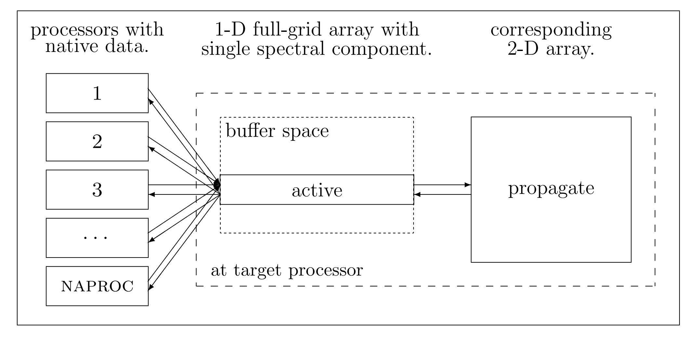

图 6.7：分布式内存模型中的数据转置。在收集操作期间，数据如图中所示从左向右移动。计算完成后，在散射操作中，数据从右向左移动。

IOSTYP 的含义如下：  
0 每个单独的进程都写入重启文件。  
1 每个文件由分配的进程写入。  
2 每个文件由单一专用输出进程写入。  
3 每种输出类型都有专用的输出进程。

请注意，重启文件是直接访问文件，因此每个处理器可以高效地仅收集本地存储的谱，而无需读取整个文件。重启文件可以由每个处理器直接写入，也可以通过专门的处理器集中写入。第一种方法需要并行文件系统，而第二种方法通常适用。

当前的数据分布算法选择基于以下几个原因：首先，它可以在源项的动态积分、冰覆盖网格点的排除以及谱内传播计算中实现自动且高效的负载均衡；其次，通信在定义上与数值传播方案无关，这与传统的域分解方法不同。在传统域分解中，仅需将所谓的"光晕（halo）"边界数据转换到相邻的网格块中，光晕的大小取决于所选的传播方案。当前数据分布方案的主要缺点是每个时间步需要通信的数据量比传统域分解大得多，尤其在使用处理器数量较少时。在 IBM RS6000 SP 上测试分布式内存版本的 WAVEWATCH III 时，这相对较大的通信量并未显著增加总计算时间，而且模型在约 100 个处理器时表现出优异的扩展性（Tolman, 2002b）。

近年来，已经开发了混合并行化技术，结合粗粒度的域分解与局部数据转置方法，这些方法在 ww3_multi 中已有应用。为了支持这一方法，模型版本 4.10 引入了 ww3_gspl(.sh) 工具。尽管在 ww3_multi 初始化阶段，该方法在模型内存占用方面仍需进一步优化，但初步的扩展性结果令人鼓舞（参见 Tolman, 2013b）。

到目前为止，只考虑了单个波浪模型网格。为了能够在单个程序中运行多个模型网格，需要设计一种数据结构，使得所有不同的模型网格及其内部工作数组能够同时保留，同时提供一个简单的机制来选择实际要操作的波浪模型网格。为实现这一点，利用了 FORTRAN 90 的一些特性（例如，Metcalf 和 Reid, 1999），具体方法如下：

1.  在模型代码中定义一个或多个数据结构（type 声明），包含模型的设置和相关工作数组。

2.  构建这些数据结构的数组，每个数组元素对应一个独立的模型网格。

3.  将描述模型的基本参数（例如网格点数量 NX 和 NY ）重新定义为指针，并将它们指向合适的数据结构元素，从而生成即时别名。

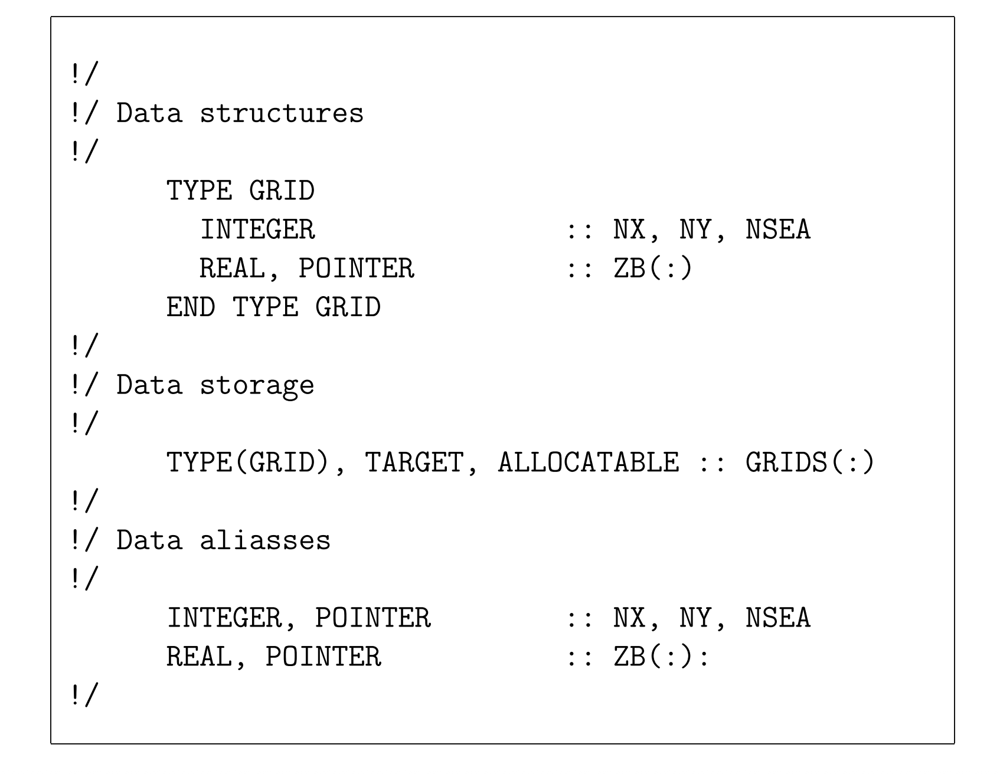
图 6.8：在 w3gdatmd.ftn 中用于定义波浪模型中多个空间网格的数据结构声明示例。为简化起见，示例仅考虑网格维度 NX 、 NY 和 NSEA ，以及海底深度数组 ZB 。

通过这种方式，可以定义一个多模型数据结构，同时在模型子程序内部保持描述模型的所有原始变量布局不变。这样的结构及其使用方法在图 6.8 和图 6.9 中有实际源代码的示例。请注意，结构体内的指针数组（如 ZB）的内存分配如下：

$$  
\text{ALLOCATE GRIDS(IMOD)\%ZB(NSEA)}  $$

在执行该语句之后，为使别名指针 ZB 正确指向新分配的空间，它需要重新指向结构体的相应元素。因此，负责分配该结构体数组的子程序 W3DIMX 在末尾会调用子程序 W3SETX，该子程序会为所选网格设置所有指针别名。对于其他设置数组尺寸的结构体子程序，情况亦是如此。

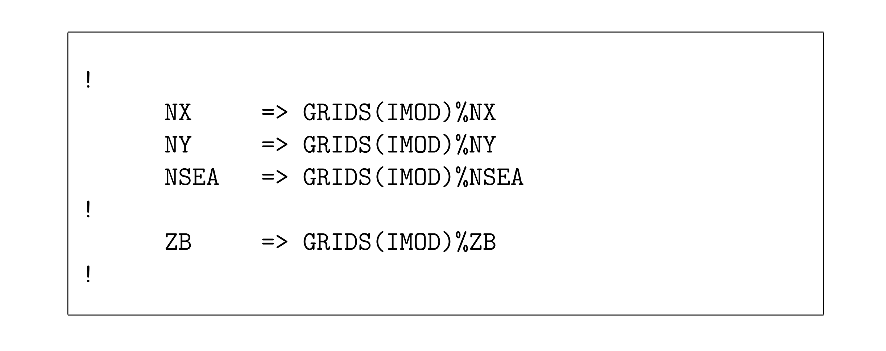

图 6.9：用于激活图 6.8 中指针别名的源代码示例，针对模型编号 IMOD。

## 6.6 模块中的变量

在直到 3.14 版本的模型文档中，所有模块中的公共和私有变量都在本节及后续章节中进行了描述。所有这些参数同样在模型的源代码中有文档记录。维护两份相互独立且未关联的文档拷贝既繁琐，又对模型用户和开发者几乎没有实质性益处。因此，从 7.14 版本起，变量的主要文档保持在源代码中更新，而手册中不再维护完整文档。本手册现在仅描述可能影响模型行为的参数定义，并标明代码 I/O 元素的关键版本。

每个列表开头右侧给出模块文件名。列表第二列标识变量类型：$i$ 表示整数，$r$ 表示实数 ，$l$ 表示逻辑值，$c$ 表示字符，$a$ 表示数组 ，$p$ 表示参数声明。除标记有 $*$ 的变量外，所有变量都是公共的。

以下各节描述模块（及程序）中的参数设置，并对数据结构中存储的内容以及这些数据结构在代码中的位置提供顶层说明。

### 6.6.1 模块中的参数设置

若干模块在内部使用了参数设置。此处仅列出那些通常可被使用或会对模型行为产生影响的参数设置。

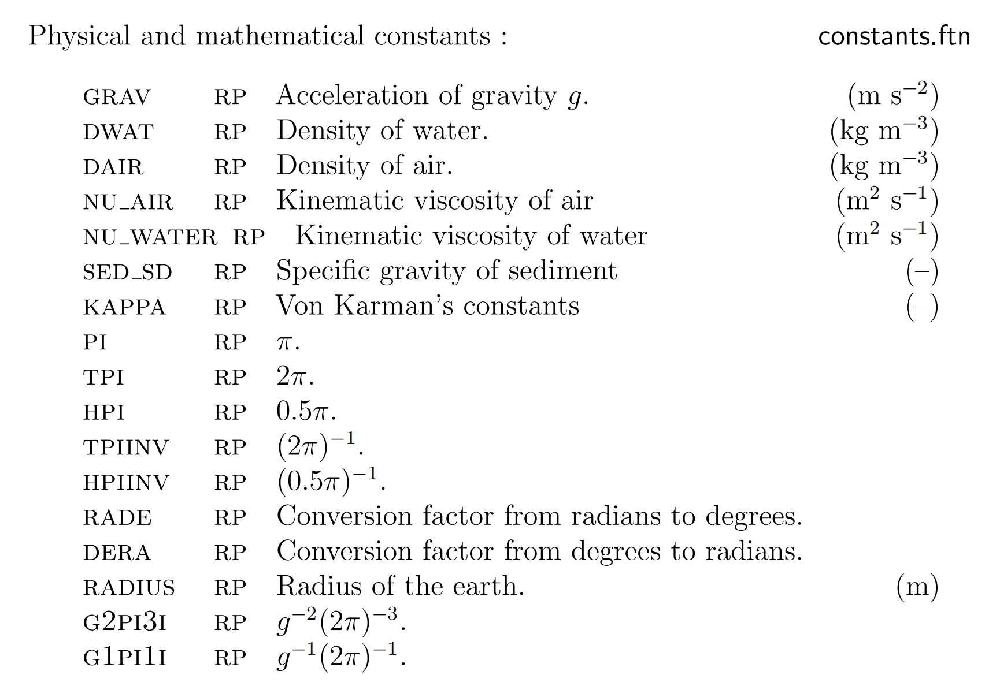
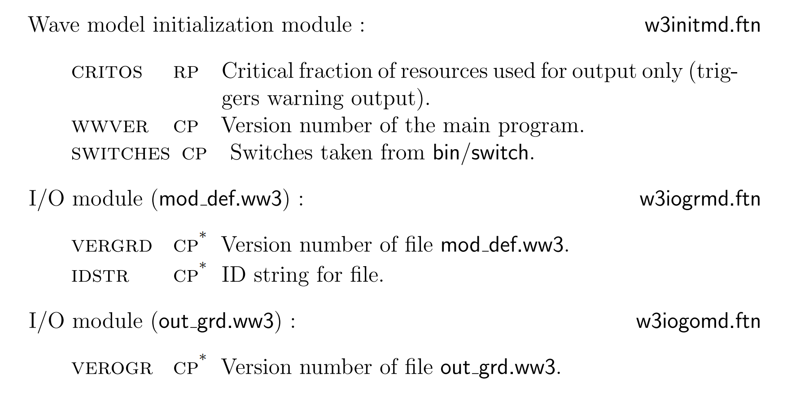
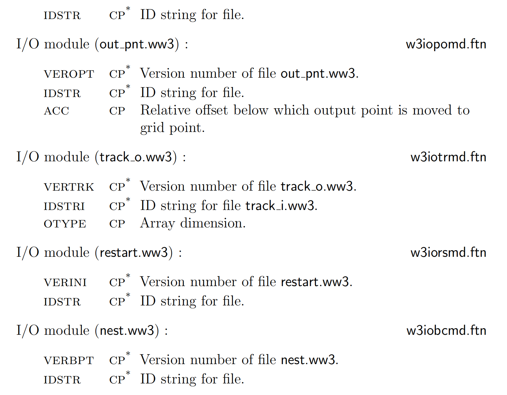
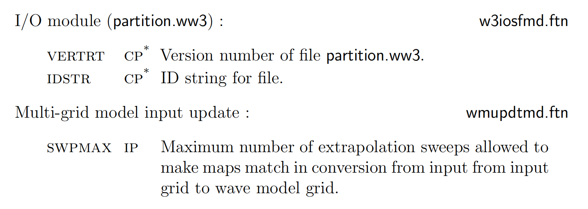

若干子程序包含通过 parameter 语句设置的插值表，其中包括：

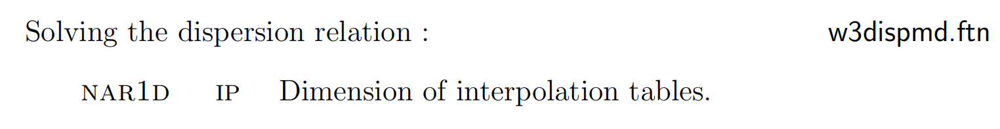
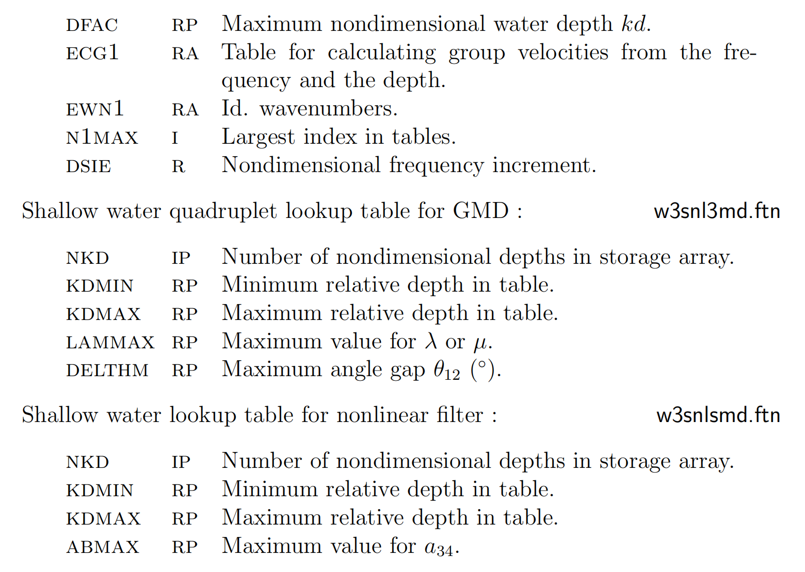
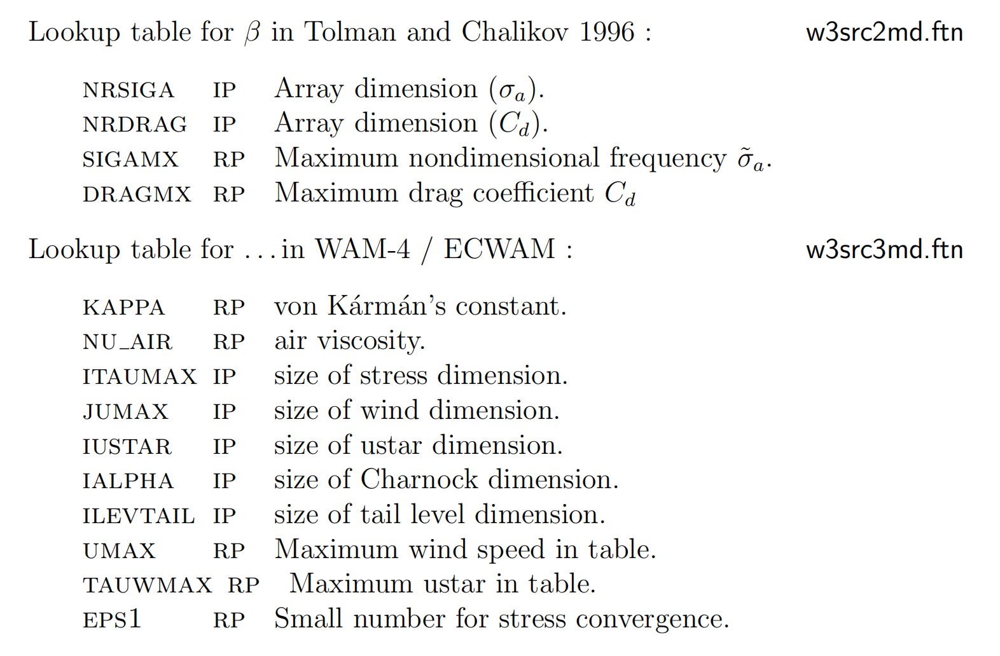
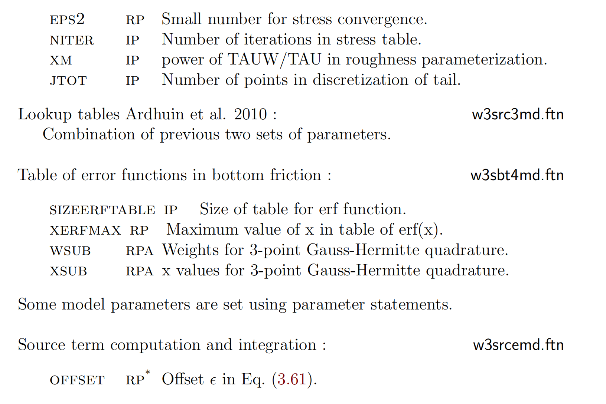
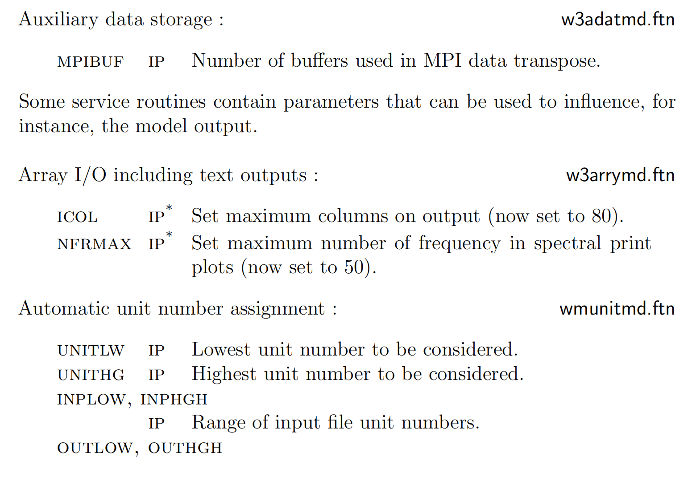
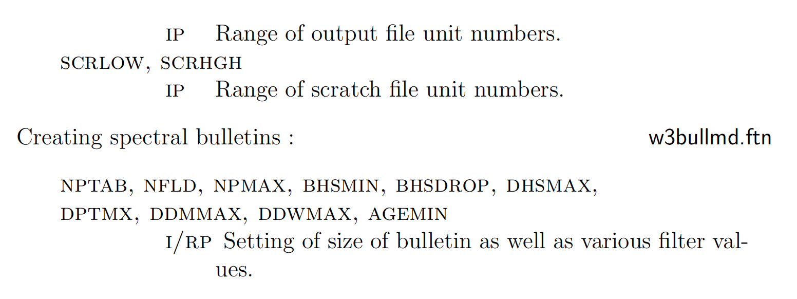

### 6.6.2 数据结构

如第 6.5.3 节所述，波浪模型的核心是一组数据结构，用于按顺序存储多个网格的数据。各个存储结构分别包含在以下模块中：

- w3gdatmd.ftn：空间网格与频谱网格信息，以及所有物理与数值模型参数。
- w3wdatmd.ftn：实际波浪数据，包括频谱以及用于模型热启动（hot-start）的场变量（如 $u_*$ 等）。
- w3adatmd.ftn：辅助场和相关参数。
- w3odatmd.ftn：输出数据。
- w3idatmd.ftn：输入数据。
- wmmdatmd.ftn：多网格模型特有的数据。

上述文件中已对这些数据结构进行了完整说明，因此本手册中不再重复相关文档内容。

# 参考文献

Abdalla, S., and J. R. Bidlot (2002), Wind gustiness and air density effects and other key changes to wave model in CY25R1, Tech. Rep. Memomrandum R60.9/SA/0273, Research Department, ECMWF, Reading, U. K.

Abdolali, A., A. Roland, A. van der Westhuysen, Z. Ma, and A. Chawla(2018), Wind wave modeling of storm-induced hurricanes using implicit scheme in WAVEWATCH III model over large scale resolved bathymetries,modeling of storm-induced hurricanes inundation through a comprehensive flexible coupling framework, 98th AMS Annual Meeting - American Meteorological Society, Austin, TX, USA.

Abdolali, A., A. Roland, A. van der Westhuysen, A. Chawla, S. Moghimi,and S. Vinogradov (2019), On the comparison of implicit with explicit schemes in WAVEWATCH III, 99th AMS Annual Meeting - American Meteorological Society, Phoenix, AZ, USA.

Aboulali, A., Roland, A., van der Westhuysen, A., Meixner, J., Chawla, A., Hesser, T. J., & Smith, J. M. (2019). Large-scale hurricane modeling using domain decomposition parallelization and implicit scheme implemented in WAVEWATCH III wave model. Ocean Modelling, under review.

Alves, J. H. G., Banner, M. L., & Young, I. R. (2003). Revisiting the Pierson--Moskowitz asymptotic limits for fully developed wind waves. Journal of Physical Oceanography, 33(7), 1301--1323.

Alves, J.-H. G. M., Chawla, A., Tolman, H. L., Schwab, D., Lang, G., & Mann, G. (2014). The operational implementation of a Great Lakes wave forecasting system at NOAA/NCEP. Weather and Forecasting, 29(6), 1473--1497. https://doi.org/10.1175/WAF-D-12-00049.1

Annenkov, S. Y., & Shrira, V. I. (2006). Role of non-resonant interactions in the evolution of nonlinear random water wave fields. Journal of Fluid Mechanics, 561, 181--207. https://doi.org/10.1017/S0022112006000632

Ardhuin, F., & Boyer, A. (2006). Numerical modelling of sea states: Validation of spectral shapes (in French). Navigation, 54, 55--71.

Ardhuin, F., & Herbers, T. H. C. (2002). Bragg scattering of random surface gravity waves by irregular seabed topography. Journal of Fluid Mechanics, 451, 1--33.

Ardhuin, F., & Jenkins, A. D. (2006). On the interaction of surface waves and upper ocean turbulence. Journal of Physical Oceanography, 36(3), 551--557.

Ardhuin, F., & Magne, R. (2007). Scattering of surface gravity waves by bottom topography with a current. Journal of Fluid Mechanics, 576, 235--264.

Ardhuin, F., & Roland, A. (2012). Coastal wave reflection, directional

已按统一格式（作者. 年份. 题目. 期刊, 卷(期), 页码. DOI）规范整理如下：

Ardhuin, F., & Roland, A. (2012). Coastal wave reflection, directional spread, and seismoacoustic noise sources. *Journal of Geophysical Research: Oceans*, 117, C00J20.

Ardhuin, F., Boutin, G., Stopa, J., Girard-Ardhuin, F., Melsheimer, C., Thomson, J., Kohout, A., Doble, M., & Wadhams, P. (2018). Wave attenuation through an Arctic marginal ice zone on 12 October 2015: 2. Numerical modeling of waves and associated ice breakup. *Journal of Geophysical Research: Oceans*, 123(8), 5652--5668. <https://doi.org/10.1002/2018JC013784>

Ardhuin, F., O'Reilly, W. C., Herbers, T. H. C., & Jessen, P. F. (2003). Swell transformation across the continental shelf. Part I: Attenuation and directional broadening. *Journal of Physical Oceanography*, 33, 1921--1939.

Ardhuin, F., Chapron, B., & Collard, F. (2009a). Ocean swell evolution from distant storms. *Geophysical Research Letters*, 36. <https://doi.org/10.1029/2008GL037030>

Ardhuin, F., Marié, L., Rascle, N., Forget, P., & Roland, A. (2009b). Observation and estimation of Lagrangian, Stokes and Eulerian currents induced by wind and waves at the sea surface. *Journal of Physical Oceanography*, 39(11), 2820--2838.

Ardhuin, F., Rogers, W. E., Babanin, A. V., Filipot, J., Magne, R., Roland, A., van der Westhuysen, A., Queffeulou, P., Lefevre, J., Aouf, L., & Collard, F. (2010). Semiempirical dissipation source functions for ocean waves. Part I: Definition, calibration, and validation. *Journal of Physical Oceanography*, 40, 1917--1941.

Ardhuin, F., Hanafin, J., Quilfen, Y., Chapron, B., Queffeulou, P., Obrebski, M., Sienkiewicz, J., & Vandermark, D. (2011a). Calibration of the IOWAGA global wave hindcast (1991--2011) using ECMWF and CFSR winds. In *Proceedings of the 12th International Workshop on Wave Forecasting and Hindcasting* (pp. 1--13).

Ardhuin, F., Tournadre, J., Queffeulou, P., & Girard-Ardhuin, F. (2011b). Observation and parameterization of small icebergs: Drifting breakwaters in the Southern Ocean. *Ocean Modelling*, 39, 405--410.

Ardhuin, F., Rawat, A., & Aucan, J. (2014). A numerical model for free infragravity waves: Definition and validation at regional and global scales. *Ocean Modelling*, 77, 20--32.

Ardhuin, F., Collard, F., Chapron, B., Girard-Ardhuin, F., Guitton, G., Mouche, A., & Stopa, J. (2015). Estimates of ocean wave heights and attenuation in sea ice using the SAR wave mode on Sentinel-1A. *Geophysical Research Letters*, 42, 2317--2325. <https://doi.org/10.1002/2014GL062940>

Ardhuin, F., Sutherland, P., Doble, M., & Wadhams, P. (2016). Ocean waves across the Arctic: Attenuation due to dissipation dominates over scattering for periods longer than 19 s. *Geophysical Research Letters*, 43(11), 5775--5783. <https://doi.org/10.1002/2016GL068204>

Babanin, A., Hsu, T.-W., Roland, A., Ou, S.-H., Doong, D.-J., & Kao, C. (2011). Spectral wave modelling of Typhoon Krosa. *Natural Hazards and Earth System Sciences*, 11(2), 501--511.

Babanin, A. V. (2009). Breaking of ocean surface waves. *Acta Physica Slovaca*, 59(4), 305--535.

Babanin, A. V. (2011). *Breaking and dissipation of ocean surface waves*. Cambridge University Press, 480 pp.

Babanin, A. V., & Soloviev, Y. P. (1987). Parameterization of width of directional energy distributions of wind-generated waves at limited fetches. *Izvestiya, Atmospheric and Oceanic Physics*, 23, 645--651.

Babanin, A. V., & Young, I. R. (2005). Two-phase behaviour of the spectral dissipation of wind waves. In *Proceedings of the Fifth International Symposium on Ocean Waves Measurement and Analysis*.

Babanin, A. V., Young, I. R., & Banner, M. L. (2001). Breaking probabilities for dominant surface waves on water of finite constant depth. *Journal of Geophysical Research: Oceans*, 106, 11659--11676. <https://doi.org/10.1029/2000JC000215>

Babanin, A. V., Banner, M. L., Young, I. R., & Donelan, M. A. (2007). Wave-follower field measurements of the wind-input spectral function. Part III: Parameterization of the wind-input enhancement due to wave breaking. *Journal of Physical Oceanography*, 37, 2764--2775.

Babanin, A. V., Tsagareli, K. N., Young, I. R., & Walker, D. J. (2010). Numerical investigation of spectral evolution of wind waves. Part II: Dissipation term and evolution tests. *Journal of Physical Oceanography*, 40, 667--683.

Banner, M. L., & Peirson, W. L. (1998). Tangential stress beneath wind-driven air--water interfaces. *Journal of Fluid Mechanics*, 364, 115--145.

Banner, M. L., Babanin, A. V., & Young, I. R. (2000). Breaking probability for dominant waves on the sea surface. *Journal of Physical Oceanography*, 30, 3145--3160.

Barbariol, F., Benetazzo, A., Carniel, S., & Sclavo, M. (2015). Space-time wave extremes: The role of metocean forcings. *Journal of Physical Oceanography*, 45(7), 1897--1916. <https://doi.org/10.1175/JPO-D-14-0232.1>

Barbariol, F., Alves, J.-H. G. M., Benetazzo, A., Bergamasco, F., Bertotti, L., Carniel, S., Cavaleri, L., Chao, Y. Y., Chawla, A., Ricchi, A., Sclavo, M., & Tolman, H. L. (2016). Numerical modeling of space-time wave extremes using WAVEWATCH III. *Ocean Dynamics*, under review.

Battjes, J. A., & Janssen, J. P. F. M. (1978). Energy loss and set-up due to breaking of random waves. In *Proceedings of the 16th International Conference on Coastal Engineering* (pp. 569--587). ASCE.

Benetazzo, A., Barbariol, F., Bergamasco, F., Torsello, A., Carniel, S., & Sclavo, M. (2015). Observation of extreme sea waves in a space-time ensemble. *Journal of Physical Oceanography*, 45(9), 2261--2275. <https://doi.org/10.1175/JPO-D-15-0017.1>

Bennetts, L. G., & Squire, V. A. (2012). On the calculation of an attenuation coefficient for transects of ice-covered ocean. *Proceedings of the Royal Society A*, 468(2137), 136--162.

Bertin, X., Li, K., Roland, A., Zhang, Y. J., Breilh, J. F., & Chaumillon, E. (2014). A modeling-based analysis of the flooding associated with Xynthia, central Bay of Biscay. *Coastal Engineering*, 94, 80--89.

Bertin, X., Li, K., Roland, A., & Bidlot, J.-R. (2015). The contribution of short waves in storm surges: Two case studies in the Bay of Biscay. *Continental Shelf Research*, 96, 1--15.

Bidlot, J.-R. (2001). ECMWF wave-model products. *ECMWF Newsletter*, 91.

Bidlot, J.-R. (2012). Present status of wave forecasting at ECMWF. In *Proceedings of the ECMWF Workshop on Ocean Wave Forecasting* (June).

Bidlot, J. R., Abdalla, S., & Janssen, P. A. E. M. (2005). A revised formulation for ocean wave dissipation in CY25R1. *ECMWF Technical Memorandum R60.9/JB/0516*, Research Department, ECMWF, Reading, UK.

Bidlot, J. R., Janssen, P. A. E. M., & Abdalla, S. (2007). A revised formulation of ocean wave dissipation and its model impact. *ECMWF Technical Memorandum 509*, ECMWF, Reading, UK.

Booij, N., & Holthuijsen, L. H. (1987). Propagation of ocean waves in discrete spectral wave models. *Journal of Computational Physics*, 68, 307--326.

Booij, N., Ris, R. C., & Holthuijsen, L. H. (1999). A third-generation wave model for coastal regions. Part I: Model description and validation. *Journal of Geophysical Research: Oceans*, 104, 7649--7666.

Boutin, G., Ardhuin, F., Dumont, D., Sévigny, C., Girard-Ardhuin, F., & Accensi, M. (2018). Floe size effect on wave--ice interactions: Possible effects, implementation in wave model, and evaluation. *Journal of Geophysical Research: Oceans*, 123(7), 4779--4805. <https://doi.org/10.1029/2017JC013622>

Bouws, E., & Komen, G. J. (1983). On the balance between growth and dissipation in an extreme depth-limited wind sea in the southern North Sea. *Journal of Physical Oceanography*, 13, 1653--1658.

Bretherton, F. P., & Garrett, C. J. R. (1968). Wave trains in inhomogeneous moving media. *Proceedings of the Royal Society of London A*, 302, 529--554.

Bunney, C. C., Saulter, A., & Palmer, T. (2013). Reconstruction of complex 2D wave spectra for rapid deployment of nearshore wave models. In *Marine Structures and Breakwaters 2013*. Institute of Civil Engineers.

Cahyono (1994). *Three-dimensional numerical modelling of sediment transport processes in non-stratified estuarine and coastal waters*. Ph.D. thesis, University of Bradford, 315 pp.

Cavaleri, L., & Malanotte-Rizzoli, P. (1981). Wind-wave prediction in shallow water: Theory and applications. *Journal of Geophysical Research*, 86, 10961--10973.

Chalikov, D. V. (1995). The parameterization of the wave boundary layer. *Journal of Physical Oceanography*, 25, 1333--1349.

Chalikov, D. V., & Belevich, M. Y. (1993). One-dimensional theory of the wave boundary layer. *Boundary-Layer Meteorology*, 63, 65--96.

Charnock, H. (1955). Wind stress on a water surface. *Quarterly Journal of the Royal Meteorological Society*, 81, 639--640.

Chawla, A., & Tolman, H. L. (2007). Automated grid generation for WAVEWATCH III. *Technical Note 254*, NOAA/NWS/NCEP/MMAB, 71 pp.

Chawla, A., & Tolman, H. L. (2008). Obstruction grids for spectral wave models. *Ocean Modelling*, 22, 12--25.

Chawla, A., Tolman, H. L., Gerald, V., Spindler, D., Spindler, T., Alves, J.-H. G., Cao, D., Hanson, J. L., & Devaliere, E.-M. (2013). A multigrid wave forecasting model: A new paradigm in operational wave forecasting. *Weather and Forecasting*, 28(4), 1057--1078.

Cheng, S., Rogers, W. E., Thomson, J., Smith, M., Doble, M. J., Wadhams, P., Kohout, A. L., Lund, B., Persson, O. P., Collins, C. O., Ackley, S. F., Montiel, F., & Shen, H. H. (2017). Calibrating a viscoelastic sea ice model for wave propagation in the Arctic fall marginal ice zone. *Journal of Geophysical Research: Oceans*, 122, 8770--8793. <https://doi.org/10.1002/2017JC013275>

Christoffersen, J. B. (1982). *Current depth refraction of dissipative water waves*. Series Paper 30, Institute of Hydrodynamics and Hydraulic Engineering, Technical University of Denmark.

Cole, D., Johnson, R., & Durell, G. (1998). Cyclic loading and creep response of aligned first-year sea ice. *Journal of Geophysical Research: Oceans*, 103(C10), 21751--21758.

Collins, C. O., & Rogers, W. E. (2017). A source term for wave attenuation by sea ice in WAVEWATCH III: IC4. *NRL Memorandum Report NRL/MR/7320--17-9726*, Naval Research Laboratory, Stennis Space Center, MS, 25 pp.

Dalrymple, R. A., & Liu, P. L. F. (1978). Waves over soft muds: A two-layer fluid model. *Journal of Physical Oceanography*, 8, 1121--1131.

Davis, R. W., & Moore, E. F. (1982). A numerical study of vortex shedding from rectangles. *Journal of Fluid Mechanics*, 116, 475--506.

De Carlo, M., Ardhuin, F., Ollivier, A., & Nigou, A. (2023). Wave groups and small-scale variability of wave heights observed by altimeters. *Journal of Geophysical Research: Oceans*.

Devaliere, E. M., Hanson, J. L., & Luettich, R. (2009). Spatial tracking of numerical wave model output using a spiral search algorithm. In *2009 WRI World Congress on Computer Science and Information Engineering* (Vol. 2, pp. 404--408), Los Angeles, CA. <https://doi.org/10.1109/CSIE.2009.1021>

Doble, M. J., & Bidlot, J.-R. (2013). Wave buoy measurements at the Antarctic sea ice edge compared with an enhanced ECMWF WAM: Progress towards global waves-in-ice modelling. *Ocean Modelling*, 70, 166--173.

Doble, M. J., De Carolis, G., Meylan, M. H., Bidlot, J.-R., & Wadhams, P. (2015). Relating wave attenuation to pancake ice thickness, using field measurements and model results. *Geophysical Research Letters*, 42, 4473--4481. <https://doi.org/10.1002/2015GL063628>

Dodet, G., Bertin, X., Bruneau, N., Fortunato, A. B., Nahon, A., & Roland, A. (2013). Wave-current interactions in a wave-dominated tidal inlet. *Journal of Geophysical Research: Oceans*, 118(3), 1587--1605.

Donelan, M. A. (1999). Wind-induced growth and attenuation of laboratory waves. In *Wind-over-wave couplings: Perspectives and prospects* (pp. 183--194). Clarendon Press.

Donelan, M. A. (2001). A nonlinear dissipation function due to wave breaking. In *Proceedings of the ECMWF Workshop on Ocean Wave Forecasting* (pp. 87--94).

Donelan, M. A., Babanin, A. V., Young, I. R., & Banner, M. L. (2006). Wave follower measurements of the wind-input spectral function. Part II: Parameterization of the wind input. *Journal of Physical Oceanography*, 36, 1672--1689.

Donelan, M. A., Curcic, M., Chen, S. S., & Magnusson, A. K. (2012). Modeling waves and wind stress. *Journal of Geophysical Research: Oceans*, 117, 1--26.

Dore, B. D. (1978). Some effects of the air--water interface on gravity waves. *Geophysical & Astrophysical Fluid Dynamics*, 10, 215--230.

Doty, B. (1995). The grid analysis and display system GrADS. COLA. Available at <http://www.iges.org/grads>

Dumont, D., Kohout, A., & Bertino, L. (2011). A wave-based model for the marginal ice zone including a floe breaking parameterization. *Journal of Geophysical Research: Oceans*, 116(C4), C04001. <https://doi.org/10.1029/2010JC006682>

Eldeberky, Y. (1995). Personal communication with R. Ris. Technical report.

Eldeberky, Y. (1996). *Nonlinear transformations of wave spectra in the nearshore zone*. Ph.D. thesis, Delft University of Technology, Delft, The Netherlands, 203 pp.

Eldeberky, Y., & Battjes, J. A. (1996). Spectral modelling of wave breaking: Application to Boussinesq equations. *Journal of Geophysical Research: Oceans*, 101, 1253--1264.

Elgar, S., Herbers, T. H. C., & Guza, R. T. (1994). Reflection of ocean surface gravity waves from a natural beach. *Journal of Physical Oceanography*, 24, 1503--1511.

Falconer, R. A., & Cahyono (1993). Water quality modelling in well mixed estuaries using higher order accurate differencing schemes. In S. S. Y. Wang (Ed.), *Advances in Hydro-Science and Engineering* (pp. 81--92). CCHE, University of Mississippi.

Fedele, F. (2012). Space--time extremes in short-crested storm seas. *Journal of Physical Oceanography*, 42(9), 1601--1615.

Fedele, F., Gallego, G., Yezzi, A., Benetazzo, A., Cavaleri, L., Sclavo, M., & Bastianini, M. (2012). Euler characteristics of oceanic sea states. *Mathematics and Computers in Simulation*, 82(6), 1102--1111.

Fedele, F., Benetazzo, A., Gallego, G., Shih, P.-C., Yezzi, A., Barbariol, F., & Ardhuin, F. (2013). Space-time measurements of oceanic sea states. *Ocean Modelling*, 70, 103--115.

Ferrarin, C., Umgiesser, G., Cucco, A., Hsu, T.-W., Roland, A., & Amos, C. L. (2008). Development and validation of a finite element morphological model for shallow water basins. *Coastal Engineering*, 55(9), 716--731.

Ferrarin, C., Roland, A., Bajo, M., Umgiesser, G., Cucco, A., Davolio, S., Buzzi, A., Malguzzi, P., & Drofa, O. (2013). Tide-surge-wave modelling and forecasting in the Mediterranean Sea with focus on the Italian coast. *Ocean Modelling*, 61, 38--48.

Filipot, J.-F., & Ardhuin, F. (2012a). A unified spectral parameterization for wave breaking: From the deep ocean to the surf zone. *Journal of Geophysical Research: Oceans*, 117, C00J08. <https://doi.org/10.1029/2011JC007784>

Filipot, J.-F., & Ardhuin, F. (2012b). A unified spectral parameterization for wave breaking: From the deep ocean to the surf zone. *Journal of Geophysical Research: Oceans*, 117(C11).

Filipot, J.-F., Ardhuin, F., & Babanin, A. (2010). A unified deep-to-shallow-water wave-breaking probability parameterization. *Journal of Geophysical Research: Oceans*, 115(C4).

Fletcher, C. A. J. (1988). *Computational techniques for fluid dynamics, Parts I and II*. Springer, 484 pp.

Foreman, M. G. G., Cherniawsky, J. Y., & Ballantyne, V. A. (2009). Versatile harmonic tidal analysis: Improvements and applications. *Journal of Atmospheric and Oceanic Technology*, 26, 806--817.

Forristall, G. Z. (1981). Measurements of a saturated range in ocean wave spectra. *Journal of Geophysical Research*, 86(C9), 8075. <https://doi.org/10.1029/JC086iC09p08075>

Fox, C., & Squire, V. A. (1994). On the oblique reflexion and transmission of ocean waves at shore fast sea ice. *Philosophical Transactions of the Royal Society A*, 347(1682), 185--218. <https://doi.org/10.1098/rsta.1994.0044>

Gagnaire-Renou, E. (2010). *Amélioration de la modélisation spectrale des états de mer par un calcul quasi-exact des interactions non-linéaires vague-vague*. Ph.D. thesis, Université du Sud Toulon Var.

Goda, T. (1970). Numerical experiments on wave statistics with spectral simulation. *Report of the Port and Harbour Research Institute, Japan*, 9, 3--57.

Gramstad, O., & Babanin, A. (2016). The generalized kinetic equation as a model for the nonlinear transfer in third-generation wave models. *Ocean Dynamics*, 66(4), 509--526. <https://doi.org/10.1007/s10236-016-0940-4>

Gramstad, O., & Stiassnie, M. (2013). Phase-averaged equation for water waves. *Journal of Fluid Mechanics*, 718, 280--303. <https://doi.org/10.1017/jfm.2012.609>

Grant, W. D., & Madsen, O. S. (1979). Combined wave and current interaction with a rough bottom. *Journal of Geophysical Research*, 84, 1797--1808.

Gropp, W., Lusk, E., & Skjellum, A. (1997). *Using MPI: Portable parallel programming with the message-passing interface*. MIT Press, 299 pp.

Hanson, J. L., & Jensen, R. E. (2004). Wave system diagnostics for numerical wave models. In *Proceedings of the 8th International Workshop on Wave Hindcasting and Forecasting*. JCOMM Technical Report 29, WMO/TD-No. 1319.

Hanson, J. L., & Phillips, O. M. (2001). Automated analysis of ocean surface directional wave spectra. *Journal of Atmospheric and Oceanic Technology*, 18, 177--293.

Hanson, J. L., Tracy, B. A., Tolman, H. L., & Scott, D. (2006). Pacific hindcast performance evaluation of three numerical wave models. In *Proceedings of the 9th International Workshop on Wave Hindcasting and Forecasting*. JCOMM Technical Report 34, Paper A2.

Hanson, J. L., Tracy, B. A., Tolman, H. L., & Scott, R. D. (2009). Pacific hindcast performance of three numerical wave models. *Journal of Atmospheric and Oceanic Technology*, 26(8), 1614--1633.

Hara, T., & Belcher, S. (2004). Wind profile and drag coefficient over mature ocean surface wave spectra. *Journal of Physical Oceanography*, 34, 2345--2358.

Hardy, T. A., & Young, I. R. (1996). Field study of wave attenuation on an offshore coral reef. *Journal of Geophysical Research*, 101, 14311--14326.

Hardy, T. A., Mason, L. B., & McConochie, J. D. (2000). A wave model for the Great Barrier Reef. *Ocean Engineering*, 28, 45--70.

Hargreaves, J. C., & Annan, J. D. (1998). Integration of source terms in WAM. In *Proceedings of the 5th International Workshop on Wave Forecasting and Hindcasting* (pp. 128--133).

Hargreaves, J. C., & Annan, J. D. (2001). Comments on "Improvement of the short fetch behavior in the ocean wave model (WAM)". *Journal of Atmospheric and Oceanic Technology*, 18, 711--715.

Hasselmann, K. (1962). On the non-linear energy transfer in a gravity wave spectrum. Part 1: General theory. *Journal of Fluid Mechanics*, 12, 481--500.

Hasselmann, K. (1963a). On the non-linear transfer in a gravity wave spectrum. Part 2: Conservation theory, wave-particle correspondence, irreversibility. *Journal of Fluid Mechanics*, 15, 273--281.

Hasselmann, K. (1963b). On the non-linear transfer in a gravity wave spectrum. Part 3: Evaluation of energy flux and sea-swell interactions for a Neumann spectrum. *Journal of Fluid Mechanics*, 15, 385--398.

Hasselmann, K., Barnett, T. P., Bouws, E., Carlson, H., Cartwright, D. E., Enke, K., Ewing, J. A., Gienapp, H., Hasselmann, D. E., Kruseman, P., Meerburg, A., Müller, P., Olbers, D. J., Richter, K., Sell, W., & Walden, H. (1973). Measurements of wind-wave growth and swell decay during the Joint North Sea Wave Project (JONSWAP). *Ergänzungsheft zur Deutschen Hydrographischen Zeitschrift*, Reihe A(8), 12, 95 pp.

Hasselmann, S., & Hasselmann, K. (1985). Computations and parameterizations of the nonlinear energy transfer in a gravity-wave spectrum. Part I: A new method for efficient computations of the exact nonlinear transfer integral. *Journal of Physical Oceanography*, 15, 1369--1377.

Herbers, T. H. C., & Burton, M. C. (1997). Nonlinear shoaling of directionally spread waves on a beach. *Journal of Geophysical Research*, 102(C9), 21101--21114.

Hersbach, H., & Janssen, P. A. E. M. (1999). Improvement of the short fetch behavior in the wave ocean model (WAM). *Journal of Atmospheric and Oceanic Technology*, 16, 884--892.

Hersbach, H., & Janssen, P. A. E. M. (2001). Reply to comments on "Improvement of the short fetch behavior in the wave ocean model (WAM)". *Journal of Atmospheric and Oceanic Technology*, 18, 716--721.

Herterich, K., & Hasselmann, K. (1980). A similarity relation for the nonlinear energy transfer in a finite-depth gravity-wave spectrum. *Journal of Fluid Mechanics*, 97, 215--224.

Hino, M. (1968). Equilibrium-range spectra of sand waves formed by flowing water. *Journal of Fluid Mechanics*, 34(3), 565--573.

Holthuijsen, L. H., Booij, N., Ris, R. C., Haagsma, I. G., Kieftenburg, A. T. M. M., & Kriezi, E. E. (2001). *SWAN Cycle III version 40.11 user manual*. Delft University of Technology, Department of Civil Engineering, P.O. Box 5048, 2600 GA Delft, The Netherlands. Available at <http://swan.ct.tudelft.nl>

Horvat, C., & Tziperman, E. (2015). A prognostic model of sea-ice floe size and thickness distribution. *The Cryosphere*, 9, 2119--2134.

Hwang, P. A. (2011). A note on the ocean surface roughness spectrum. *Journal of Atmospheric and Oceanic Technology*, 28, 436--443.

Larson, J., Jacob, R., & Ong, E. (2005). The Model Coupling Toolkit: A new Fortran90 toolkit for building multiphysics parallel coupled models. *International Journal of High Performance Computing Applications*, 19(3), 277--292.

Janekovic, I., Hetzel, Y., Pattiaratchi, C., Wijeratne, E., & Roland, A. (n.d.). Unstructured high resolution 2-way coupled storm surge--wave model for Western Australia.

Janssen, P. A., Lionello, P., Reistad, M., & Hollingsworth, A. (1989). Hindcasts and data assimilation studies with the WAM model during the Seasat period. *Journal of Geophysical Research: Oceans*, 94(C1), 973--993.

Janssen, P. A. E. M. (1982). Quasilinear approximation for the spectrum of wind-generated water waves. *Journal of Fluid Mechanics*, 117, 493--506.

Janssen, P. A. E. M. (1989). Wind-induced stress and the drag of air-flow over sea waves. *Journal of Physical Oceanography*, 19, 745--754.

Janssen, P. A. E. M. (1991). Quasi-linear theory of wind wave generation applied to wave forecasting. *Journal of Physical Oceanography*, 21, 1631--1642.

Janssen, P. A. E. M. (2003). Nonlinear four-wave interactions and freak waves. *Journal of Physical Oceanography*, 33(4), 863--884. [https://doi.org/10.1175/1520-0485(2003)033](https://doi.org/10.1175/1520-0485%282003%29033)\<0863:NFIAFW\>2.0.CO;2

Janssen, P. A. E. M. (2004). *The interaction of ocean waves and wind*. Cambridge University Press, 300 pp.

Janssen, P. A. E. M. (2009). On some consequences of the canonical transformation in the Hamiltonian theory of water waves. *Journal of Fluid Mechanics*, 637, 1--44.

Jones, P. W. (1998). *A user's guide for SCRIP: A spherical coordinate remapping and interpolation package, Version 1.5*. 29 pp.

Jones, P. W. (1999). First- and second-order conservative remapping schemes for grids in spherical coordinates. *Monthly Weather Review*, 127, 2204--2210.

Kahma, K. K., & Calkoen, C. J. (1992). Reconciling discrepancies in the observed growth rates of wind waves. *Journal of Physical Oceanography*, 22, 1389--1405.

Kahma, K. K., & Calkoen, C. J. (1994). Growth curve observations. In *Dynamics and modelling of ocean waves* (Chap. II.8, pp. 174--182). Cambridge University Press.

Karypis, G. (2011). METIS and ParMETIS. In *Encyclopedia of Parallel Computing* (pp. 1117--1124).

Kerr, P. C., Donahue, A. S., Westerink, J. J., Luettich, R. A., Zheng, L., Weisberg, R. H., Huang, Y., Wang, H., Teng, Y., Forrest, D., et al. (2013). US IOOS Coastal and Ocean Modeling Testbed: Inter-model evaluation of tides, waves, and hurricane surge in the Gulf of Mexico. *Journal of Geophysical Research: Oceans*, 118(10), 5129--5172.

Kohout, A., Williams, M., Dean, S., & Meylan, M. (2014). Storm-induced sea-ice breakup and the implications for ice extent. *Nature*, 509, 604--607.

Kohout, A. L., & Meylan, M. H. (2008). An elastic plate model for wave attenuation and ice floe breaking in the marginal ice zone. *Journal of Geophysical Research: Oceans*, 113(C9). <https://doi.org/10.1029/2007JC004434>

Komen, G. J., Hasselmann, S., & Hasselmann, K. (1984). On the existence of a fully developed wind-sea spectrum. *Journal of Physical Oceanography*, 14, 1271--1285.

Komen, G. J., Cavaleri, L., Donelan, M., Hasselmann, K., Hasselmann, S., & Janssen, P. A. E. M. (1994). *Dynamics and modelling of ocean waves*. Cambridge University Press, 532 pp.

Krasitskii, V. P. (1994). On reduced equations in the Hamiltonian theory of weakly nonlinear surface waves. *Journal of Fluid Mechanics*, 272, 1--20.

Kreisel, G. (1949). Surface waves. *Quarterly of Applied Mathematics*, 7, 21--44.

Kuik, A. J., Van Vledder, G. P., & Holthuijsen, L. H. (1988). A method for the routine analysis of pitch-and-roll buoy wave data. *Journal of Physical Oceanography*, 18, 1020--1034.

Lavrenov, I. V. (2001). Effect of wind wave parameter fluctuation on the nonlinear spectrum evolution. *Journal of Physical Oceanography*, 31, 861--873.

Leckler, F. (2013). *Observation and modelling of wave breaking*. Ph.D. thesis, Université de Bretagne Occidentale, Brest, France, 150 pp.

Leckler, F., Ardhuin, F., Peureux, C., Benetazzo, A., Bergamasco, F., & Dulov, V. (2015). Analysis and interpretation of frequency--wavenumber spectra of young wind waves. *Journal of Physical Oceanography*, 45, 2484--2496. <https://doi.org/10.1175/JPO-D-14-0237.1>

Leonard, B. P. (1979). A stable and accurate convective modelling procedure based on quadratic upstream interpolation. *Computer Methods in Applied Mechanics and Engineering*, 18, 59--98.

Leonard, B. P. (1991). The ULTIMATE conservative difference scheme applied to unsteady one-dimensional advection. *Computer Methods in Applied Mechanics and Engineering*, 88, 17--74.

Leonard, B. P., Lock, A. P., & MacVean, M. K. (1996). Conservative explicit unrestricted-time-step multidimensional constancy-preserving advection schemes. *Monthly Weather Review*, 124, 2588--2606.

Li, J., A. L. Kohout, and H. H. Shen (2015). Comparison of wave propagation through ice covers in calm and storm conditions. *Geophysical Research Letters*, 42, 5935--5941. <https://doi.org/10.1002/2015GL064715>

Li, J., A. L. Kohout, M. J. Doble, P. Wadhams, C. Guan, and H. H. Shen (2017). Rollover of apparent wave attenuation in ice covered seas. *Journal of Geophysical Research: Oceans*, 122, 8557--8566. <https://doi.org/10.1002/2017JC012978>

Li, J. G. (2003). A multiple-cell flat-level model for atmospheric tracer dispersion over complex terrain. *Boundary-Layer Meteorology*, 107, 289--322.

Li, J. G. (2008). Upstream nonoscillatory advection schemes. *Monthly Weather Review*, 136, 4709--4729.

Li, J. G. (2011). Global transport on a spherical multiple-cell grid. *Monthly Weather Review*, 139, 1536--1555.

Li, J. G. (2012). Propagation of ocean surface waves on a spherical multiple-cell grid. *Journal of Computational Physics*, 231(24), 8262--8277.

Li, J. G. (2016). Ocean surface waves in an ice-free Arctic Ocean. *Ocean Dynamics*, 66(8), 989--1004.

Li, J.-G., and A. Saulter (2014). Unified global and regional wave model on a multi-resolution grid. *Ocean Dynamics*, 64(11), 1657--1670.

Li, J. G., and A. Saulter (2017). Applications of the spherical multiple-cell grid in ocean surface wave models. In *First International Workshop on Waves, Storm Surges and Coastal Hazards*, Paper I1, p. 20.

Liau, J.-M., A. Roland, T.-W. Hsu, S.-H. Ou, and Y.-T. Li (2011). Wave refraction--diffraction effect in the wind wave model WWM. *Coastal Engineering*, 58(5), 429--443.

Liu, A. K., and E. Mollo-Christensen (1988). Wave propagation in a solid ice pack. *Journal of Physical Oceanography*, 18, 1702--1712.

Liu, A. K., B. Holt, and P. W. Vachon (1991). Wave propagation in the marginal ice zone: Model predictions and comparisons with buoy and synthetic aperture radar data. *Journal of Geophysical Research*, 96(C3), 4605--4621.

Liu, Q., A. V. Babanin, Y. Fan, S. Zieger, C. Guan, and I.-J. Moon (2017). Numerical simulations of ocean surface waves under hurricane conditions: Assessment of existing model performance. *Ocean Modelling*, 118, 73--93.

Moon, I. J., I. Ginis, T. Hara, and B. Thomas (2006). Physics-based parameterization of air--sea momentum flux at high wind speeds and its impact on hurricane intensity predictions. *Monthly Weather Review*, 135, 2869--2878.

Mosig, J. E. M., F. Montiel, and V. A. Squire (2015). Comparison of viscoelastic-type models for ocean wave attenuation in ice-covered seas. *Journal of Geophysical Research: Oceans*, 120, 1--17. <https://doi.org/10.1002/2015JC010700>

Murray, R. J. (1996). Explicit generation of orthogonal grids for ocean models. *Journal of Computational Physics*, 126(2), 251--273.

NCEP (1998). GRIB. Office Note 388, NOAA/NWS/NCEP.

Nelson, R. C. (1994). Depth limited wave heights in very flat regions. *Coastal Engineering*, 23, 43--59.

Nelson, R. C. (1997). Height limits in top down and bottom up wave environments. *Coastal Engineering*, 32, 247--254.

Ng, C. (2000). Water waves over a muddy bed: A two-layer Stokes' boundary layer model. *Coastal Engineering*, 40(3), 221--242.

O'Reilly, W. C., R. T. Guza, and R. J. Seymour (1999). Wave prediction in the Santa Barbara Channel. In *5th California Islands Symposium*, March 29--31, Santa Barbara, CA.

Perrie, W., and D. T. Resio (2009). A two-scale approximation for efficient representation of nonlinear energy transfers in a wind wave spectrum. Part II: Application to observed wave spectra. *Journal of Physical Oceanography*, 39(10), 2451--2476. <https://doi.org/10.1175/2009JPO3947.1>

Perrie, W., B. Toulany, D. T. Resio, A. Roland, and J.-P. Auclair (2013a). A two-scale approximation for wave--wave interactions in an operational wave model. *Ocean Modelling*, 70, 38--51. <https://doi.org/10.1016/j.ocemod.2013.06.008>

Perrie, W., B. Toulany, D. T. Resio, A. Roland, and J.-P. Auclair (2013b). A two-scale approximation for wave--wave interactions in an operational wave model. *Ocean Modelling*, 70, 38--51.

Perrie, W., B. Toulany, A. Roland, M. Dutour-Sikiric, C. Chen, R. C. Beardsley, J. Qi, Y. Hu, M. P. Casey, and H. Shen (2018). Modeling North Atlantic nor'easters with modern wave forecast models. *Journal of Geophysical Research: Oceans*, 123(1), 533--557.

Phillips, O. M. (1977). *The dynamics of the upper ocean* (2nd ed.). Cambridge University Press, 336 pp.

Phillips, O. M. (1984). On the response of short ocean wave components at a fixed wavenumber to ocean current variations. *Journal of Physical Oceanography*, 14, 1425--1433.

Phillips, O. M. (1985). Spectral and statistical properties of the equilibrium range in wind-generated gravity waves. *Journal of Fluid Mechanics*, 156, 505--531.

Pierson, W. J., and L. Moskowitz (1964). A proposed spectral form for fully developed wind seas based on the similarity theory of S. A. Kitaigorodskii. *Journal of Geophysical Research*, 69, 5181--5190.

Polnikov, V. G., and I. V. Lavrenov (2007). Calculation of the nonlinear energy transfer through the wave spectrum at the sea surface covered with broken ice. *Oceanology*, 47, 334--343.

Jacob, R., E. O. Larson, and J. Larson (2005). M×N communication and parallel interpolation in CCSM3 using the model coupling toolkit. *International Journal of High Performance Computing Applications*, 19(3), 293--307.

Rasch, P. J. (1994). Conservative shape-preserving two-dimensional transport on a spherical reduced grid. *Monthly Weather Review*, 122, 1337--1350.

Rascle, N., and F. Ardhuin (2013). A global wave parameter database for geophysical applications. Part 2: Model validation with improved source term parameterization. *Ocean Modelling*, 70, 174--188.

Reichl, B. G., T. Hara, and I. Ginis (2014). Sea state dependence of the wind stress over the ocean under hurricane winds. *Journal of Geophysical Research: Oceans*, 119(1), 30--51.

Resio, D. T., and W. Perrie (1991). A numerical study of nonlinear energy fluxes due to wave--wave interactions. Part 1: Methodology and basic results. *Journal of Fluid Mechanics*, 223, 603--629.

Resio, D. T., and W. Perrie (2008). A two-scale approximation for efficient representation of nonlinear energy transfers in a wind wave spectrum. Part I: Theoretical development. *Journal of Physical Oceanography*, 38(12), 2801--2816. <https://doi.org/10.1175/2008JPO3713.1>

Resio, D. T., C. E. Long, and W. Perrie (2011). The role of nonlinear momentum fluxes on the evolution of directional wind-wave spectra. *Journal of Physical Oceanography*, 41(4), 781--801. <https://doi.org/10.1175/2010JPO4545.1>

Ricchiuto, M., A. Csík, and H. Deconinck (2005). Residual distribution for general time-dependent conservation laws. *Journal of Computational Physics*, 209(1), 249--289.

Robinson, N., and S. Palmer (1990). A modal analysis of a rectangular plate floating on an incompressible liquid. *Journal of Sound and Vibration*, 142(3), 453--460.

Roe, P. L. (1986). Characteristic-based schemes for the Euler equations. *Annual Review of Fluid Mechanics*, 18, 337--365.

Rogers, W. E. (2017). Mean square slope in SWAN and WAVEWATCH III; buoy response functions; and limitations of ST1 physics in SWAN. In *Waves in Shallow Water Environments Meeting (WISE-24)*, Victoria, Canada.

Rogers, W. E., and T. J. Campbell (2009). Implementation of curvilinear coordinate system in the WAVEWATCH III model. NRL Memorandum Report NRL/MR/7320--09-9193, Naval Research Laboratory, Stennis Space Center, MS, 42 pp.

Rogers, W. E., and K. Holland (2009). A study of dissipation of wind-waves by mud at Cassino Beach, Brazil: Prediction and inversion. *Continental Shelf Research*, 29, 676--690.

Rogers, W. E., and M. D. Orzech (2013). Implementation and testing of ice and mud source functions in WAVEWATCH III model. NRL Memorandum Report NRL/MR/7320--13-9462, Naval Research Laboratory, Stennis Space Center, MS, 31 pp.

Rogers, W. E., and S. Zieger (2014). New wave--ice interaction physics in WAVEWATCH III. In *22nd IAHR International Symposium on Ice*, Singapore, 8 pp.

Rogers, W. E., A. V. Babanin, and D. W. Wang (2012). Observation-consistent input and whitecapping dissipation in a model for wind-generated surface waves: Description and simple calculations. *Journal of Atmospheric and Oceanic Technology*, 29, 1329--1346.

Rogers, W. E., J. D. Dykes, and P. A. Wittmann (2014). US Navy global and regional wave modeling. *Oceanography*, 27(3), 56--67.

Rogers, W. E., J. Thomson, H. H. Shen, M. J. Doble, P. Wadhams, and S. Cheng (2016). Dissipation of wind waves by pancake and frazil ice in the autumn Beaufort Sea. *Journal of Geophysical Research: Oceans*, 121, 7991--8007. <https://doi.org/10.1002/2016JC012251>

Rogers, W. E., P. Posey, L. Li, and R. A. Allard (2018a). Forecasting and hindcasting waves in and near the marginal ice zone: Wave modeling and the ONR "Sea State" field experiment. NRL Memorandum Report NRL/MR/7320--18-9786, Naval Research Laboratory, Stennis Space Center, MS, 179 pp.

Rogers, W. E., M. H. Meylan, and A. L. Kohout (2018b). Frequency distribution of dissipation of energy of ocean waves by sea ice using data from Wave Array 3 of the ONR "Sea State" field experiment. NRL Memorandum Report NRL/MR/7320--18-9801, Naval Research Laboratory, Stennis Space Center, MS, 25 pp.

Rogers, W. E., J. Yu, and D. W. Wang (2021a). Incorporating dependencies on ice thickness in empirical parameterizations of wave dissipation by sea ice. NRL Technical Report NRL/OT/7320-21-5145, Naval Research Laboratory, Stennis Space Center, MS, 35 pp.

Rogers, W. E., M. H. Meylan, and A. L. Kohout (2021b). Estimates of spectral wave attenuation in Antarctic sea ice, using model/data inversion. *Cold Regions Science and Technology*, 182, 103198. <https://doi.org/10.1016/j.coldregions.2020.103198>

Roland, A. (2009). *Development of WWM II: Spectral wave modelling on unstructured meshes*. Ph.D. thesis, Technische Universität Darmstadt, 212 pp.

Roland, A. (2012). Application of residual distribution (RD) schemes to the geographical part of the wave action equation. In *Proceedings of ECMWF Workshop on Ocean Wave Forecasting*, June.

Roland, A., and F. Ardhuin (2014a). On the developments of spectral wave models: Numerics and parameterizations for the coastal ocean. *Ocean Dynamics*, 64(6), 833--846.

Roland, A., and F. Ardhuin (2014b). On the developments of spectral wave models: Numerics and parameterizations for the coastal ocean. *Ocean Dynamics*, 64(6), 833--846.

Srokosz, M. A. (1986). On the joint distribution of surface elevation and slopes for a nonlinear random sea, with an application to radar altimetry. *Journal of Geophysical Research*, 91, 995--1006.

Stopa, J. E. (2018). Wind forcing calibration and wave hindcast comparison using multiple reanalysis and merged satellite wind datasets. *Ocean Modelling*, 127, 55--69. <https://doi.org/10.1016/j.ocemod.2018.04.008>

Stopa, J. E., F. Ardhuin, and F. Girard-Ardhuin (2016). Wave climate in the Arctic 1992--2014: Seasonality and trends. *The Cryosphere*, 10, 1605--1629.

SWAN Team (2023). *SWAN Cycle III version 41.45A user manual*. Delft University of Technology.

Teixeira, M. A. C., and S. E. Belcher (2002). On the distortion of turbulence by a progressive surface wave. *Journal of Fluid Mechanics*, 458, 229--267.

The WAVEWATCH III® Development Group (2019). *User manual and system documentation of WAVEWATCH III version 6.07*. NOAA/NWS/NCEP/MMAB Technical Note 333, 465 pp.

Thornton, E. B., and R. T. Guza (1983). Transformation of wave height distribution. *Journal of Geophysical Research*, 88, 5925--5938.

Tolman, H. L. (1990). The influence of unsteady depths and currents of tides on wind wave propagation in shelf seas. *Journal of Physical Oceanography*, 20, 1166--1174.

Tolman, H. L. (1991). A third-generation model for wind waves on slowly varying, unsteady and inhomogeneous depths and currents. *Journal of Physical Oceanography*, 21, 782--797.

Tolman, H. L. (1992). Effects of numerics on the physics in a third-generation wind-wave model. *Journal of Physical Oceanography*, 22, 1095--1111.

Tolman, H. L. (1994). Wind-waves and moveable-bed bottom-friction. *Journal of Physical Oceanography*, 24, 994--1009.

Tolman, H. L. (1995a). Sub-grid modeling of moveable-bed bottom-friction in wind-wave models. *Coastal Engineering*, 26, 57--75.

Tolman, H. L. (1995b). On the selection of propagation schemes for a spectral wind wave model. Office Note 411, NWS/NCEP, 30 pp.

Tolman, H. L. (2001). Improving propagation in ocean wave models. In *4th International Symposium on Ocean Wave Measurement and Analysis*, pp. 507--516, ASCE.

Ardhuin, F., A. Chawla, J.-F. Filipot, H. Michaud, and F. Leckler (2019). Improving downscaling efficiency of WAVEWATCH III on unstructured grids. *Geoscientific Model Development*, submitted.

Romero, L. (2019). Distribution of surface wave breaking fronts. *Geophysical Research Letters*, 46, 10463--10474. <https://doi.org/10.1029/2019GL083408>

Saha, S., S. Moorthi, H. Pan, X. Wu, J. Wang, S. Nadiga, P. Tripp, R. Kistler, J. Woollen, D. Behringer, et al. (2010). The NCEP climate forecast system reanalysis. *Bulletin of the American Meteorological Society*, 91, 1015--1057.

Shemdin, O., K. Hasselmann, S. V. Hsiao, and K. Heterich (1978). Nonlinear and linear bottom interaction effects in shallow water. In *Turbulent Fluxes through the Sea Surface, Wave Dynamics and Prediction*, NATO Conference Series V, Vol. 1, pp. 347--365.

Sikirić, M. D., A. Roland, I. Tomažić, I. Janeković, et al. (2012). Hindcasting the Adriatic Sea near-surface motions with a coupled wave-current model. *Journal of Geophysical Research: Oceans*, 117(C12).

Sikirić, M. D., A. Roland, I. Janeković, I. Tomažić, and M. Kuzmić (2013). Coupling of the regional ocean modeling system (ROMS) and wind wave model. *Ocean Modelling*, 72, 59--73.

Sikirić, M. D., D. Ivanković, A. Roland, S. Ivatek-Šahdan, and M. Tudor (2018). Operational wave modelling in the Adriatic Sea with the wind wave model. *Pure and Applied Geophysics*, 175, 1--15.

Smith, J. M., T. Hesser, M. A. Bryant, A. Roland, A. Chawla, A. Abdolali, H. Alves, and A. van der Westhuysen (2018). Validation of unstructured WAVEWATCH III for nearshore waves. In *Proceedings of the 36th International Conference on Coastal Engineering (ICCE 2018)*, ASCE, Baltimore, MD.

Snyder, R. L., F. W. Dobson, J. A. Elliott, and R. B. Long (1981). Array measurements of atmospheric pressure fluctuations above surface gravity waves. *Journal of Fluid Mechanics*, 102, 1--59.

Soulsby, R. (1997). *Dynamics of marine sands: A manual for practical applications*. Thomas Telford, London, 256 pp.

Tolman, H. L. (2002a). Alleviating the garden sprinkler effect in wind wave models. *Ocean Modelling*, 4, 269--289.

Tolman, H. L. (2002b). Distributed memory concepts in the wave model WAVEWATCH III. *Parallel Computing*, 28, 35--52.

Tolman, H. L. (2002c). Limiters in third-generation wind wave models. *Global Atmosphere and Ocean System*, 8, 67--83.

Tolman, H. L. (2002d). Testing of WAVEWATCH III version 2.22 in NCEP's NWW3 ocean wave model suite. Tech. Note 214, NOAA/NWS/NCEP/OMB, 99 pp.

Tolman, H. L. (2002e). *User manual and system documentation of WAVEWATCH III version 2.22*. Tech. Note 222, NOAA/NWS/NCEP/MMAB, 133 pp.

Tolman, H. L. (2002f). Validation of WAVEWATCH III version 1.15 for a global domain. Tech. Note 213, NOAA/NWS/NCEP/OMB, 33 pp.

Tolman, H. L. (2003a). *Optimum Discrete Interaction Approximations for wind waves. Part 1: Mapping using inverse modeling*. Tech. Note 227, NOAA/NWS/NCEP/MMAB, 57 pp. + Appendices.

Tolman, H. L. (2003b). Treatment of unresolved islands and ice in wind wave models. *Ocean Modelling*, 5, 219--231.

Tolman, H. L. (2004). Inverse modeling of Discrete Interaction Approximations for nonlinear interactions in wind waves. *Ocean Modelling*, 6, 405--422.

Tolman, H. L. (2005). *Optimum Discrete Interaction Approximations for wind waves. Part 2: Convergence of model integration*. Tech. Note 247, NOAA/NWS/NCEP/MMAB, 74 pp. + Appendices.

Tolman, H. L. (2006). Toward a third release of WAVEWATCH III: A multi-grid model version. In *9th International Workshop on Wave Hindcasting and Forecasting*, JCOMM Tech. Rep. 34, Paper L1.

Tolman, H. L. (2007). *Development of a multi-grid version of WAVEWATCH III*. Tech. Note 256, NOAA/NWS/NCEP/MMAB, 194 pp. + Appendices.

Tolman, H. L. (2008a). *Optimum Discrete Interaction Approximations for wind waves. Part 3: Generalized multiple DIAs*. Tech. Note 269, NOAA/NWS/NCEP/MMAB, 117 pp.

Tolman, H. L. (2008b). A mosaic approach to wind wave modeling. *Ocean Modelling*, 25, 35--47.

Tolman, H. L. (2009a). Practical nonlinear interaction algorithms. In *11th International Workshop on Wave Hindcasting and Forecasting & Coastal Hazards Symposium*, JCOMM Tech. Rep. 52, WMO/TD-No. 1533, Paper J2.

Tolman, H. L. (2009b). *User manual and system documentation of WAVEWATCH III™ version 3.14*. Tech. Note 276, NOAA/NWS/NCEP/MMAB, 194 pp. + Appendices.

Tolman, H. L. (2010a). *WAVEWATCH III® development best practices*. Tech. Note 286, Ver. 0.1, NOAA/NWS/NCEP/MMAB, 19 pp.

Tolman, H. L. (2010b). *Optimum Discrete Interaction Approximations for wind waves. Part 4: Parameter optimization*. Tech. Note 288, NOAA/NWS/NCEP/MMAB, 175 pp.

Tolman, H. L. (2010c). *A genetic optimization package for the Generalized Multiple DIA in WAVEWATCH III®*. Tech. Note 289, Ver. 1.0, NOAA/NWS/NCEP/MMAB, 21 pp.

Tolman, H. L. (2011a). On the impact of nonlinear interaction parameterizations in practical wave models. In *12th International Workshop on Wave Hindcasting and Forecasting & 3rd Coastal Hazards Symposium*, Paper I15, 10 pp.

Tolman, H. L. (2011b). A conservative nonlinear filter for the high-frequency range of wind wave spectra. *Ocean Modelling*, 39, 291--300.

Tolman, H. L. (2013a). A Generalized Multiple Discrete Interaction Approximation for resonant four-wave nonlinear interactions in wind wave models with arbitrary depth. *Ocean Modelling*, 70, 11--24.

Tolman, H. L. (2013b). Scaling of WAVEWATCH III® on massively-parallel computer architectures. Part I: Hybrid parallelization. Tech. Note, NOAA/NWS/NCEP/MMAB, in preparation.

Tolman, H. L. (2014a). *WAVEWATCH III® development best practices*. Tech. Note 286, Ver. 1.1, NOAA/NWS/NCEP/MMAB, 23 pp.

Tolman, H. L. (2014b). *A genetic optimization package for the Generalized Multiple DIA in WAVEWATCH III®*. Tech. Note 289, Ver. 1.4, NOAA/NWS/NCEP/MMAB, 21 pp. + Appendix.

Tolman, H. L. (2014c). *WAVEWATCH III® development best practices*. Tech. Note 286, Ver. 1.1, NOAA/NWS/NCEP/MMAB, 23 pp.

Tolman, H. L., and J. H. G. M. Alves (2005). Numerical modeling of wind waves generated by tropical cyclones using moving grids. *Ocean Modelling*, 9, 305--323.

Tolman, H. L., and N. Booij (1998). Modeling wind waves using wavenumber-direction spectra and a variable wavenumber grid. *Global Atmosphere and Ocean System*, 6, 295--309.

Tolman, H. L., and D. V. Chalikov (1996). Source terms in a third-generation wind-wave model. *Journal of Physical Oceanography*, 26, 2497--2518.

Tolman, H. L., and R. W. Grumbine (2013). Holistic genetic optimization of a Generalized Multiple Discrete Interaction Approximation for wind waves. *Ocean Modelling*, 70, 25--37.

Tolman, H. L., and V. M. Krasnopolsky (2004). Nonlinear interactions in practical wind wave models. In *8th International Workshop on Wave Hindcasting and Forecasting*, JCOMM Tech. Rep. 29, WMO/TD-No. 1319, Paper E1.

Tolman, H. L., B. Balasubramaniyan, L. D. Burroughs, D. V. Chalikov, Y. Y. Chao, H. S. Chen, and V. M. Gerald (2002). Development and implementation of wind-generated ocean surface wave models at NCEP. *Weather and Forecasting*, 17, 311--333.

Tracy, B., and D. T. Resio (1982). *Theory and calculation of the nonlinear energy transfer between sea waves in deep water*. WES Report 11, US Army Corps of Engineers.

Tracy, B., E.-M. Devaliere, T. Nicolini, H. L. Tolman, and J. L. Hanson (2007). Wind sea and swell delineation for numerical wave modeling. In *10th International Workshop on Wave Hindcasting and Forecasting & Coastal Hazards Symposium*, JCOMM Tech. Rep. 41, WMO/TD-No. 1442, Paper P12.

Tracy, F. T., B. Tracy, and D. T. Resio (2006). *ERDC MSRC Resource*. Tech. Rep. Fall 2006, US Army Corps of Engineers.

Tsagareli, K. N., A. V. Babanin, D. J. Walker, and I. R. Young (2010). Numerical investigation of spectral evolution of wind waves. Part I: Wind-input source function. *Journal of Physical Oceanography*, 40, 656--666.

Tuomi, L., H. Pettersson, C. Fortelius, K. Tikka, J.-V. Björkqvist, and K. K. Kahma (2014). Wave modelling in archipelagos. *Coastal Engineering*, 83, 205--220.

Valcke, S. (2013). The OASIS3 coupler: A European climate modelling community software. *Geoscientific Model Development*, 6, 373--388.

Van der Westhuysen, A. J., J. L. Hanson, and E. M. Devaliere (2016). Spatial and temporal tracking of wave systems. *Journal of Atmospheric and Oceanic Technology*, in preparation.

Van Vledder, G. P. (2000). Improved method for obtaining the integration space for the computation of nonlinear quadruplet wave--wave interaction. In *6th International Workshop on Wave Forecasting and Hindcasting*, pp. 418--431.

Van Vledder, G. P. (2002a). *Improved parameterizations of nonlinear four-wave interactions for application in operational wave prediction models*. Report 151a, Alkyon, The Netherlands.

Van Vledder, G. P. (2002b). *A subroutine version of the Webb/Resio/Tracy method for the computation of nonlinear quadruplet interactions in a wind-wave spectrum*. Report 151b, Alkyon, The Netherlands.

Van Vledder, G. P. (2006). The WRT method for the computation of nonlinear four-wave interactions in discrete spectral wave models. *Coastal Engineering*, 53(2--3), 223--242. <https://doi.org/10.1016/j.coastaleng.2005.10.011>

Vincent, L., and P. Soille (1991). Watersheds in digital spaces: An efficient algorithm based on immersion simulations. *IEEE Transactions on Pattern Analysis and Machine Intelligence*, 13, 583--598.

Voorrips, A. C., V. K. Makin, and S. Hasselmann (1997). Assimilation of wave spectra from pitch-and-roll buoys in a North Sea wave model. *Journal of Geophysical Research*, 102, 5829--5849.

Wadhams, P. (1973). Attenuation of swell by sea ice. *Journal of Geophysical Research*, 78(18), 3552--3563.

Wadhams, P. (1975). Airborne laser profiling of swell in an open ice field. *Journal of Geophysical Research*, 80(33), 4520--4528.

Wadhams, P., V. Squire, D. Goodman, A. Cowan, and S. Moore (1988). The attenuation rates of ocean waves in the marginal ice zone. *Journal of Geophysical Research*, 93, 6799--6818.

WAMDIG (1988). The WAM model -- A third generation ocean wave prediction model. *Journal of Physical Oceanography*, 18, 1775--1810.

Wang, R., and H. H. Shen (2010). Gravity waves propagating into an ice-covered ocean: A viscoelastic model. *Journal of Geophysical Research*, 115(C6).

Wang, Y., B. Holt, W. E. Rogers, J. Thomson, and H. H. Shen (2016). Wind and wave influences on sea ice floe size and leads in the Beaufort and Chukchi Seas during the summer--fall transition. *Journal of Geophysical Research: Oceans*, 121, 1502--1525. <https://doi.org/10.1002/2015JC011349>

Webb, D. J. (1978a). Nonlinear transfer between sea waves. *Deep-Sea Research*, 25, 279--298.

Webb, D. J. (1978b). Non-linear transfers between sea waves. *Deep-Sea Research*, 25, 279--298.

Wessel, P., and W. H. F. Smith (1996). A global self-consistent hierarchical high-resolution shoreline database. *Journal of Geophysical Research*, 101, 8741--8743.

Whitham, G. B. (1965). A general approach to linear and non-linear dispersive waves using a Lagrangian. *Journal of Fluid Mechanics*, 22, 273--283.

Williams, T. D., L. G. Bennetts, V. A. Squire, D. Dumont, and L. Bertino (2013). Wave--ice interactions in the marginal ice zone. Part 1: Theoretical foundations. *Ocean Modelling*, 70(1), 81--91. <https://doi.org/10.1016/j.ocemod.2013.05.010>

WISE Group (2007). Wave modelling -- The state of the art. *Progress in Oceanography*, 75, 603--674.

WMO (2001). *WMO Manual on Codes, Volume I -- International Codes, Part B: Binary Codes*. Publication No. 306, WMO.

Wu, J. (1982). Wind-stress coefficients over sea surface from breeze to hurricane. *Journal of Geophysical Research*, 87, 9704--9706.

Young, I. R., and A. V. Babanin (2006). Spectral distribution of energy dissipation of wind-generated waves due to dominant wave breaking. *Journal of Physical Oceanography*, 36, 376--394.

Yu, J. (2022). Wave boundary layer at the ice--water interface. *Journal of Marine Science and Engineering*, 10(10). <https://doi.org/10.3390/jmse10101472>

Yu, J., W. E. Rogers, and D. W. Wang (2019). A scaling for wave dispersion relationships in ice-covered waters. *Journal of Geophysical Research: Oceans*, 124, 8429--8438. <https://doi.org/10.1029/2018JC014870>

Yu, J., W. E. Rogers, and D. W. Wang (2022). A new method for parameterization of wave dissipation by sea ice. *Cold Regions Science and Technology*, 199, 103582. <https://doi.org/10.1016/j.coldregions.2022.103582>

Zanke, U., A. Roland, T.-W. Hsu, S.-H. Ou, and J.-M. Liau (2006). Spectral wave modelling on unstructured grids with the WWM (wind wave model) -- II: The shallow water cases. In *Third Chinese--German Joint Symposium on Coastal and Ocean Engineering (JOINT2006)*, Tainan, Taiwan.

Zieger, S., A. V. Babanin, W. E. Rogers, and I. R. Young (2015). Observation-based source terms in the third-generation wave model WAVEWATCH. *Ocean Modelling*, 96, 2--25.

Zieger, S., D. Greenslade, and J. D. Kepert (2018). Wave ensemble forecast system for tropical cyclones in the Australian region. *Ocean Dynamics*, 68, 1--23.

Zijlema, M. (2010). Computation of wind-wave spectra in coastal waters with SWAN on unstructured grids. *Coastal Engineering*, 57(3), 267--277.

# 附录

## A 模型时间步长的设置

模型时间步长按网格逐一设置，并作为模型设置的一部分写入模型定义文件 mod_def.ww3。这意味着在多网格模型配置（使用模型驱动程序 ww3_multi）中，每个网格都具有各自独立的时间步长设置。

本节将为单个网格以及拼接（mosaic）方法中的多个网格提供时间步长设置的指导。实际应用中的时间步长示例，可参见测试算例 mww3_case_01 至 mww3_case_03 所使用的网格设置。

### A.1 单个网格

一个基本的波浪模型网格需要定义四个时间步长，详见本手册第 3.2 节（第 129 页）。

通常首先需要考虑的是空间传播的 CFL 时间步长，即在 `ww3_grid.inp` 文件中为该网格定义的四个时间步长中的第二个。

用于判定数值格式稳定性的临界 CFL 数 $C_c$ 定义为（参见公式 (3.16)）：

$$C_c=\frac{c_{g,\max}\Delta t}{\min(\Delta x,\Delta y)}\tag{A.1}$$

其中 $c_{g,\max}$ 为最大群速度， $\Delta t$ 、 $\Delta x$ 和 $\Delta y$ 分别为时间与空间步长。最大群速度对应于模型中最低离散频率的群速度。需要注意的是，在给定频率下，最大群速度通常出现在中等水深条件下，该最大值约为最低离散谱频率对应深水群速度的 $1.15$ 倍。

需要指出，CFL 数在理论上还包括洋流的影响（见式 $(2.9)$）以及网格移动的影响（见式 $(3.45)$）。后两种影响在模型内部通过根据流速和网格移动速度动态调整相应的最小时间步长来加以考虑。因此，用户在定义该最小传播时间步长时，可以忽略洋流和网格移动的影响。对于此处所采用的数值格式，临界 CFL 数为 $1$。

第二个需要考虑的时间步长是整体时间步长（即 `ww3_grid.inp` 中定义的第一个时间步长）。为获得最高的数值精度，该时间步长应小于或等于上述 CFL 时间步长。

然而，尤其在球面网格中，临界 CFL 条件通常只出现在少数网格点；在大多数网格点上，CFL 数远小于 1。在这种网格中，如果将整体时间步长设置为临界 CFL 时间步长的 $2$ 至 $4$ 倍，精度通常不会明显下降，同时对模型计算效率有显著的积极影响。

数值精度的关键在于对 CFL 数的理解。CFL 数表示在一个时间步内信息传播距离相对于网格尺度的归一化度量。如果在施加源项之前，信息已传播跨越多个网格单元，就可能产生误差。

当 $CFL \approx 1$ 且整体时间步长为 CFL 时间步长的 4 倍时，信息在施加源项之前可能传播约 4 个网格单元，从而导致模型误差。

但如果最大 CFL 数为 $1$，而平均 CFL 数仅为 $0.25$（在许多球面网格中，即便对最低频率也是如此），则在一个整体时间步内信息仅传播约 1 个网格单元，因此不会产生明显的精度问题。

有效的整体时间步长还应考虑模型强迫数据可用的时间间隔以及模型输出所需的时间间隔。如果输入和输出时间步长都是整体时间步长的整数倍，则可形成平衡且一致的数值积分方案，尽管模型本身并不强制要求如此。在这一考虑中，最重要的是结果的可重复性。如果输入或输出时间步长被修改为不再是整体模型时间步长的整数倍，则模型内部的实际离散时间推进将受到这些输入和输出时间步长的影响，从而可能对模型结果产生影响。这种影响有时可能是可察觉的，但通常非常小。

第三个需要考虑的时间步长是最大折射（以及波数移动）时间步长。为了获得最佳计算效率，该时间步长应设置为等于或大于整体时间步长。然而，这样会在连续时间步中交替改变空间传播与折射计算的顺序，在强折射情况下，可能导致波浪参数出现周期为 $2\Delta t$ 的轻微振荡。

若将最大折射时间步长设置为整体时间步长的一半，则可完全避免这种振荡。鉴于折射项在模型中的计算代价较小，这样的设置对计算效率的影响通常可以忽略。因此，推荐的折射时间步长为整体模型时间步长的 $\frac{1}{2}$ 。

在设置该时间步长时需要注意一点。为保证数值稳定性，特征折射速度会按照式 $(3.51)$ 进行滤波处理。该滤波在海底地形变化剧烈时会抑制折射效应。当折射时间步长减小时，这种滤波的影响也会减弱。因此，建议在采用远小于默认值的谱内时间步长进行测试，以评估该滤波对模型结果的影响。

最后需要设置的是第 3.6 节中动力源项积分的最小时间步长。这是一个安全限制，用于避免源项积分过程中出现过小的时间步长。根据网格分辨率不同，该值通常设置为 $5$ 至 $15,\text{s}$ 。需要注意的是，增大该时间步长并不一定能提高计算效率；较大的最小源项积分时间步长会增加谱噪声，而谱噪声的增加反过来可能降低平均源项积分时间步长。

### A.2 Mosaic 网格

对于使用 ww3_multi 构建拼接模型的各个单独网格，其时间步长设置原则上与上一节中单网格的讨论相同。除此之外，还需注意以下几点：

• 各个网格的整体时间步长在拼接方法的管理算法中并不需要彼此"匹配"才能正常运行。不过，如果相同等级的网格采用相同的整体时间步长，并且不同等级网格之间的时间步长保持整数倍关系，那么将更容易理解和预测管理算法的运行方式。

• 若两个相同等级的网格存在重叠区域，则所需的重叠宽度由数值格式的模板宽度以及该格式针对最长波分量被调用的次数决定（该次数由整体时间步长与最大 CFL 时间步长之比决定）。因此，增大整体时间步长可以提高单个网格的计算效率，但同时也会增加同等级网格所需的重叠区域宽度，从而降低拼接方法的整体效率。

## B 嵌套运行的设置

### B.1 使用 ww3_shel

使用单网格波浪模型程序 ww3_shel 运行嵌套模型在原理上是比较简单的。一个大尺度模型生成包含边界数据的文件，例如 nest1.ww3。随后将该文件重命名为 nest.ww3，并放入运行嵌套（小尺度）模型的目录中。小尺度模型会自动读取该文件，并根据需要和可用数据更新边界条件。

然而，要实现一致且正确的嵌套设置则更为复杂。下面给出一个逐步操作的方法。另一种方法是在下一小节中介绍的，使用 ww3_bound 从频谱输出生成 nest.ww3 文件。

1.  首先，完整地建立大尺度模型，但暂时不要为嵌套模型生成边界数据。应包含正确的风场、图形输出等内容。对该模型进行充分测试，直到确认其运行正确。

2.  建立小尺度模型，此时暂不考虑边界条件。需要注意的是，理想情况下，小尺度模型的边界应与大尺度模型的网格线重合，以减小边界数据文件的大小。按照与大尺度模型相同的方法建立该模型，并进行充分测试。

3.  当小尺度模型按上述方式设置完成后，需要定义边界条件。进入小尺度模型的 ww3_grid.inp 文件，按照第 4.4.3 节的说明，将所有预期作为输入的边界标记出来。确保在 switch 文件中选择了模型开关 !/O1，如有必要需重新编译。运行 ww3_grid 并保存屏幕输出。此时程序输出将包含所有被标记为输入边界点的列表。同时确保小尺度模型的 mod_def.ww3 文件（如有备份）已正确更新。

4.  下一步是在大尺度模型中，将上述列表中的所有输入边界点设置为输出边界点。继续进行相应配置。保留上述列表，然后进入大尺度模型的 ww3_grid.inp 文件。按照第 4.4.3 节的说明，将该列表中的所有点添加为输出边界点。确保所有数据（且仅这些数据）被写入同一个文件，然后使用正确的输入文件运行 ww3_grid。程序此时应生成一个输出边界点列表，该列表应与前面的小尺度模型输入边界点列表一致。需要注意，列表中点的顺序并不重要。同样要确保大尺度模型的 mod_def.ww3 文件（如有备份）已正确更新。

5.  如果两个点列表之间存在差异，则在前两个步骤之间反复检查和修改，直到两个列表完全一致。

6.  下一步是开始由大尺度模型生成边界数据。这需要在大尺度模型中启用嵌套输出功能。相关输出设置在前述步骤中已写入大尺度模型的模型定义文件 mod_def.ww3。现在需要在大尺度模型实际运行所用的 ww3_shel.inp 文件中设置输出的起始时间、时间间隔和结束时间，以激活该功能。如果只是增加第二个或后续嵌套，则无需再次执行此步骤。此时，大尺度模型将生成边界数据文件。若为首次嵌套，输出文件名为 nest1.ww3。该文件需要保存，用于小尺度模型。

7.  要在小尺度模型中使用嵌套数据，需要将上述边界数据文件重命名为 nest.ww3，并放入运行小尺度模型 ww3_shel 的目录中。如果小尺度模型已在其 mod_def.ww3 文件中正确设置输入边界点，则会自动处理 nest.ww3 文件，并根据可用数据更新边界条件。此时建议进行以下两项额外测试：

• 首次在存在 nest.ww3 文件的情况下运行小尺度模型时，应仔细检查 ww3_shel 的输出，确认：（i）程序报告已成功读取并处理 nest.ww3 文件；（ii）没有出现关于边界数据不兼容或缺失的额外警告。同时检查日志文件 log.ww3，确认边界数据在预期时间得到更新。

• 当确认所有数据均被正确处理后，建议进行一次测试运行：在 ww3_shel.inp 中关闭风场输入，并且不提供重启动文件 restart.ww3。在这种情况下，波浪能量只能通过边界进入计算区域。这是检验边界数据是否按预期从大尺度模型正确传递到小尺度模型的有效方法。

可以按照相同方法添加更多嵌套模型。从小尺度模型再向下添加第二级嵌套的步骤也相同。目前模型在一次运行中最多可生成 9 个边界数据文件。对连续（"望远镜式"）嵌套的层数没有限制。

### B.2 使用 ww3_bound 和/或非结构网格

在某些情况下，在运行大尺度模型时难以或无法预先确定小尺度模型所需的边界强迫点位置。例如，当利用在线或第三方数据库为近岸加密区域提供边界条件时，就会出现这种情况。

此时，可以利用 ww3_bound 根据频谱输出生成 nest.ww3 文件。由于非结构网格的边界点分布不规则，这种方法对非结构网格尤为方便。ww3_bound 接收一组频谱文件（这些文件必须具有相同的频谱网格），并生成 nest.ww3 文件。插值系数根据最近可用频谱的位置以及小尺度模型中活动边界点的位置来确定。

### B.3 使用 ww3_multi

在波浪模型驱动程序 ww3_multi 中进行双向嵌套，比使用 ww3_shel 要简单得多，因为所需的数据传递均在多网格波浪模型程序内部自动完成。

拼接（mosaic）模型系统通过反复执行以下步骤建立：

1.  使用 ww3_grid 工具建立一个网格。定义网格、其活动边界点以及所有其他模型信息（如时间步长等），但不要尝试为其他网格生成嵌套输出数据。这些内容将由 ww3_multi 中的多网格程序自动判断。需要注意的是，最低等级的网格可以选择使用活动边界数据（从文件读取或在计算过程中保持常数）；而较高等级的网格则必须定义活动边界点，才能在拼接方法中有效运行。

2.  在 ww3_multi.inp 输入文件中，将该网格作为一个新网格加入，并赋予适当的等级编号。运行 ww3_multi 后，程序将自动识别不同网格之间以及与请求的边界数据点之间的不一致之处，并可通过迭代方式进行修正，同时还会检测网格之间的其他不匹配问题。手动消除这些差异可能较为繁琐。Chawla 和 Tolman（2007, 2008）开发的网格生成工具包可自动检查此类不一致问题，因此推荐在本版本 WAVEWATCH III 中使用该工具进行网格生成。

定义输入数据场（如风场）的网格也可按类似方式添加。对于海洋输入场（流场、水位和海冰），建议使用陆海掩膜，以确保沿岸点处的输入值具有物理合理性。

通常情况下，应先建立较低等级的网格，不过任意等级的网格都可以在任何阶段添加。

## C 分布式计算环境（MPI）设置

### C.1 模型设置

为了在分布式内存计算机上使用 MPI 运行 WAVEWATCH III，需要满足两个基本条件。

首先，所有可执行程序必须正确编译。这意味着在编译时需要选择正确的 WAVEWATCH III 选项（switches），并使用合适的编译器选项。

其次，并行版本的模型必须在正确的并行环境中运行。这意味着程序需要在多处理器计算机上运行，并正确调用该计算机上的并行运行环境。下面对这两个方面进行说明。

在第 4 节中介绍的所有 WAVEWATCH III 程序中，只有三个程序能够从 MPI 并行实现中受益：实际模型程序 ww3_shel 和 ww3_multi，以及初始条件程序 ww3_strt。ww3_strt 通常不用于业务运行环境，一般可以在单处理器模式下运行。以多处理器模式运行 ww3_strt 的主要目的是降低其内存需求。

这三个程序是仅有的会同时操作所有网格点全部频谱数据的程序，因此其内存需求远高于其他 WAVEWATCH III 程序。除了缩短运行时间外，并行运行这些程序的另一个优点是：随着处理器数量的增加，每个处理器所需的内存会减少。

基于上述情况，在大多数并行平台实现中，只需对主程序 ww3_shel 和 ww3_multi 使用 MPI 选项进行编译即可。除 ww3_strt 外，其他 WAVEWATCH III 程序均设计为单处理器运行。这些程序不应在并行环境中运行，否则可能导致输出文件出现 I/O 错误。此外，由于其程序结构特点，在并行环境中运行这些程序也无法带来运行时间上的提升。

由于所有程序共享部分子程序，必须确保编译过程正确完成，即主程序和子程序应采用兼容的编译选项进行编译。这意味着，被并行程序和非并行程序共同调用的子程序，应分别针对不同应用进行单独编译。

编译 MPI 版本程序的第一步，是确保使用正确的编译器及其相应的编译选项。例如，在 IBM 系统上使用 xlf 编译器，或在 Linux 系统上使用 Portland 编译器时的设置示例，可参考 WAVEWATCH III 发布包中提供的 comp 和 link 示例脚本。

第二步是在编译 WAVEWATCH III 各个组成部分时启用正确的编译选项（switches）。大多数程序仍按单处理器模式编译。为确保所有子程序与其所链接的主程序保持一致，编译过程应分为两个阶段进行。一个可正确编译全部 WAVEWATCH III 程序的简单脚本示例见图 C.1。该示例的扩展版本现已通过以下命令提供：
<big>
<center>

make MPI
</center>

</big>
或通过
<big>
<center>

w3_automake
</center>

</big>
实现。

也可以交互式执行脚本中的各条命令，并在适当时候直接编辑 switch 文件。

另一种保持编译一致性的方法，是先使用 w3_source 为每个程序提取所需的全部子程序源代码，然后将源文件和 makefile 分别放入独立目录中，再使用 make 命令进行编译。在这种方法中，ww3_shel 和 ww3_multi 的源代码应使用相应的 MPI 选项提取，而其他程序则使用共享内存架构的编译选项提取。

在所有程序正确编译之后，需要在合适的并行环境中运行实际的波浪模型 ww3_shel 和 ww3_multi。具体的并行环境取决于所使用的计算机系统。例如，在 NCEP 的 IBM 系统上，处理器数量及运行环境通常在脚本开头的作业控制卡（job cards）中设置，然后通过如下方式调用程序进入并行环境：
<big>
<center>

poe ww3_shel
</center>

</big>
而在许多 Linux 系统中，MPI 实现通常包含 mpirun 命令，其典型调用方式为：
<big>
<center>

mpirun -np $NP ww3_shel</center></big>
其中 -np \$NP 选项表示从资源文件中请求一定数量的进程（$ NP 为包含数值的 shell 脚本变量）。关于如何在具体系统上运行并行程序，请参阅相应的系统手册或用户支持文档。

``` swift
#!/bin/sh
# Generate appropriate switch file for shared and
# distributed computational environments
    cp switch switch.hold
    sed -e ’s/DIST/SHRD/g’ \
        -e ’s/MPI //g’ switch.hold > switch.shrd
    sed ’s/SHRD/DIST MPI/g’ switch.hold > switch.MPI
# Make all single processor codes
    cp switch.shrd switch
    w3_make ww3_grid ww3_strt ww3_prep ww3_outf ww3_outp \
    ww3_trck ww3_grib gx_outf gx_outp
# Make all parallel codes
    cp switch.MPI switch
    w3_make ww3_shel ww3_multi
# Go back to a selected switch file
    cp switch.shrd switch
# cp switch.hold switch
# Clean up
    rm -f switch.hold switch.shrd switch.MPI
    w3_clean
# end of script
```

此外，在并行模型设置中，还可以选择不同的 I/O 方式，以适应并行或非并行文件系统（参见 Tolman, 2003a）。

### C.2 常见错误

在尝试使用 MPI 运行 ww3_shel 和 ww3_multi 时，最常见的错误包括：

- 在并行环境中运行串行版本代码（编译时未启用 MPI）。

这会导致数据文件损坏，因为所有进程都会尝试向同一个文件写入数据。可以通过 ww3_shel 的标准输出进行识别。正确的并行版本每条输出信息只显示一次，而串行版本在并行环境下运行时，会为每个启动的进程重复输出相同的内容。

- 在并行环境中运行本应为串行程序的代码（即除指定 MPI 程序外的其他程序）。

同样会造成数据文件损坏，因为所有进程都会同时向同一文件写入。可通过程序的标准输出识别，其表现为每条输出信息被重复打印多次。

- ww3_shel 或 ww3_multi 已正确编译为并行版本，但未在并行环境中运行。

在某些系统上，这会导致 ww3_shel 在启动时自动执行失败。如果未自动失败，则需要借助系统工具检查程序实际运行的进程数量和运行位置，以确认其是否真正进入并行环境。

- 在编译过程中混用了串行和并行版本的子程序。

这是导致编译、链接及运行时错误的最常见原因。应按照前一节所述步骤进行编译，以避免此类问题。

### C.3 MPI 点对点通信错误

在并行模式下运行 ww3_multi，特别是包含多个大尺度且相互重叠的网格时，会涉及大量同时进行的 MPI 点对点通信（MPI send/recv 对）。为保证程序正确执行，每一个活动的 MPI 消息都必须具有唯一的通信封装信息（发送进程编号、接收进程编号、标签 tag 以及通信域 communicator），并且其 tag 值必须在允许范围内。在这种情况下，可能出现两类 MPI 点对点通信错误：

(1) MPI 消息的 tag 值超过允许的上限；
(2) 两个或多个 MPI 消息具有相同的通信封装信息。

第一类错误可能导致 ww3_multi 崩溃，并出现 MPI "invalid tag" 错误或内部 tag 上限超出的报错。第二类错误可能导致从一个 MPI 任务发送的频谱数据被错误地传送到其他位置。第二类错误更难检测，因为 MPI 本身不会捕捉该错误，其表现可能仅为模型输出结果异常。

为避免上述问题，ww3_multi 中不同类型点对点通信所允许的 MPI tag 范围由 WMMDATMD 中定义的参数 MT_AGB、MT_AG0、MT_AG1、MT_AG2 和 MT_AG_UB 控制。这些参数必须满足： $MTAGB \ge 0$ 和

$7 \ast NRGRD - 1 \le MTAG0 < MTAG1 < MTAG2 < MTAGUB \le MPITAG\_UB$

其中， $MPI\_TAG\_UB$ 为具体 MPI 实现所允许的 tag 上限。

特定 MPI 实现中的 $MPI\_TAG\_UB$ 可在运行时通过 MPI_COMM_GET_ATTR 例程获取。MPI 标准规定的最小上限为 32767，即 $2^{15} - 1$ ，但具体实现可以设置更大的值。例如，在当前版本的 OpenMPI 中， $MPI\_TAG\_UB = 2147483647$ ，即 $2^{31} - 1$ ；而在使用 Cray MPICH 的 Cray XC40 系统上， $MPI\_TAG\_UB$ 较小，为 2097151，即 $2^{21} - 1$ 。由于 Cray XC40 的该值是目前已知并行平台中较低的一个，因此在 WMMDATMD 中将 MT_AG_UB 设置为与该上限相匹配。

如果某个 MPI tag 值超过 MPI 实现所规定的上限 MPI_TAG_UB ，ww3_multi 可能会因 MPI "invalid tag" 错误而崩溃。如果某个 MPI tag 值超过内部设定的 tag 上限之一，ww3_multi 将以错误代码 1001 终止，并报告被超出的具体 tag 上限。下面说明各类 MPI tag 允许范围及其设置方法。

参数 MT_AGB 仅用作不与其他点对点通信重叠的阻塞通信的 tag 下限。因此，将 $MT_AGB$ 设置为 MPI 允许的最小 tag 值 0 即可满足要求。

参数 MT_AG0 除了作为 WMINIOMD 中内部边界数据通信的 tag 下限外，还在 WMIOPOMD 中作为统一点输出通信的 tag 上限。为确保统一点输出通信的 tag 值满足 $\ge 0$，MT_AG0 至少应为 $7 \ast NRGRD - 1$。在 WMMDATMD 中采用较为宽裕的设置：MT_AG0 = 1000。

内部边界数据点对点通信（WMINIOMD:WMIOBS）的允许 tag 范围为 (MT_AG0, MT_AG1\]。由于该通信仅涉及模型网格的边界点，在 WMMDATMD 中采用较为宽裕的设置：MT_AG1 = 10000。

从高等级网格向低等级网格的点对点通信（WMINIOMD:WMIOHS）的允许 tag 范围为 (MT_AG1, MT_AG2\]。相同等级网格之间的点对点通信（WMINIOMD:WMIOES）的允许 tag 范围为 (MT_AG2, MT_AG_UB\]。

高等级到低等级以及同等级之间的通信均涉及模型网格的边界点和内部点，因此这两类通信所需的 tag 范围应大于内部边界数据通信的范围。在嵌套网格应用（例如一个全球网格包含多个区域嵌套）中，高等级到低等级通信所需的 tag 范围通常大于同等级通信所需范围。因此，在 WMMDATMD 中采用 MT_AG2 = 1500000，以便为高等级到低等级通信分配更大的 tag 范围。对于其他多网格应用，可能需要根据具体情况调整 MT_AG2 的取值。

## D 非规则网格拼接方法

### D.1 引言

WAVEWATCH III 3.14 版本（Tolman，2009b）引入了多网格功能，相关内容见第 3.14.2 节。在第 4 版中，模型增加了对不规则网格和非结构网格的支持，分别见第 3.4.3 节和第 3.4.4 节。然而，第 3.14.2 节中描述的方法仅适用于规则网格，并不具有普适性。因此，在 7.14 版本中引入了新的功能，以便在多网格框架下支持不规则网格和非结构网格。

Tolman（2008b）中，从低等级网格向高等级网格通信的核心步骤是在空间上进行插值，以在更高空间分辨率下提供边界数据。在 7.14 版本中，该技术通过调用由 T. Campbell 在 WAVEWATCH III 第 4 版中实现的网格搜索工具（GSU）得到了推广。此外，对该过程的辅助组件也进行了相应扩展。

从高等级网格向低等级网格通信的核心步骤是保守重映射操作：根据与之重叠的多个小网格（高等级网格）单元的频谱密度，并按照小网格单元覆盖大网格（低等级网格）单元的面积比例进行加权，从而更新大网格单元的频谱密度。同时需要注意，一个小网格单元可能与多个大网格单元重叠。在 7.14 版本中，该方法通过调用外部软件包 SCRIP-WW3 进行了推广。重映射权重被存储在一个 FORTRAN "派生数据类型"数组中。对重映射过程的辅助部分也进行了扩展，例如计算边界距离的逻辑，以及对掩膜点和陆地点的处理等。

### D.2 SCRIP-WW3

SCRIP-WW3 软件包改编自 Jones（1998）开发的 SCRIP（Spherical Coordinate Remapping and Interpolation Package）软件包，后者在此称为 SCRIP-LANL。SCRIP-WW3 基于 SCRIP-LANL 1.5 版本开发。两者的主要区别在于：SCRIP-LANL 是一个独立运行的程序，通过 NetCDF 文件进行用户交互；而 SCRIP-WW3 被修改为在 WAVEWATCH III 内部运行，通过系统内存进行数据通信。此外，SCRIP-WW3 仅使用保守重映射功能，而 SCRIP-LANL 还包含其他可选功能，例如双线性重映射。

SCRIP 中使用的保守重映射方法基于 Jones（1999）。该方法针对每一对源网格与目标网格，围绕各网格单元计算线积分，并在计算过程中跟踪与另一网格的交点，从而得到网格之间的重叠面积。该方法基于球面坐标系设计（而非将经纬度视为笛卡尔坐标系中的 x 和 y 轴），并包含处理经度跨越（即所谓的"分支切割"）以及包含极点单元的特殊逻辑。

该方法同样适用于非结构网格，允许网格单元具有任意数量的角点。网格单元角点的坐标必须按逆时针方向排列，以沿单元外边界依次给出。软件支持一阶和二阶重映射，并在 SCRIP-WW3 中计算两种方法的权重。目前在 WAVEWATCH III 中仅实现了一阶重映射。Jones（1999）指出，在将细网格映射到粗网格时，采用二阶方法几乎没有显著优势。

### D.3 SCRIP 的运行方式

通过在 switch 文件中加入 SCRIP 选项即可启用 SCRIP-WW3。如果用户在 ww3_multi 中使用不规则或非结构网格而未启用该选项，程序将报错并终止运行。对于 ww3_shel（传统的单向嵌套），不需要使用 SCRIP-WW3；在 ww3_multi 仅包含规则网格时也不需要，因为代码中仍保留了原有的重映射方法以供使用。

SCRIP-WW3 的源代码存放在独立目录 /ftn/SCRIP/ 中，因为它属于修改后的第三方软件。当启用 SCRIP 选项后，构建系统（ww3_make）会自动编译该目录下的源文件，并将其链接到 ww3_multi 中。

用户还可以选择在启用 SCRIP 的同时加入 SCRIPNC 选项。该功能依赖 NetCDF。关于在 WAVEWATCH III 中使用 NetCDF 的说明见第 5.7 节及文件 w3_make。启用 SCRIPNC 后，对于每一对源网格和目标网格，都会生成一个 NetCDF 文件，例如 rmp_src_to_dst_conserv_002_001.nc，其中 002 和 001 分别表示源网格和目标网格；网格编号由 ww3_multi 分配，并在程序的屏幕输出中给出。该 .nc 文件包含 WAVEWATCH III 进行重映射所需的全部信息。若在 switch 文件中再加入 T38 选项，还可在 .nc 文件中写入额外的重映射诊断信息。

需要注意：switch 文件中应包含 "SCRIP SCRIPNC" 或仅包含 "SCRIP"；如果只使用 SCRIPNC 而未包含 SCRIP，将导致编译错误。

虽然不是必须的，但 SCRIP-WW3 也可以用于规则网格之间的重映射。对于球面（经纬度）网格，使用 SCRIP-WW3 可能会产生轻微差异，因为 SCRIP-WW3 基于真实距离计算面积，而非 SCRIP 方法则基于经纬度角度进行计算。

### D.4 优化与常见问题

SCRIP-WW3 例程本身未进行并行化。因此，当使用大量进程运行 ww3_multi 时，每个进程都会重复执行完全相同的权重计算。对于包含大量网格点的重映射操作，这会使 ww3_multi 的准备阶段耗时较长，例如 3 至 10 分钟，这在日常业务化运行中可能难以接受。

为解决该问题，SCRIP-WW3 被改进为支持使用先前 ww3_multi 运行中已计算好的重映射权重。如果 ww3_multi 在运行时发现相应的 .nc 文件存在，则会直接从这些文件中读取重映射数据，而不会再次调用 SCRIP。当然，如果自上一次运行以来网格发生变化，或使用了移动网格，则不应使用预计算权重。

此外，还提供了一个便于用户使用的功能：如果在运行目录中存在名为 SCRIP_STOP 的文件，ww3_multi 会在生成 .nc 文件后立即终止。SCRIP_STOP 文件的内容无关紧要，可以是空文件。启用该功能时，重映射操作将分配到不同进程执行，例如 rmp_src_to_dst_conserv_002_001.nc 由进程 1 生成，rmp_src_to_dst_conserv_003_001.nc 由进程 2 生成，等等。这在使用大量网格时可显著提升性能。

该功能主要针对两种运行模式：

模式 A）预计算权重：存在 SCRIP_STOP 文件，但 .nc 文件不存在。
模式 B）使用预计算权重：不存在 SCRIP_STOP 文件，但 .nc 文件已存在。

如果工作目录中同时存在这两类文件（例如误操作所致），ww3_multi 将报错并终止运行。在假设的业务化运行环境中，通常首次运行使用模式 A，而后续在相同网格配置下运行时使用模式 B。

并行扩展能力受最耗时的重映射网格对限制，即负载均衡是一个关键问题。例如，若共有 12 组重映射对，且每组计算量均等，各占总计算时间的 $1/12$ ，则理论加速比可达 12 倍；而若 12 组中有一组占总计算时间的 50%，则总体加速比仅约为 2 倍。

需要注意的是，当进程数等于重映射对数量时资源利用率最高；若进程数超过重映射对数量，额外进程将不会被使用。

为进一步说明用户可采用的不同方式，考虑一个包含 9 个网格、12 组重映射对、海点较多的多网格系统。该系统每天运行两次，持续数月，共进行 1000 次预报。用户可以采用以下不同策略：

1）使用 SCRIP、SCRIPNC 和 MPI，并启用 SCRIP_STOP 功能。
重映射权重计算将并行完成。首次运行时，可能需要 5--10 分钟计算重映射权重（模式 A），再用 20 分钟完成模式预报（模式 B）。从第 2 次到第 1000 次预报，仅需 20 分钟进行模式预报（模式 B）。

2）使用 SCRIP、SCRIPNC 和 SCRIP_STOP 功能，但以串行方式生成 .nc 文件，而使用 MPI 进行预报计算。
首次运行时，可能需要 20 分钟计算重映射权重，再用 20 分钟完成模式预报。此后第 2 至第 1000 次预报，仅需 20 分钟进行模式预报。

3）使用 SCRIP、SCRIPNC 和 MPI，但不使用 SCRIP_STOP 功能。
重映射权重不会并行计算，由于通信开销，甚至可能比串行方式更慢。首次运行时，可能需要 40 分钟计算重映射权重，加 20 分钟完成模式预报。此后第 2 至第 1000 次预报，仅需 20 分钟进行模式预报。

4）使用 SCRIP 和 MPI，在 12 个处理器上运行，但不使用 SCRIPNC 和 SCRIP_STOP。
重映射权重不会并行计算，而且每次运行都必须重新计算，速度较慢。对于 1 至 1000 次所有预报，每次都可能需要 40 分钟计算重映射权重，再用 20 分钟完成模式预报。

在某些情况下，SCRIP-WW3 可能会为个别网格点返回可疑数值，从而在屏幕输出中产生警告信息。如果这种情况仅发生在少量网格点上，根据对 .nc 文件中诊断输出的分析经验，通常重映射权重仍然有效，因为问题点多位于 WAVEWATCH III 不实际使用权重的边界位置。

然而，如果大量网格点出现此类问题，则很可能是 SCRIP-WW3 计算失败，此时 WAVEWATCH III 会报错并终止。根据经验，这种情况多发生在存在大量重合线段的重叠规则网格之间。

一种可行的解决方法是对其中一个网格添加一个人为的微小偏移量。虽然在 ww3_grid.inp 的网格描述中原本就可以设置偏移量，但该偏移通常用于真实物理位移，因此此处额外的人为偏移通过 namelist 单独实现。在 namelist 组 MISC 中使用参数 GSHIFT。例如：MISC GSHIFT = 1.0D-6 较小的数值可以减少重网格化误差，但必须足够大才能产生预期效果。建议采用试错法，每次按 10 倍比例调整其数值，直至获得稳定结果。

### D.5 限制

目前仍有两项功能尚未实现，将在后续版本中加以完善：

1）相同等级网格之间的通信仍仅支持规则网格。
如果其中一个网格为不规则或非结构网格，ww3_multi 将报错并终止运行。可以在包含相同等级网格的多网格系统中使用非规则网格，但前提是彼此重叠的相同等级网格必须全部为规则网格。

2）用于定义输入场（例如风场）的 "input grid"（或 "F modid"）选项，尚未支持不规则或非结构网格。
如果尝试使用该选项，ww3_multi 将报错并终止运行。应改用 "native" 输入网格选项。

说明：本节由 E. Rogers 撰写。相关代码编写与测试工作由 E. Rogers、M. Dutour、A. Roland、F. Ardhuin 和 K. Lind 完成。H. Tolman 和 T. Campbell 提供了技术指导。

## E 基于 OASIS 的海洋--海冰--波浪--大气耦合

### E.1 引言

WAVEWATCH III 已与 OASIS3-MCT 实现接口，从而支持与大气和/或海洋模式进行耦合模拟。OASIS（Ocean Atmosphere Sea Ice Soil）是一套由 CERFACS 和 CNRS 开发的耦合软件（Valcke，2013）。需要注意的是，该缩写中并未包含波浪。当前版本 OASIS3-MCT 集成了 MCT（Model Coupling Toolkit），该工具由 Argonne 国家实验室开发（J. Larson，2005；R. Jacob，2005）。此外，OASIS 耦合器还集成了由 Los Alamos 国家实验室开发的 SCRIP 库。关于 OASIS 耦合器的详细使用方法，可参阅 OASIS 用户指南。本节仅补充说明 OASIS 在 WAVEWATCH III 中的使用方式。

简而言之，OASIS3-MCT 具有以下特点：

• 完全并行化
• 无独立可执行文件（在启动耦合模拟时无需为其单独分配进程）
• 能够交换二维和三维场变量
• 支持并行方式交换数据
• 支持非结构网格
• 使用名为 namcouple 的输入文件，可在不重新编译代码的情况下修改耦合特性（如交换时间间隔、插值类型、交换变量数量等）

### E.2 与 OASIS3-MCT 的接口

为了与其他模式进行通信（如海洋、波浪、海冰或大气模式），各个组成模式都需要在程序中加入若干对 OASIS3-MCT 耦合库的专用调用。为在 WAVEWATCH III 中使用 OASIS 的相关功能，新增了 4 个模块：

• w3oacpmd.ftn
该模块包含大气与海洋耦合的通用函数。这些函数在时间循环开始之前调用，位置在 ww3_shel 主程序中。

• w3ogcmmd.ftn、w3igcmmd.ftn 和 w3agcmmd.ftn
这三个模块分别包含波浪--海洋耦合、波浪--海冰耦合以及波浪--大气耦合的专用函数。这些函数在时间循环内部调用。

### E.3 使用 OASIS3-MCT 进行编译

为控制是否启用耦合功能，引入了 5 个开关选项：

• COU
启用耦合功能：读取 ww3_shel.inp 输入文件，并定义交换变量数量和交换时间间隔。

• OASIS
初始化 OASIS 耦合器（调用 w3oacpmd.ftn）。

• OASACM、OASOCM 和 OASICM
分别用于与大气模式（w3agcmmd.ftn）、海洋模式（w3ogcmmd.ftn）以及海冰模式（w3igcmmd.ftn）之间发送和接收耦合场变量。

为使用 OASIS，WAVEWATCH III 需要在编译时启用相应开关。例如：

与大气环流模式耦合时：
<big>
<center>

COU OASIS OASACM
</center>

</big>
与海洋环流模式耦合时：
<big>
<center>

COU OASIS OASOCM
</center>

</big>
如果同时与多个模式耦合，则需同时启用对应的开关选项。

与海冰模式耦合时：
<big>
<center>

COU OASIS OASICM
</center>

</big>
同时与海洋和大气环流模式耦合时：
<big>
<center>

COU OASIS OASACM OASOCM
</center>

</big>
只有 ww3_shel 程序需要与 OASIS 库一起编译，其他程序仍可按常规方式使用。

需要注意，关于风场和流场的时间插值开关不能使用，因为耦合机制无法提供未来时刻的强迫场值。根据耦合类型不同，大气耦合时必须设置开关 WNT0，海洋耦合时必须设置开关 CRT0。

### E.4 启动耦合模拟

以使用 Intel MPI 为例，启动耦合模拟需要以下文件：

• WW3 输入文件：ww3_shel.inp 以及常规的 \*.ww3 文件
• OASIS 输入文件：namcouple
• 海洋/海冰/大气模式的输入文件：具体取决于所使用的模式

启动耦合模拟时，应使用 mpirun 命令，例如：
<big>
<center>

mpirun -np $nbre_cores WW3_exe : -np $nbre_cores_OA_exe_OA
</center>

</big>
其中 \$nbre_cores 为分配的核数，WW3_exe 为 WAVEWATCH III 可执行文件，OA_exe 为耦合的大气或海洋模式可执行文件。

### E.5 限制

目前仍存在以下限制，将在后续版本中改进：

• OASIS 耦合目前仅在 ww3_shel 程序中实现，尚未支持 ww3_multi。
• 在 WW3 系统中存在两个 SCRIP 版本：一个用于 OASIS，另一个用于 ww3_multi。

## F 基于 NUOPC 的耦合

### F.1 引言

自 v6.02 版本起，WAVEWATCH III 提供了一个组件封装（cap）wmesmf，通过 NUOPC（National Unified Operational Prediction Capability）层与多网格例程进行接口。NUOPC 规定使用 ESMF（Earth System Modeling Framework）来实现与其他地球系统模式（如大气、海洋、海冰和风暴潮模式）的耦合。

该封装设计具有较强的灵活性，目前已在 NOAA 和美国海军的多个耦合系统中投入使用。本节介绍如何构建、安装、配置和运行 NUOPC 封装。阅读本节内容需具备一定的 WAVEWATCH III 使用基础。

### F.2 构建与安装 NUOPC 封装

要生成包含 WAVEWATCH III 代码及其封装、并可嵌入 NUOPC 耦合模式中的库文件，应使用 modelesmfMakefile。例如，在 NOAA 的环境建模系统（NEMS）中，执行命令：
<big><center>make ww3_nems</center></big>
该 makefile 会随后调用 w3_make。在构建过程中，还会生成一个名为 nuopc.mk 的 makefile 片段文件，用于告知 NUOPC/ESMF WAVEWATCH III 库文件所在的位置。

此外新增了一个开关 WRST，用于在重启动文件中加入 10 米高度风场，并在波浪模式的初始时间步使用该风场。当耦合的大气模式在初始化时未提供 10 米风速数据时，可使用该功能。

### F.3 NUOPC 封装中的输入/输出场

可用于导入（import）和导出（export）的变量如下。关于如何激活导入场的耦合，请参见 F.4 节。

导入变量：

• 相对于海平面的海表高度
• 海表东西向海水流速
• 海表南北向海水流速
• 10 米高度东西向风速
• 10 米高度南北向风速
• 海冰浓度

导出变量：

• 波浪诱导的 Charnock 参数
• 波浪 z0 粗糙度长度
• 东向 Stokes 漂流流速
• 北向 Stokes 漂流流速
• 东向波浪底层流速
• 北向波浪底层流速
• 波浪底层流周期
• 东向波浪辐射应力
• 东向--北向波浪辐射应力
• 北向波浪辐射应力

### F.4 NUOPC 封装的输入文件配置

所需的 WAVEWATCH III 输入文件为 ww3_multi.inp 或 ww3_multi.nml。

若希望某个输入场通过耦合方式获取，而不是从文件读取，则需在该输入场的输入网格定义前加上前缀 "CPL:"。这样模式将通过耦合接口接收该变量，而不再从本地文件读取。

当前 NUOPC 封装存在以下限制：

• 仅允许一个输入网格（可以是某个计算网格，也可以是专门的输入网格）。
• 仅允许一个输出网格（若存在多个计算网格，则为第一个计算网格）。
• 网格类型可以是结构化网格或非结构网格。

需要注意，虽然模拟的起始时间和结束时间由 NUOPC 驱动程序控制，但输出的起始时间、结束时间以及输出频率仍由 ww3_multi 输入文件决定。

### F.5 运行 NUOPC 封装

该封装主要设计用于外部耦合系统中运行，具体耦合系统配置不在本说明范围内。

不过，系统提供了一个用于回归测试的脚本，可用于独立运行 WAVEWATCH III 的 NUOPC 封装。该脚本位于 regtestrun_esmf_test 测试套件中。
